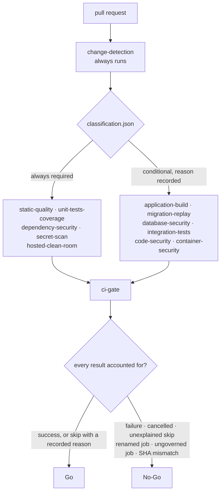

# RootLco CI/CD and automated assurance

The pipeline that decides whether a change may merge, what runs every night, and
what a future release would have to prove.

## Start here

| If you want to…                             | Read                                                             |
| ------------------------------------------- | ---------------------------------------------------------------- |
| Understand why the pipeline looks like this | [`current-state-audit.md`](current-state-audit.md)               |
| See the shape of the whole system           | [`target-architecture.md`](target-architecture.md)               |
| Know which test layer covers what           | [`automated-testing-strategy.md`](automated-testing-strategy.md) |
| Understand a red `ci-gate`                  | [`failure-triage.md`](failure-triage.md)                         |
| Run or re-run something by hand             | [`operator-runbook.md`](operator-runbook.md)                     |
| Know what a job blocks on                   | [`pr-gate.md`](pr-gate.md)                                       |
| Know what nightly does                      | [`nightly-assurance.md`](nightly-assurance.md)                   |
| Understand the security controls            | [`security-model.md`](security-model.md)                         |
| Find an artifact                            | [`artifact-catalog.md`](artifact-catalog.md)                     |
| Change a coverage floor                     | [`coverage-policy.md`](coverage-policy.md)                       |
| Interpret a performance number              | [`performance-policy.md`](performance-policy.md)                 |
| Deal with a flaky test                      | [`flaky-test-policy.md`](flaky-test-policy.md)                   |
| Change branch protection                    | [`branch-ruleset.md`](branch-ruleset.md)                         |
| Know what happens next                      | [`rollout-plan.md`](rollout-plan.md)                             |
| Prepare a release                           | [`release-verification.md`](release-verification.md)             |
| Understand the deployment gap               | [`deployment-foundations.md`](deployment-foundations.md)         |

## The one-paragraph version

Every pull request runs `pr-ci.yml`. It always starts — there are no top-level
path filters, because a required check that never runs stays _Pending_ forever.
A `change-detection` job classifies the diff and decides which heavy jobs are
needed; six may be skipped on a documentation-only change, each with a recorded
reason. Twelve jobs run, and a single `ci-gate` reads all of their results plus
the recorded reasons and returns **Go** or **No-Go**. `ci-gate` is the only
check branch protection should require.

## What makes a job's result trustworthy

The gate does not trust the absence of a failure. It requires a positive account
of every job it governs, including the ones that did not run.

## Principles this pipeline is built on

**A check that cannot fail is not a check.** Every gate script refuses to report
"clean" over an empty set: no test files, no workflows, no migrations, no
measurements — each exits non-zero rather than passing vacuously.

**A skip is a decision, not an absence.** Change detection writes down why each
heavy job was not needed, and the gate re-reads that document. A skip nobody can
justify fails.

**Measure before you ratchet.** Every baseline that has never been measured on a
hosted runner is committed empty with the reason stated in the file. Inventing a
threshold and calling it a gate is worse than having no gate, because it looks
like protection.

**Report what you found, not what you hoped.** Findings that cannot be fixed
inside this initiative — ten unproven idempotency promises, one dev-only
advisory with no consumable fix, GitHub's own scanners still disabled — are
itemised by name with owners and expiry dates rather than quietly excluded.

**Never print a secret.** The credential scanners report file and pattern class
only. The matched text is never stored, never logged, never uploaded.

## What this pipeline does not do

- It does not deploy. There is no hosting decision (ADR-012); the two deployment
  workflows verify their preconditions and then explicitly refuse.
- It does not promote `develop` to `main`. That is a founders' reserved decision
  (ADR-006) and no workflow performs it.
- It does not run browser end-to-end tests. No UI exists yet, and a Playwright
  suite asserting against nothing would be worse than the gap.
- It does not use a self-hosted runner, a paid larger runner, or any external
  paid service.
