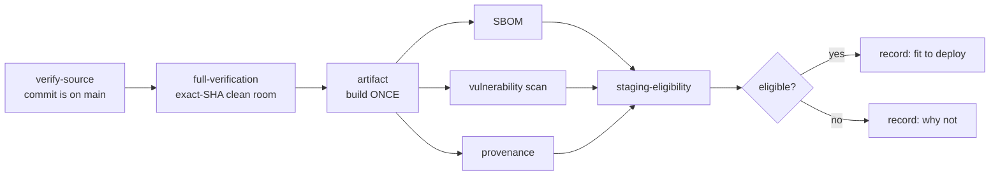

# Release verification

**No release has been performed.** This is the gate a future release would pass
through, built now so it is reviewed in calm conditions rather than written under
pressure on the day.

## The chain

The last step is **eligibility**, not deployment. Deciding an artifact is fit to
deploy and deploying it are different acts with different authorities.

## Build once

The image is built exactly once, and its digest is what would be promoted to
staging and then to production. Rebuilding per environment produces a different
artifact from the same source and silently discards every test result that
referred to the first one.

Both deployment workflows therefore accept a **digest** and refuse anything that
is not a `sha256:` value. A tag can be repointed after it was tested; a digest
cannot.

## `verify-source`

A release must describe a commit that is genuinely on the protected branch. A tag
can be pushed anywhere, so being reachable from `main` is checked with
`git merge-base --is-ancestor` rather than assumed.

Promotion of `develop` to `main` is a founders' reserved decision (ADR-006) and
no workflow performs it.

## What is recorded

`release-manifest.json`:

| Field            |                                               |
| ---------------- | --------------------------------------------- |
| `sourceCommit`   | the commit built                              |
| `imageDigest`    | the immutable artifact identity               |
| `imageTarDigest` | SHA-256 of the saved image                    |
| `sbomDigest`     | SHA-256 of the SBOM                           |
| `provenance`     | `attested`, `manifest-only`, or `unavailable` |
| `workflowRun`    | the run that produced it                      |
| `runner`         | OS and architecture                           |
| `buildTimestamp` | UTC                                           |

`release-state.json` adds the migration count, the expected schema hash, the
production dependency versions and the Node version.

## SBOM

SPDX JSON via `anchore/sbom-action`, over the built image so it reflects what
actually shipped rather than what the lockfile intended.

Integrity is asserted: an **empty** SBOM fails, and one listing fewer than ten
packages fails. An empty bill of materials is not a bill of materials.

## Provenance — claimed only when verified

GitHub artifact attestation is attempted when the caller asks for it. The step is
allowed to fail, and the next step **inspects the outcome and the bundle on
disk**:

- bundle present and the step succeeded → `attested`, and the workflow then runs
  `gh attestation verify` against it;
- otherwise → `manifest-only`, with the limitation written into the manifest.

Generating an attestation and never verifying it proves the action ran, not that
the attestation is valid. A green step with no bundle is not cryptographic
provenance, and the manifest says so explicitly rather than implying otherwise.

This has **not yet been exercised** — no release has run. Whether attestation is
available on this plan is unknown, and the workflow is written so that either
answer produces an honest record.

## Vulnerability policy at release

Stricter than the pull-request gate: `ignore-unfixed` is off, so findings with no
available patch are included. A release is the moment to decide whether to
rebuild on a newer base image — a decision that would be invisible if the report
filtered them out.

## Retention

365 days. A release record is what you need a year later, when nobody remembers
what shipped. The image tarball itself is not uploaded — hundreds of megabytes,
reproducible from the recorded commit, and its digest is recorded instead.
