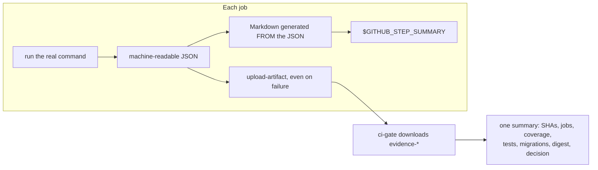

# Target architecture

## Layout

```
.github/
├── actions/
│   └── setup-project/action.yml     composite: exact-head checkout, Node, npm ci
├── ci-baselines/                     every threshold, one file each, all reviewable
│   ├── coverage-baseline.unit.json
│   ├── coverage-baseline.backend.json
│   ├── build-size-baseline.json
│   ├── container-baseline.json
│   ├── schema-baseline.json
│   ├── performance-baseline.json
│   ├── dependency-exceptions.json
│   ├── idempotency-exceptions.json
│   └── mutation-targets.json
├── dependabot.yml
└── workflows/
    ├── pr-ci.yml                              pull_request → develop, main
    ├── protected-develop-verification.yml     push → develop, main
    ├── nightly-assurance.yml                  schedule + dispatch
    ├── release-verification.yml               release tag + dispatch, main only
    ├── deploy-staging.yml                     dispatch only, does not deploy
    ├── deploy-production.yml                  dispatch only, does not deploy
    ├── ci.yml                                 LEGACY, retained until cutover
    └── _reusable-*.yml                        seven reusable workflows

scripts/ci/                            the logic that needs unit testing
tests/ci/                              98 tests for that logic
```

## Why reusable workflows and not just more jobs

The audit found the identical `checkout → setup-node → npm ci` block four times
across two workflows, with the Node version written out four times (CSA-11).
Drift between them was a matter of when, not whether.

The split follows what each thing is:

| Mechanism                  | Used for                                                   | Why not the others                                                                       |
| -------------------------- | ---------------------------------------------------------- | ---------------------------------------------------------------------------------------- |
| Composite action           | `setup-project` — a repeated step _sequence_               | A reusable workflow is a whole job; this is three steps inside one                       |
| Reusable workflow          | A complete job with its own runner, services and artifacts | A composite action cannot declare `services:` or its own `permissions:`                  |
| Script under `scripts/ci/` | Decision logic — gate evaluation, ratchets, linters        | Logic embedded in YAML cannot be unit-tested, and this logic decides whether code merges |

The rule of thumb: **if being wrong about it would let a bad change merge, it
lives in a script and has tests.**

## The three trigger surfaces

| Workflow                             | Trigger                    | Concurrency             | Cancels? | Authoritative?                               |
| ------------------------------------ | -------------------------- | ----------------------- | -------- | -------------------------------------------- |
| `pr-ci.yml`                          | `pull_request`             | per pull-request number | **yes**  | no — a PR run is superseded by the next push |
| `protected-develop-verification.yml` | `push` to `develop`/`main` | per branch              | **no**   | **yes** — this is what a gate record cites   |
| `nightly-assurance.yml`              | schedule 02:30 UTC         | one at a time           | no       | for its own questions                        |
| `release-verification.yml`           | release tag, dispatch      | per ref                 | no       | yes, for a release                           |

Cancelling is correct on a pull request and wrong on a protected branch. That
distinction is CSA-01: `ci.yml` used one group for both and silently destroyed
protected-push evidence when two merges landed close together.

## The gate contract

`scripts/ci/evaluate-ci-gate.mjs` owns one list, `DECLARED_JOBS`, and checks it
against `needs` **in both directions**:

- a declared job absent from `needs` → someone renamed or removed a job;
- a job in `needs` that is not declared → someone added one the gate cannot see.

Both are failures. This is what a job-name-shaped required-check list cannot do,
and it is the reason `ci-gate` should be the only required check.

Per-job outcomes:

| Result                                                      | Accepted | Because                                                  |
| ----------------------------------------------------------- | -------- | -------------------------------------------------------- |
| `success`                                                   | yes      | —                                                        |
| `skipped`, and change detection recorded it as not required | yes      | the reason is in the artifact and is re-read by the gate |
| `skipped`, and change detection required it                 | **no**   | the job that mattered did not run                        |
| `skipped`, and the job is unconditionally required          | **no**   | no classification may excuse it                          |
| `skipped`, and no classification exists                     | **no**   | absence of evidence is not evidence                      |
| `cancelled`                                                 | **no**   | a cancelled job proves nothing                           |
| `failure`                                                   | **no**   | —                                                        |
| anything else                                               | **no**   | an ambiguous result is a failure                         |

## Evidence flow



Markdown is always generated _from_ the JSON, never written independently. Two
hand-maintained representations of the same fact drift, and the one people read
is the one that drifts first.

## Caching

| Cached                 | Key inputs                                 | Why it is safe                                                           |
| ---------------------- | ------------------------------------------ | ------------------------------------------------------------------------ |
| npm download cache     | OS, Node version, `package-lock.json` hash | `actions/setup-node` built-in; `npm ci` still resolves from the lockfile |
| Docker BuildKit layers | scope per build target (`dev`, `runner`)   | separate scopes stop a dev build poisoning the production layer set      |

Deliberately **not** cached: PostgreSQL data directories, migrated databases,
seeded data, security results, gate decisions. A cache hit must never stand in
for a validation step — the clean room exists precisely to prove the build works
from nothing.

## Job-level permissions

Workflow default is `contents: read` everywhere. Additional scope is granted to
exactly one job each:

| Scope                                    | Job                        | Why                    |
| ---------------------------------------- | -------------------------- | ---------------------- |
| `security-events: write`                 | `code-security` only       | SARIF upload           |
| `pull-requests: read`                    | `dependency-security` only | dependency-review diff |
| `id-token: write`, `attestations: write` | `release-artifact` only    | build provenance       |

Security is split into THREE FILES — `_reusable-secret-scan.yml`,
`_reusable-dependency-security.yml`, `_reusable-code-security.yml` — each with
exactly one job. A caller's permissions are the ceiling for EVERY job in the
file it calls, including ones an `if:` would skip, so one file holding all
three could not be called by anyone granting less than SARIF write. Enforced
by WFS-011.
