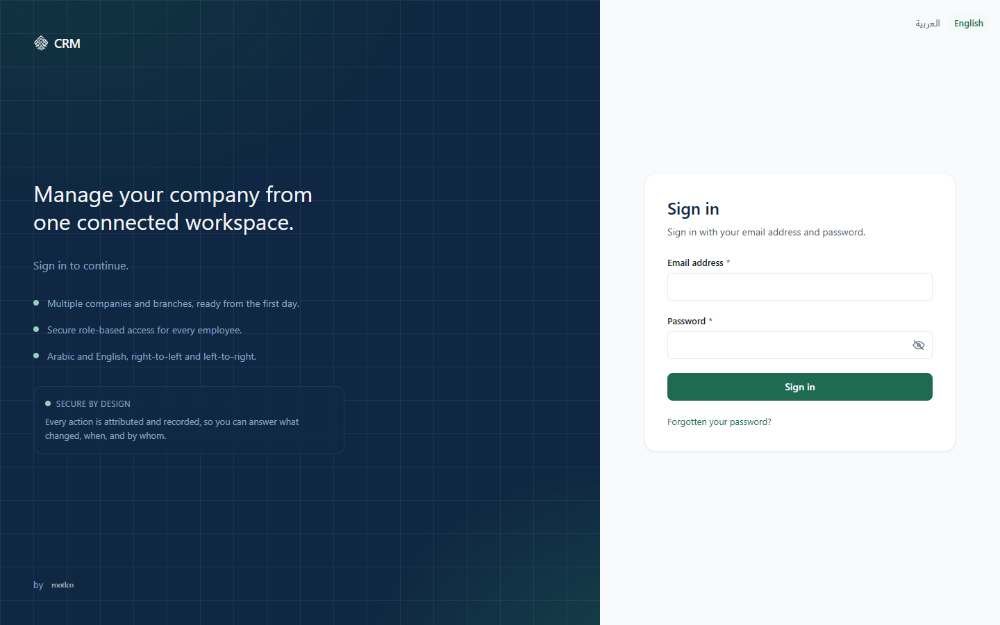
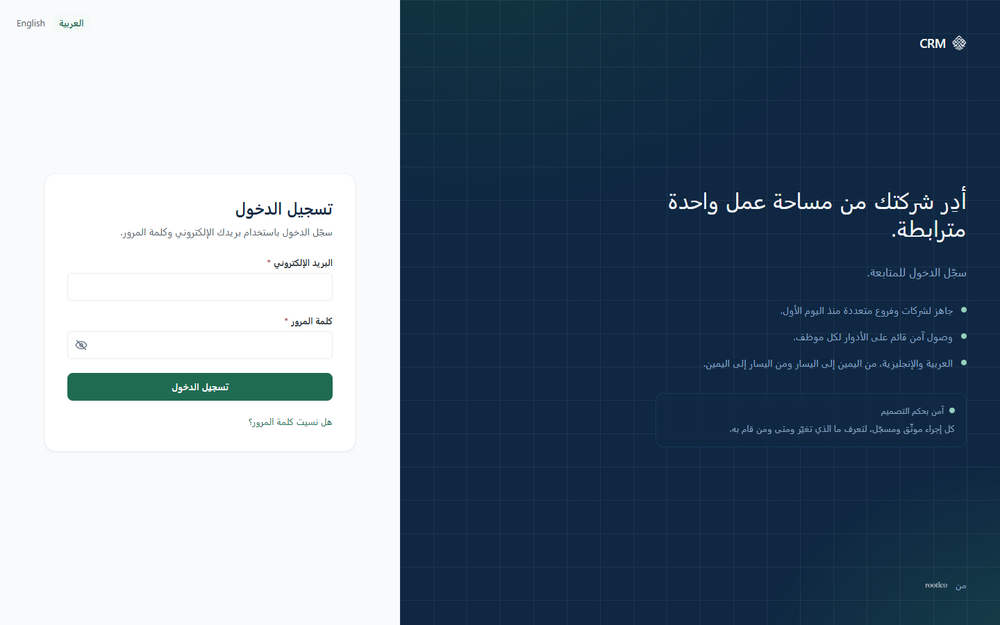
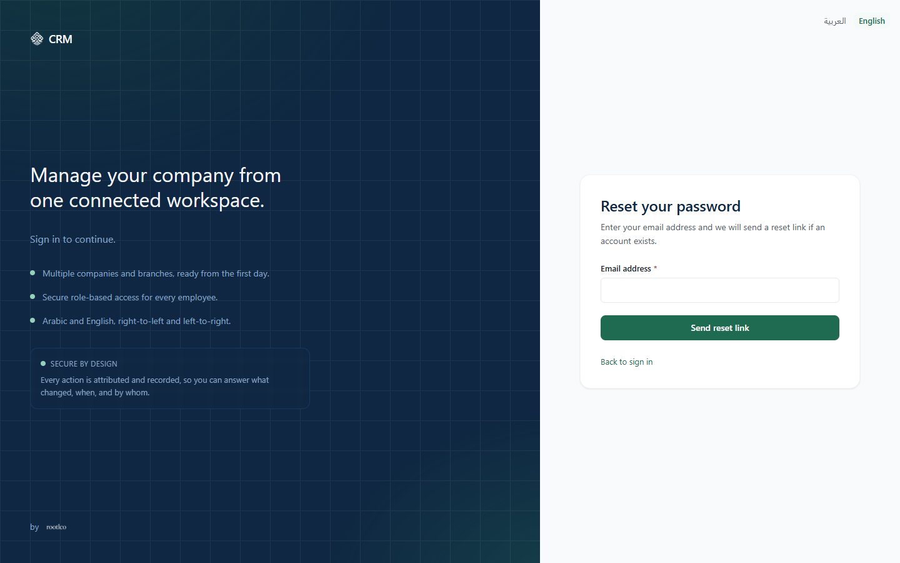
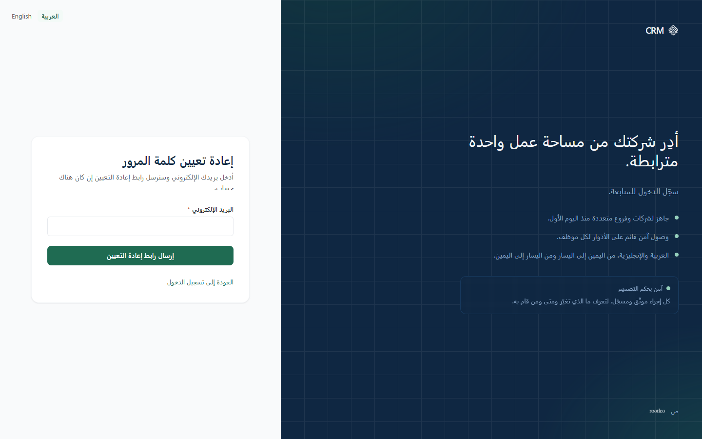
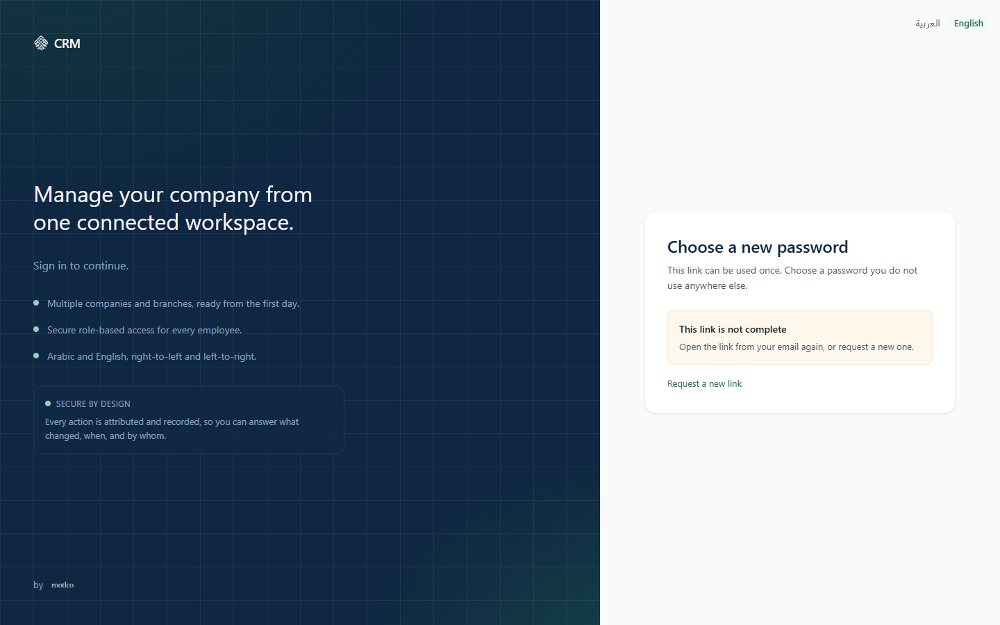
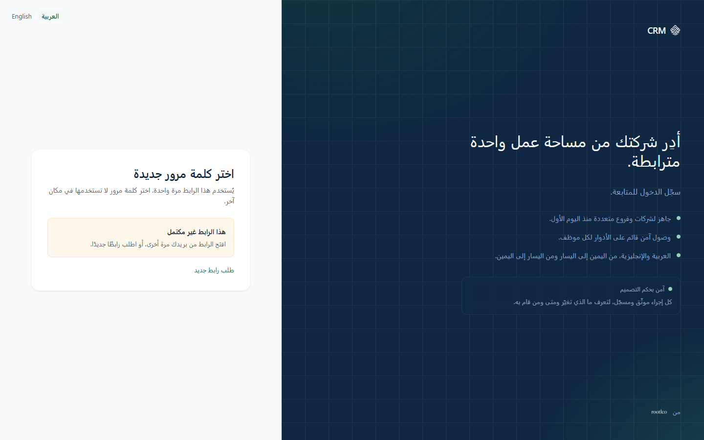

# Part 1 — Access and account recovery

This part tells you how to reach the application, how to sign in and out, how a new account gets its
first password, how a forgotten password is reset, how to switch between Arabic and English, what
happens when a session ends or access is refused, and what your profile screen shows you.

Every screen label below is the application's own wording. Where a section is about language, the
Arabic label is given beside the English one.

**Labels used in this part**

- **IMPLEMENTED (UI)** — a screen you can use now.
- **OPERATOR PROCEDURE** — exists only as a command or a runbook act; there is no screen.
- **DEFERRED** — recorded backlog or a later phase.
- **NOT AVAILABLE** — not built.

**Example data.** Every name in this part is fictional and marked "(example)". The example company
is **Al-Noor Auto Services (example)**, with branches **Riyadh — Exit 5 (example)** and **Jeddah —
Corniche (example)**. Example people are **Salma Al-Fahad (example)** (administrator) and **Tariq
Hassan (example)** (a newly invited user). No password, link, token or reference from a real account
appears anywhere in this manual.

---

## 1.1 Where the application runs, and who can reach it

**OPERATOR PROCEDURE** (starting the environment) · **IMPLEMENTED (UI)** (the sign-in page itself)

The application runs on one private machine only. There is no public address, no hosted site and no
customer-facing link. Development, staging and production environments are recorded as planned and
not provisioned, so **Local is the only environment that exists**. Nobody can reach the application
from outside that machine, and nothing in this manual should be read as saying otherwise.

**Addresses on that machine**

| What                                | Address                          |
| ----------------------------------- | -------------------------------- |
| The application                     | `http://localhost:3100`          |
| Sign-in page, English               | `http://localhost:3100/en/login` |
| Sign-in page, Arabic                | `http://localhost:3100/ar/login` |
| The local mailbox (see 1.5 and 1.6) | `http://127.0.0.1:54324`         |

Opening `http://localhost:3100` on its own sends you to the Arabic interface, because Arabic is the
application's default language. To start in English, open `http://localhost:3100/en/login`.

**Starting and stopping the environment is an operator act, not a screen.** Someone with access to
the machine runs the supported commands from the repository root: the database and mailbox tier
first, then the application tier; and the matching stop command when work is finished. There is no
button in the interface that starts or stops anything. If the address does not answer, the
application tier is simply not running — that is an operator matter, not an account problem.

**Restrictions.** Local only. One machine. No remote access, no mobile app, no offline mode.

**Screenshot.** No screenshot available at this version.

---

## 1.2 Sign in

**IMPLEMENTED (UI)**

**Label:** Sign in <!-- auth.login.title --> (Arabic: تسجيل الدخول)

**Who.** Anybody who has been given an account in this workspace and whose account has been
activated by an administrator. There is no self-service sign-up: an account exists only because an
administrator invited it.

**Where.** `http://localhost:3100/en/login` (English) or `http://localhost:3100/ar/login` (Arabic).
The page introduces itself with **Sign in with your email address and password.** <!-- auth.login.description -->

**Steps**

1. Open the sign-in page. It shows two fields.
2. **Email address** <!-- auth.login.email --> — _required_. This is your sign-in identity. Example:
   the address Al-Noor Auto Services (example) gave to Salma Al-Fahad (example).
3. **Password** <!-- auth.login.password --> — _required_. Use **Show password** <!-- field.password.show -->
   to read what you typed, and **Hide password** <!-- field.password.hide --> to conceal it again.
4. Press **Sign in** <!-- auth.login.submit --> . While the service answers, the button reads
   **Signing in…** <!-- auth.login.submitting --> and a second press does nothing.

You are not asked which company, branch or workspace you belong to. The service works that out from
your own account.

**Result.** You land on the application's home page, **Overview** <!-- nav.overview --> , with the
navigation panel on one side and your name in the header. The sign-in page is replaced in your
browser history, so pressing Back does not return you to it.

**Restrictions**

- An invited account that an administrator has **not** yet activated cannot sign in. The sign-in is
  refused with the ordinary failure message.
- A locked or archived account cannot sign in either, and is refused the same way.
- Every refusal reads the same on purpose. The application never says "no account with that
  address", because that would tell an outsider which addresses exist.

**If it goes wrong**

| What you see                                                                                       | What it means                                                                                                            | What to do                                                                                                                                                   |
| -------------------------------------------------------------------------------------------------- | ------------------------------------------------------------------------------------------------------------------------ | ------------------------------------------------------------------------------------------------------------------------------------------------------------ |
| **Enter your email address.** <!-- auth.login.error.email -->                                      | The field is empty.                                                                                                      | Type the address.                                                                                                                                            |
| **Enter your password.** <!-- auth.login.error.password -->                                        | The field is empty.                                                                                                      | Type the password.                                                                                                                                           |
| **That address is too long.** <!-- auth.login.error.emailLength -->                                | The address exceeds the accepted length.                                                                                 | Check for a typing or paste error.                                                                                                                           |
| **That password is too long.** <!-- auth.login.error.passwordLength -->                            | Same, for the password.                                                                                                  | Retype it.                                                                                                                                                   |
| **Check the details below and try again.** <!-- auth.login.error.invalid -->                       | One or both fields failed a check.                                                                                       | Correct the marked field.                                                                                                                                    |
| **Those details did not sign you in.** <!-- auth.login.error.failed -->                            | The address, the password, or the state of the account is not accepted. The application deliberately does not say which. | Retype the password. If it still fails, use **Forgotten your password?** (1.6). If that does not help, ask your administrator whether the account is active. |
| **Too many attempts. Wait a short while before trying again.** <!-- auth.login.error.throttled --> | Too many sign-in attempts in a short period.                                                                             | Wait, then try once more. This is not a verdict on your password.                                                                                            |
| **The service is not responding. This is usually brief.** <!-- auth.login.error.unavailable -->    | The application could not reach the service behind it.                                                                   | Wait a moment and try again. If it persists, the application tier is probably not running (1.1).                                                             |

**Screenshot** — `images/login-en.png`; the right-to-left rendering is
`images/login-ar.png`. Both show the sign-in page as an anonymous visitor meets it, with the fields
empty.

---

## 1.3 Messages you may meet on the sign-in page

**IMPLEMENTED (UI)**

When the application sends you back to sign in, it says why in a banner above the form. There are
four, and they mean different things.

| Banner                                                                                                                                                                                                                                                                        | What it means                                                                          | What to do                                                                            |
| ----------------------------------------------------------------------------------------------------------------------------------------------------------------------------------------------------------------------------------------------------------------------------- | -------------------------------------------------------------------------------------- | ------------------------------------------------------------------------------------- |
| **Your session ended. Sign in again to continue.** <!-- auth.login.reason.expired --> (Arabic: انتهت جلستك. سجّل الدخول مجددًا للمتابعة.)                                                                                                                                     | Your session reached its end while you were away.                                      | Sign in again. See 1.8.                                                               |
| **You have been signed out.** <!-- auth.login.reason.signedOut -->                                                                                                                                                                                                            | You pressed Sign out.                                                                  | Sign in again whenever you want to.                                                   |
| **The service could not confirm your session. Sign in again.** <!-- auth.login.reason.unavailable -->                                                                                                                                                                         | The service behind the application did not answer, so the application would not guess. | Wait a moment, then sign in again.                                                    |
| **Your details are correct, but this account is not permitted to open the application. An administrator needs to grant it access.** <!-- auth.login.reason.forbidden --> (Arabic: بياناتك صحيحة، لكن هذا الحساب غير مخوّل لفتح التطبيق. يلزم أن يمنحه المسؤول صلاحية الوصول.) | Your password was right; the account holds nothing that lets it open the application.  | Ask your administrator to grant your account a role. Trying again will not change it. |

**Screenshot.** No screenshot available at this version.

---

## 1.4 Sign out

**IMPLEMENTED (UI)**

**Label:** Sign out <!-- auth.session.signOut --> (Arabic: تسجيل الخروج)

**Who.** Anybody signed in.

**Where.** The account control at the end of the header, on every screen. It shows your display name
and email address; opening it shows **Signed in as** <!-- auth.session.signedInAs --> followed by
your address, then **Your profile** <!-- nav.profile --> and **Sign out**.

**Steps**

1. Open the account control in the header.
2. Press **Sign out**. While it finishes, it reads **Signing out…** <!-- auth.session.signingOut -->
   .

**Result.** You are returned to the sign-in page with the banner **You have been signed out.** Your
session on this machine is finished; anything unsaved on the screen you left is lost.

**Restrictions**

- Signing out ends **this** session. To end every session an account has open — for example after a
  lost laptop — an administrator uses **Sign out everywhere** <!-- users.action.revokeSessions -->
  on the Users screen, confirmed with **Sign this user out everywhere?** <!-- users.confirm.revokeSessions -->
  and **Every active session ends. They can sign in again straight away.** <!-- users.confirm.revokeSessionsBody -->
  That is an administrator action, not a self-service one; it is described in Part 3.
- Closing the browser without signing out leaves the session to end by itself (1.8). On a shared
  machine, sign out.

**If it goes wrong.** Sign-out clears your side first and tells the service second, so the button
always takes effect for you even if the service is briefly unreachable.

**Screenshot.** No screenshot available at this version.

---

## 1.5 Setting the password on a new account (invitation)

**IMPLEMENTED (UI)** — the screen · **OPERATOR PROCEDURE** — reading the email in this environment

**Label:** Set up your account <!-- auth.activate.title --> (Arabic: إعداد حسابك)

**Who.** A person an administrator has invited. Example: Tariq Hassan (example) has just been
invited to Al-Noor Auto Services (example).

**Where.** The link in the invitation email. **In this environment no message leaves the machine.**
No external mail service is configured, so nothing is delivered to a real inbox anywhere: the
message lands in a mail catcher running beside the application at `http://127.0.0.1:54324`, which
the operator of the machine opens in a browser to find it. The link inside the message points at
`localhost`, so it can only be opened on that same machine — sending it on to somebody else's
computer would give them an address their browser cannot reach. There is no printed or dictated
code, and an administrator cannot read the link out of the application.

**Steps**

1. The administrator sends the invitation from the Users screen — **Invite a user** <!-- users.invite -->
   — filling in **Display name** <!-- users.invite.displayName --> and **Email address** <!-- users.invite.email -->
   , choosing **Roles to grant** <!-- users.invite.roles --> , then pressing **Send invitation** <!-- users.invite.submit -->
   . The screen states the rule plainly: **They receive an email invitation. Their account stays
   invited until an administrator activates it.** <!-- users.invite.description --> (Part 3 covers
   this side of it.)
2. The invited person opens the link from the email. The page reads **Set up your account** and
   **Choose a password to finish setting up your account.** <!-- auth.activate.description -->
3. **New password** <!-- auth.reset.password --> — _required_. The hint says **At least 8
   characters.** <!-- auth.reset.passwordHint -->
4. **Confirm new password** <!-- auth.reset.confirmPassword --> — _required_. Type the same password
   again.
5. Press **Save password** <!-- auth.reset.submit --> (**Saving…** <!-- auth.reset.submitting -->
   while it works).

**Result.** The page says **Your password is set** <!-- auth.activate.done --> and **An
administrator activates your account once your invitation is confirmed. You can sign in as soon as
that happens.** <!-- auth.activate.doneDetail --> The page also states, before and after, **Your
access and workspace are set by your administrator, not on this page.** <!-- auth.activate.note -->

**Restrictions**

- **This page does not activate the account.** Until an administrator presses **Activate account** <!-- users.action.activate -->
  on the Users screen, signing in is refused with the ordinary failure message. The administrator's
  confirmation says why: **The service confirms the invitation was accepted before activating.** <!-- users.confirm.activateBody -->
  So the order is fixed: the invited person sets a password first, the administrator activates
  second.
- The link can be used once.
- The link is not repeated in the address bar: the application removes it from the URL as soon as
  the page opens, so it cannot be copied out of the browser afterwards. If you need another one, ask
  for a new invitation or use the reset route (1.6).

**If it goes wrong**

| What you see                                                                                                                                                              | What it means                                                                                                                       | What to do                                                                    |
| ------------------------------------------------------------------------------------------------------------------------------------------------------------------------- | ----------------------------------------------------------------------------------------------------------------------------------- | ----------------------------------------------------------------------------- |
| **This link is not complete** <!-- auth.reset.missingToken --> with **Open the link from your email again, or request a new one.** <!-- auth.reset.missingTokenDetail --> | The page was opened without the part of the link that identifies you — usually because the address was retyped rather than clicked. | Click the link in the email itself.                                           |
| **This link has expired or has already been used.** <!-- auth.reset.error.token --> with **Request a new link** <!-- auth.reset.requestAnother -->                        | Exactly what it says; the application does not distinguish the three cases.                                                         | Follow **Request a new link**, or ask your administrator to invite you again. |
| **The two passwords do not match.** <!-- auth.reset.error.mismatch -->                                                                                                    | The two fields differ.                                                                                                              | Retype both.                                                                  |
| **Use between 8 and 200 characters.** <!-- auth.reset.error.passwordLength -->                                                                                            | The password is too short or too long.                                                                                              | Choose one inside that range.                                                 |
| **That password was not accepted. Choose a different one.** <!-- auth.reset.error.rejected -->                                                                            | The service refused the password itself.                                                                                            | Choose a different password.                                                  |
| **Too many attempts. Wait a short while before trying again.** <!-- auth.reset.error.throttled -->                                                                        | Too many attempts in a short period.                                                                                                | Wait, then try again.                                                         |

**Screenshot.** No screenshot available at this version.

---

## 1.6 Forgotten password, and setting a new one

**IMPLEMENTED (UI)** — both screens · **OPERATOR PROCEDURE** — reading the email in this environment

### 1.6.1 Asking for a reset link

**IMPLEMENTED (UI)**

**Label:** Reset your password <!-- auth.forgot.title --> (Arabic: إعادة تعيين كلمة المرور)

**Who.** Anybody with an account.

**Where.** The link **Forgotten your password?** <!-- auth.login.forgot --> on the sign-in page, or
`http://localhost:3100/en/forgot-password`. The page explains itself: **Enter your email address and
we will send a reset link if an account exists.** <!-- auth.forgot.description -->

**Steps**

1. **Email address** <!-- auth.forgot.email --> — _required_.
2. Press **Send reset link** <!-- auth.forgot.submit --> (**Sending…** <!-- auth.forgot.submitting -->
   while it works).
3. To return without asking, use **Back to sign in** <!-- auth.backToLogin --> .

**Result.** The form is replaced by **Check your email** <!-- auth.forgot.submitted --> and **If an
account exists for that address, a reset link is on its way. The link can be used once and
expires.** <!-- auth.forgot.submittedDetail -->

**Restrictions**

- The same confirmation appears whether or not an account exists for that address. That is
  deliberate: the application must not disclose who has an account. It is therefore not a
  confirmation that a message was sent to you.
- In this environment the message is not delivered to any real inbox, and external mail delivery is
  not active at all. It appears in the local mail catcher at `http://127.0.0.1:54324`, and the reset
  link inside it addresses `localhost`, so it can only be followed on this machine.
- The local mail service is configured to send at most thirty messages an hour, so a long run of
  repeated requests will eventually stop producing a message.
- There is no administrator button that sets a password for you and no code an administrator can
  read out. The reset link is the only route.

**If it goes wrong**

| What you see                                                                                        | What it means                                      | What to do           |
| --------------------------------------------------------------------------------------------------- | -------------------------------------------------- | -------------------- |
| **Enter your email address.** <!-- auth.forgot.error.email -->                                      | The field is empty.                                | Type the address.    |
| **Check the address and try again.** <!-- auth.forgot.error.invalid -->                             | The address is not a usable address.               | Correct the typing.  |
| **Too many requests. Wait a short while before trying again.** <!-- auth.forgot.error.throttled --> | Too many requests in a short period.               | Wait, then ask once. |
| **The service is not responding. This is usually brief.** <!-- auth.forgot.error.unavailable -->    | The service behind the application did not answer. | Try again shortly.   |

**Screenshot** — `images/forgot-password-en.png`; the right-to-left rendering is
`images/forgot-password-ar.png`. Both show the request page with the address field empty.

### 1.6.2 Choosing the new password

**IMPLEMENTED (UI)**

**Label:** Choose a new password <!-- auth.reset.title --> (Arabic: اختر كلمة مرور جديدة)

**Who.** The holder of a reset link.

**Where.** The link in the message, which opens `/{language}/reset-password`. The page states **This
link can be used once. Choose a password you do not use anywhere else.** <!-- auth.reset.description -->

**Steps**

1. **New password** <!-- auth.reset.password --> — _required_, **At least 8 characters.**
2. **Confirm new password** <!-- auth.reset.confirmPassword --> — _required_.
3. Press **Save password** <!-- auth.reset.submit --> .

**Result.** **Password updated** <!-- auth.reset.done --> and **You can now sign in with your new
password. A device you were already signed in on stays signed in there until that sign-in runs
out.** <!-- auth.reset.doneDetail --> A button **Go to sign in** <!-- auth.reset.continue --> takes
you to the sign-in page.

**Restrictions**

- One use per link, and it expires.
- **Setting a new password does not immediately sign out a browser that is already signed in.** The
  old password is dead at once, and no session can renew itself afterwards — but a sign-in already
  handed to another browser keeps working there until it runs out on its own, which on this
  installation is an hour (1.8). If the point of the change is that somebody else may have had your
  password, go to the other device and sign out of it as well, or wait the hour out. The screen
  states the same thing in its own words, above.
- Your email address cannot be changed here. It is your sign-in identity and an administrator
  changes it (1.10).

**If it goes wrong.** The same messages as in 1.5 apply, including **This link has expired or has
already been used.** with **Request a new link**.

**Screenshot** — `images/reset-password-no-token-en.png`; the right-to-left rendering
is `images/reset-password-no-token-ar.png`. Both show the page opened without the identifying part
of the link: it reads **This link is not complete** <!-- auth.reset.missingToken --> , offers
**Request a new link** <!-- auth.reset.requestAnother --> , and withholds the password fields
altogether, so there is nothing to fill in until a complete link is opened.

### 1.6.3 What the application does not do with passwords

**NOT AVAILABLE**

- **No administrator-set password.** No screen lets an administrator type a password for someone
  else. The Users screen offers **Activate account**, **Lock account** <!-- users.action.lock --> ,
  **Unlock account** <!-- users.action.unlock --> , **Archive account** <!-- users.action.archive -->
  , **Cancel invitation** <!-- users.action.cancelInvitation --> and **Sign out everywhere** — and
  nothing about passwords.
- **No password expiry and no forced rotation.** A password stays valid until somebody changes it
  through the reset route. The application never asks you to renew it and never warns that it is
  old.
- **No self-service sign-up.** There is no "create an account" page.
- **No two-factor enrolment screen.** Your profile shows whether two-factor authentication is
  required for your account, and that setting is made by an administrator (1.10). There is no screen
  on which you enrol a device.
- **No single sign-on screen.**

---

## 1.7 Arabic and English, right to left and left to right

**IMPLEMENTED (UI)**

**Label:** Language <!-- locale.switch --> (Arabic: اللغة). The two choices read **English** <!-- locale.en -->
and **العربية** <!-- locale.ar --> .

**Who.** Anybody, signed in or not.

**Where.** The header of every screen, next to your account control — and on the sign-in card as
well, so you can change language before you sign in.

**Steps**

1. Press **English** or **العربية** in the language control.
2. The page reloads in the chosen language.

**Result.** The whole interface changes language _and direction_: Arabic is laid out right to left,
English left to right. The application names both directions in words on its Languages screen —
**Left to right** <!-- languages.direction.ltr --> (Arabic: من اليسار إلى اليمين) and **Right to
left** <!-- languages.direction.rtl --> (Arabic: من اليمين إلى اليسار). You stay on the screen you
were reading, and ordinary list settings such as the page you were on and the column you sorted by
are carried across.

**Restrictions**

- Two languages only: Arabic and English. The Languages screen states **Arabic and English are both
  served by this application and cannot be removed here.** <!-- languages.required -->
- Anything in the address bar that is not one of the ordinary list settings is dropped when you
  switch — a search term you typed into a URL, for example, is not carried over. Retype it.
- The language you pick applies to your browser as you move around. The **Workspace default** <!-- languages.default -->
  — **Applies to new accounts and to anything the service renders on your behalf.** <!-- languages.defaultHint -->
  — is set by an administrator on the Languages screen (Part 2), not here.
- Opening the application without a language in the address takes you to Arabic, because Arabic is
  the default.
- A customer record carries its own **Preferred language**, which is about that customer, not about
  you (Part 4).

**If it goes wrong.** If a screen looks mirrored or the text runs the wrong way, check which
language is highlighted in the language control; Arabic is right-to-left by design.

**Screenshot** — `images/login-ar.png` is the mirrored layout: the same sign-in page as
`images/login-en.png`, read from the right, with the language control and the fields laid out in
the opposite direction. (The evidence captures held for this version cover the sign-in and
password-recovery pages and the delivery, warranty, reports and audit-log screens in both languages,
not the profile screen.)

---

## 1.8 When your session ends

**IMPLEMENTED (UI)**

**What happens.** A session lasts as long as the sign-in it came from. The application does not
renew it quietly in the background: your browser holds nothing that could renew it. In this local
environment the sign-in is configured to last one hour.

**What you see.** When you next open or refresh a page after the session has ended, you are taken to
the sign-in page with **Your session ended. Sign in again to continue.** If a screen reports it in
place rather than redirecting, it reads **Your session has ended** <!-- state.expired.title -->
(Arabic: انتهت جلستك) with **Sign in again to continue. Unsaved changes on this page will be lost.** <!-- state.expired.description -->

**What to do.** Sign in again. Signing in again is the whole remedy — there is nothing to renew and
nothing to repair.

**Restrictions and consequences**

- **Unsaved work on the screen is lost.** The application tells you so in that exact sentence. If
  you are filling in a long form and expect to be interrupted, save first.
- The check happens before a protected page is drawn, so you never see a half-loaded screen with
  someone else's data on it.
- An expired session and a refusal of permission are treated as different things on purpose: being
  refused a screen never signs you out.

**Screenshot.** No screenshot available at this version.

---

## 1.9 When you are refused access

**IMPLEMENTED (UI)**

**What you see.** **You do not have access** <!-- state.denied.title --> (Arabic: لا تملك صلاحية
الوصول) with **Your account does not have permission for this. An administrator can grant it.** <!-- state.denied.description -->
(Arabic: حسابك لا يملك صلاحية لهذا الإجراء. يمكن لمسؤول النظام منحها.)

**What it means.** You are signed in correctly. Your account simply does not hold what this screen
or this action requires. The message appears _before_ the application reads anything, so nothing of
the record is shown to you.

**What to do.** Ask your administrator to grant the permission, naming the screen you were trying to
open. If a **Reference:** <!-- state.correlationId --> (Arabic: المرجع:) is shown beneath the
message, give that too — see 1.11.

**Related things you may notice**

- Menu entries you are not permitted to use are not shown to you. The application is explicit that
  this is a convenience only: **What you see here is a convenience. Every request is checked by the
  service, and its decision is the one that applies.** <!-- permissions.visibilityNotice -->
- Some menu entries are shown but marked **Planned** <!-- nav.planned --> with **This module is
  defined but its screens are not built yet.** <!-- nav.plannedHint --> That is not a permission
  problem; those screens do not exist yet. **Documents** and **Notifications** are the two entries
  in that state.
- If your account holds nothing at all, sign-in itself is refused with the "not permitted to open
  the application" banner in 1.3.

**Screenshot.** No screenshot available at this version.

---

## 1.10 Your profile

**IMPLEMENTED (UI)**

**Label:** Your profile <!-- profile.title --> (Arabic: ملفك الشخصي)

**Who.** Anybody signed in. There is no permission to hold: the screen shows only your own account.

**Where.** The account control in the header → **Your profile**. It is reached from there and not
from the navigation panel.

**What the screen shows.** Its description reads **What the service knows about your account, and
what you can change here.** <!-- profile.description --> Three panels:

1. **Identity** <!-- profile.identity -->
   - **Display name** <!-- profile.displayName --> (Arabic: الاسم الظاهر)
   - **Email address** <!-- profile.email --> , with the note **Your email address is your sign-in
     identity and is changed by an administrator.** <!-- profile.emailHint -->
   - **Account reference** <!-- profile.userId --> (Arabic: مرجع الحساب) — the identifier support
     may ask for.
   - **Workspace** <!-- profile.tenant --> (Arabic: مساحة العمل).
   - **Two-factor authentication required** <!-- profile.mfaRequired --> , shown as **Required** <!-- profile.mfaOn -->
     or **Not required** <!-- profile.mfaOff --> , with **Set by an administrator for your
     account.** <!-- profile.mfaHint -->
2. **Where you can work** <!-- profile.scope --> (Arabic: نطاق عملك) — either **Every company and
   branch in this workspace.** <!-- profile.scope.unrestricted --> or the lists **Companies** <!-- profile.scope.companies -->
   and **Branches** <!-- profile.scope.branches --> .
3. **What you may do** <!-- profile.permissions --> — the permissions resolved for this session,
   under the note **Resolved by the service for this session. Your administrator changes these.** <!-- profile.permissionsHint -->
   If there are none: **No permissions are granted to this account yet.** <!-- profile.permissionsEmpty -->

**What you can change here**

- If your account holds the administrative permission to manage users, the **Display name** field is
  editable and **Save changes** <!-- profile.save --> saves it; the screen then confirms **Your
  profile was updated.** <!-- profile.saved -->
- Otherwise the screen is read-only and says so: **Only an administrator can change these details** <!-- profile.readOnly -->
  (Arabic: لا يمكن تغيير هذه البيانات إلا بواسطة مسؤول) and **The service has no self-service update
  for a profile. Ask an administrator to make the change for you.** <!-- profile.readOnlyDetail -->

**Restrictions**

- **There is no self-service profile update.** Your email address, your workspace, your scope, your
  roles and your two-factor setting are all changed by an administrator, never here.
- **Companies and branches appear as references, not names.** The screen says why: **The service
  publishes no company or branch directory, so references are shown rather than names.** <!-- admin.contractGap.noDirectory -->
  So for Salma Al-Fahad (example) the panel shows the reference of Riyadh — Exit 5 (example), not
  the words "Riyadh — Exit 5". Keep a note of which reference is which branch; Part 2 explains where
  those references come from.
- **Changing your password is not done here.** Use the route in 1.6.
- The list under **What you may do** describes this session. If an administrator changes your roles
  while you are signed in, sign out and in again to see the change.

**If it goes wrong.** If **Save changes** is refused, or the panel reports **Something went wrong** <!-- state.error.title -->
with **The request did not complete. Trying again is safe.** <!-- state.error.description --> , try
once more and then quote the **Reference:** to support.

**Screenshot.** No screenshot available at this version.

---

## 1.11 Giving support a reference

**IMPLEMENTED (UI)**

When the application cannot complete something, it prints a short identifier under the message,
labelled **Reference:** <!-- state.correlationId --> (Arabic: المرجع:). It appears with **Something
went wrong**, **You do not have access**, and **Service unavailable** <!-- state.unavailable.title -->
— the last of which reads **The service is not responding. This is usually brief.** <!-- state.unavailable.description -->

Quote that reference exactly when you report a problem, together with the time and the screen you
were on. It lets support find the single request behind your message. There is nothing else you need
to collect, and you should never send a password or a link from an email.

**Restrictions.** Fault monitoring in this environment is **local only** — there is no paging, no
alerting service and no outside connection. Somebody with access to the machine reads the local
records. Do not expect an automatic response to a fault.

**Screenshot.** No screenshot available at this version.

---

## 1.12 Limitations of this part, at a glance

**REFERENCE** — this section summarises, records or points elsewhere; it makes no capability claim of its own.

- Local machine only. No public address, no hosted environment. (1.1)
- No self-service sign-up, no administrator-set password, no password expiry, no forced rotation, no
  two-factor enrolment screen, no single sign-on. (1.6.3)
- An invited person sets a password, then an administrator activates the account; until then sign-in
  is refused. (1.5)
- A reset or invitation link works once, expires, and in this environment arrives only in the local
  mail catcher at `http://127.0.0.1:54324`; at most thirty messages an hour are sent. External mail
  delivery is not active, and the links in those messages address `localhost`, so they are usable
  only on this machine. (1.5, 1.6)
- **Changing or resetting a password does not cut off a browser that is already signed in.** The old
  password stops working at once and no session can renew itself afterwards, but a sign-in already
  in use elsewhere lasts until it runs out — an hour on this installation. Sign that device out
  yourself. (1.6.2, 1.8)
- Sessions are not renewed silently; when a session ends, unsaved work on the screen is lost. (1.8)
- The profile screen is read-only for most accounts, and shows companies and branches as references
  rather than names. (1.10)
- **Documents** and **Notifications** are shown in the navigation marked **Planned** and have no
  screens. (1.9)
- The product name, logo and colours are provisional. The header carries **Provisional appearance —
  final brand pending** <!-- app.provisionalBrand --> (Arabic: مظهر مؤقّت — الهوية النهائية قيد
  الاعتماد), and the home page explains that changing them later is a settings change that affects
  no customer or vehicle record.
- The sign-in page and both password-recovery pages are shown in both languages (1.2, 1.6.1,
  1.6.2); no screenshot of the profile screen exists at this version.

---

## 1.13 Not established

**REFERENCE** — this section summarises, records or points elsewhere; it makes no capability claim of its own.

- **Whether a session can be extended without signing in again.** The application holds no renewal
  credential in the browser and publishes no renewal step, so a session ends with its sign-in; the
  acceptable session length is recorded as an open question for the Owner. Stated here as NOT
  ESTABLISHED because no setting exposes it to an operator.
- **The exact wording of the invitation and reset emails.** The messages are produced by the
  identity service, not by the application's own message catalogue, so no exact text is quoted in
  this part.
- **Whether any account other than an administrator's own can edit a display name on the profile
  screen.** The field is editable only for an account holding the user-management permission; no
  other route exists.

<!--
REVISION 2026-09-21 — sections 1.5, 1.6.1, 1.6.2 and 1.12 were re-read and corrected at develop
f30ce918405164712cc9cdcadb458c4e91a2b5b9. Every other section of this part is carried unchanged
from the readings recorded below and was not re-read.

Read for this revision:
- apps/web/src/i18n/messages/en.json — auth.reset.doneDetail, whose wording changed at this head
  from "Any other sessions have been ended." to a sentence that matches what actually happens.
- apps/api/src/modules/iam/provider/supabase-provider.ts signOutEverywhere, and
  apps/api/src/modules/iam/application/authentication-service.ts completePasswordReset — a global
  sign-out revokes the identity's refresh tokens; an access token already issued to another device
  keeps verifying until its own expiry.
- supabase/config.toml — the local mail catcher on 54324, the hourly send limit, and the absence of
  any external mail transport; supabase/templates/recovery.html — the reset link addresses the
  application's own reset page on localhost.
-->
<!--
Sources for Part 1 (read at develop commit beebc6c28c873f498fe0503161eb53caa107a9e3 unless noted):
- Message catalogue, English: apps/web/src/i18n/messages/en.json — keys auth.login.*, auth.forgot.*,
  auth.reset.*, auth.activate.*, auth.backToLogin, auth.session.*, auth.showcase.*, field.password.show,
  field.password.hide, profile.*, nav.profile, nav.planned, nav.plannedHint, locale.switch, locale.en,
  locale.ar, languages.*, state.expired.*, state.denied.*, state.error.*, state.unavailable.*,
  state.correlationId, permissions.visibilityNotice, admin.contractGap.noDirectory, app.provisionalBrand,
  users.invite.*, users.action.*, users.confirm.activateBody, users.confirm.revokeSessions*,
  users.status.*.
- Message catalogue, Arabic: apps/web/src/i18n/messages/ar.json — same keys, Arabic values quoted for
  auth.login.title/email/password/submit/forgot/reason.expired/reason.forbidden, auth.forgot.title,
  auth.reset.title, auth.activate.title, auth.session.signOut, locale.switch, profile.title/displayName/
  userId/tenant/scope/readOnly, state.denied.title/description, state.expired.title, state.correlationId,
  languages.direction.ltr/rtl, app.provisionalBrand.
- apps/web/src/features/authentication/components/LoginForm.tsx:52-108 (two fields, labels, submit).
- apps/web/src/features/authentication/actions/login.ts:68, :95-105 (one failure message, throttle,
  tenant resolved from the verified identity, redirect after sign-in).
- apps/web/src/features/authentication/actions/logout.ts:34-44 (cookie cleared first, redirect with the
  signed-out reason).
- apps/web/src/features/authentication/components/AccountMenu.tsx:100-133 (header account control,
  Signed in as, Your profile, Sign out as a form).
- apps/web/src/features/authentication/components/RecoveryTokenBridge.tsx (token read from the link and
  erased from the address bar; one screen serves reset and activation).
- apps/web/src/app/[locale]/(auth)/reset-password/page.tsx; .../activate-account/page.tsx;
  .../forgot-password/page.tsx:24; .../session-ended/route.ts; .../login/page.tsx.
- apps/web/src/app/[locale]/(dashboard)/profile/page.tsx:38-141 (mayManage gate, three panels, labels).
- apps/web/src/features/authentication/api/session.ts:58-107 (403 is not an expired session; expired
  goes through session-ended; the other reasons redirect straight to sign-in).
- apps/web/src/lib/api/session-cookie.ts:15-71, :86-100 (httpOnly, no refresh token stored, cookie
  expires with its token).
- apps/web/src/components/shell/AppShell.tsx:386-410 (provisional-brand notice and the language control
  in the header); apps/web/src/components/shell/LocaleSwitcher.tsx:1-70 (links, preserved path, only
  allow-listed query parameters carried); apps/web/src/app/[locale]/(auth)/layout.tsx:71 (switcher on
  the sign-in card).
- apps/web/src/app/page.tsx (root redirects to the default language); apps/web/src/i18n/config.ts:8-23
  (LOCALES ar/en, DEFAULT_LOCALE ar, direction per locale).
- apps/web/src/config/navigation.ts:454-470 (Documents and Notifications carry status 'planned').
- docs/phase-1/phase-1-26/authentication-workflows.md §§1-7 (sign-in, forgotten password, reset,
  activation, invitation, profile, session expiry and sign-out).
- docs/phase-1/phase-1-26/known-limitations.md §§1, 3, 4, 5 (session lifetime, references not names,
  read-only profile, administrative activation).
- docs/phase-1/phase-1-26/ci-evidence.md:189 (a session that ends unexpectedly: sign in again is the
  whole remedy).
- docs/phase-1/phase-1-1/environment-matrix.md:11, :17-20 and ADR-012 (Local is the only environment).
- supabase/config.toml [local_smtp] :114-117 (mailbox on 54324), [auth] jwt_expiry :207 (3600),
  [auth.rate_limit] email_sent :250 (30 per hour). Re-anchored 2026-09-19: the two hourly-limit
  sentences above said "two an hour", which was the committed value until the local harness raised
  it to 30 with the reason written beside the setting; the jwt_expiry and email_sent line numbers
  moved with that same change. The claims were re-read at the committed lines, not re-based by
  offset.
- docs/phase-1/phase-1-31/acceptance-plan.md §1.4-1.5 (mailbox, ports 3100/3000/54324) and
  docs/phase-1/phase-1-31/acceptance-record.md lines 101, 139-144 (invitation link read from the local
  mailbox; a login before activation is refused) — cited for behaviour only, no verification claimed.
- orchestration/evidence/p1-31/acceptance-20260916-0008/screens — checked: it holds delivery, warranty,
  report and audit-log captures only; no sign-in, password, language or profile screen exists there.
-->
