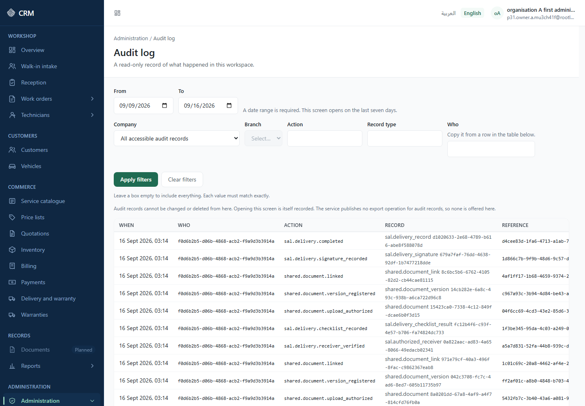
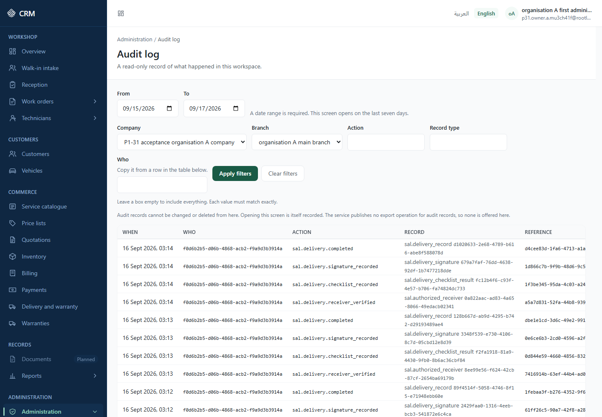
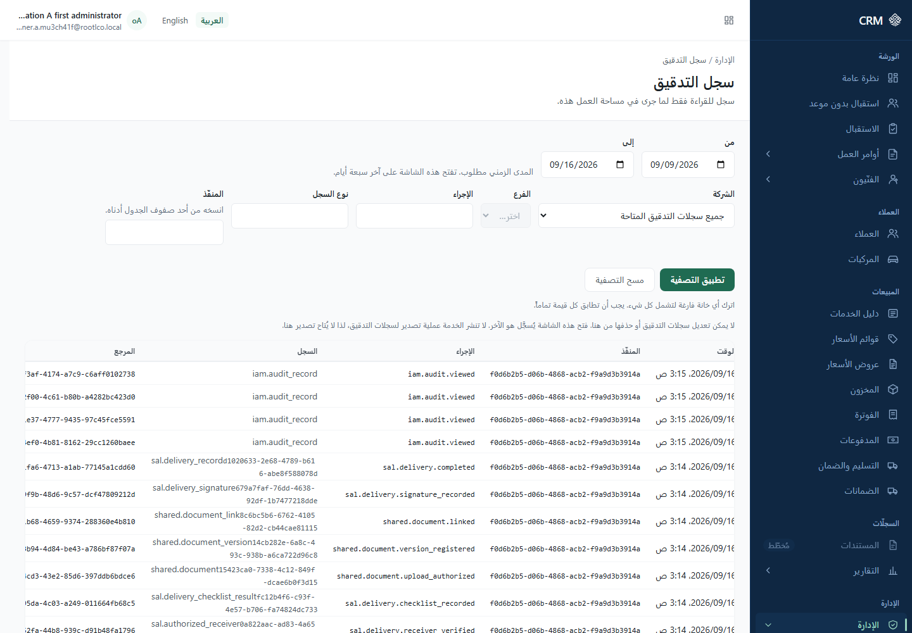
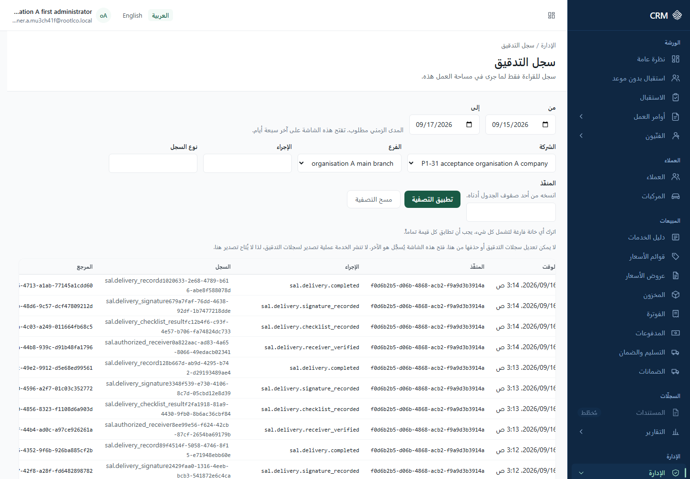

# Part 2 — SaaS and organisation administration

## How to read the labels in this part

**REFERENCE** — this section summarises, records or points elsewhere; it makes no capability claim of its own.

Every section and sub-section carries exactly one label:

- **IMPLEMENTED (UI)** — a screen you can open and use now.
- **OPERATOR PROCEDURE** — it exists, but only as a command or a service call that a platform
  operator runs for you. There is no screen, and you cannot do it yourself from the application.
- **DEFERRED** — recorded as future work, with the backlog item named.
- **NOT AVAILABLE** — not built at this version, in any form.

Screen labels below are the application's own English wording. The catalogue key is shown in a
hidden comment beside the first use of each label, so the wording stays traceable. Arabic labels are
given for the navigation entries and for anything that concerns language.

Example data throughout is fictional and marked "(example)".

---

## 2.1 The six words this manual uses, and how they fit together

**REFERENCE** — this section defines the words. Where each record is created, and by whom, is 2.1.3.

**What changed at this version, in one paragraph.** The workspace itself is still created outside
your organisation, by the platform owner in their own console (Part 2A). Everything **inside** the
workspace is now yours to run from the Administration screens: companies, branches, departments,
employees, users, the roles each person holds and the places each role applies in. Where an earlier
revision of this manual said "operator procedure, there is no screen", read the section again — in
most cases there is now a screen, and its limits are the subscription's rather than the software's.

### 2.1.1 The words

**REFERENCE**

**SaaS tenant — called the "Workspace" on screen** <!-- organization.tenant --> One paying customer
of the platform. It is the outermost boundary: everything you can see, and everything anyone in your
organisation can see, belongs to exactly one workspace, and no workspace can reach another's
records. The workspace carries a **Display name** <!-- organization.displayName --> , a **Workspace
code** <!-- organization.tenantCode --> , a **Status** <!-- organization.status --> , a **Default
language** <!-- organization.defaultLocale --> and a **Default time zone** <!-- organization.defaultTimezone -->
. In Arabic the workspace is مساحة العمل.

**Company** The legal entity that trades. It holds the legal name, the base currency and,
optionally, a registration number and a tax registration number. A workspace is created with exactly
one company.

**Branch** A physical site belonging to one company — the workshop you actually walk into. It holds
a name, an address, a country and a time zone of its own. A branch cannot be moved to another
company, and its branch code cannot be changed after it is created. Most day-to-day lists in this
application are scoped to a single branch, so you will be asked to **Choose a branch** <!-- admin.scope.pickBranch -->
before many screens will show you anything.

**Department** A named subdivision inside one branch, used to route work. It has a department code
and a name, and it can be retired and reinstated.

**Employee** An entry in a branch's staff register: a display name, optionally a link to a login
account, and optionally an opaque reference to an employment record kept somewhere else. It exists
so that the application can name the person who handed a vehicle over. It is deliberately not a
personnel record — the records for this release state plainly "This is not an HR module", and the
register holds no contract, no salary, no contact detail and no document.

**Login user (account)** Someone who signs in. An account has an email address, a display name, a
status and a set of granted roles; roles carry permissions, and a grant applies in a stated set of
places — the whole organisation, selected companies, selected branches or selected departments.
Accounts are managed on the **Users** screen <!-- nav.users --> , and each account's roles and
places on its own **Roles and access** screen — see Part 3.

An employee and a login user are two different records. A person handing a vehicle over may exist in
the employee register with no login at all; a person with a login may have no employee-register
entry. Linking the two is optional and is done when the employee record is created.

### 2.1.2 How they fit together

**REFERENCE**

```
Platform  (operated by RootLco, the company that supplies this software)
│
└── Workspace — one customer, one tenant, the hard boundary around all data
    │          example: "Al-Noor Auto Services (example)", code al_noor_auto (example)
    │
    ├── Company — the legal entity
    │   │        example: "Al-Noor Auto Services (example)", base currency SAR
    │   │
    │   ├── Branch — "Riyadh — Exit 5 (example)"
    │   │   │        address, country, time zone, its own numbering sequences
    │   │   ├── Department — "Mechanical (example)"
    │   │   ├── Department — "Body shop (example)"
    │   │   └── Employee register — "Faris Al-Mutairi (example)"
    │   │                           "Layla Al-Qassim (example)"
    │   │
    │   └── Branch — "Jeddah — Corniche (example)"
    │
    └── Login users — accounts that sign in to the workspace
                      Roles decide what each may do; the scope on a grant decides
                      which companies and branches each may do it in.
```

Note on the diagram: a workspace is created with **one** company and **one** branch. Further
companies and branches are added afterwards — by you on the **Organization** screen (2.4, 2.5), or
by the platform owner from their console (Part 2A, §2A.8) — within the limits your subscription
allows (2.9).

### 2.1.3 Where each record is created, and what you see of it

**REFERENCE**

| Record             | Created by                                                  | What you see in the interface                                                                                      |
| ------------------ | ----------------------------------------------------------- | ------------------------------------------------------------------------------------------------------------------ |
| Workspace (tenant) | The platform owner, in their console (2.2)                  | Read-only facts on the **Organization** screen. Its settings are editable with the right permission.               |
| Company            | You, on **Organization** → **Companies and branches** (2.4) | Listed by name with its code and status, and creatable and deactivatable there.                                    |
| Branch             | You, on **Organization** → **Companies and branches** (2.5) | Listed by name under its company, with its city, country, time zone and status; creatable and deactivatable there. |
| Department         | You, on the **Departments** screen (2.6)                    | A full screen: add, rename, retire, reinstate — one branch at a time.                                              |
| Employee           | You, on the **Employees** screen (2.7)                      | A full screen: add, deactivate, reactivate — one branch at a time.                                                 |
| Login user         | You, on the **Users** screen                                | Full screen: invite, activate, lock, unlock, archive, sign out everywhere, and roles and access. See Part 3.       |

A standing notice remains on the **Organization** screen: **"Limited in this
release"** <!-- admin.contractGap.title --> — _"The service publishes no company or branch
directory, so references are shown rather than names."_ <!-- admin.contractGap.noDirectory --> It
now applies to the **settings** blocks lower down that page, and to the other settings-backed
screens, where a company or a branch is still identified by reference. The **Companies and
branches** block above those settings names both by name.

---

## 2.2 Creating a workspace (tenant onboarding)

**IMPLEMENTED (UI), but not by you.** There is a screen for this, and it is in the platform owner's
console, not in your workspace. No account inside a workspace can create a workspace: no workspace
role carries any platform authority, and a role can only be given permissions the person granting it
already holds.

**Where it is done.** The platform owner opens **Organisations** → **New organisation** in the
Platform Owner Console and fills one form. The full description — every field, what the codes must
look like, the optional subscription, and the message each refusal produces — is **Part 2A, §2A.7**.
It is written there once so there is one description to keep correct.

**What you receive.** One request produces, in a single transaction, either nothing at all or a
working workspace: the tenant, its first company, its first branch, its settings, its
document-number sequences, its payment methods, the first administrator's account, and the roles
granted to that person. The first administrator receives an invitation email and sets their own
password through it; no password is ever set, sent or seen by the platform owner.

**The same act described as a service call.** For completeness, the console posts to
`POST /api/v1/platform/organizations` with the following content. The list is kept because it says
exactly what a new workspace is made of.

1. **Workspace** — code (2–63 characters), display name, default language, default time zone.
   Example: code `al_noor_auto (example)`, display name "Al-Noor Auto Services (example)", language
   `en`, time zone `Asia/Riyadh`.
2. **Company** — code, legal name, three-letter base currency; registration number _(optional)_ and
   tax registration number _(optional)_.
3. **Branch** — code, name, time zone; city _(optional)_ and two-letter country code _(optional)_.
   Example: "Riyadh — Exit 5 (example)".
4. **First owner** — email address and display name; a return destination for the invitation link
   _(optional)_. Example: Layla Al-Qassim (example), `layla.alqassim@al-noor-auto.example`.
5. **Subscription** _(optional)_ — a plan code, and optionally a status and an effective date.
6. **Activate** _(optional)_ — whether the workspace should be switched on immediately.

**Restrictions**

- Neither the roles nor the permissions can be chosen. They are fixed by the platform. A request
  that tries to name a role, a permission, a user or a target workspace is refused outright rather
  than quietly ignored.
- Activating at the same time needs the platform lifecycle authority as well; this is checked before
  anything is written, so an owner who cannot activate is refused with nothing created.
- **One company and one branch are created here.** Further ones are added afterwards — see 2.4, 2.5
  and Part 2A, §2A.8 — within the limits the subscription allows (2.9).

**If it goes wrong** Any refusal at any step rolls the whole thing back. There is no half-created
workspace: either nothing exists, or a workspace with a working administrator exists. Ask the
platform owner for the reference printed with the refusal and quote it when reporting the problem
(Part 7 explains how a reference is used).

**Screenshot** no screenshot available at this version.

---

## 2.3 Activating, suspending or closing a workspace

**IMPLEMENTED (UI), in the platform owner's console only.** The **Organization** screen inside your
workspace shows the workspace **Status** <!-- organization.status --> as a plain fact with no control
beside it, because changing it belongs to the platform owner and there is nobody inside your
workspace who can do it.

**Label** Suspend / Activate / Close **Who** The platform owner, holding the platform lifecycle
authority. **Where** The organisation's page in the Platform Owner Console — Part 2A, §2A.6.1.
**Steps** The owner chooses the action and confirms it; a reason is recorded with the change.
**Result** The workspace moves to the new status and the change is written to an append-only history
with the owner and the time. The new status appears in the **Status** field on your **Organization**
screen, and in the **Status history** block of the organisation's page in the console.
**Restrictions** A workspace can never go back to **"Being set up"**: the bootstrap window closes on
the first transition and nothing reopens it. Two independent controls refuse it. **Closing is
permanent** — the console says so before it acts, and no screen reverses it. **If it goes wrong**
Nothing in your workspace will tell you it has been suspended other than the **Status** field; if
people cannot sign in and the status is not active, that is the first thing to check with the
platform owner. **Screenshot** no screenshot available at this version.

**One consequence worth knowing.** While an organisation is not active, nothing new can be added to
it. An administrator who tries meets **"This organisation is not active, so nothing new can be
added to it. Ask the platform owner to reactivate it."** <!-- capacity.organisationInactive -->

---

## 2.4 Companies

### 2.4.1 Adding a company — IMPLEMENTED (UI)

**Label** **Companies** <!-- organization.company.title --> — _"The legal companies in your
organisation."_ <!-- organization.company.description --> , inside the block **"Companies and
branches"** <!-- organization.structure.title --> .
**Who** Someone holding the company-management permission.
**Where** Sidebar → **Administration** → **Organization**, then the **Companies and branches** block.

**Steps** Choose **Add company** <!-- organization.company.add --> — _"A new legal company in your
organisation."_ <!-- organization.company.addDescription --> — and fill in:

| Field                              | Notes                                                                                                    |
| ---------------------------------- | -------------------------------------------------------------------------------------------------------- |
| **Code**                           | _"Lower case letters, digits and underscores, starting with a letter."_ It cannot be changed afterwards. |
| **Display name**                   | What the company is called day to day.                                                                   |
| **Legal name**                     | The name it trades under legally.                                                                        |
| **Base currency**                  | _"Chosen from the currencies enabled for your companies."_ Three capital letters, for example JOD.       |
| **Commercial registration number** | Optional.                                                                                                |
| **Tax registration number**        | Optional.                                                                                                |

**Result** **"The company was added."** <!-- organization.company.created --> It appears in the list
straight away, by name, with its code and status.

**Restrictions**

- Codes are unique inside your organisation. A repeat is refused with **"A company with this code
  already exists in your organisation."** <!-- organization.company.duplicateCode -->
- A new company counts against your subscription's company limit. At the limit, the attempt is
  refused with **"Your subscription allows {limit} companies and {used} are in use. Ask the platform
  owner to raise the limit."** <!-- capacity.reached.companies --> Nothing is created. See 2.9.
- Where there are none yet: **"No companies yet."** — _"Add a company to start adding branches to
  it."_

**If it goes wrong** A refusal names what it refused and creates nothing. Read 2.9 before asking for
a limit to be raised: the figures are on the same screen.

**Screenshot** no screenshot available at this version.

### 2.4.2 Activating or deactivating a company — IMPLEMENTED (UI)

**Label** **Activate** <!-- organization.structure.activate --> / **Deactivate** <!-- organization.structure.deactivate -->
, beside each company.
**Who** Someone holding the company-management permission.
**Where** The same **Companies and branches** block.

**Steps** Choose the action and confirm — **"Activate this company?"** <!-- organization.company.confirmActivate -->
or **"Deactivate this company?"** <!-- organization.company.confirmDeactivate --> .

**Result** The company's **Status** reads **Active** or **Inactive**, and the change is recorded
with its reason.

**Restrictions** The company code cannot be changed, ever. A company has only those two states;
"suspended" and "being set up" belong to the workspace, not to a company. Editing a company's legal
name, currency or registration numbers is a service call (`PATCH /api/v1/org/companies/{company}`)
and has no screen at this version — **OPERATOR PROCEDURE** for that one act.

**Screenshot** no screenshot available at this version.

### 2.4.3 Where a company appears in the interface — IMPLEMENTED (UI)

**IMPLEMENTED (UI).** A company now appears by name in three places:

- In the **Companies and branches** block on the **Organization** screen, with its code and status.
- On the **Audit log** <!-- nav.auditLog --> , where the **Company** filter <!-- audit.filter.company -->
  lists the companies you may reach **by legal name**, with the placeholder **"All accessible audit
  records"** <!-- audit.filter.allCompanies --> .
- In the branch choosers that operational screens open with.

In the **settings** blocks — **System settings**, **Numbering rules**, **Taxes**, **Currencies**,
and the company and branch settings lower down the **Organization** screen — a company is still
identified by a **Company reference** <!-- admin.scope.companyId --> rather than by name, and those
screens still carry the notice _"The service publishes no company or branch directory, so references
are shown rather than names."_ <!-- admin.contractGap.noDirectory -->

---

## 2.5 Branches

### 2.5.1 Adding a branch — IMPLEMENTED (UI)

**Label** **Branches** <!-- organization.branch.title --> — _"The workshops and locations of your
companies."_ <!-- organization.branch.description -->
**Who** Someone holding the branch-management permission.
**Where** Sidebar → **Administration** → **Organization** → **Companies and branches**.

**Steps** Choose **Add branch** <!-- organization.branch.add --> — _"A new branch of one of your
companies."_ <!-- organization.branch.addDescription --> — and fill in:

| Field           | Notes                                                                                                |
| --------------- | ---------------------------------------------------------------------------------------------------- |
| **Company**     | Which company the branch belongs to. Required: _"Choose the company this branch belongs to."_        |
| **Code**        | Lower case letters, digits and underscores, starting with a letter. It cannot be changed afterwards. |
| **Branch name** | What the site is called.                                                                             |
| **City**        | Optional.                                                                                            |
| **Country**     | _"Two capital letters, for example JO."_                                                             |
| **Time zone**   | _"For example Asia/Amman. It must be a time zone the platform recognises."_                          |

**Result** **"The branch was added."** <!-- organization.branch.created --> Its invoice, quotation
and receipt numbering is set up with it, so it can start trading without a further step.

**Restrictions**

- A branch code is unique inside its company: **"A branch with this code already exists in that
  company."** <!-- organization.branch.duplicateCode -->
- A branch belongs to one company and cannot be moved to another.
- A new branch counts against your subscription's branch limit. At the limit: **"Your subscription
  allows {limit} branches and {used} are in use. Ask the platform owner to raise the limit."**
  <!-- capacity.reached.branches --> Nothing is created. See 2.9.
- Where there are none yet: **"No branches yet."** — _"Add a branch to start working in it."_
- Editing a branch's name, address or time zone afterwards is a service call
  (`PATCH /api/v1/org/branches/{branch}`) with no screen at this version — **OPERATOR PROCEDURE**
  for that one act.

**Screenshot** no screenshot available at this version.

### 2.5.3 Activating or deactivating a branch — IMPLEMENTED (UI)

**Label** **Branch status** <!-- organization.branchStatus --> ,
**Active** <!-- organization.branchStatus.active --> ,
**Inactive** <!-- organization.branchStatus.inactive --> , **Change branch
status** <!-- organization.branchStatus.change --> .

**Who** Someone holding the settings-management permission.
**Where** Beside each branch in the **Companies and branches** block on the **Organization** screen.

**Steps** Choose **Activate** or **Deactivate** and confirm — **"Activate this
branch?"** <!-- organization.branch.confirmActivate --> or **"Deactivate this
branch?"** <!-- organization.branch.confirmDeactivate --> .

**Result** The branch moves state through the transition engine, and the change is written to an
append-only branch status history with the actor and the time taken from the session, not from the
request.

**Restrictions** A branch-scoped administrator may change their own branch and no other; this is
enforced by the database, not only by the application.

**If it goes wrong** The change is refused if the branch changed since it was read. Re-open the
screen and try again.

**Screenshot** no screenshot available at this version.

---

## 2.6 Departments — IMPLEMENTED (UI)

**Label** **Departments** <!-- nav.departments --> — _"The departments inside each
branch."_ <!-- departments.description -->

**Who** Someone holding the department-read permission to open the screen, and the
department-management permission to change anything. Both are part of the set the first
administrator receives.
**Where** Sidebar → **Administration** → **Departments**, at `/{language}/administration/departments`.

**Steps**

1. Open the screen. It asks you to pick a branch first: **"Choose a branch to see its departments."**
   <!-- departments.chooseBranch --> Departments belong to one branch, so there is no organisation-wide
   list to show.
2. Choose **Add department** <!-- departments.add --> . The panel names the branch it is adding to:
   **"The department is added to"** <!-- departments.addDescription --> …
3. Give the **Code** — _"Lower case letters, digits and underscores, starting with a letter."_ — and
   the **Department name** <!-- departments.name --> .

**Result** **"The department was added."** <!-- departments.created --> It becomes available where
work is routed on the work-order detail, and where a role is restricted to particular departments
(Part 3).

**Other actions.** **Rename** <!-- departments.rename --> ; **Retire** <!-- departments.retire -->
— confirmed with **"Retire this department?"** and _"Its code stays reserved, and you can reinstate
it later."_ ; **Reinstate** <!-- departments.reinstate --> — _"It can be chosen again when giving
someone access."_

**Restrictions**

- A department belongs to one branch and cannot be moved.
- The code cannot be changed after the department exists, and a retired department keeps its code
  reserved, so the same code cannot be reused for something else.
- Where a branch has none: **"This branch has no departments yet."** — _"Add a department to
  organise the people in this branch."_

**If it goes wrong** A malformed code is refused naming the field, rather than failing deep in the
database.

**Screenshot** no screenshot available at this version.

---

## 2.7 Employees — IMPLEMENTED (UI)

**Label** **Employees** <!-- nav.employees --> — _"The people who work in each branch, whether or not
they sign in."_ <!-- employees.description -->
**Who** Someone holding the employee-read permission to open the screen, and the
employee-management permission to change anything. The split is deliberate: a handover clerk who
must choose a delivering employee should be able to read the register without being able to alter
it.
**Where** Sidebar → **Administration** → **Employees**, at `/{language}/administration/employees`.

**Steps**

1. Open the screen and pick a branch: **"Choose a branch to see its employees."**
   <!-- employees.chooseBranch -->
2. Choose **Add employee** <!-- employees.add --> . The panel names the branch it is adding to.
3. Give the **Name** <!-- employees.displayName --> . Two fields are optional:
   - **Login account** <!-- employees.loginAccount --> — _"Link the account this person signs in
     with, if they have one."_ <!-- employees.loginAccountHint -->
   - **Employment reference** <!-- employees.employmentRef --> — _"A reference to their record in
     your personnel system, if you use one."_ <!-- employees.employmentRefHint -->

**Result** **"The employee was added."** <!-- employees.created --> The person can now be named as
the employee who handed a vehicle over. Each row shows **Has a login** <!-- employees.hasLogin -->
or **No login** <!-- employees.noLogin --> . Long registers are paged with **Show
more** <!-- employees.showMore --> .

**Deactivating and reactivating.** **Deactivate** <!-- employees.deactivate --> is confirmed with a
sentence that states exactly what it costs: _"They can no longer be named on a new vehicle handover.
Handovers already recorded do not change."_ <!-- employees.confirmDeactivateBody -->
**Reactivate** <!-- employees.reactivate --> reverses it: _"They can be named on new vehicle
handovers again."_

**Restrictions**

- The login link is optional on purpose — a workshop cannot always give a login to the person who
  drives a car out to a customer.
- **This register is not an HR record.** It holds no contract, salary, contact detail or document,
  and nothing on this screen asks for one.
- Where a branch has none: **"This branch has no employees yet."** — _"Add the people who work in
  this branch."_

**If it goes wrong** A create is authorised against the branch before anything is written, and
refused identically whether or not the branch exists — so a wrong choice tells you nothing about
what exists elsewhere.

**Screenshot** no screenshot available at this version.

### 2.7.1 Filling the register for handovers that already happened — OPERATOR PROCEDURE

**OPERATOR PROCEDURE.** Where vehicle handovers were recorded before the employee register existed,
a platform operator runs a one-off backfill that creates one employee per distinct person already
named on a handover, provided that person resolves to a login account in the same workspace. It is
run as a dry run first, and the dry run performs the same work and discards it, so what it prints is
what the real run will do. A value that resolves to nobody produces **no** employee and is listed
for review; it is never substituted and never replaced with the operator. The command deletes
nothing and overwrites nothing. You cannot start it and will see no trace of it in the interface.

---

## 2.8 Login users

**IMPLEMENTED (UI).** Accounts have full screens: **Users** <!-- nav.users --> (المستخدمون),
**Roles** <!-- nav.roles --> (الأدوار), **Permissions** <!-- nav.permissions --> (الصلاحيات), and a
**Roles and access** screen for each individual account. Inviting people, granting and withdrawing
roles, choosing the places each role applies in, locking and archiving accounts, and the
role-to-capability table are all covered in **Part 3 — Users and permissions**.

Three facts belong here, because they are about the shape of the organisation rather than about
access:

- An account belongs to one workspace. The same email address can hold an account in another
  workspace; they are separate people as far as this application is concerned.
- **A new account counts against your subscription's user limit.** At the limit, the invitation is
  refused with **"Your subscription allows {limit} user accounts and {used} are in use. Ask the
  platform owner to raise the limit."** <!-- capacity.reached.users --> Nothing is created. See 2.9.
- The set of permissions the first administrator receives is written **once**, at the moment the
  workspace is created, and nothing re-applies it. A workspace created before a permission existed
  keeps the set it was given, and because a permission can only be granted by someone who already
  holds it, nobody inside that workspace can be given the newer code from a screen. Correcting this
  is a platform-side act (an additive backfill), not something you can do yourself.

---

## 2.9 Limits on a workspace — how many users, branches or companies

**IMPLEMENTED (UI).** Your subscription sets how many companies, branches and user accounts your
organisation may have, the figures are on screen, and they are enforced: an attempt past a limit is
refused and nothing is created.

**Where to see them.** Sidebar → **Administration** → **Organization**, in the block **"Subscription
and capacity"** <!-- organization.capacity.title --> — _"What your subscription allows, and how much
of it is in use."_ <!-- organization.capacity.description --> The block shows the
**Subscription** <!-- organization.capacity.plan --> , when it **Started** and when it **Ends** (or
**"No end date"**), and one row per limit:

| Row               | What it reads                                                                          |
| ----------------- | -------------------------------------------------------------------------------------- |
| **Companies**     | **"{used} of {limit} in use"**, or **"{used} in use"** where the plan sets no ceiling. |
| **Branches**      | The same.                                                                              |
| **User accounts** | The same.                                                                              |

A limit the plan leaves blank reads **Unlimited** <!-- organization.capacity.unlimited --> . A row
approaching its ceiling reads **"Nearly full."** <!-- organization.capacity.nearlyFull --> ; one
that has reached it reads **"The limit is reached. Ask the platform owner to raise
it."** <!-- organization.capacity.full --> Where your organisation has no subscription at all, the
block reads **"No active subscription was found for this
organisation."** <!-- organization.capacity.noPlan -->

**What a refusal looks like.** Each of the three has its own sentence, and each names both figures
and what to do next:

- **"Your subscription allows {limit} companies and {used} are in use. Ask the platform owner to
  raise the limit."** <!-- capacity.reached.companies -->
- **"Your subscription allows {limit} branches and {used} are in use. Ask the platform owner to
  raise the limit."** <!-- capacity.reached.branches -->
- **"Your subscription allows {limit} user accounts and {used} are in use. Ask the platform owner to
  raise the limit."** <!-- capacity.reached.users -->

Where the limit concerned cannot be named: **"Your subscription does not allow any more of these.
Ask the platform owner to raise the limit."** <!-- capacity.reached.unknown -->

**A second refusal, with the same shape.** While the organisation is not active, nothing new can be
added at all: **"This organisation is not active, so nothing new can be added to it. Ask the
platform owner to reactivate it."** <!-- capacity.organisationInactive --> That is a status matter,
not a limit (2.3).

**Restrictions**

- **You cannot raise your own limit.** Every message above says who can: the platform owner, from
  their console (Part 2A, §2A.11). There is no screen inside your workspace that changes a plan.
- **An organisation can be over its limits without anything being removed.** If the platform owner
  deliberately assigns a plan smaller than the organisation is already using — which they can only
  do by accepting it explicitly and stating why (Part 2A, §2A.11.1) — nothing of yours is deleted
  or disabled. What happens is that the refusals above start, and continue until the usage or the
  plan changes.
- **Being close to a limit is a signal, not a refusal.** The **Attention** screen lists a limit that
  is reached, passed, or nine tenths used, under **"Subscription limits"**. See Part 5.

**A separate mechanism, feature entitlement, also exists**: the platform can switch a named feature
on or off for a workspace, and a caller who is not entitled is refused without being told which
feature is involved. It is not adjustable from any screen, on either side.

**Screenshot** no screenshot available at this version.

---

## 2.10 The administration screens that do exist

**IMPLEMENTED (UI).** From the sidebar, the group **Administration** <!-- nav.group.administration -->
(الإدارة) holds the entry **Administration** <!-- nav.administration --> , which opens at
`/{language}/administration`.

Four of the screens in this section — **Numbering rules**, **Taxes**, **Currencies** and **System
settings** — are key-and-value settings editors and not features in their own right. Each of them
carries the notice _"This screen edits organization settings. The service publishes no dedicated
operation for this area yet, so nothing here is assumed on your behalf — the values are exactly the
ones you enter."_ <!-- admin.contractGap.settingsBacked --> Read 2.10.9 before using any of them.

### 2.10.1 Administration overview — IMPLEMENTED (UI)

**Label** **Administration** <!-- admin.title --> — _"People, access, and how this workspace is
configured."_ <!-- admin.description --> **Who** Anyone holding the user-read permission; each link
is then filtered by its own permission, so you see only the screens you may open. **Where** Sidebar
→ **Administration** → **Administration overview** <!-- nav.administrationOverview --> . **Steps**
The page lists three sections:

1. **People and access** <!-- admin.section.identity --> — _"Who has an account, what they may do,
   and what they may approve."_ <!-- admin.section.identityBody --> Links: **Users**, **Roles**,
   **Permissions**, **Approval limits**.
2. **Configuration** <!-- admin.section.configuration --> — _"Workspace details and the settings
   each company and branch runs on."_ <!-- admin.section.configurationBody --> Links:
   **Organization**, **Numbering rules**, **Taxes**, **Currencies**, **Languages**, **System
   settings**.
3. **Records** <!-- admin.section.audit --> — _"What happened, who did it, and when."_ <!-- admin.section.auditBody -->
   Link: **Audit log**. **Result** You open the screen you chose. **Restrictions** A link you may
   not use is not shown, and a section with no usable links is not shown either. An empty-looking
   page means your account has none of these permissions, not that the screens are missing. See 2.11
   for what a newly created workspace's administrator actually sees. **If it goes wrong** **"You do
   not have access"** <!-- state.denied.title --> / _"Your account does not have permission for
   this. An administrator can grant it."_ <!-- state.denied.description --> **Screenshot** no
   screenshot available at this version.

### 2.10.2 Organization — IMPLEMENTED (UI)

**Label** **Organization** <!-- organization.title --> (المنشأة) — _"Your workspace, and the
settings each company and branch runs on."_ <!-- organization.description --> **Who** Anyone holding
the tenant-read permission can open it. Saving anything needs the settings-management permission;
without it the screen says _"You can view this, but not change it."_ <!-- admin.readOnly --> The
**Company settings** and **Branch settings** panels appear only if you may read companies and
branches respectively. **Where** Sidebar → **Administration** → **Settings** <!-- nav.settings --> →
**Organization** <!-- nav.organization --> . **Steps**

1. The **Workspace** panel <!-- organization.tenant --> shows **Workspace code** <!-- organization.tenantCode -->
   and **Status** <!-- organization.status --> as facts with no control, and offers three editable
   fields: **Display name** _(required)_ <!-- organization.displayName --> , **Default language** <!-- organization.defaultLocale -->
   (_"Must be a language the platform has registered."_ <!-- organization.defaultLocaleHint --> )
   and **Default time zone** <!-- organization.defaultTimezone --> (_"An IANA time zone name, for
   example Asia/Amman."_ <!-- organization.defaultTimezoneHint --> ). Press **Save** <!-- admin.save -->
   .
2. Below it, **"Subscription and capacity"** <!-- organization.capacity.title --> shows what your
   plan allows and how much is in use. Read 2.9 for what each row means and what a refusal says.
3. Below that, **"Companies and branches"** <!-- organization.structure.title --> lists both by name
   and is where each is created and its status changed. Read 2.4 and 2.5. This block appears only if
   you may read companies or branches; the create and status controls appear only with the matching
   management permission.
4. The **Company settings** panel <!-- organization.settings.company --> and the **Branch settings**
   panel <!-- organization.settings.branch --> each ask for a **Company reference** <!-- admin.scope.companyId -->
   or **Branch reference** <!-- admin.scope.branchId --> first.
5. With a reference entered, add a value under **Add or update a setting** <!-- organization.setting.add -->
   : **Setting** _(required_ — _"Lower case letters, digits, dots and underscores."_ <!-- organization.setting.keyHint -->
   _)_, **Type** <!-- organization.setting.type --> , **Value** <!-- organization.setting.value -->
   (_"The value is stored exactly as entered and validated against the type you choose."_ <!-- organization.setting.valueHint -->
   ), the **Sensitive** checkbox <!-- organization.setting.sensitive --> , and **Version** <!-- organization.setting.version -->
   . **Result** **"Saved."** <!-- admin.saved --> The setting appears in the list for that company
   or branch. A setting marked sensitive is listed as **"Configured, value withheld"** <!-- organization.setting.withheld -->
   . **Restrictions**

- The **Workspace code** and **Status** cannot be changed from here by anyone. Workspace status is a
  platform act (2.3).
- If your account is unrestricted across the workspace, the screen cannot pre-fill a company or
  branch for you and tells you so: _"Your session resolves to no specific company or branch, so
  enter the reference you want to work on."_ <!-- admin.scope.noneResolved --> Typing a reference
  buys no access — an identifier outside your authority is refused identically whether or not it
  names a real company.
- Standing notice: **"Limited in this release"** <!-- admin.contractGap.title --> / _"The service
  publishes no company or branch directory, so references are shown rather than names."_ <!-- admin.contractGap.noDirectory -->
  **If it goes wrong**
- _"That language or time zone is not registered on the platform."_ <!-- organization.error.unknownReference -->
  — the value you typed is not one the platform knows. There is no list to choose from at this
  version.
- **"Someone else changed this"** <!-- state.conflict.title --> / _"The record changed while you
  were editing. Reload to see the current version before saving."_ <!-- state.conflict.description -->
  — reload and re-apply your change. Do not retype and force it.
- **"That change was not saved."** <!-- admin.actionFailed --> **Screenshot** no screenshot
  available at this version.

### 2.10.3 Approval limits — IMPLEMENTED (UI)

**Label** **Approval limits** <!-- approvalLimits.title --> (حدود الاعتماد) — _"The most a role or a
person may approve, per company."_ <!-- approvalLimits.description --> **Who** Anyone holding the
approval-management permission. The first administrator holds it. **Where** Sidebar →
**Administration** → **Approval limits** <!-- nav.approvalLimits --> . **Steps**

1. The table shows **Applies to** <!-- approvalLimits.column.subject --> , **Limit type** <!-- approvalLimits.column.type -->
   , **Amount** <!-- approvalLimits.column.amount --> , **Currency** <!-- approvalLimits.column.currency -->
   , **From** <!-- approvalLimits.column.from --> and **To** <!-- approvalLimits.column.to --> .
2. **Add a limit** <!-- approvalLimits.create --> opens **Add an approval limit** <!-- approvalLimits.create.title -->
   . Fill in: **Applies to** _(required)_ — **Role** <!-- approvalLimits.subject.role --> or
   **Person** <!-- approvalLimits.subject.user --> — then **Role reference** <!-- approvalLimits.field.roleId -->
   or **Person reference** <!-- approvalLimits.field.userId --> _(required)_, **Company reference**
   _(required)_ <!-- approvalLimits.field.companyId --> , **Limit type** _(required_ — _"Lower case
   letters, digits and underscores. Your organization decides what each type means."_ <!-- approvalLimits.field.limitTypeHint -->
   _)_, **Amount** _(required)_, **Currency** _(required_ — _"Three-letter ISO code, for example JOD
   or USD."_ <!-- approvalLimits.field.currencyHint --> _)_, **Effective from** <!-- approvalLimits.field.effectiveFrom -->
   and **Effective until** <!-- approvalLimits.field.effectiveTo --> .
3. **End this limit** <!-- approvalLimits.end --> opens **End this approval limit** <!-- approvalLimits.end.title -->
   — _"Choose the last day it applies. The record is kept."_ <!-- approvalLimits.end.body -->
   **Result** The limit appears in the table and applies from its start date. **Restrictions**

- **Read this sentence before trusting the table:** _"The service returns at most 200 limits and
  does not say whether it stopped there, so this list may be incomplete. Narrow it by company to be
  sure."_ <!-- approvalLimits.mayBeTruncated --> When the list is known to be whole, the screen says
  so instead: _"This is the complete list for the current filters, not a page of it."_ <!-- approvalLimits.completeList -->
- You may type any limit type you like, but at this version the application reads exactly one of
  them: `discount`, used when someone applies a discount to a quotation line. A limit of any other
  type is stored and is not consulted by anything.
- The discount check fails closed. **If no discount limit is recorded for a person, that person has
  no discount authority at all** — an absent limit means none, never unlimited. Equally, a large
  limit does not grant the permission: a permission says what kind of thing you may approve, a limit
  says how much.
- Whoever requests a discount may not be the person who authorises it. **If it goes wrong**
- _"Enter an amount with at most 14 digits and 4 decimal places."_ <!-- approvalLimits.error.amount -->
- _"Enter a three-letter ISO currency code, in capitals."_ <!-- approvalLimits.error.currency -->
- _"Enter a date as YYYY-MM-DD."_ <!-- approvalLimits.error.date -->
- _"Choose whether this applies to a role or to a person."_ <!-- approvalLimits.error.subject -->
  **Screenshot** no screenshot available at this version.

### 2.10.4 Numbering rules — IMPLEMENTED (UI), key-and-value settings

**Label** **Numbering rules** <!-- numbering.title --> (قواعد الترقيم) — _"How reference numbers are
formed, stored as organization settings."_ <!-- numbering.description --> **Who** The screen
requires the company-read permission to open; saving requires the settings-management permission.
The navigation entry only appears for someone holding the settings-management permission, which the
first administrator does **not** have (2.11). **Where** Sidebar → **Administration** → **Settings**
→ **Numbering rules** <!-- nav.numberingRules --> . **Steps** Choose or type the **Company
reference**, then fill the slots: **Prefix** <!-- numbering.field.prefix --> , **Suffix** <!-- numbering.field.suffix -->
, **Minimum digits** <!-- numbering.field.padding --> , **Start at** <!-- numbering.field.startAt -->
, **Reset** <!-- numbering.field.resetPeriod --> — **Never** <!-- numbering.reset.never --> ,
**Every month** <!-- numbering.reset.monthly --> or **Every year** <!-- numbering.reset.yearly --> .
**Save**. **Result** **"Saved."** The values are stored against that company exactly as you entered
them. **Restrictions**

- Standing notices: _"Numbers are always allocated by the service. Nothing on this screen produces
  one."_ <!-- numbering.noGeneration --> and _"The service publishes no preview operation, so no
  example number is shown here."_ <!-- numbering.noPreview -->
- The slots on this screen cover **invoice** numbering only.
- **Nothing in the service reads these values at this version.** They are stored for you; the
  invoice number an invoice actually receives comes from the branch's own sequence, which this
  screen does not configure and cannot show you. Treat this screen as a place to record your
  intention, not as a control. **If it goes wrong**
- _"Use up to 12 characters: letters, digits, hyphens or underscores."_ <!-- numbering.error.affix -->
- _"Enter a whole number between 1 and 12."_ <!-- numbering.error.padding -->
- _"Enter a whole number of 1 or more."_ <!-- numbering.error.startAt --> **Screenshot** no
  screenshot available at this version.

### 2.10.5 Taxes — IMPLEMENTED (UI), key-and-value settings

**Label** **Taxes** <!-- taxes.title --> (الضرائب) — _"Tax configuration for a company, stored as
organization settings."_ <!-- taxes.description --> **Who** As 2.10.4 — company-read to open,
settings-management to save and to see the navigation entry. **Where** Sidebar → **Administration**
→ **Settings** → **Taxes** <!-- nav.taxes --> . **Steps** With a **Company reference** entered,
fill: **Tax code** <!-- taxes.field.code --> , **Name** <!-- taxes.field.name --> , **Rate (%)** <!-- taxes.field.rate -->
(_"Entered and stored as an exact decimal. No rate is assumed for you."_ <!-- taxes.field.rateHint -->
), **Effective from** <!-- taxes.field.effectiveFrom --> , **Active** <!-- taxes.field.active --> .
**Save**. **Result** **"Saved."** **Restrictions**

- Standing notices: **"Limited in this release"** / _"The platform reference list behind this screen
  is not published by the service in this release."_ <!-- admin.contractGap.noCatalogue --> and _"No
  country or tax regime is assumed. Every value here is one your organization has decided."_ <!-- taxes.noJurisdiction -->
- **Nothing in the service reads these values at this version.** Entering a rate here does not put
  tax on a quotation or an invoice. **If it goes wrong**
- _"Use up to 32 characters: letters, digits, hyphens or underscores."_ <!-- taxes.error.code -->
- _"Enter a rate between 0 and 100, with at most 4 decimal places."_ <!-- taxes.error.rate -->
  **Screenshot** no screenshot available at this version.

### 2.10.6 Currencies — IMPLEMENTED (UI), key-and-value settings

**Label** **Currencies** <!-- currencies.title --> (العملات) — _"The currencies this workspace uses,
stored as organization settings."_ <!-- currencies.description --> **Who** As 2.10.4. **Where**
Sidebar → **Administration** → **Settings** → **Currencies** <!-- nav.currencies --> . **Steps**
With a **Company reference** entered, use **Enabled currencies** <!-- currencies.field.enabled -->
(_"Three-letter ISO codes, in capitals. No base currency is chosen for you."_ <!-- currencies.field.enabledHint -->
). **Add currency** <!-- currencies.add --> adds a **Currency code** <!-- currencies.field.code -->
; **Remove** <!-- currencies.remove --> takes one out. **Save**. **Result** **"Saved."**
**Restrictions** Standing notice: _"No exchange rate is held or calculated here."_ <!-- currencies.noRates -->
**Nothing in the service reads this list at this version.** The company's base currency is the one
recorded when the workspace was created (2.2). **If it goes wrong**

- _"Enter a three-letter ISO currency code, in capitals."_ <!-- currencies.error.code -->
- _"That currency is already in the list."_ <!-- currencies.error.duplicate --> **Screenshot** no
  screenshot available at this version.

### 2.10.7 Languages — IMPLEMENTED (UI)

**Label** **Languages** <!-- languages.title --> (اللغات) — _"The languages this application serves,
and the workspace default."_ <!-- languages.description --> **Who** Anyone holding the tenant-read
permission — including the first administrator — can open it. Changing the workspace default needs
the settings-management permission. **Where** Sidebar → **Administration** → **Settings** →
**Languages** <!-- nav.languages --> . **Steps**

1. **Available in this application** <!-- languages.available --> lists the languages served, with a
   **Direction** column <!-- languages.direction --> reading **Left to right** <!-- languages.direction.ltr -->
   or **Right to left** <!-- languages.direction.rtl --> . English is left to right; Arabic
   (العربية) is right to left, and choosing it turns the whole interface round.
2. **Workspace default** <!-- languages.default --> — _"Applies to new accounts and to anything the
   service renders on your behalf."_ <!-- languages.defaultHint --> **Result** New accounts start in
   the language you set here. Each person can still switch their own language from the header at any
   time — see Part 1. **Restrictions** _"Arabic and English are both served by this application and
   cannot be removed here."_ <!-- languages.required --> Standing notice: _"The platform reference
   list behind this screen is not published by the service in this release."_ <!-- admin.contractGap.noCatalogue -->
   **If it goes wrong** If the value is not one the platform has registered, the save is refused
   with _"That language or time zone is not registered on the platform."_ <!-- organization.error.unknownReference -->
   **Screenshot** no screenshot available at this version.

### 2.10.8 System settings — IMPLEMENTED (UI), key-and-value settings

**Label** **System settings** <!-- systemSettings.title --> (إعدادات النظام) — _"Settings held at
the workspace, company and branch levels."_ <!-- systemSettings.description --> **Who** The
navigation entry and every save need the settings-management permission. The screen itself opens
only if you may read companies or branches; if you may read neither, the whole page is the
permission-denied state. **Where** Sidebar → **Administration** → **Settings** → **System settings** <!-- nav.systemSettings -->
. **Steps** Choose the **Level** <!-- systemSettings.level --> — **Workspace** <!-- admin.scope.tenant -->
, **Company** <!-- admin.scope.company --> or **Branch** <!-- admin.scope.branch --> — supply the
**Company reference** or **Branch reference** where your session does not resolve one, then add a
setting with the same **Setting** / **Type** / **Value** / **Sensitive** / **Version** editor as on
the **Organization** screen. **Result** **"Saved."** This screen shows every setting at the chosen
level, not a narrowed subset. **Restrictions** Standing notices: _"Platform-wide settings are not
reachable from this application in this release."_ <!-- systemSettings.noPlatformScope --> and _"The
service publishes no company or branch directory, so references are shown rather than names."_ **If
it goes wrong** As the **Organization** screen: a stale **Version** produces **"Someone else changed
this"**; a refused save produces **"That change was not saved."** **Screenshot** no screenshot
available at this version.

### 2.10.9 What "stored as organization settings" actually means — IMPLEMENTED (UI)

**IMPLEMENTED (UI).** Four screens — **Numbering rules**, **Taxes**, **Currencies** and **System
settings** — write plain key-and-value settings. They exist because the service publishes no
dedicated operation for those subjects. The consequences, in plain terms:

- The value is stored **exactly as you type it**. Nothing is defaulted, inferred or corrected.
- No reference number can be previewed or produced from a screen.
- No tax reference list is published, and no country or tax regime is assumed.
- No exchange rate is held or calculated, and no base currency is chosen for you.
- Platform-wide settings cannot be reached from this application.
- At this version **no other part of the application reads the numbering, tax or currency keys these
  screens write.** Use them to record a decision; do not expect them to change what an invoice, a
  quotation or a report does.

### 2.10.10 Audit log — IMPLEMENTED (UI)

**Label** **Audit log** <!-- audit.title --> (سجل التدقيق) — _"A read-only record of what happened
in this workspace."_ <!-- audit.description --> **Who** Anyone holding the audit-view permission,
which the first administrator holds. A second permission, sensitive-data view, decides whether
withheld values are revealed; the first administrator holds that too. **Where** Sidebar →
**Administration** → **Audit log** <!-- nav.auditLog --> . **Steps**

1. Set the date range: **From** _(required)_ <!-- audit.from --> and **To** _(required)_ <!-- audit.to -->
   . _"A date range is required. This screen opens on the last seven days."_ <!-- audit.rangeHint -->
2. Narrow it with **Company** <!-- audit.filter.company --> , **Branch** <!-- audit.filter.branch -->
   , **Action** <!-- audit.filter.action --> , **Record type** <!-- audit.filter.entityType --> and
   **Who** <!-- audit.filter.actor --> . _"Leave a box empty to include everything. Each value must
   match exactly."_ <!-- audit.filter.hint --> For an identifier: _"Copy it from a row in the table
   below."_ <!-- audit.filter.identifierHelp -->
3. **Apply filters** <!-- audit.filter.apply --> , or **Clear filters** <!-- audit.filter.clear -->
   to start again.
4. Read the table: **When** <!-- audit.column.occurredAt --> , **Who** <!-- audit.column.actor --> ,
   **Action** <!-- audit.column.action --> , **Record** <!-- audit.column.entity --> , **Reference** <!-- audit.column.correlationId -->
   , **Result** <!-- audit.column.result --> . Open a row for **Audit record** <!-- audit.detail.title -->
   and its **Details** <!-- audit.detail.details --> . **Result** The rows matching your range and
   filters. The **Reference** column is the value to quote when you report a problem to support
   (Part 7). **Restrictions**

- _"Audit records cannot be changed or deleted from here."_ <!-- audit.readOnly -->
- _"Opening this screen is itself recorded."_ <!-- audit.viewedNotice -->
- _"The service publishes no export operation for audit records, so none is offered here."_ <!-- audit.noExport -->
  There is no way to download the audit log.
- If you pick a company you must also pick a branch: _"Choose a branch for the selected company."_ <!-- audit.filter.chooseBranch -->
- Values you are not cleared to see read **"Withheld"** <!-- audit.detail.masked --> — _"Some values
  are withheld unless your account may view sensitive data."_ <!-- audit.detail.maskedHint --> **If
  it goes wrong**
- _"Company and branch choices are unavailable. You can still search the audit log."_ <!-- audit.filter.scopeUnavailable -->
  — the company and branch lists could not be loaded; the search still works without them.
- _"This record carries no detail rows."_ <!-- audit.detail.noDetails -->
- _"Enter the identifier exactly as it was given."_ <!-- audit.filter.idFormat -->
- **"No matches"** <!-- state.noResults.title --> / _"No records match the current filters. Clearing
  one may widen the result."_ <!-- state.noResults.description --> **Screenshot**
  `images/audit-log-en.png` (the range and the five filters before searching) and
  `images/audit-log-en-answered.png` (the answered table, showing the **Reference** column). In
  Arabic: `images/audit-log-ar.png` and `images/audit-log-ar-answered.png`.









---

## 2.11 What the first administrator of a new workspace can actually open

**IMPLEMENTED (UI).** This matters more than any single screen, so read it before you plan your
first day. The set of permissions the first administrator is given is fixed, and a screen gated on a
code outside it is not shown at all — neither its navigation entry nor its link on the overview
page.

**The set is wider than it was.** An organisation provisioned at this version gives its first
administrator the identity and access codes, the organisation codes (companies, branches,
departments, employees), and the operational codes the workshop and inventory personas need, so that
those can be delegated to other people.

**Three permissions were added to the set at this version**, because working the product by hand
found each of them missing in a way that shut a capability for the whole organisation rather than
just for one person. A freshly provisioned organisation can now record a customer's contacts,
addresses and preferences; record the condition evidence a reception visit asks for; and say what
work is on a work order. Part 3, §3.15 says what each unblocks.

**Two things it still cannot do, and both await an Owner decision.** They are named here because
they are the two gaps an administrator will meet first:

- **Unit cost on a goods receipt.** Recording what a part cost needs the cost-visibility
  permission, which the first administrator does not hold and — since nobody can grant a permission
  they do not hold themselves — cannot obtain from inside the organisation. The receipt form says
  so: _"Unit costs can be recorded only by someone who may see costs."_ Part 5, §5.19.
- **Approving a credit note.** The credit permission is not in the set either. A return of a part
  sold over the counter still raises a credit note and still says it is waiting for a second person
  — and inside a freshly provisioned organisation there is no such person and no way to make one.
  The credit-note screen opens and says **"You do not have access. Your account does not have
  permission for this. An administrator can grant it."** Part 6, §6.2a.

| Screen                                       | Visible to the first administrator? | Why                                                                                                         |
| -------------------------------------------- | ----------------------------------- | ----------------------------------------------------------------------------------------------------------- |
| **Users**, **Roles**, **Permissions**        | Yes                                 | The identity and access permissions are in the set.                                                         |
| **Approval limits**                          | Yes                                 | The approval-management permission is in the set.                                                           |
| **Departments**, **Employees**               | Yes, and fully usable               | Their read and management permissions are both in the set.                                                  |
| **Organization** — companies and branches    | Yes, and fully usable               | Company and branch management are both in the set.                                                          |
| **Organization** — subscription and capacity | Yes, read-only                      | Tenant-read is in the set. Nobody inside a workspace can change a plan; that is the platform owner's (2.9). |
| **Organization** — settings blocks           | Yes, read-only                      | Settings-management is **not** in the set, so those blocks show _"You can view this, but not change it."_   |
| **Organization** — branch status             | **No**                              | Activating or deactivating a branch is gated on settings-management (2.5.3).                                |
| **Languages**                                | Yes, read-only                      | Same reason as the settings blocks.                                                                         |
| **Audit log**                                | Yes                                 | Audit-view and sensitive-view are both in the set.                                                          |
| **Numbering rules**                          | **No**                              | Gated on settings-management, which is not in the set.                                                      |
| **Taxes**                                    | **No**                              | Same.                                                                                                       |
| **Currencies**                               | **No**                              | Same.                                                                                                       |
| **System settings**                          | **No**                              | Same.                                                                                                       |
| **Notifications**, **Documents**             | **No**                              | Planned, not built — see 2.13.                                                                              |
| **Appointments**                             | **No**                              | No appointment permission is in the set. See Part 4A.                                                       |
| **Credit notes**                             | **No**                              | The credit permission is not in the set, so the entry is hidden and the address refuses. Part 6, §6.2a.     |

**You still cannot fix the gaps from inside the workspace.** A role may only be given a permission
that the person granting it already holds, and this is enforced by the database as well as by the
application, so a code outside the set cannot be granted by anyone in the workspace, including the
first administrator. If you need **Numbering rules**, **Taxes**, **Currencies**, **System settings**
or the ability to deactivate a branch, ask whoever runs the platform.

The same rule explains the report export limitation described in Part 6: the export permission is
deliberately left out of the set, so exporting a report is unavailable until that code is granted.

**And one thing that does not travel backwards.** The set above is written **once**, when the
organisation is provisioned. An organisation created before a code existed keeps the set it was
given — so an older workspace may find **Departments**, **Employees** or the **Companies and
branches** block missing even at this version. Putting that right is a platform-side act (an
additive backfill), not something a screen can do.

---

## 2.12 The product name, the logo and the colours

**IMPLEMENTED (UI).**

- The product name shown in the interface is a **placeholder**: **CRM**. It is a working name and is
  expected to change.
- **RootLco** is the **company** that makes the software. It is never the product name. Where you
  see the RootLco wordmark it is an attribution, shown beside the word **"by"** <!-- brand.byCompany -->
  (من), not a product title.
- The **Overview** page carries a standing explanation headed **"The name and logo"** <!-- overview.identityTitle -->
  — _"The product name, logo and colours are set in one place, so every screen looks the same.
  Changing them does not affect any of your customer or vehicle records."_ <!-- overview.identityBody -->
- The colours are neutral defaults. No brand colour has been approved.
- The application also holds a header banner reading **"Provisional appearance — final brand
  pending"** <!-- app.provisionalBrand --> (مظهر مؤقّت — الهوية النهائية قيد الاعتماد), shown only
  while the brand configuration is marked provisional. **At this version the configuration is not
  marked provisional, so the banner is not displayed** and the Overview explanation reads "The name
  and logo" rather than "The name and logo are temporary" <!-- overview.brandTitle, present in the catalogue but not rendered at this version -->
  .
- **There is no screen for any of this.** The product name, the logo and the colour set are not
  configurable by an operator at this version; changing them is a change to the application, made by
  the supplier.
- No version number is shown anywhere in the interface. If support asks which version you are
  running, quote the commit named in this manual's front matter.

---

## 2.13 What this part does not cover, because it does not exist

**NOT AVAILABLE** unless a backlog item is named, in which case **DEFERRED**.

- **NOT AVAILABLE** — a screen for **editing** a company's legal name, currency or registration
  numbers, or a branch's name, address or time zone, after it has been created. Creating them,
  and changing their status, do have screens (2.4, 2.5); editing them is a service call.
- **NOT AVAILABLE** — a technician roster screen.
- **NOT AVAILABLE** — a company or branch directory in the **settings** screens; there you still
  supply a reference. The **Companies and branches** block, the **Audit log** filters and the branch
  choosers on operational screens all name them.
- **NOT AVAILABLE, inside your workspace** — subscription or plan administration. You can see what
  your plan allows and how much is in use, and nothing more (2.9). Changing a plan belongs to the
  platform owner (Part 2A, §2A.11).
- **NOT AVAILABLE** — platform-wide settings, from this application.
- **NOT AVAILABLE** — exporting the audit log.
- **NOT AVAILABLE** — any HR, accounting or AI capability. None exists in any form, and this manual
  found no record planning one.
- **DEFERRED** — the delivery checklist-template administration screen, recorded as backlog item
  **P1-31-FU-001**. Until it is built, a company with no checklist template sees _"No checklist has
  been set up for this company, so there is nothing to work through here."_ on the handover screen
  (Part 4).
- **Planned, shown but not usable** — **Documents** <!-- nav.documents --> (المستندات) and
  **Notifications** <!-- nav.notifications --> (الإشعارات) appear in the sidebar under **Records** <!-- nav.group.records -->
  carrying the badge **"Planned"** <!-- nav.planned --> (مُخطّط) and the hint _"This module is
  defined but its screens are not built yet."_ <!-- nav.plannedHint --> Neither has a page. The
  first administrator does not hold the notification permission, so **Notifications** is hidden from
  them entirely.

---

## 2.14 NOT ESTABLISHED

**REFERENCE** — this section summarises, records or points elsewhere; it makes no capability claim of its own.

The following could not be established from the application's own source and records at this
version, and is stated here rather than guessed:

1. **Where an operator can find a company reference or a branch reference for the settings screens.**
   The **Companies and branches** block names both, but does not display their references, and no
   other screen does either. The reliable source is still the record kept when the company or branch
   was created. NOT ESTABLISHED.
2. **Whether any feature entitlement flag is actually applied to an operation at this version.** The
   mechanism exists; which features it currently governs was not established.
3. **Whether the workspace default language set on the **Languages** screen is read by any server
   operation**, as distinct from being stored as a setting. NOT ESTABLISHED.
4. **Whether an administrator has walked the new company, branch, department and employee screens in
   a browser at this commit.** The screens, their labels and their refusals are read from the code.
   An authenticated walk of them is recorded as still owed in
   [`../product/owner-directive-2026-09-16/capability-status.md`](../product/owner-directive-2026-09-16/capability-status.md),
   and this part does not claim one happened.

Nothing in this part is a statement that any check, test or gate was run. No hosted testing,
certification, audit or approval is claimed. This phase of the product is not certified.

<!--
REVISION 2026-09-21 — section 2.11 was re-read and corrected at develop
f30ce918405164712cc9cdcadb458c4e91a2b5b9, against
apps/api/src/modules/iam/domain/bootstrap-roles.ts (the three codes added to the bundle and the
deliberate exclusion of inv.cost.view), apps/web/src/config/navigation.ts (nav.creditNotes, gated
on sal.credit.manage) and apps/api/src/app/api/v1/credit-notes/** (both reads declare
sal.credit.manage and sal.finance.view). Everything else in this part is carried unchanged from the
reading recorded below and was not re-read.

REVISION 2026-09-18 — sections 2.1, 2.1.2, 2.1.3, 2.2, 2.3, 2.4, 2.5, 2.6, 2.7, 2.8, 2.9, 2.10.2,
2.11, 2.13 and 2.14 were re-read and rewritten at develop 5b2c7840da1821f973438d5429665ef4448132f2.
Everything else in this part is carried unchanged from the reading below.

Re-read for this revision:
  apps/web/src/app/[locale]/(dashboard)/administration/organization/page.tsx — tenant panel,
    capacity panel (org.capacity-read), OrganizationStructure (companies and branches by name),
    the noDirectory notice now above the settings blocks, canManageCompanies / canManageBranches /
    canChangeBranchStatus = canWriteSettings
  apps/web/src/features/administration/organization/{actions.ts,api.ts,types.ts}
    — POST /api/v1/org/companies (org.company-create), POST /api/v1/org/branches
      (org.branch-create), POST …/companies/{id}/status (org.company-status-set),
      POST /api/v1/organization/branches/{id}/status (shared.branch-status-change),
      GET /api/v1/org/capacity (org.capacity-read), GET /api/v1/org/companies, GET /api/v1/org/branches
  apps/web/src/features/administration/organization/components/{CapacityPanel,OrganizationStructure}.tsx
  apps/web/src/features/administration/departments/components/DepartmentsScreen.tsx and
    apps/web/src/app/[locale]/(dashboard)/administration/departments/page.tsx
  apps/web/src/features/administration/employees/components/EmployeesScreen.tsx and
    apps/web/src/app/[locale]/(dashboard)/administration/employees/page.tsx
  apps/web/src/config/navigation.ts — nav.departments (org.department.read),
    nav.employees (org.employee.read)
  apps/api/src/modules/iam/domain/bootstrap-roles.ts — the tenant administration bundle now carries
    org.company.manage, org.branch.manage, org.department.read/.manage, org.employee.read/.manage
    and the inventory codes, and does NOT carry org.settings.manage, rpt.report.export,
    shared.notification.read or any apt.* code
  New message keys quoted: organization.structure.*, organization.company.*, organization.branch.*,
    organization.capacity.*, departments.*, employees.*, capacity.reached.*,
    capacity.organisationInactive, capacity.planBelowUsage, nav.departments, nav.employees

SOURCES for everything carried forward (read at origin/develop
beebc6c28c873f498fe0503161eb53caa107a9e3, via `git show`, from the checkout
C:/Users/Ezzaldeen/wt-p9; plus the module inventory handover-map-B.json and the environment map
handover-map-A.json supplied with the brief).

Message catalogue keys, apps/web/src/i18n/messages/en.json (Arabic from ar.json, same keys):
app.provisionalBrand; brand.byCompany; admin.title, admin.description, admin.readOnly, admin.save,
admin.saved, admin.actionFailed, admin.recordVersion,
admin.contractGap.title/.noDirectory/.noCatalogue/.settingsBacked,
admin.scope.tenant/.company/.branch/.companyId/.branchId/.noneResolved/.pickBranch,
admin.section.identity/.identityBody/.configuration/.configurationBody/.audit/.auditBody;
organization.title/.description/.tenant/.tenantCode/.displayName/.status/.defaultLocale/
.defaultLocaleHint/.defaultTimezone/.defaultTimezoneHint/.settings.company/.settings.branch/
.setting.add/.setting.key/.setting.keyHint/.setting.type/.setting.value/.setting.valueHint/
.setting.sensitive/.setting.version/.setting.withheld/.error.unknownReference/
.branchStatus/.branchStatus.active/.branchStatus.inactive/.branchStatus.change (at 5b2c7840 these
four are rendered by OrganizationStructure.tsx; at beebc6c2 they were referenced by no component);
numbering.*,
taxes.*, currencies.*, languages.*, systemSettings.*; approvalLimits.* (including .mayBeTruncated
and .completeList); audit.* (including .noExport, .readOnly, .viewedNotice,
.filter.company/.branch/.allCompanies/ .chooseBranch/.scopeUnavailable); state.denied.*,
state.conflict.*, state.noResults.*, state.empty.*; nav.* (English and Arabic pairs used for every
navigation label quoted); overview.identityTitle/.identityBody and overview.brandTitle/.brandBody;
permissions.escalationWarning, roles.*, users.* (referenced, detailed in Part 3).

Web source: apps/web/src/config/brand.ts:83-94 (systemName 'CRM', companyName 'RootLco',
isProvisional false) apps/web/src/components/shell/AppShell.tsx:394-397 (banner rendered only while
provisional) apps/web/src/app/[locale]/(dashboard)/page.tsx:54 (identityTitle vs brandTitle
selection) apps/web/src/app/[locale]/(dashboard)/administration/page.tsx:38-100 (the three sections
and the per-link permission gate)
apps/web/src/app/[locale]/(dashboard)/administration/organization/page.tsx (at beebc6c2: three
panels only, no branch-status control; superseded by the re-reading noted at the top of this
comment)
apps/web/src/features/administration/organization/components/TenantForm.tsx:14-26, 54-66 (tenantCode
and status shown as facts; read-only variant)
apps/web/src/features/administration/organization/components/SettingsEditor.tsx:14-38, 104-120 (no
directory; typed reference; scope decided server-side)
apps/web/src/features/administration/shared/components/SettingsBackedScreen.tsx:49-58, 71-87
(company-read gate; company-level panel; the settings-backed notice)
apps/web/src/features/administration/shared/settings-keys.ts:29-66 (the numbering, tax and currency
slots; invoice-only numbering)
apps/web/src/features/administration/audit/components/AuditLogScreen.tsx:208-241 (company and branch
selects by name) apps/web/src/config/navigation.ts (navigation entries, permissions and the
'planned' status)

API source: apps/api/src/app/api/v1/platform/organizations/route.ts:1-21, 55-133, 135-162 (control
plane; provisioning body; operation ids and permissions; idempotency)
apps/api/src/app/api/v1/platform/organizations/[tenantId]/status/route.ts:44-71 (active / suspended
/ closed, mandatory reason, no return to provisioning)
apps/api/src/modules/platform/application/organization-service.ts:74-104 (the five ordered steps;
all-or-nothing) apps/api/src/modules/iam/application/tenant-bootstrap-service.ts:1-45, 61-73 (two
roles; server-owned sets; invitation through the provider; no credential handled)
apps/api/src/modules/iam/domain/bootstrap-roles.ts:267-273 (first_owner: three codes), :276-424
(tenant_administrator set; no org.settings.manage, no org.company.manage, no org.branch.manage, no
rpt.export, no shared.notification.*) apps/api/src/modules/iam/domain/delegation-policy.ts:1-27,
140-200 (a permission may only be granted by someone holding it; enforced in the database as well)
apps/api/src/app/api/v1/org/companies/route.ts (list only — no create),
.../[companyId]/route.ts:38-58, .../[companyId]/status/route.ts:43-51
apps/api/src/app/api/v1/org/branches/route.ts (list only — no create), .../[branchId]/route.ts:1-27,
40-70 (frozen code and company)
apps/api/src/app/api/v1/organization/branches/[branchId]/status/route.ts:26-31, 33-71
(active/inactive, mandatory reason, org.settings.manage)
apps/api/src/app/api/v1/org/departments/route.ts:65-80
apps/api/src/app/api/v1/org/employees/route.ts:1-38, 76-105 and .../[employeeId]/status/route.ts;
EMPLOYEE_STATUSES at apps/api/src/modules/iam/application/employee-administration-service.ts:104
apps/api/src/app/api/v1/org/tenant/route.ts (tenant read / update permissions)
apps/api/src/app/api/v1/org/companies/[companyId]/settings/route.ts and
.../branches/[branchId]/settings/route.ts (settings read/write permissions)
apps/api/src/modules/pricing/application/discount-authorization-service.ts:1-38 (approval limits are
read for discounts; fail-closed; maker not approver);
apps/api/src/modules/pricing/domain/pricing.ts:45 (limit type 'discount')
apps/api/src/server/auth/entitlement.ts:1-70 (feature entitlement exists; no capacity limit)
apps/api/src/shared/constants/app.ts:18, 24, 30-31 (placeholder product name; vendor name; version
constants not rendered) Searches that returned nothing, and are the basis of the "nothing reads
these" statements: `numbering.invoice|tax.rate_percent|currency.enabled_codes` across apps/api/src
and supabase; `capacity_limits|max_users|seats` across apps/api/src and apps/web/src;
`org.company-create|org.branch-create` across apps/api/src and docs/api.

Records: docs/phase-1/phase-1-31/operator-runbook.md §3-§6, §10 (the five operator acts; the
delivering-employee backfill preconditions, dry run and guarantees at §5)
scripts/platform/backfill-tenant-administrator-bundle.mjs:1-60 (why the bundle is written once, why
widening it is a script and not a route, and the authority it requires)
scripts/platform/genesis-platform-operator.mjs (the first platform operator is a one-time act)
docs/phase-1/phase-1-31/delivering-employee-identity-seam.md:50 ("This is not an HR module")
docs/phase-1/phase-1-31/change-control-2026-09-08.md §75.4 (P1-31-FU-001, deferred)
docs/phase-1/phase-1-1/environment-matrix.md:11, 17-20 and ADR-012 (exactly one environment: Local)
docs/phase-1/phase-1-31/certification-and-clearance-packet.md §7 (the nine determinations are empty
— the basis of the "no certification is claimed" sentence) Evidence screenshots:
orchestration/evidence/p1-31/acceptance-20260916-0008/screens/ audit-log-en.png,
audit-log-en-answered.png, audit-log-ar.png, audit-log-ar-answered.png (the only administration
screenshots that exist at this version)

Deviation from the supplied inventory, recorded deliberately: the inventory lists "Change branch
status" among the Organization screen's controls. The catalogue keys exist but no component
references them, and the Organization page renders exactly three panels, so this part states the
branch status change as an operator procedure with no screen. The inventory also states that the
"Provisional appearance — final brand pending" banner is rendered; at this commit the brand
configuration is not marked provisional, so it is not. -->
