# Part 4D — Handing the vehicle over, and the warranty

This part picks the journey up at the moment the work is finished. It covers the delivery readiness
queue, the handover record itself — who may collect the vehicle, what is checked, what is signed,
the odometer and the release — the printable handover sheet, and then the warranty: issuing one,
reading it, and administering the plans a warranty is issued under.

Each section carries one label:

- **IMPLEMENTED (UI)** — a screen you can use now.
- **OPERATOR PROCEDURE** — it exists, but only as a runbook act someone performs outside the
  interface. There is no screen.
- **DEFERRED** — recorded backlog, not built at this version.
- **NOT AVAILABLE** — not built at all.

Example data in this part is fictional and labelled "(example)": the company **Al-Noor Auto Services
(example)** with branches **Riyadh — Exit 5 (example)** and **Jeddah — Corniche (example)**, the
delivering employee **Omar Al-Mithal (example)**, and the person collecting the vehicle **Layla
Al-Mithal (example)**.

Two notes that apply to everything below and are repeated where you meet them:

- The product name, logo and colours are provisional. The interface shows the placeholder **CRM**
  with the banner **Provisional appearance — final brand pending**.
- Several screens in this part are **single-branch**. They read nothing until you name a branch, and
  there is no view across the whole company.

---

## 4D.1 How a handover comes to exist — starting it from the work order

**IMPLEMENTED (UI)**

A handover is never created from the delivery screens. It is started on the work order, in a section
of its own, and only one live handover can exist per work order.

### Workflow — Start a handover

**IMPLEMENTED (UI)**

**Label** — <!-- delivery.workOrder.heading --> **Vehicle handover**, and the submit control <!-- delivery.start.submit -->
**Start the handover**.

**Who** — someone holding `sal.delivery.manage` (to open a handover) and `org.employee.read` (to be
offered the people who may hand a vehicle over). `org.branch.read` is optional and only decides
whether you can look at another branch's people. A freshly provisioned tenant administrator holds
all three.

**Where** — <!-- nav.group.work --> **Workshop** → <!-- nav.workOrders --> **Work orders** → open
the work order → the **Vehicle handover** section.

**Steps**

1. Open the work order. If no handover exists yet the section reads <!-- delivery.workOrder.none -->
   "No handover has been started for this work order."
2. **Which branch to choose from** <!-- delivery.start.branchField --> — optional. It opens on <!-- delivery.start.branchPlaceholder -->
   "This work order's own branch". The help text is "The people based at this work order's own
   branch are offered first. Choose another branch of the same company to see the people based there
   instead. Where a colleague is based does not limit where they may hand a vehicle over." <!-- delivery.start.branchHelp -->
3. **Who is handing the vehicle over** <!-- delivery.start.employeeField --> — **required**. Choose
   a person from the list; the placeholder is <!-- delivery.start.employeePlaceholder --> "Choose a
   person". You never type an identifier.
4. Press **Start the handover**.

**Result** — the section reports <!-- delivery.start.done --> "The handover has been started."
followed by <!-- delivery.start.recordedFor --> "It is recorded in the name of" and the name the
**server** recorded, and offers <!-- delivery.workOrder.open --> **Open the handover**.

**Restrictions**

- One live handover per work order.
- Changing the branch clears the person you had chosen, so you cannot submit someone from the
  previous list.
- If you cannot be shown the list of people, no form is offered and no identifier box is offered in
  its place: <!-- delivery.start.employeeSelectionUnavailable --> "The list of people who may hand a
  vehicle over cannot be shown to you, so a handover cannot be started here. Ask an administrator if
  you need to start one."
- If you may not open a handover, the form is simply absent — there is no disabled button.

**If it goes wrong**

| What you see                                                                                                                                                                             | What it means                          | What to do                                 |
| ---------------------------------------------------------------------------------------------------------------------------------------------------------------------------------------- | -------------------------------------- | ------------------------------------------ |
| "That person is not on this company's list of people who may hand a vehicle over, or they cannot be shown to you. Choose somebody from the list." <!-- delivery.start.refusedUnknown --> | The server did not accept the person.  | Choose again from the list.                |
| "That person has left this role and cannot be named on a new handover. Choose somebody else, or ask an administrator to bring them back." <!-- delivery.start.refusedRetired -->         | The person is retired in the register. | Choose somebody else.                      |
| "This work order already has a handover under way. Open that one instead of starting another." <!-- delivery.start.refusedAlreadyStarted -->                                             | A live handover exists.                | Use **Open the handover**.                 |
| "You are not allowed to start a handover. Ask an administrator if you need to." <!-- delivery.start.refusedDenied -->                                                                    | You lack `sal.delivery.manage`.        | Ask an administrator.                      |
| "Nobody at this branch is listed as available to hand a vehicle over. Try another branch of the same company, or ask an administrator to add them." <!-- delivery.start.noEmployees -->  | The branch's register is empty.        | Try another branch, or see the note below. |

**Screenshot** — no screenshot available at this version.

### The register of people who may hand a vehicle over

**OPERATOR PROCEDURE**

There is **no company, branch, department or employee screen** in this release. The people offered
in step 3 come from an employee register that is populated outside the interface, by the identity
backfill in the operator runbook. If Omar Al-Mithal (example) is missing from the list, no
administrator can add him through a screen — it is a runbook act performed by whoever operates the
installation.

---

## 4D.2 The delivery readiness queue

**IMPLEMENTED (UI)** · single-branch

### Workflow — Review which vehicles are ready to hand over

**IMPLEMENTED (UI)**

**Label** — <!-- delivery.queue.title --> **Delivery readiness** (Arabic: **جاهزية التسليم**), with
the description <!-- delivery.queue.description --> "Review completed work orders and the checks
required before handover."

**Who** — you need **three** permissions together: `sal.delivery.view`, `wo.work_order.read` **and**
`sal.finance.view`. Any one of them missing refuses the whole page, and no reduced view is offered.
The navigation entry is shown to anyone with `sal.delivery.view` alone, deliberately, so that the
page itself can tell you which authority is missing rather than the module disappearing.

**Where** — <!-- nav.group.commerce --> sidebar entry <!-- nav.delivery --> **Delivery and
warranty** (Arabic: **التسليم والضمان**), address `/{language}/delivery`.

**Steps**

1. Open **Delivery and warranty**. The page opens on <!-- delivery.queue.idleTitle --> "Choose a
   branch" / <!-- delivery.queue.idleBody --> "Choose a company and branch to review its delivery
   checks." Nothing is read until you answer.
2. Choose **Company** <!-- delivery.queue.company --> — **required**.
3. Choose **Branch** <!-- delivery.queue.branch --> — **required**. Both are chosen from a
   directory; you do not type identifiers.
4. Press <!-- delivery.queue.show --> **Show readiness**.

**Result** — the table <!-- delivery.queue.resultsHeading --> "Delivery readiness in the selected
branch" lists completed work orders, newest first, with the columns **Work order**, **Vehicle**,
**Customer**, **Opened**, **State**, **Ready to hand over?** and **Handover** <!-- delivery.queue.column.workOrder … .handover -->
. The readiness cell reads <!-- delivery.queue.ready --> **Ready** or <!-- delivery.queue.notReady -->
**Not ready** with its reasons. The last column is either <!-- delivery.queue.noHandover --> **Not
started** or the link <!-- delivery.queue.openHandover --> **Open the handover**. The work-order
cell links to the work order; a work order with no number shows <!-- delivery.queue.column.noReference -->
"Not numbered".

The page also states, in its own words:

- "Newest work orders appear first. Readiness may change when work, parts or billing records
  change." <!-- delivery.queue.orderingNote -->
- "A check marked as unavailable needs attention before handover. Receiver, signature and checklist
  checks are completed in the handover record." <!-- delivery.queue.reasonsExplain -->
- "This queue shows up to 50 results per page." <!-- delivery.queue.pageSizeCapped --> If you ask
  for 100 rows the page reduces it to 50 and says so.

**Restrictions**

- One branch at a time. There is no tenant-wide readiness view.
- The verdict is the server's. The page does not work readiness out for itself, and it does not let
  you filter by readiness, because the service publishes no such filter.
- A check that could not be read is drawn differently from a check that failed; the reason cell for
  the unreadable case reads <!-- delivery.queue.reasonUnreadable --> "could not be checked".
- A row with no handover has no **Open the handover** link. Start it from the work order (4D.1).

**If it goes wrong**

| What you see                                                                                                                                                | What it means                                                      | What to do                                                                                        |
| ----------------------------------------------------------------------------------------------------------------------------------------------------------- | ------------------------------------------------------------------ | ------------------------------------------------------------------------------------------------- |
| "You do not have access" <!-- state.denied.title --> with "Your account does not have permission for this. An administrator can grant it."                  | One of the three codes is missing — most often `sal.finance.view`. | Ask an administrator to grant it. This is a known consequence of the queue's design, not a fault. |
| "No branch available" / "No company and branch are available for selection with your current access." <!-- delivery.queue.noScopesTitle / .noScopesBody --> | Your account is not granted in any branch.                         | Ask an administrator for a branch grant.                                                          |
| "No completed work orders were found in this branch." <!-- delivery.queue.noneMatching -->                                                                  | The branch genuinely has none.                                     | Check the branch, or check that the work is finished.                                             |
| "Readiness unavailable" <!-- delivery.queue.unknown -->                                                                                                     | The verdict could not be read for that row.                        | Open the handover record, which explains each check individually.                                 |

**Screenshot** — `images/readiness-queue-en.png` (the page before a branch is answered) and
`images/readiness-queue-en-answered.png` (the answered queue). The right-to-left rendering is
`images/readiness-queue-ar.png` and `images/readiness-queue-ar-answered.png`.

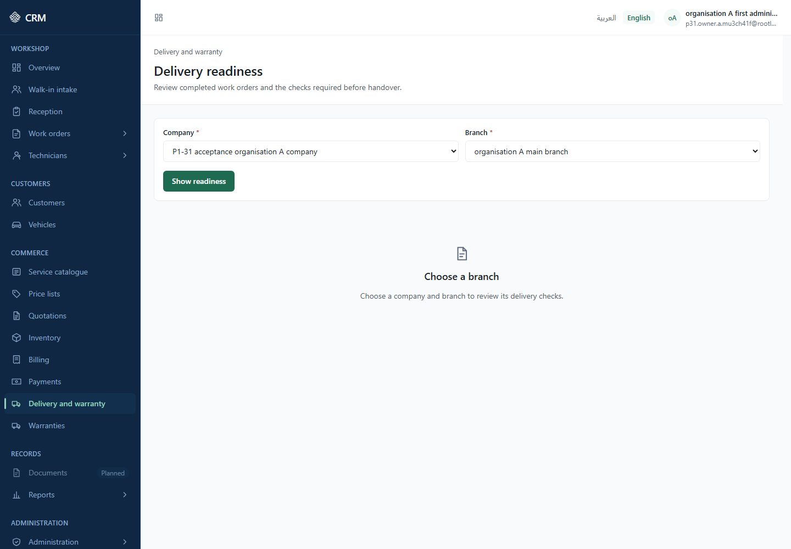

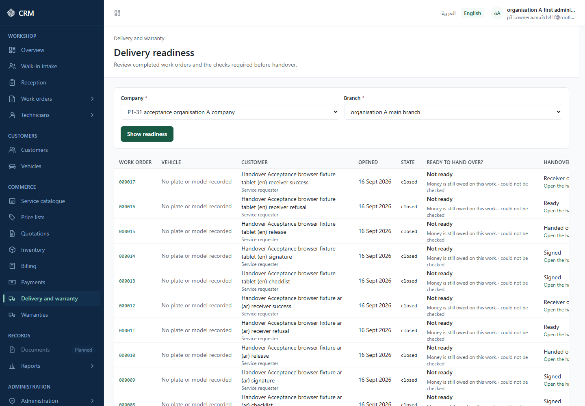

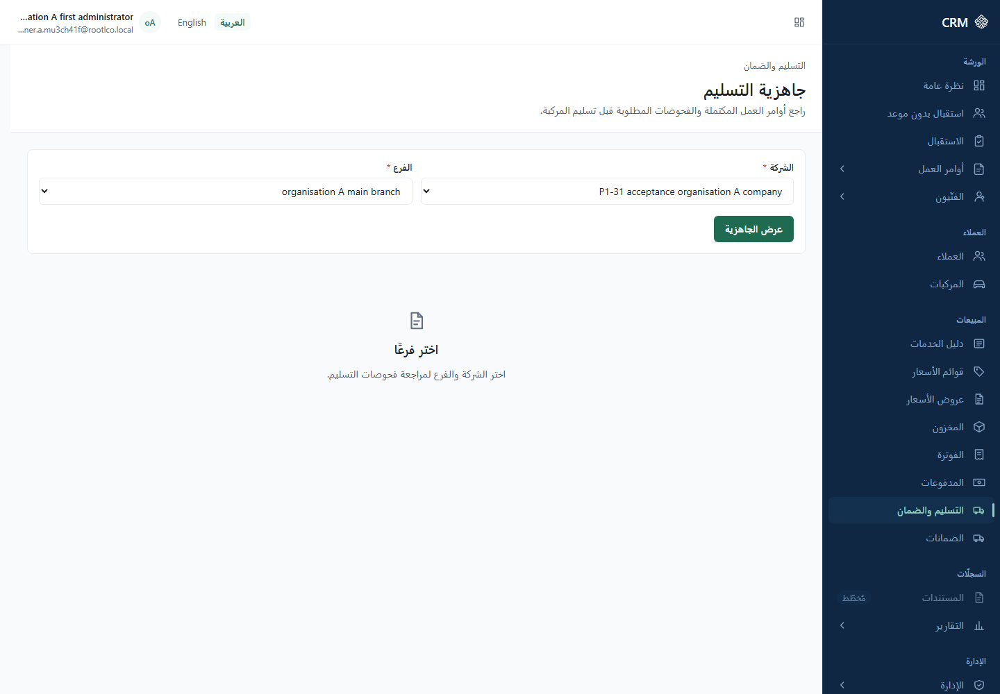

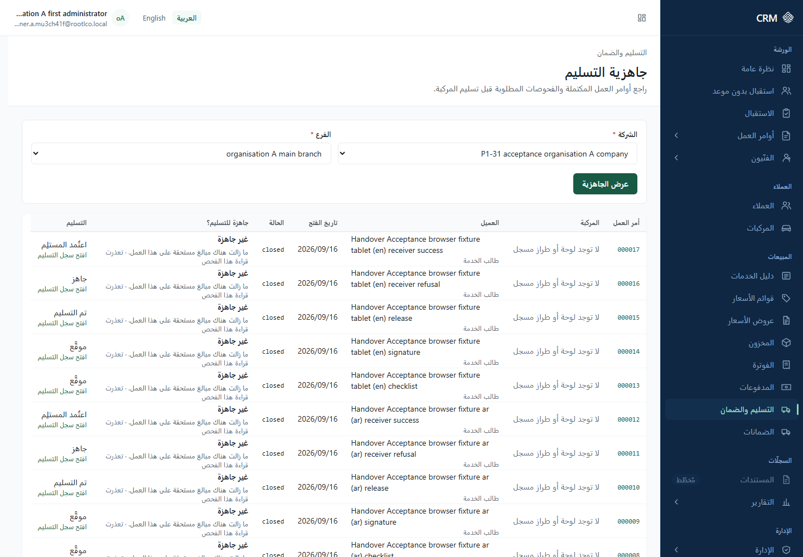

---

## 4D.3 The vehicle handover record — what the screen is

**IMPLEMENTED (UI)**

**Label** — <!-- delivery.detail.title --> **Vehicle handover** (Arabic: **تسليم المركبة**), address
`/{language}/delivery/{handover}`, breadcrumb <!-- delivery.detail.crumb --> **Handover**. Its
description is "The record of one vehicle handover: what must still happen before the vehicle can be
released, who may receive it, what was signed and what was checked." <!-- delivery.detail.description -->

**Who** — `sal.delivery.view` opens the page. It is checked **before** anything is read, so an
account without it never causes a read. Everything else on the page is an affordance decided
separately:

| What you want to do                                                  | Permission                                          |
| -------------------------------------------------------------------- | --------------------------------------------------- |
| See the release checks, and release the vehicle                      | `sal.finance.view`                                  |
| Confirm a receiver, record a checklist result, add a signature       | `sal.delivery.manage`                               |
| Attach a proof-of-identity document to the confirmation              | `shared.document.read` and `shared.document.manage` |
| Release the vehicle                                                  | `sal.delivery.complete` (with `sal.finance.view`)   |
| Issue a warranty                                                     | `wty.warranty.issue`                                |
| Choose the warranty plan when issuing                                | `wty.warranty.read`                                 |
| See the customer, plate and work-order number on the printable sheet | `wo.work_order.read`                                |

A control you may not use is **absent**, not disabled. If a panel is missing, the authority for it
is missing.

**The panels, in order** — **Handover summary**, **Ready to release?**, **Who may receive the
vehicle**, **Signatures**, **Checklist results**, **History**, **Release the vehicle**,
**Warranty**, **Handover document**. Each panel reads its own data, so one refusal stays inside one
panel instead of taking the screen down.

**Handover summary** <!-- delivery.summary.heading --> shows **Stage** <!-- delivery.summary.status -->
, **Handed over on** <!-- delivery.summary.deliveredAt --> (or <!-- delivery.summary.notDeliveredYet -->
"Not handed over yet"), the link <!-- delivery.summary.workOrderLink --> **Open the work order**,
and four labelled references: **Vehicle reference**, **Visit reference**, **Employee handing over,
reference** and **Final odometer reading**. Beneath them the screen states: "These are internal
references. The system holds no names for them, so each reference is shown exactly as it is stored." <!-- delivery.summary.identifiersExplain -->
For a handover started through the selector in 4D.1 the delivering employee is shown by name; older
records show a bare reference.

**The stages** are **Ready**, **Receiver confirmed**, **Signed**, **Handed over** and **Problem
raised** <!-- delivery.status.ready / .receiverVerified / .signed / .delivered / .exception --> .

**Screenshot** — `images/handover-record-en.png`; the right-to-left rendering is
`images/handover-record-ar.png`.

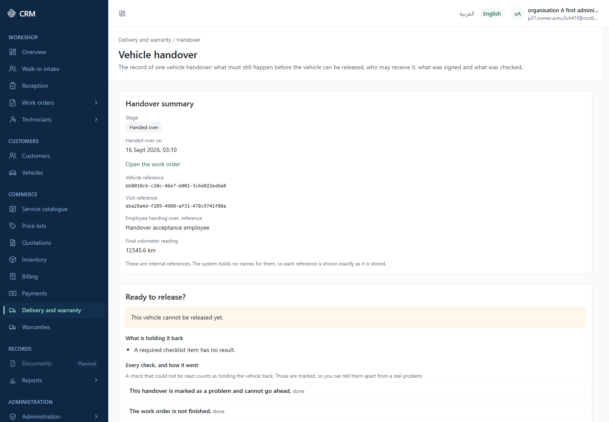

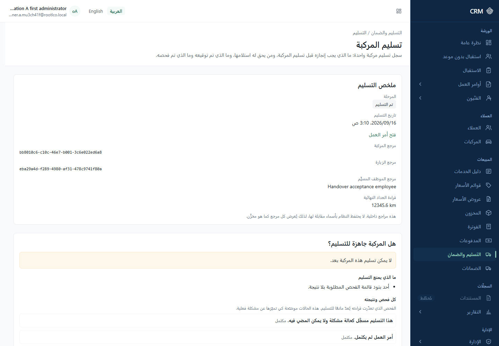

---

## 4D.4 "Ready to release?" — the release checks

**IMPLEMENTED (UI)**

**Label** — <!-- delivery.eligibility.heading --> **Ready to release?**

**Who** — `sal.delivery.view` to be on the page, and `sal.finance.view` to see this panel at all.
Without the financial code the panel says so and **makes no request**: "Answering this needs
permission to see financial information, because one reason a vehicle is held back is money still
owed. Ask an administrator if you need it." <!-- delivery.eligibility.needsFinance -->

**What it shows**

- The verdict: <!-- delivery.eligibility.eligible --> "Everything required is done. This vehicle can
  be released." or <!-- delivery.eligibility.notEligible --> "This vehicle cannot be released yet."
- <!-- delivery.eligibility.blockersHeading --> **What is holding it back** — the reasons, in plain
  sentences:

| Sentence on screen                                            | Catalogue key                                  |
| ------------------------------------------------------------- | ---------------------------------------------- |
| "The work order is not finished."                             | `delivery.blocker.workOrderNotComplete`        |
| "Quality control has not passed."                             | `delivery.blocker.qualityControlNotPassed`     |
| "Money is still owed on this work."                           | `delivery.blocker.financialBalanceOutstanding` |
| "Parts are still held or unaccounted for on this work order." | `delivery.blocker.partObligationOutstanding`   |
| "A required checklist item has no result."                    | `delivery.blocker.checklistIncomplete`         |
| "Nobody has been confirmed to receive the vehicle."           | `delivery.blocker.receiverNotVerified`         |
| "No signature has been collected."                            | `delivery.blocker.signatureMissing`            |
| "This handover is marked as a problem and cannot go ahead."   | `delivery.blocker.deliveryStateInvalid`        |

- <!-- delivery.eligibility.factsHeading --> **Every check, and how it went**, with the warning that
  matters most on this screen: "A check that could not be read counts as holding the vehicle back.
  Those are marked, so you can tell them apart from a real problem." <!-- delivery.eligibility.factsExplain -->
  A check reads **done** <!-- delivery.eligibility.factSatisfied --> , **holding the vehicle back** <!-- delivery.eligibility.factBlocking -->
  , or "could not be checked, report this reference to support" <!-- delivery.eligibility.factUnreadable -->
  followed by a reference.
- <!-- delivery.eligibility.gapsHeading --> **Required checklist items still open**, with "A sample
  of the required items that have no result yet. There may be more than are listed here." <!-- delivery.eligibility.gapsExplain -->
- <!-- delivery.eligibility.version --> **Version to quote when completing** — the record version
  the release will be sent against.

**Read "could not be checked" as a platform problem, not a customer problem.** If the panel says the
customer still owes money, chase the customer. If it says a check could not be read, quote the
reference to support (see Part 7).

**Only one reason can ever be set aside** — money still owed. The panel says which of two applies:
"You may release the vehicle despite the money still owed. Doing so is recorded against your name." <!-- delivery.eligibility.overridableByYou -->
or "A manager who is allowed to complete handovers may release the vehicle despite the money still
owed." <!-- delivery.eligibility.overridableByOther -->

**Screenshot** — visible in `images/handover-record-en.png`.

---

## 4D.5 Confirming who may receive the vehicle

**IMPLEMENTED (UI)**

This is the custody step. Exactly **one** receiver can be confirmed per handover, and the form
disappears once one is.

### Workflow — Confirm the receiver

**IMPLEMENTED (UI)**

**Label** — panel <!-- delivery.receiver.heading --> **Who may receive the vehicle** (Arabic: **من
يحق له استلام المركبة**); form <!-- delivery.receiver.verifyHeading --> **Confirm who may receive
the vehicle**; submit <!-- delivery.receiver.verifySubmit --> **Confirm this person**.

**Who** — `sal.delivery.manage`. To attach a document you additionally need `shared.document.read`
and `shared.document.manage`. Without those two you can still confirm, and the screen says why the
file control is missing: "You can confirm the receiver, but you do not have permission to attach a
proof of identity document." <!-- delivery.receiver.evidenceNotPermitted -->

**Where** — the **Vehicle handover** record, panel **Who may receive the vehicle**.

**Steps**

1. Until someone is confirmed the panel reads <!-- delivery.receiver.noneTitle --> "Nobody confirmed
   yet" / <!-- delivery.receiver.noneDescription --> "No one has been confirmed to receive this
   vehicle. That happens before the handover is signed."
2. **Person receiving the vehicle** <!-- delivery.receiver.partnerLabel --> — **required**. Search
   by name and pick — for example Layla Al-Mithal (example). The form explains: "Search for the
   person by name. The system checks that they are recorded on this visit as allowed to collect the
   vehicle, and refuses the confirmation if they are not." <!-- delivery.receiver.verifyExplain -->
3. **Proof of identity document (optional)** <!-- delivery.receiver.evidenceLabel --> (Arabic:
   **مستند إثبات الهوية (اختياري)**) — see 4D.6 below.
4. Press **Confirm this person**. While the chain runs the panel says <!-- delivery.receiver.verifying -->
   "Confirming the receiver…"

**Result** — <!-- delivery.receiver.verified --> "The person receiving the vehicle has been
confirmed." The panel then shows **Person receiving, reference** <!-- delivery.receiver.partner -->
, **Confirmed by, employee reference** <!-- delivery.receiver.verifiedBy --> , **Confirmed on** <!-- delivery.receiver.verifiedAt -->
and one of two sentences about the document: "Proof of identity is on file. It is not shown here." <!-- delivery.receiver.evidenceOnFile -->
or "No proof of identity is on file." <!-- delivery.receiver.evidenceAbsent -->

**Restrictions**

- The receiver must already be recorded on the reception visit as someone allowed to collect the
  vehicle, and that permission must still be valid today. The screen asserts nothing; the platform
  decides and the refusal is the platform's answer.
- The receiver and the confirming employee are shown as references. The product resolves no names
  for them, and the stored identity document is never displayed, never linked and cannot be opened
  from this screen.
- One receiver per handover. Once confirmed, the form is gone.

**If it goes wrong**

| What you see                                                                                 | What it means                                                                                                | What to do                                                                      |
| -------------------------------------------------------------------------------------------- | ------------------------------------------------------------------------------------------------------------ | ------------------------------------------------------------------------------- |
| "Choose the person who will receive the vehicle." <!-- delivery.receiver.partnerRequired --> | No person was picked. The screen checks this before spending a request, so a document you chose is not lost. | Pick a person.                                                                  |
| "The receiver was not confirmed." <!-- delivery.receiver.refused -->                         | A general refusal, with a reference beneath it.                                                              | Read the more specific sentence shown with it; see 4D.6 for the document cases. |

**Screenshot** — no screenshot available at this version (the captured handover already has a
confirmed receiver).

---

## 4D.6 The optional proof-of-identity document

**IMPLEMENTED (UI)**

The document is genuinely optional: you can confirm a receiver without one, and that is a normal
outcome, not a shortcut. What the product guarantees is the opposite direction — **once you have
chosen a document, the confirmation never goes through without it.**

**What the screen tells you**

- The hint: "You may attach a photo or scan of the receiver's proof of identity. It is optional: the
  receiver can be confirmed without one." <!-- delivery.receiver.evidenceHint -->
- <!-- delivery.receiver.evidenceTypes --> **Accepted file types:** and <!-- delivery.receiver.evidenceMaxSize -->
  **Largest file accepted:** — both read from the document type the platform publishes, not fixed in
  the screen. At this version that type accepts **JPEG, PNG and WEBP** images up to **10 MB**, and
  the types are named the way you would name them (JPEG, not the technical media type).
- While that is being read: <!-- delivery.receiver.evidenceLimitsLoading --> "Checking which files
  can be accepted…"
- If it cannot be read: "The accepted file types and size could not be shown. The document is still
  checked when you confirm." <!-- delivery.receiver.evidenceLimitsUnavailable --> This does not stop
  you; the check simply happens when you press Confirm.

**The status line beneath the control always says which case you are in**

- <!-- delivery.receiver.evidenceChosen --> "A document is chosen. It will be saved and attached to
  this visit before the receiver is confirmed."
- <!-- delivery.receiver.evidenceNoneChosen --> "No document is chosen. The receiver will be
  confirmed without a proof of identity document."

That line is announced to screen readers as it changes, so you are never left guessing. To go back
to confirming without a document, use <!-- delivery.receiver.evidenceRemove --> **Remove the chosen
document**.

**What happens on a refusal — and why nothing is confirmed**

With a document chosen, the confirmation is one act in four steps: read the document type, save the
file against the reception visit, attach it to that visit, then confirm the receiver with the
document bound. **If any step fails, nothing is confirmed** and the document stays on the form. A
second press of **Confirm this person** sends the same document again; confirming without it takes
your explicit **Remove the chosen document**.

| What you see                                                                                                                                                                                                                         | What it means                                                                                                                 |
| ------------------------------------------------------------------------------------------------------------------------------------------------------------------------------------------------------------------------------------ | ----------------------------------------------------------------------------------------------------------------------------- |
| "Proof of identity documents cannot be accepted because no document type for them is active. Nothing was saved." <!-- delivery.receiver.evidenceCategoryMissing -->                                                                  | The installation has no active document type for receiver identity. Nothing is filed anywhere else in its place.              |
| "The proof of identity document could not be saved, so nothing was confirmed." <!-- delivery.receiver.evidenceUploadFailed -->                                                                                                       | The file did not reach the store — for example it is larger than the ceiling, or of a type the document type does not accept. |
| "The proof of identity document was saved but could not be attached to this visit, so nothing was confirmed." <!-- delivery.receiver.evidenceLinkFailed -->                                                                          | The file was stored but not linked.                                                                                           |
| "The document did not pass its safety check and cannot be used, so nothing was confirmed." <!-- delivery.receiver.evidenceRefusedReview -->                                                                                          | The stored file was rejected or quarantined by the file check.                                                                |
| "The system did not accept this confirmation. The document may not be accepted as proof of identity for this handover, or another detail was not accepted. Nothing was confirmed." <!-- delivery.receiver.evidenceRefusedInvalid --> | A validation refusal. The document is one possible cause, not the only one.                                                   |
| "Something this confirmation needs could not be found for your account: the document, the receiver or this handover. Nothing was confirmed." <!-- delivery.receiver.evidenceRefusedMissing -->                                       | One of the three could not be resolved for you.                                                                               |
| "The chosen document is still on the form. Confirm again to try with it, or remove it first to confirm without a document." <!-- delivery.receiver.evidenceStillChosen -->                                                           | Your instructions after any of the above.                                                                                     |
| "Choose a file to record." <!-- attachments.capture.empty -->                                                                                                                                                                        | An empty file was chosen.                                                                                                     |

**One browser behaviour to know about.** If you reopen the file picker and then cancel it, some
browsers empty the control. The panel does not hide that: the status line changes to "No document is
chosen…" and the Remove control disappears, before you press Confirm.

**OPERATOR PROCEDURE** — the receiver-identity document type itself is seeded by an operator act
(operator runbook, the identity-evidence category seed). There is no screen for creating it. If the
message about no active document type appears, that seed has not been applied on this installation.

**Screenshot** — no screenshot available at this version.

---

## 4D.7 Checklist results

**IMPLEMENTED (UI)** · the template administration screen is **DEFERRED**

### Workflow — Record a checklist result

**IMPLEMENTED (UI)**

**Label** — panel <!-- delivery.checklist.heading --> **Checklist results**; submit <!-- delivery.checklist.record -->
**Record this result**.

**Who** — `sal.delivery.manage`.

**Where** — the **Vehicle handover** record, panel **Checklist results**.

**Steps**

1. The panel explains itself: "Every item of every checklist that is in use for this company. What
   has a result shows it; what does not can be recorded here. A result cannot be changed once it is
   recorded." <!-- delivery.checklist.assembledExplain --> Required items are marked <!-- delivery.checklist.mandatory -->
   **Required item**; items with no result read <!-- delivery.checklist.notRecordedYet --> "No
   result yet."
2. **Result** <!-- delivery.checklist.outcome --> — **required**. The choices are <!-- delivery.outcome.passed -->
   **Passed**, <!-- delivery.outcome.failed --> **Failed** and <!-- delivery.outcome.waived -->
   **Waived**.
3. **Reason for waiving this item** <!-- delivery.checklist.waiverReasonLabel --> — **required, and
   only shown, when the result is Waived**. Up to 2,000 characters. The help text is "A waiver has
   to say why. Give the reason in a sentence someone reading this later can act on." <!-- delivery.checklist.waiverReasonHelp -->
4. Press **Record this result**.

**Result** — <!-- delivery.checklist.recorded --> "The result has been recorded." The item then
shows its result and, for a waiver, <!-- delivery.checklist.waiverReason --> "Reason for waiving:"
with your sentence. No control is offered on an item that already has a result.

**Restrictions**

- **A recorded result is final.** There is no edit and no delete. Correct an error by raising it
  with whoever operates the installation; the interface offers no correction.
- Results recorded against items that have since been withdrawn stay on the record, under <!-- delivery.checklist.withdrawnHeading -->
  "Recorded against items no longer in use" with "These results were recorded against checklist
  items that have since been withdrawn. They stay on the record." <!-- delivery.checklist.withdrawnExplain -->
- A reason is sent only with a waiver, never with a pass or a fail.

**If it goes wrong**

| What you see                                                                                                                                                                                 | What it means                           | What to do          |
| -------------------------------------------------------------------------------------------------------------------------------------------------------------------------------------------- | --------------------------------------- | ------------------- |
| "This item already has a result, and a recorded result is final. Refresh to see what was recorded." <!-- delivery.checklist.alreadyRecorded -->                                              | Someone recorded it first.              | Refresh the page.   |
| "Required" <!-- form.required --> beneath the reason box                                                                                                                                     | A waiver with no reason.                | Write the reason.   |
| "No checklist is in use" / "No checklist has been set up for this company, so there is nothing to work through here." <!-- delivery.checklist.noTemplatesTitle / .noTemplatesDescription --> | This company has no checklist template. | See the note below. |

**Screenshot** — no screenshot available at this version.

### The checklist template administration screen

**DEFERRED** — backlog item **P1-31-FU-001**.

There is no screen for creating or editing a delivery checklist template. Until that item is built,
a company with no template sees the "No checklist is in use" message above and there is nothing an
administrator can do about it from the interface. The Owner has recorded that this screen is not a
closure requirement of the current phase and is not to be inserted into the next one. Templates are
therefore an **OPERATOR PROCEDURE** for this release.

Note the practical consequence: the release check "A required checklist item has no result." can
only be cleared for companies whose template already exists. A company with no template has no
required items, so that check does not hold the vehicle back.

---

## 4D.8 Signatures

**IMPLEMENTED (UI)**

### Workflow — Add a signature

**IMPLEMENTED (UI)**

**Label** — panel <!-- delivery.signatures.heading --> **Signatures**; form <!-- delivery.signatures.captureHeading -->
**Add a signature**; submit <!-- delivery.signatures.captureSubmit --> **Add the signature**.

**Who** — `sal.delivery.manage`.

**Where** — the **Vehicle handover** record, panel **Signatures**.

**Steps**

1. Before anything is signed the panel reads <!-- delivery.signatures.noneTitle --> "No signatures
   yet" / <!-- delivery.signatures.noneDescription --> "Nothing has been signed for this handover so
   far."
2. **Who is signing** <!-- delivery.signatures.signerRole --> — **required**. The three roles are <!-- delivery.signerRole.receiver -->
   **Person receiving the vehicle**, <!-- delivery.signerRole.deliveringEmployee --> **Employee
   handing over** and <!-- delivery.signerRole.witness --> **Witness**.
3. **Signature image** <!-- delivery.signatures.signatureFile --> — **required**. The form explains:
   "Choose an image of the signature. It is stored against this visit and only a reference to it is
   kept with the handover." <!-- delivery.signatures.captureExplain -->
4. Press **Add the signature**.

**Result** — <!-- delivery.signatures.attached --> "The signature has been added to the handover."
The row shows the role, the moment, and <!-- delivery.signatures.onFile --> "Signature on file".

**Restrictions**

- **The screen does not draw a signature.** You upload an image of one — a photo or a scan.
- The image is never shown: "Signature images are kept on file and are not shown on this screen." <!-- delivery.signatures.documentsExplain -->
- Unlike the proof-of-identity control, this form does **not** print the accepted file types or the
  size ceiling. They belong to the platform's signature document type, which at this version accepts
  JPEG, PNG and WEBP up to 10 MB, and a file outside that is refused when you submit.
- More than one signature may be added; use <!-- delivery.action.loadMore --> **Show more** to page
  through them.

**If it goes wrong**

| What you see                                                                                                                                    | What it means                                                                                             | What to do                                                                                           |
| ----------------------------------------------------------------------------------------------------------------------------------------------- | --------------------------------------------------------------------------------------------------------- | ---------------------------------------------------------------------------------------------------- |
| "The signature was not added." <!-- delivery.signatures.refused --> plus a reason beside the control                                            | The capture was refused — an empty file, a file over the ceiling, or a type the platform does not accept. | Correct the file and try again. The reason appears beneath the control it is about, not as a pop-up. |
| "That file is larger than this kind of evidence allows." <!-- attachments.capture.tooLarge -->                                                  | Over the size ceiling.                                                                                    | Use a smaller image.                                                                                 |
| "The evidence store could not be reached, so nothing was recorded. Nothing was lost — try again." <!-- attachments.capture.storeUnavailable --> | A transient storage problem.                                                                              | Try again.                                                                                           |

**Screenshot** — no screenshot available at this version.

---

## 4D.9 Releasing the vehicle

**IMPLEMENTED (UI)**

### Workflow — Release the vehicle

**IMPLEMENTED (UI)**

**Label** — panel and submit both <!-- delivery.completion.heading / .submit --> **Release the
vehicle** (Arabic: **تسليم المركبة**).

**Who** — `sal.delivery.complete` **and** `sal.finance.view`. Without the financial code the panel
states: "Releasing a vehicle needs permission to see financial information, because one reason a
vehicle is held back is money still owed. Ask an administrator if you need it." <!-- delivery.completion.needsFinance -->
Without `sal.delivery.complete` the panel is not drawn at all.

**Where** — the **Vehicle handover** record, last write panel.

**Steps**

1. Read **Ready to release?** first (4D.4). The panel warns you that the answer is taken again at
   the moment you press the button: "The final step. The system checks everything again at the
   moment you release, so a release can be refused even when this page looked ready." <!-- delivery.completion.explain -->
2. **Final odometer reading** <!-- delivery.completion.odometer --> — **required**. "Whole numbers,
   or one digit after the decimal point. Two digits after the point are not accepted." <!-- delivery.completion.odometerHelp -->
3. **Measured in** <!-- delivery.completion.unit --> — **required**. Either <!-- delivery.odometerUnit.km -->
   **Kilometres** or <!-- delivery.odometerUnit.mi --> **Miles**.
4. Only if the release checks named money as a reason that may be set aside: <!-- delivery.completion.override -->
   **Release despite the money still owed**, with "This is the only reason that can be set aside, it
   needs a reason in writing, and it is recorded against your name." <!-- delivery.completion.overrideExplain -->
   Ticking it makes <!-- delivery.completion.overrideReason --> **Why you are releasing the vehicle
   anyway** **required** (up to 2,000 characters).
5. Press **Release the vehicle**.

**Result** — <!-- delivery.completion.done --> "The vehicle has been released." The stage moves to
**Handed over** and **Handed over on** carries the moment. The warranty panel (4D.11) becomes usable
at this point and not before.

**Restrictions**

- **Money still owed is the only reason that can ever be set aside.** Every other blocker must be
  cleared for real.
- An override is recorded against your name.
- While the checks are unmet the panel says <!-- delivery.completion.heldBack --> "The vehicle
  cannot be released yet. The release checks above say what is still outstanding."

**If it goes wrong**

| What you see                                                                                                                                                                 | What it means                                                                                                                                               | What to do                                            |
| ---------------------------------------------------------------------------------------------------------------------------------------------------------------------------- | ----------------------------------------------------------------------------------------------------------------------------------------------------------- | ----------------------------------------------------- |
| "Enter a reading with at most one digit after the decimal point." <!-- delivery.completion.odometerInvalid -->                                                               | Two decimals. The form refuses this before sending anything.                                                                                                | Round to one decimal.                                 |
| "The release was refused. These are the reasons the system gave, read again just now:" <!-- delivery.completion.refusedBlocked -->                                           | The server refused and the checks were read again. The list beneath is the current truth, not the one on screen a minute ago.                               | Clear the listed reasons.                             |
| "You are not allowed to release a vehicle while money is still owed. The permission needed is:" <!-- delivery.completion.refusedOverride --> followed by the permission code | You ticked the override without the authority.                                                                                                              | Ask someone who holds that permission to release it.  |
| "Someone else changed this handover while you were working on it. The page has been refreshed; check it and try again." <!-- delivery.completion.refusedStale -->            | Another person changed the record. The page retries once by itself against a freshly read version; this message means the second attempt also met a change. | Read the page and press again.                        |
| "This release could not be sent. Refresh the page and try again." <!-- delivery.completion.refusedNoVersion -->                                                              | A fault on the page rather than in your request.                                                                                                            | Refresh. If it repeats, report it with the reference. |

**Screenshot** — no screenshot available at this version.

---

## 4D.10 History, and the printable handover document

### History on the handover

**IMPLEMENTED (UI)**

Panel <!-- delivery.history.heading --> **History** lists the stage changes with <!-- delivery.history.started -->
**Started at**, <!-- delivery.history.movedFrom --> **Moved from** … <!-- delivery.history.movedTo -->
**to**, and <!-- delivery.history.actor --> **Recorded by, employee reference**. <!-- delivery.action.loadMore -->
**Show more** pages it. When there is nothing yet: <!-- delivery.history.noneTitle --> "No history
yet" / <!-- delivery.history.noneDescription --> "No stage change has been recorded for this
handover."

### Workflow — Print the handover document

**IMPLEMENTED (UI)**

**Label** — panel <!-- delivery.document.heading --> **Handover document** (Arabic: **مستند
التسليم**); controls <!-- delivery.document.open --> **Show the printable document**, <!-- delivery.document.close -->
**Hide the printable document** and <!-- delivery.document.print --> **Print**.

**Who** — anyone who can open the handover. What appears on the paper depends on what **you** are
allowed to read.

**Where** — the **Vehicle handover** record, last panel.

**Steps**

1. Press **Show the printable document**. The data is read only now, not on every visit, and the
   **Print** control appears once it has landed.
2. Press **Print**. This opens your browser's own print dialogue.

**Result** — a sheet titled <!-- delivery.document.title --> **Vehicle handover** with the sections <!-- delivery.document.handoverHeading -->
**The handover** (Work order, Customer, Vehicle), <!-- delivery.document.releaseChecksHeading -->
**Release checks**, <!-- delivery.document.checklistCaption --> **Checklist results** (columns
**Item code**, **Item**, **Result**, **Reason for waiving**), <!-- delivery.document.signaturesCaption -->
**Signatures** (**Signed by**, **Signed on**, **Signature image**) and <!-- delivery.document.historyCaption -->
**Stage history** (**From**, **To**, **When**, **Recorded by, employee reference**).

**Restrictions**

- **It is not an archived copy.** The footer says so, in your own language: "Operational printout —
  not an archived copy of a document. It shows what the system published to the person printing it,
  at the moment it was printed." <!-- delivery.document.disclaimer --> No stored document version is
  created; nothing is filed.
- **No PDF is generated.** Printing is the browser's own print, and a PDF only exists if your
  browser makes one.
- Without `wo.work_order.read`: "The work order, the customer and the vehicle are shown as
  references only, because you do not have permission to read work orders." <!-- delivery.document.workOrderWithheld -->
- Without `sal.finance.view`: "The release checks are left off this printout, because you do not
  have permission to see financial information." <!-- delivery.document.financeWithheld -->
- Signature images and the proof of identity are **named, never printed**. The sheet states <!-- delivery.document.identityEvidence -->
  **Proof of identity** is on file and offers no way to fetch it.
- No company, branch or organisation **name** appears on the sheet — the product holds none to
  print. No money appears on it either.
- Long lists print their first page only, and say so: <!-- delivery.document.partialList --> "Only
  the first page is printed. There are more records than are shown here."

**If it goes wrong**

| What you see                                                                                                                                                                      | What it means                                                                                           | What to do                                       |
| --------------------------------------------------------------------------------------------------------------------------------------------------------------------------------- | ------------------------------------------------------------------------------------------------------- | ------------------------------------------------ |
| "This part could not be read, so it is not on this printout. If you need it, report this reference to support:" <!-- delivery.document.sectionRefused --> followed by a reference | One section could not be read. The sheet refuses to print an empty section as if nothing were recorded. | Quote the reference to support (Part 7).         |
| "The work order could not be read, so the customer and vehicle details are not on this printout." <!-- delivery.document.workOrderRefused -->                                     | That one read failed.                                                                                   | Try again, or print the identifiers as they are. |
| "No checklist result has been recorded for this handover." <!-- delivery.document.checklistNone -->                                                                               | Genuinely nothing recorded — this is different from a refusal, and worded differently on purpose.       | Nothing to do.                                   |

**Screenshot** — no screenshot available at this version.

---

## 4D.11 Issuing a warranty

**IMPLEMENTED (UI)**

A warranty is issued from the **handover**, not from the warranty module.

### Workflow — Issue a warranty

**IMPLEMENTED (UI)**

**Label** — panel <!-- warranty.generate.heading --> **Warranty** (Arabic: **الضمان**); submit <!-- warranty.generate.submit -->
**Issue the warranty** (Arabic: **إصدار الضمان**).

**Who** — `wty.warranty.issue`. Without it the panel is absent. `wty.warranty.read` is a separate
code and decides only whether you are offered a choice of plan.

**Where** — the **Vehicle handover** record, panel **Warranty**.

**Steps**

1. The panel states the rule: "A warranty can be issued once the vehicle has been handed over. Its
   length and its limits come from the terms the workshop has set up, so there is nothing to fill in
   here." <!-- warranty.generate.explain -->
2. **Warranty plan** <!-- warranty.generate.policyField --> — **optional**. "Choose the plan to
   issue under. Leaving it unchosen uses the plan the workshop already has in use." <!-- warranty.generate.policyHelp -->
   The unchosen option reads "Use the plan the workshop already has in use" <!-- warranty.generate.policyPlaceholder -->
   . Only plans of this handover's own company that are in use are offered.
3. Press **Issue the warranty**.

**Result** — <!-- warranty.generate.done --> "The warranty has been issued.", with <!-- warranty.generate.openRecord -->
**Open the warranty**.

**Restrictions**

- The control is unusable until the stage is **Handed over**: <!-- warranty.generate.notHandedOver -->
  "The vehicle has not been handed over yet, so there is no date to start a warranty from."
- You supply **no** warranty term of any kind — no duration, no distance, no scope. Everything comes
  from the cover terms in force on the day of the handover.
- If you do not hold `wty.warranty.read`, or the plans cannot be read, the picker is not drawn and
  the form still submits without naming a plan: <!-- warranty.generate.policiesRefused --> "The
  warranty plans could not be read, so the plan the workshop already has in use will be applied." or <!-- warranty.generate.policyNotOffered -->
  "The plan the workshop already has in use will be applied."

**If it goes wrong**

| What you see                                                                                                                                                                              | What it means                                                  | What to do                                        |
| ----------------------------------------------------------------------------------------------------------------------------------------------------------------------------------------- | -------------------------------------------------------------- | ------------------------------------------------- |
| "This vehicle already has a warranty running on the same terms for these dates. Cancel it or wait for it to end before issuing another." <!-- warranty.generate.refusedAlreadyCovered --> | Overlapping cover.                                             | Check the existing warranty on the warranty list. |
| "No warranty terms are set up for the day this vehicle was handed over, so nothing can be issued. Ask an administrator to set them up." <!-- warranty.generate.refusedNotConfigured -->   | The plan has no cover terms window covering that date.         | Add cover terms (4D.15), then issue.              |
| "The warranty was refused. The handover must be complete and must carry a final odometer reading." <!-- warranty.generate.refusedPrecondition -->                                         | The handover is not finished, or has no odometer reading.      | Release the vehicle first (4D.9).                 |
| "You are not allowed to issue a warranty. Ask an administrator if you need to." <!-- warranty.generate.refusedDenied -->                                                                  | `wty.warranty.issue` is missing.                               | Ask an administrator.                             |
| "This request was already recorded. Refresh the handover to see the warranty it produced." <!-- warranty.generate.refusedAlreadyRecorded -->                                              | The same request was already accepted; nothing was duplicated. | Refresh and open the warranty.                    |

**Screenshot** — no screenshot available at this version.

---

## 4D.12 The warranty list

**IMPLEMENTED (UI)** · single-branch

### Workflow — Find a warranty

**IMPLEMENTED (UI)**

**Label** — <!-- warranty.list.title --> **Warranties** (Arabic: **الضمانات**). Description: "Every
warranty issued by one branch, newest first. Choose a branch to see its warranties, and name a
vehicle to see only that vehicle's." <!-- warranty.list.description -->

**Who** — `wty.warranty.read`, checked before anything is read. `org.branch.read` only decides
whether you get a branch directory to pick from; without it you type the identifiers and reach
exactly the same rows.

**Where** — sidebar <!-- nav.warranty --> **Warranties** (Arabic: **الضمانات**), address
`/{language}/warranty`.

**Steps**

1. Under <!-- warranty.target.heading --> **Branch** the page explains: "A warranty belongs to one
   branch. Name the branch to see its warranties; the server checks the choice on every read." <!-- warranty.target.explain -->
2. Choose **Branch** <!-- warranty.common.branchField --> — **required** (placeholder <!-- warranty.common.branchPlaceholder -->
   "Choose a branch"). If the directory cannot be read the page says "The branch list could not be
   read, so the identifiers are typed instead." <!-- warranty.common.branchesRefused --> and offers
   **Company identifier** <!-- warranty.common.companyIdField --> and **Branch identifier** <!-- warranty.common.branchIdField -->
   with "Paste the identifier you were given." <!-- warranty.common.identifierHelp -->
3. Press <!-- warranty.target.choose --> **Show this branch**. To move to another branch, use <!-- warranty.target.change -->
   **Change branch**.
4. Optionally narrow by vehicle: <!-- warranty.filter.heading --> **One vehicle** → **Vehicle
   identifier** <!-- warranty.filter.vehicleField --> → <!-- warranty.filter.apply --> **Apply**.

**Result** — the table <!-- warranty.list.tableCaption --> "Warranties issued by the chosen branch"
under the heading <!-- warranty.list.heading --> **Warranties in this branch**, newest first, with
**Warranty plan**, **State**, **Cover starts**, **Cover ends**, **Odometer reading at which cover
ends** and **Vehicle reference** <!-- warranty.list.columnPolicy … .columnVehicle --> . <!-- warranty.list.loadMore -->
**Show more** pages it. The link <!-- warranty.list.openPolicies --> **Open the warranty plans**
takes you to plan administration (4D.14) — there is no sidebar entry for it.

**Restrictions**

- Nothing is read until you name a branch: "Choose a branch above. A warranty belongs to one branch,
  so nothing is read until you name one." <!-- warranty.list.chooseBranchFirst -->
- Vehicle is the **only** filter: "Naming a vehicle shows the warranties issued for it, newest
  first. It is the only way to narrow this list, because it is the only choice the system offers." <!-- warranty.filter.explain -->
- The vehicle is named by identifier, not by plate.

**If it goes wrong**

| What you see                                                                                                                                     | What it means                                                            | What to do                                  |
| ------------------------------------------------------------------------------------------------------------------------------------------------ | ------------------------------------------------------------------------ | ------------------------------------------- |
| "No warranties here" / "This branch has issued no warranty that matches what you asked for." <!-- warranty.list.noneTitle / .noneDescription --> | Genuinely none in that branch, or your vehicle filter excludes them all. | Clear the vehicle filter, or change branch. |
| "You do not have access" <!-- state.denied.title -->                                                                                             | `wty.warranty.read` is missing; the page refuses before it reads.        | Ask an administrator.                       |
| "Enter the identifier exactly as it was given." <!-- warranty.common.idFormat -->                                                                | A malformed identifier in the typed fallback.                            | Paste it again.                             |

**Screenshot** — `images/warranty-list-en.png` (before a branch is chosen) and
`images/warranty-list-en-answered.png` (answered). Right-to-left: `images/warranty-list-ar.png` and
`images/warranty-list-ar-answered.png`.

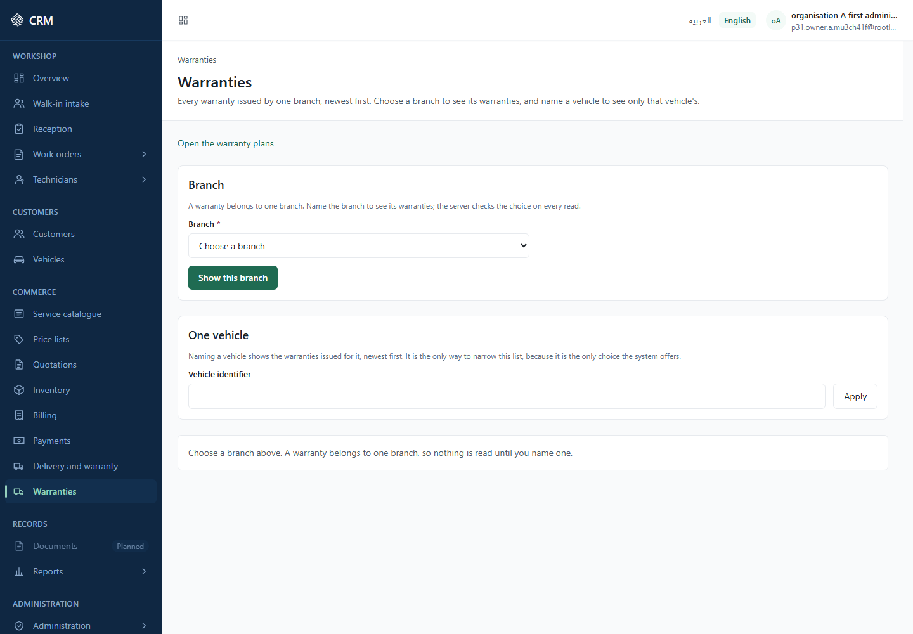

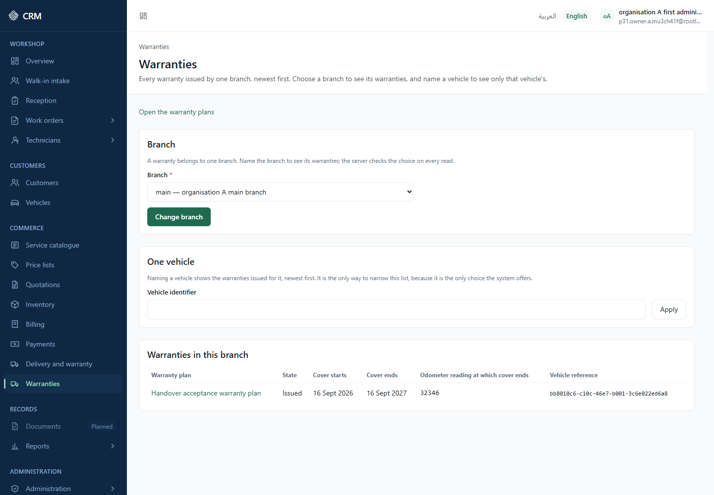

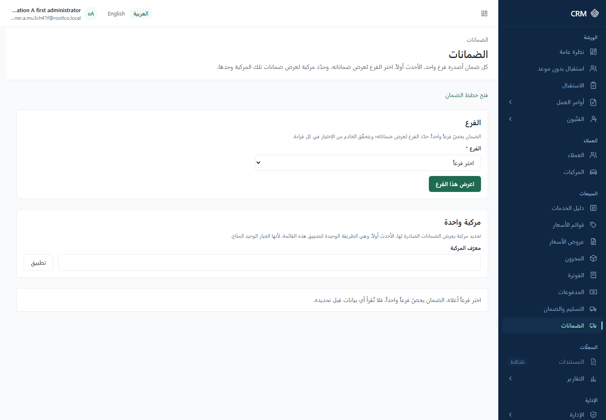

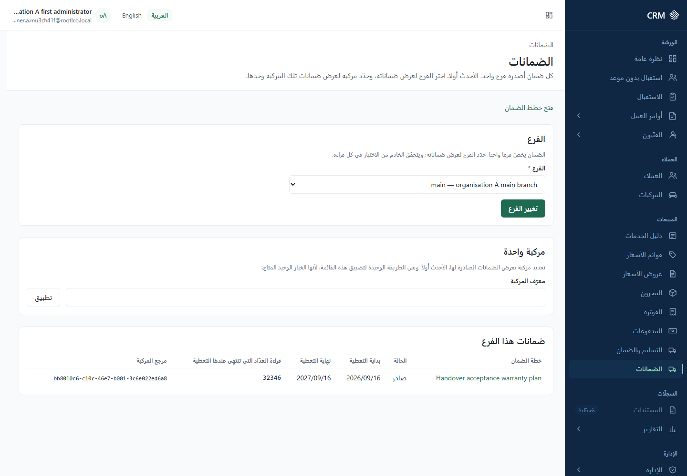

---

## 4D.13 One warranty record

**IMPLEMENTED (UI)**

**Label** — <!-- warranty.record.title --> **Warranty record** (Arabic: **سجل الضمان**), breadcrumb <!-- warranty.record.crumb -->
**Warranty**, address `/{language}/warranty/{warranty}`.

**Who** — `wty.warranty.read`.

**Where** — from the warranty list, or from **Open the warranty** after issuing one.

**What it shows**

- <!-- warranty.summary.heading --> **Warranty summary** — **State** <!-- warranty.summary.status -->
  , **Cover starts**, **Cover ends**, **Odometer reading when issued** <!-- warranty.summary.odometerAtIssue -->
  , **Odometer reading at which cover ends** <!-- warranty.summary.odometerLimit --> (or <!-- warranty.summary.noDistanceLimit -->
  "No distance limit"), **Vehicle reference**, and the links <!-- warranty.summary.workOrderLink -->
  **Open the work order** and <!-- warranty.summary.deliveryLink --> **Open the vehicle handover**.
- <!-- warranty.policy.heading --> **Warranty plan** — **Plan**, **Plan reference**, **Plan state**,
  with "The plan this warranty was issued under. Plans are set up by the workshop and are never
  chosen here." <!-- warranty.policy.explain -->
- <!-- warranty.coverage.heading --> **Cover terms** — **What is covered**, **Months of cover**,
  **Distance the cover allows** (or <!-- warranty.coverage.unlimitedDistance --> "Distance is not
  limited"), **These terms apply from**, **These terms apply until** (or <!-- warranty.coverage.openEnded -->
  "Still in force"), **Terms state**. The panel states: "The terms in force on the day the vehicle
  was handed over. Every one of them is set up by the workshop, and this screen fills in none of
  them." <!-- warranty.coverage.explain -->
- <!-- warranty.items.heading --> **What this warranty covers** — the jobs and parts recorded
  against it, by <!-- warranty.items.sourceJob --> **Job reference** and <!-- warranty.items.sourcePart -->
  **Part reference**; kinds are <!-- warranty.itemKind.service --> **Job** and <!-- warranty.itemKind.part -->
  **Part**. If nothing was recorded: <!-- warranty.items.none --> "Nothing was recorded against this
  warranty."
- <!-- warranty.history.heading --> **History** — every change of state, newest first, with **Issued
  as** <!-- warranty.history.origin --> , **Moved from** … **to**, and **Recorded by, employee
  reference**. Empty: <!-- warranty.history.noneTitle --> "No history yet" / <!-- warranty.history.noneDescription -->
  "No change of state has been recorded for this warranty." The panel notes "The workshop keeps this
  record; nothing on this screen adds to it." <!-- warranty.history.explain -->

**States** — <!-- warranty.status.issued --> **Issued**, <!-- warranty.status.active --> **In
force**, <!-- warranty.status.expired --> **Ended**, <!-- warranty.status.voided --> **Cancelled**
and <!-- warranty.status.claimedAgainst --> **Claimed against**.

**Restrictions**

- **Nothing on this screen is worked out for you.** The screen does not decide whether cover is
  still live, does not compare the end date with today, and does not subtract one odometer figure
  from the other. It reports what the record says.
- **Two odometer figures, deliberately kept apart.** "Odometer reading when issued" and "Odometer
  reading at which cover ends" are different things and their absences are worded differently. Do
  not read one for the other.
- **There is no money anywhere on a warranty.** The record holds no amount, no currency and no cap,
  so none is shown and none is invented.
- **Cover terms are shown as scopes**: <!-- warranty.coveredScope.all --> **Jobs and parts**, <!-- warranty.coveredScope.service -->
  **Jobs only**, <!-- warranty.coveredScope.part --> **Parts only**.
- A reference is a reference: "This is an internal reference. The system holds no name for it, so it
  is shown exactly as it is stored." <!-- warranty.summary.identifiersExplain -->

### Warranty claims

**NOT AVAILABLE**

There is no claims screen anywhere in the product. The state **Claimed against** can be read if the
record already carries it, but nothing in this release can record a claim, and no claim history
exists. Handle claims outside the system for now.

**Screenshot** — `images/warranty-record-en.png`; right-to-left `images/warranty-record-ar.png`.

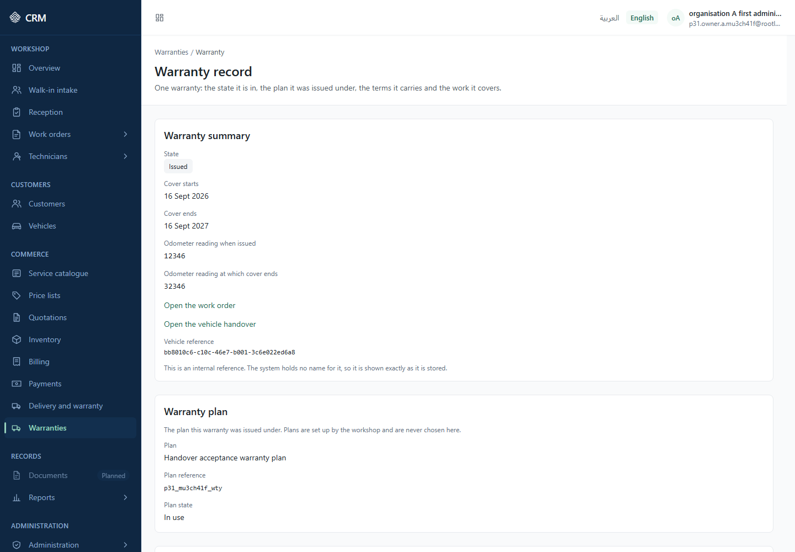

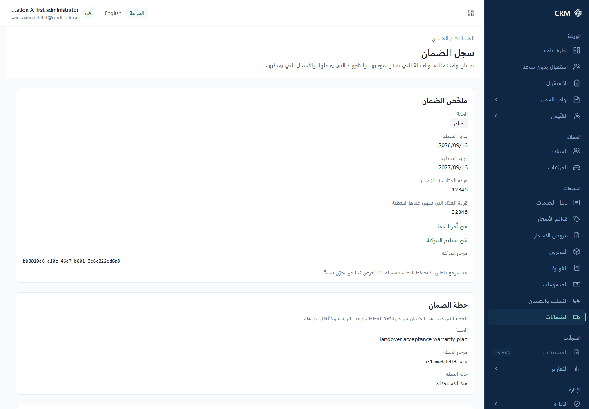

---

## 4D.14 Warranty plans

**IMPLEMENTED (UI)**

A warranty cannot be issued until a plan exists **with cover terms on it**. This is where both are
set up.

**Where** — there is **no sidebar entry**. Reach it from <!-- nav.warranty --> **Warranties** → <!-- warranty.list.openPolicies -->
**Open the warranty plans**, address `/{language}/warranty/policies`.

**Who** — `wty.warranty.read` opens the page (so a clerk who issues warranties can read the terms).
Every change needs `wty.policy.manage`. A freshly provisioned tenant administrator holds both.

### Workflow — Add a warranty plan

**IMPLEMENTED (UI)**

**Label** — page <!-- warranty.policies.title --> **Warranty plans** (Arabic: **خطط الضمان**);
section <!-- warranty.policies.createHeading --> **New plan**; form <!-- warranty.policies.createFormLabel -->
**Add a warranty plan**; submit <!-- warranty.policies.createSubmit --> **Add the plan**.

**Steps**

1. The section explains: "A plan belongs to one company, and every branch of that company issues
   warranties under it. Add the cover terms afterwards, on the plan itself." <!-- warranty.policies.createExplain -->
2. **Company** <!-- warranty.policies.companyField --> — **required**. Companies are shown by
   reference: "The companies your branches belong to. No company name is held by anything this
   screen reads, so each one is shown by its reference." <!-- warranty.policies.companyFromDirectory -->
3. **Plan reference** <!-- warranty.policies.codeField --> — **required**. "A short reference you
   choose once. It cannot be changed later, because warranties issued under this plan keep citing
   it." <!-- warranty.policies.codeHelp --> The rule: "Use lower-case letters, digits and
   underscores, starting with a letter. Between two and sixty-three characters." <!-- warranty.policies.codeFormat -->
   For example `standard_12m` (example).
4. **Plan name** <!-- warranty.policies.nameField --> — **required**, up to two hundred characters <!-- warranty.policies.nameLength -->
   . For example "Standard 12-month cover (example)".
5. Press **Add the plan**.

**Result** — <!-- warranty.policies.created --> "The plan has been added." with <!-- warranty.policies.openCreated -->
**Open the plan**. The list <!-- warranty.policies.listHeading --> **Plans** (caption "Warranty
plans and the company each one belongs to" <!-- warranty.policies.tableCaption --> ) carries
**Plan**, **Plan reference**, **State**, **Company reference** and **Change** <!-- warranty.policies.columnName … .columnAction -->
.

**Restrictions**

- The plan reference can never be changed. Choose it once, carefully.
- A new plan grants nothing until cover terms are added to it.
- The list shows retired plans as well unless you narrow it: <!-- warranty.policies.filterHeading -->
  **Show** → **State** <!-- warranty.policies.stateField --> with <!-- warranty.policies.anyState -->
  **Every plan**. "Plans that have been retired are listed with the rest unless you narrow this. A
  retired plan keeps its reference and can be put back in use." <!-- warranty.policies.filterExplain -->
  States are <!-- warranty.configurationStatus.active --> **In use** and <!-- warranty.configurationStatus.archived -->
  **Retired**.

**If it goes wrong**

| What you see                                                                                                                                                                                     | What it means                               | What to do                                      |
| ------------------------------------------------------------------------------------------------------------------------------------------------------------------------------------------------ | ------------------------------------------- | ----------------------------------------------- |
| "That plan reference is already used in this company. Choose another one." <!-- warranty.policies.refusedDuplicateCode -->                                                                       | The reference is taken.                     | Choose a different reference.                   |
| "You are not allowed to change warranty plans. Ask an administrator if you need to." <!-- warranty.policies.refusedDenied -->                                                                    | `wty.policy.manage` is missing.             | Ask an administrator.                           |
| "Something you entered was refused. Check the fields and try again." <!-- warranty.policies.refusedInvalid -->                                                                                   | A field was not accepted.                   | Check the reference format and the name length. |
| "No warranty plans" / "Nothing matches what you asked for. A warranty cannot be issued until a plan is set up with the terms it grants." <!-- warranty.policies.noneTitle / .noneDescription --> | No plan matches the filter, or none exists. | Widen the **Show** filter, or add a plan.       |

**Screenshot** — `images/warranty-plans-en.png`; right-to-left `images/warranty-plans-ar.png`.

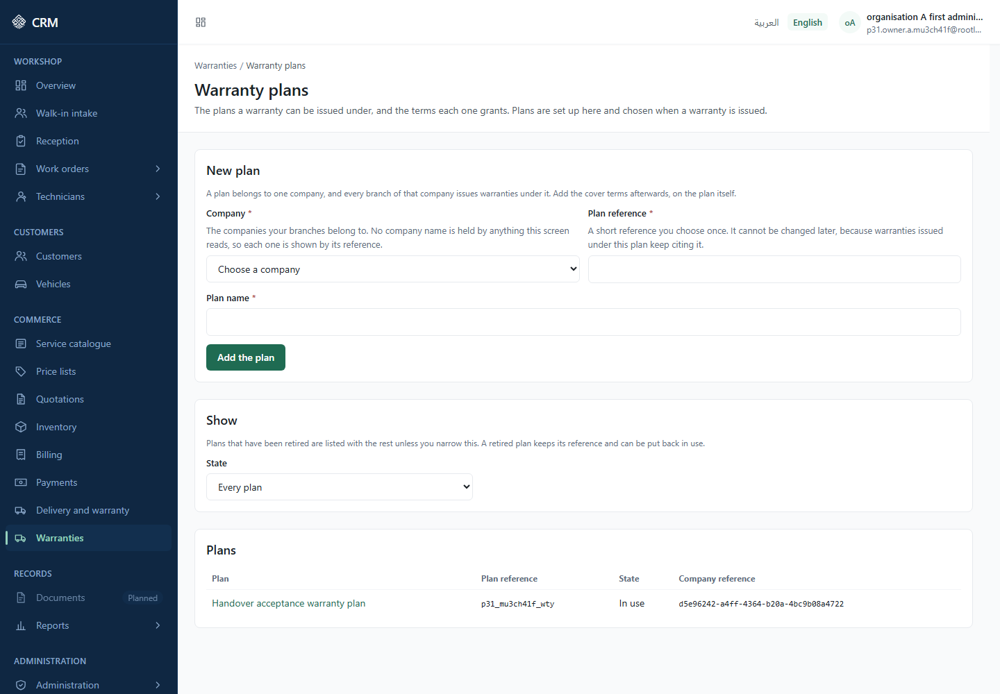

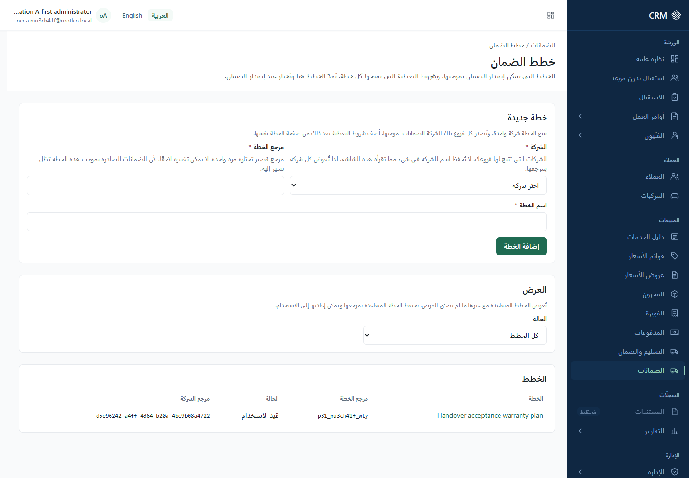

---

## 4D.15 One warranty plan — name, use, and cover terms

**IMPLEMENTED (UI)**

**Label** — <!-- warranty.policies.detailTitle --> **Warranty plan** (Arabic: **خطة الضمان**),
breadcrumb <!-- warranty.policies.detailCrumb --> **Plan**, address
`/{language}/warranty/policies/{plan}`. Description: "One plan: what it is called, whether it is
still in use, and every window of cover terms it holds." <!-- warranty.policies.detailDescription -->

**Who** — `wty.warranty.read` to open it; `wty.policy.manage` for every change.

**The summary** **Plan** <!-- warranty.policies.summaryHeading --> shows **Plan name**, **State**,
**Plan reference** and **Company reference**.

### Workflow — Rename a plan

**IMPLEMENTED (UI)**

**Steps** — section <!-- warranty.policies.renameHeading --> **Rename** ("Only the name can be
changed. The plan reference stays as it is, because warranties already issued keep citing it." <!-- warranty.policies.renameExplain -->
) → **Plan name** — **required** → <!-- warranty.policies.renameSubmit --> **Save the name**.

**Result** — <!-- warranty.policies.renamed --> "The name has been saved." The screen then reads the
plan again from the server rather than showing what you typed.

### Workflow — Retire or restore a plan

**IMPLEMENTED (UI)**

**Steps** — section <!-- warranty.policies.stateHeading --> **Whether this plan is in use** → <!-- warranty.policies.retirePlan -->
**Retire this plan** or <!-- warranty.policies.restorePlan --> **Put this plan back in use**.

**Result** — <!-- warranty.policies.statusChanged --> "The plan has been updated."

**Restrictions** — "Retiring a plan stops it being offered when a warranty is issued. Warranties
already issued under it are not affected, and its cover terms are left exactly as they are." <!-- warranty.policies.stateExplain -->

### Workflow — Add cover terms

**IMPLEMENTED (UI)**

**Label** — section <!-- warranty.policies.coverageHeading --> **Cover terms** (table caption
"Windows of cover terms held by this plan" <!-- warranty.policies.coverageTableCaption --> ); form <!-- warranty.policies.addCoverageHeading -->
**Add cover terms**; submit <!-- warranty.policies.addCoverageSubmit --> **Add the terms**.

**Steps**

1. Read the rule first: "Terms are added, never edited. To change what a plan grants, retire the
   window in force and add the one you mean, which leaves the old terms readable beside the
   warranties that cite them." <!-- warranty.policies.addCoverageExplain -->
2. **What is covered** <!-- warranty.coverage.coveredScope --> — **required**. **Jobs and parts**,
   **Jobs only** or **Parts only**.
3. **Months of cover** <!-- warranty.coverage.durationMonths --> — **required**. "Enter a whole
   number of months, at least one." <!-- warranty.policies.monthsRange -->
4. **Distance the cover allows** <!-- warranty.coverage.odometerAllowance --> — optional. "The
   distance this cover allows. Leave it empty for cover with no distance limit." <!-- warranty.policies.distanceHelp -->
5. **These terms apply from** <!-- warranty.coverage.effectiveFrom --> — **required**.
6. **These terms apply until** <!-- warranty.coverage.effectiveTo --> — optional. "Leave it empty
   for terms that stay in force." <!-- warranty.policies.endHelp -->
7. Press **Add the terms**.

**Result** — <!-- warranty.policies.coverageAdded --> "The cover terms have been added." The window
appears in the table with **What is covered**, **Months of cover**, **Distance the cover allows**,
**These terms apply from**, **These terms apply until**, **Terms state** and **Change**. Each window
can be retired with <!-- warranty.policies.retireWindow --> **Retire** or brought back with <!-- warranty.policies.restoreWindow -->
**Put back in use**; both report <!-- warranty.policies.coverageStatusChanged --> "The cover terms
have been updated."

**Restrictions**

- **Cover terms are never edited.** Retire the window and add a new one. This is deliberate: it
  keeps the terms a past warranty was issued under readable.
- Retired windows stay listed, "because they explain warranties issued under terms that have since
  been replaced." <!-- warranty.policies.coverageExplain -->
- A plan with no terms states: "This plan holds no cover terms yet, so nothing can be issued under
  it." <!-- warranty.policies.noCoverage -->
- Two windows of the same kind of cover may not overlap in time.

**If it goes wrong**

| What you see                                                                                                                                                                                      | What it means                                                                                                                                                                               | What to do                                            |
| ------------------------------------------------------------------------------------------------------------------------------------------------------------------------------------------------- | ------------------------------------------------------------------------------------------------------------------------------------------------------------------------------------------- | ----------------------------------------------------- |
| "This plan changed while you were looking at it. Read it again and make your change once more." <!-- warranty.policies.refusedStale -->                                                           | Someone else changed the plan first. A <!-- warranty.policies.reload --> **Read it again** control is offered **only** beside this one refusal, because it is the only one a re-read fixes. | Press **Read it again**, then repeat your change.     |
| "Another window of cover already covers part of these dates for the same kind of cover. Retire that one first, or choose dates that do not overlap it." <!-- warranty.policies.refusedOverlap --> | An overlap. Retrying unchanged will be refused every time.                                                                                                                                  | Retire the overlapping window, or choose other dates. |
| "The end date must be later than the start date." <!-- warranty.policies.endAfterStart -->                                                                                                        | The dates are the wrong way round.                                                                                                                                                          | Correct them.                                         |
| "Enter a whole distance, or leave it empty for no limit." <!-- warranty.policies.distanceRange -->                                                                                                | A non-whole distance.                                                                                                                                                                       | Enter a whole number, or clear the field.             |
| "This plan could not be found. It may have stopped being visible to you since this screen was opened." <!-- warranty.policies.refusedMissing -->                                                  | The plan is gone or out of your reach.                                                                                                                                                      | Go back to the plan list.                             |
| "The change could not be sent. Read the plan again and try once more." <!-- warranty.policies.refusedNotSent -->                                                                                  | A fault on the page rather than in your request.                                                                                                                                            | Read it again; if it repeats, report it.              |
| "The plan could not be read again after that change, so what is shown here may be out of date." <!-- warranty.policies.rereadFailed -->                                                           | Your change went through, but the screen could not refresh itself.                                                                                                                          | Reload the page before making another change.         |

**One trap worth knowing.** A plan and each of its cover windows carry **separate** version
counters. If you are working on a plan and its windows at the same time, a refusal about one does
not mean the other is stale. The refusal always states which rule it is about, so read the sentence
rather than assuming a conflict.

**Screenshot** — no screenshot available at this version.

---

## 4D.16 Limitations of this part, gathered in one place

**IMPLEMENTED (UI)** — this is a summary of behaviour described above, not new behaviour.

1. **The readiness queue needs three permissions, including the financial one.** An operator without
   `sal.finance.view` is refused the whole queue and no reduced view exists. The remedy is an
   administrator granting the code.
2. **Single branch, always.** The readiness queue and the warranty list both read one branch at a
   time and open on a "choose a branch" state. There is no view across the company.
3. **No company, branch, department or employee screen exists.** The people who may hand a vehicle
   over come from a register maintained outside the interface.
4. **The delivery checklist template has no administration screen** (backlog **P1-31-FU-001**). A
   company with no template sees "No checklist has been set up for this company, so there is nothing
   to work through here."
5. **A recorded checklist result is final** and a warranty **cover terms window is never edited**.
   Both are corrected by adding, not by changing.
6. **There is no warranty claims surface at all**, and no money on any warranty screen.
7. **The printable handover sheet is not an archive.** It says so on the paper. No document version
   is stored and no PDF is generated.
8. **References are references.** The vehicle, the visit, the receiver, the confirming employee and
   the covered jobs and parts are shown as stored identifiers, because the product holds no names
   for them. The delivering employee is the one exception, and only on handovers started through the
   current selector.
9. **The product name, logo and colours are provisional** — the interface renders the placeholder
   **CRM** with the banner **Provisional appearance — final brand pending**.
10. **Monitoring is local only.** If something on these screens fails, nothing is sent anywhere;
    quote the **Reference:** <!-- state.correlationId --> shown with the failure when you ask for
    help.
11. **Both languages are complete for this part.** English and Arabic carry the same wording, and
    the Arabic screens lay out right to left.

---

## 4D.17 What could not be established

**REFERENCE** — this section summarises, records or points elsewhere; it makes no capability claim of its own.

**NOT ESTABLISHED** — stated here so that nothing above implies more than was checked.

- **Whether a proof-of-identity file type or size ceiling differs on your installation.** The screen
  reads them from the platform's published document type at the moment you open the form. The values
  quoted in 4D.6 (JPEG, PNG and WEBP, up to 10 MB) are the ones the standard seed carries. If your
  installation's seed differs, believe the screen, not this manual.
- **Whether the receiver-identity document type is active on your installation.** It is applied by
  an operator act. If it is not applied, the message in 4D.6 about no active document type appears.
- **The exact wording of the "Vehicle handover" section on the work-order screen beyond the labels
  quoted.** The surrounding work-order screen is covered in another part of this manual.
- **No claim is made here that any of these workflows has been certified, audited or verified in a
  hosted environment.** The only environment that exists for this product is a local one, and the
  browser checks that were run for the handover and warranty screens were run locally.

<!--
Sources
- Commit pinned for every read: beebc6c28c873f498fe0503161eb53caa107a9e3 (origin/develop), checkout C:/Users/Ezzaldeen/wt-p9
- Message catalogue: apps/web/src/i18n/messages/en.json — all keys under delivery.*, warranty.*, attachments.capture.*, nav.delivery, nav.warranty, nav.workOrders, state.*, form.required, action.reference
- Arabic catalogue: apps/web/src/i18n/messages/ar.json — nav.delivery, nav.warranty, delivery.queue.title, delivery.detail.title, delivery.document.heading, delivery.completion.submit, delivery.receiver.heading, delivery.receiver.evidenceLabel, warranty.list.title, warranty.record.title, warranty.policies.title, warranty.policies.detailTitle, warranty.generate.heading, warranty.generate.submit
- Navigation: apps/web/src/config/navigation.ts:407-429 (Delivery and warranty), :432-445 (Warranties)
- Screens/components: apps/web/src/features/delivery/components/{DeliveryReadinessScreen,DeliveryDetailScreen,EligibilityPanel,ReceiverPanel,ChecklistResultsPanel,SignaturesPanel,CompletionPanel,StatusHistoryPanel,DeliveryDocument,DeliveryDocumentPanel,WorkOrderDeliveryPanel}.tsx; apps/web/src/features/delivery/receiver-capture.ts; apps/web/src/features/delivery/delivery-contract.ts:483 (MAX_REASON = 2000); apps/web/src/features/warranty/components/{WarrantyListScreen,WarrantyRecordScreen,WarrantyHistoryPanel,WarrantyPolicyListScreen,WarrantyPolicyScreen,GenerateWarrantyPanel}.tsx; apps/web/src/features/warranty/warranty-api.ts:215-262 (status-history reader, P-18)
- Phase documents: docs/phase-1/phase-1-31/delivery-readiness-queue-ui.md; delivery-detail-screen.md:10-90; delivery-execution-screen.md:13-120 (each write, its operation, its authority), :121-160 (D-18 identity evidence); delivery-start-selector.md:1-120 (FE-002); delivery-document.md (FE-007, D-7); warranty-record-screens.md:17-190 (FE-008/FE-009); warranty-policy-administration.md:22-175 (plan administration, two version counters, one conflict code meaning three things)
- Seeds: supabase/seeds/05_shared_reference.sql:45 (reception_signature), :79 (delivery_receiver_identity — image/jpeg, image/png, image/webp, 10485760 bytes)
- Permissions/bundle: apps/api/src/modules/iam/domain/bootstrap-roles.ts (TENANT_ADMINISTRATOR_ROLE holds sal.delivery.manage/.view/.complete, sal.finance.view, wty.warranty.issue/.read, wty.policy.manage, shared.document.read/.manage, org.employee.read, org.branch.read, wo.work_order.read)
- Acceptance: docs/phase-1/phase-1-31/acceptance-record.md §11.6 (the two receiver browser cases, executed and passed in three projects; a second confirmation after an evidence refusal was found and fixed before those cases landed), §11.7 (28 PNGs), §11.12 items 5, 13, 16 (single-branch lists, provisional brand, deferred checklist template)
- Screenshots that exist: orchestration/evidence/p1-31/acceptance-20260916-0008/screens/{readiness-queue-en,readiness-queue-en-answered,readiness-queue-ar,readiness-queue-ar-answered,handover-record-en,handover-record-ar,warranty-list-en,warranty-list-en-answered,warranty-list-ar,warranty-list-ar-answered,warranty-record-en,warranty-record-ar,warranty-plans-en,warranty-plans-ar}.png
-->
