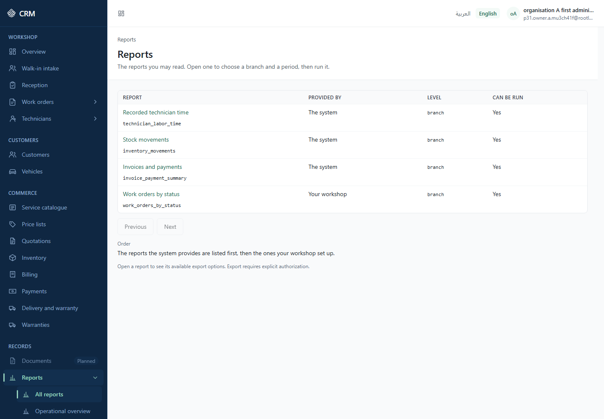
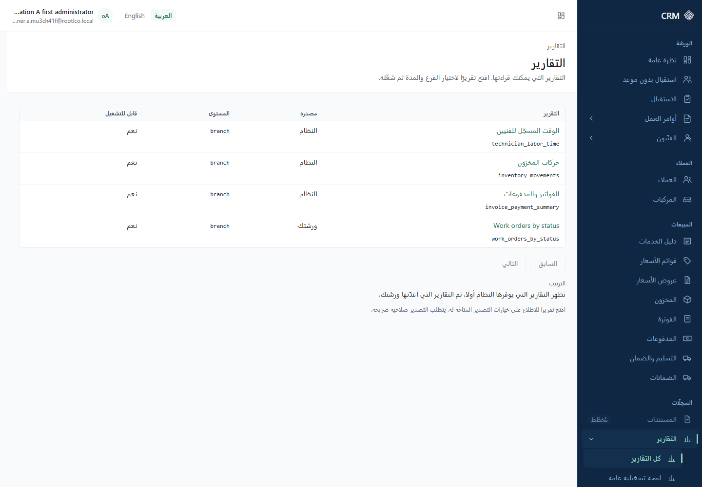
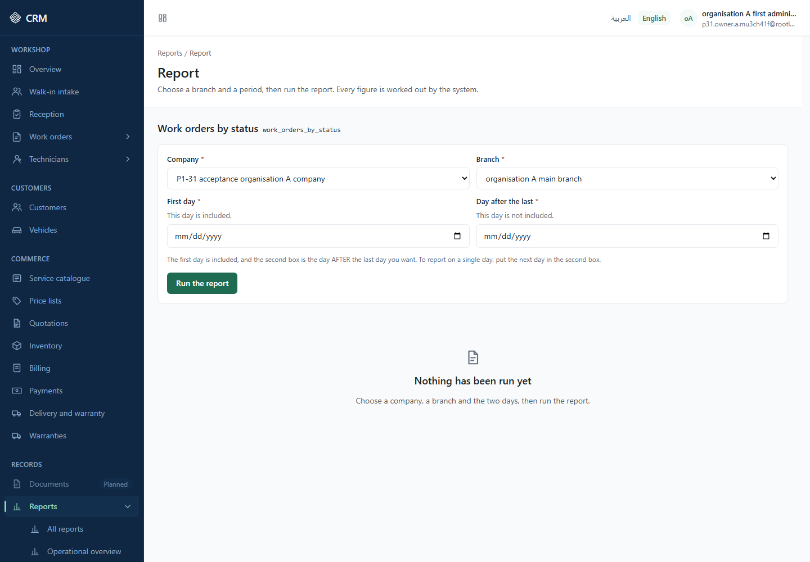
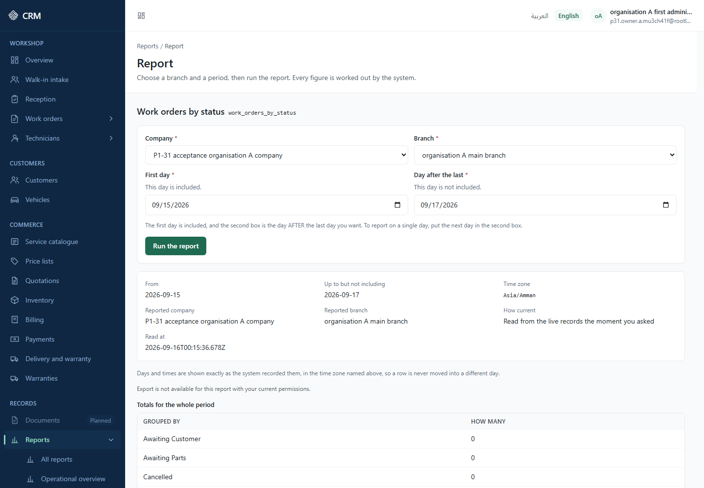
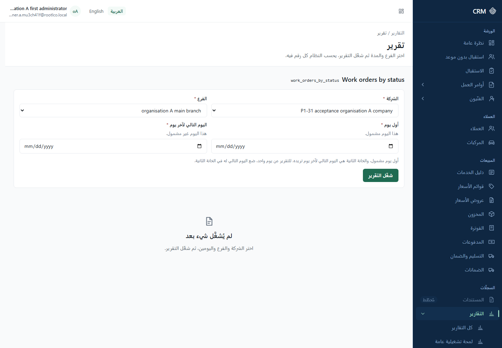
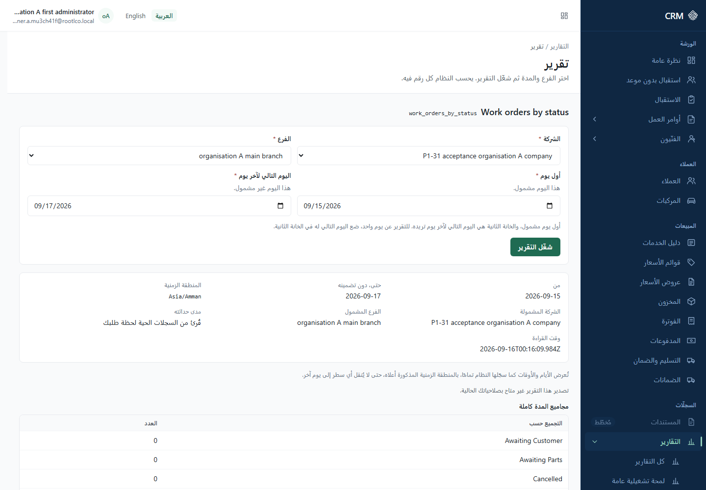
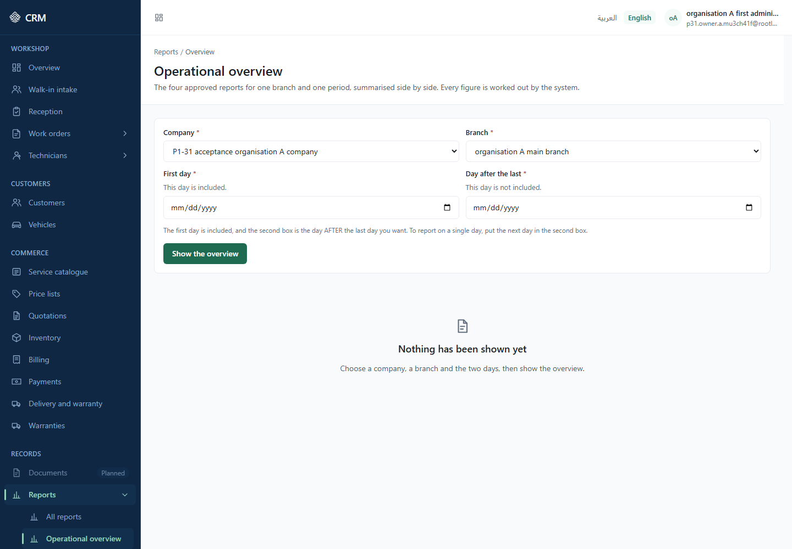
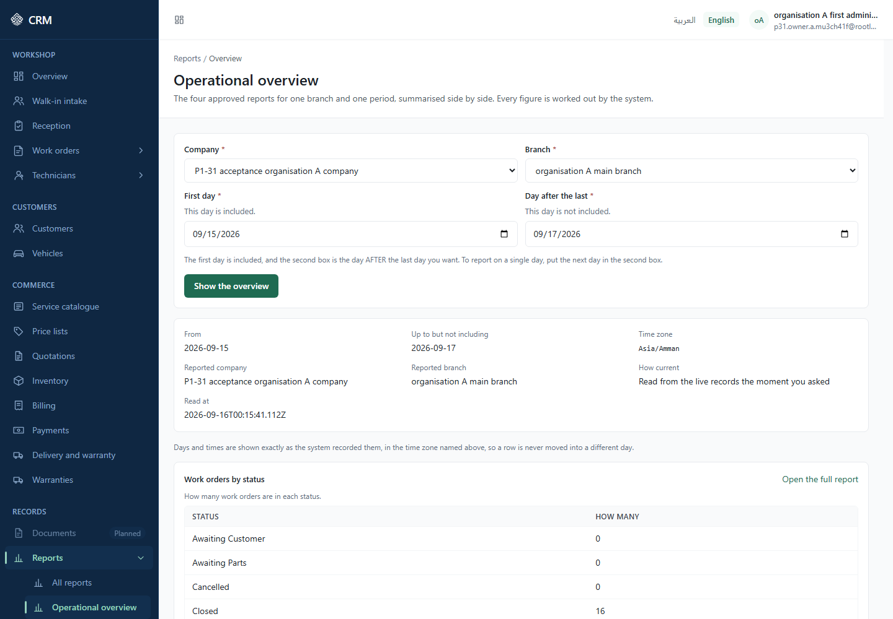
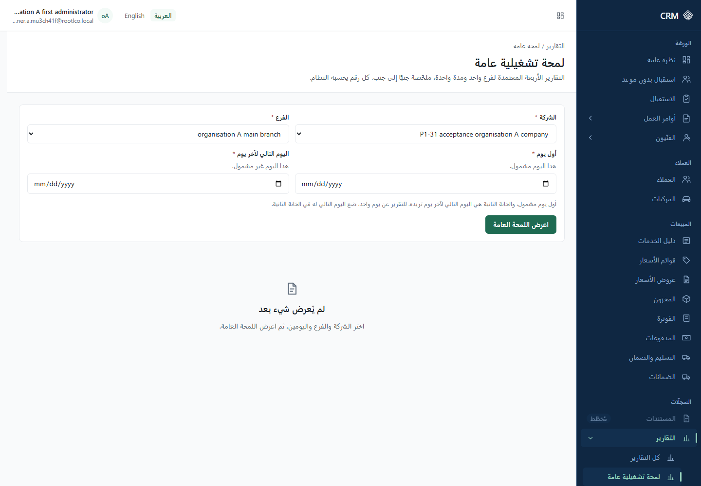
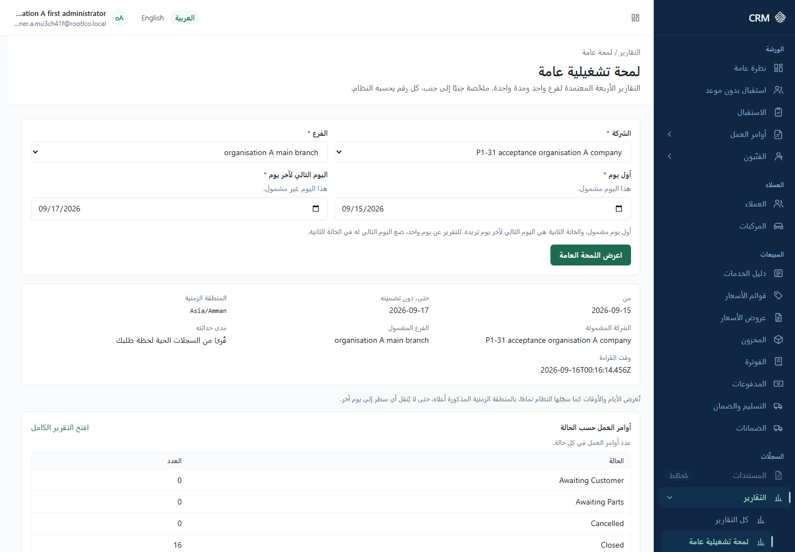

# Part 6 — Finance and reporting

## How to read this part

**REFERENCE** — this section summarises, records or points elsewhere; it makes no capability claim of its own.

Every section and sub-section carries exactly one label:

- **IMPLEMENTED (UI)** — a screen you can use now.
- **OPERATOR PROCEDURE** — it exists, but only as a command or a runbook act performed by your
  operator. There is no screen.
- **DEFERRED** — recorded backlog or a later phase.
- **NOT AVAILABLE** — not built.

Screen labels are quoted in the application's own English wording, with the message key in a hidden
comment beside the first use. Arabic labels are given where they are needed to recognise the same
screen in Arabic. All example data is fictional and marked "(example)".

Throughout this part the worked example is the company **Al-Noor Auto Services (example)** with two
branches, **Riyadh — Exit 5 (example)** and **Jeddah — Corniche (example)**.

---

## 6.1 Where finance and reporting live in the menu

**IMPLEMENTED (UI)**

In the left-hand menu <!-- nav.landmark = "Modules" --> you will find:

| Group                                              | Entry                                               | Address                        | Permission the entry is shown for |
| -------------------------------------------------- | --------------------------------------------------- | ------------------------------ | --------------------------------- |
| "Commerce" <!-- nav.group.commerce -->             | "Billing" <!-- nav.billing -->                      | `/en/invoices`                 | `sal.invoice.manage`              |
| "Commerce"                                         | "Payments" <!-- nav.payments -->                    | `/en/payments`                 | `sal.finance.view`                |
| "Commerce"                                         | "Credit notes" <!-- nav.creditNotes -->             | `/en/credit-notes`             | `sal.credit.manage`               |
| "Records" <!-- nav.group.records -->               | "Reports" <!-- nav.reports -->                      | `/en/reports`                  | `rpt.report.read`                 |
| "Records" › "Reports"                              | "All reports" <!-- nav.reportsAll -->               | `/en/reports`                  | `rpt.report.read`                 |
| "Records" › "Reports"                              | "Operational overview" <!-- nav.reportsOverview --> | `/en/reports/overview`         | `rpt.report.read`                 |
| "Administration" <!-- nav.group.administration --> | "Audit log" <!-- nav.auditLog -->                   | `/en/administration/audit-log` | `iam.audit.view`                  |

In Arabic the same entries read "الفوترة", "المدفوعات", "إشعارات الخصم", "التقارير", "كل التقارير",
"لمحة تشغيلية عامة" and "سجل التدقيق". Replace `/en/` with `/ar/` in any address.

A menu entry you do not hold the permission for is not shown at all. The interface tells you plainly
that the menu is only a convenience: "What you see here is a convenience. Every request is checked
by the service, and its decision is the one that applies." <!-- permissions.visibilityNotice -->

---

## 6.2 Invoices

### 6.2.1 What the Invoice screen is, and what it is not

**IMPLEMENTED (UI)**

The screen is titled "Invoice" <!-- invoices.page.title --> ("الفاتورة") and describes itself as
"What a work order would bill, its invoice once made, the open balance, and a printable copy." <!-- invoices.page.description -->

**There is no invoice list on this screen.** It opens on the question "Which work order?" <!-- invoices.choose.heading -->
, and it explains why: "An invoice belongs to a work order. Open one from the work-order board, or
enter its identifier here." <!-- invoices.choose.explain --> A work order named in the address is
the only way in. There is no tenant-wide register of invoices anywhere in this release.

One invoice on this screen belongs to one work order. Everything on it — the preview, the draft, the
issue, the cancellation, the balance and the printable copy — is about that one work order.

**One kind of invoice has no work order at all.** A **counter sale** is a sale of parts to somebody
who left no vehicle with you. It is an invoice like any other — it is issued, settled, printed and
credited exactly as the rest of this section describes — but it is built on the **Counter sales**
screen in inventory, because what the person doing it is selling is stock. That screen, its buyer
search, the rule that an item with no selling price refuses the whole sale, and the fact that an
issued sale cannot be undone, are **Part 5, §5.23.2**. A branch's counter sales are listed there,
newest first, which is the one branch-wide list of invoices that does exist.

### 6.2.2 Open the invoice of a work order

**IMPLEMENTED (UI)**

- **Label:** "Show the invoice" <!-- invoices.choose.submit -->
- **Who:** an account holding `sal.invoice.manage`. The tenant-administrator bundle holds it. To see
  any amount you also need `sal.finance.view`; to read the work order's own header you also need
  `wo.work_order.read`.
- **Where:** "Commerce" › "Billing", or the address `/en/invoices?workOrderId=<identifier>`.
- **Steps:**
  1. Open "Billing".
  2. **Required** — "Work-order identifier" <!-- invoices.choose.workOrderId --> : paste the
     complete identifier of the work order. If it is not complete the screen answers "Enter a
     complete identifier." <!-- invoices.common.idFormat --> You can instead use the link "Go to the
     work-order board" <!-- invoices.choose.boardLink --> and open the work order there first.
  3. Press "Show the invoice".
- **Result:** a "Work order" <!-- invoices.workOrder.heading --> panel showing "Reference" <!-- invoices.workOrder.ref -->
  , "State" <!-- invoices.workOrder.state --> and "Customer" <!-- invoices.workOrder.customer --> ,
  then either the preview "What would be billed" (no invoice yet) or the "Invoice" <!-- invoices.detail.heading -->
  itself.
- **Restrictions:** the screen is gated on `sal.invoice.manage` and the check happens before
  anything is read. Without it you see "You do not have access" <!-- state.denied.title --> and
  "Your account does not have permission for this. An administrator can grant it." <!-- state.denied.description -->
- **If it goes wrong:**
  - "Your access does not include work orders, so only the identifier is shown." <!-- invoices.workOrder.notReadable -->
    — you hold `sal.invoice.manage` but not `wo.work_order.read`. The invoice still works; only the
    header is blank.
  - "The work order could not be read, so only the identifier is shown." <!-- invoices.workOrder.refused -->
    — you do hold the code and the read was still refused or failed. A "Reference:" <!-- state.correlationId -->
    value is shown with it. Quote that reference to support.
  - "This work order was not found." <!-- invoices.invoice.missing -->
  - "The invoice of this work order is unavailable right now." <!-- invoices.invoice.unavailable -->
    — try again.
- **Screenshot:** no screenshot available at this version.

### 6.2.3 Read what would be billed, before anything is written

**IMPLEMENTED (UI)**

Until an invoice exists, the screen shows "What would be billed" <!-- invoices.preview.heading -->
with the note "Computed by the server from the accepted quotation revision. Nothing is written until
the invoice is created." <!-- invoices.preview.explain -->

The table is captioned "Lines of the accepted quotation revision" <!-- invoices.preview.caption -->
and its columns are "Line", "Description", "Type", "Quantity", "Unit price", "Discount", "Tax rate",
"Net", "Tax" and "Gross" <!-- invoices.preview.column.line … .gross --> . Beneath it are "Before
discount" <!-- invoices.preview.subtotal --> , "Discount", "Net", "Tax" and "Gross".

Two sentences on this panel matter:

- "The tax rate is the fraction captured on the quotation line, shown as recorded." <!-- invoices.preview.taxRateNote -->
  — the figure is a fraction, not a percentage, and it is not recalculated for display.
- "This work order has no accepted quotation revision, so there is nothing to bill yet." <!-- invoices.preview.noAcceptedRevision -->
  — the work order must have an **accepted** quotation revision before an invoice can exist.
  Accepting a quotation is covered in Part 4.

If you do not hold `sal.finance.view` the panel says "The preview shows amounts, which your access
does not include." <!-- invoices.preview.needsFinance --> and no figures appear.

### 6.2.4 Create the draft invoice

**IMPLEMENTED (UI)**

- **Label:** "Create invoice" <!-- invoices.create.submit --> , under the heading "Create the
  invoice" <!-- invoices.create.heading -->
- **Who:** an account holding `sal.invoice.manage` and `sal.finance.view`.
- **Where:** "Commerce" › "Billing", after opening a work order that has an accepted quotation
  revision and no invoice yet.
- **Steps:**
  1. Read the preview and satisfy yourself the lines are right.
  2. "Payer identifier" <!-- invoices.create.payer --> — **optional**. The help text reads
     "Optional." <!-- invoices.create.payerHelp --> and the panel explains the rule: "The draft is
     written from the accepted quotation revision exactly as previewed. The quotation's payer is
     used; a payer named here counts only when the quotation names none." <!-- invoices.create.explain -->
  3. Press "Create invoice".
- **Result:** "The invoice was created." <!-- invoices.create.success --> and "Invoice created:" <!-- invoices.create.recorded -->
  with the new invoice's identifier. The screen then shows the "Invoice" panel with "Number" <!-- invoices.detail.number -->
  reading "Not issued" <!-- invoices.detail.notIssued --> , "Status" <!-- invoices.detail.status -->
  reading "Draft" <!-- invoices.status.draft --> , and "Issued at" <!-- invoices.detail.issuedAt -->
  reading "Not issued yet" <!-- invoices.detail.notIssuedYet --> .
- **Restrictions:** one invoice per work order. A draft carries no number: the number is allocated
  only at issue (6.2.5).
- **If it goes wrong:**
  - "An invoice already existed for this work order; nothing further was created:" <!-- invoices.create.replayed -->
    — your request reached the service twice. Nothing was duplicated; the identifier shown is the
    existing invoice.
  - "The invoice could not be created; the work order may already have one. The screen was re-read." <!-- invoices.create.conflict -->
    — read what the screen now shows before trying again.
- **Screenshot:** no screenshot available at this version.

### 6.2.5 Issue the invoice, and where its number comes from

**IMPLEMENTED (UI)**

- **Label:** "Issue invoice" <!-- invoices.issue.action --> , under "Actions" <!-- invoices.actions.heading -->
- **Who:** an account holding `sal.invoice.manage`, `sal.finance.view` and `sal.invoice.issue`.
- **Where:** "Commerce" › "Billing", on a draft invoice.
- **Steps:**
  1. Check the "Lines" <!-- invoices.detail.lines.heading --> and the "Totals" <!-- invoices.detail.totals -->
     .
  2. Press "Issue invoice".
- **Result:** "The invoice was issued." <!-- invoices.issue.success --> and "Invoice issued with
  number" <!-- invoices.issue.recorded --> followed by the allocated number. "Status" changes to
  "Issued" <!-- invoices.status.issued --> and "Issued at" carries the moment.
- **Restrictions:** the screen states the rule itself: "Issuing allocates the number from the
  branch's sequence and fixes the invoice. It is refused if the invoice changed since it was read,
  or if the branch has no invoice numbering set up." <!-- invoices.issue.explain --> Two
  consequences you must plan for:
  - **The number comes from the branch's own sequence.** Riyadh — Exit 5 (example) and Jeddah —
    Corniche (example) number their invoices separately.
  - **If the branch has no invoice numbering set up, issuing is refused.** Setting that sequence up
    is an administration act — see 6.2.11.
  - Once issued, the invoice cannot be cancelled. See 6.2.6.
- **If it goes wrong:**
  - "The invoice changed since it was read; it has been re-read. Check it and try again." <!-- invoices.detail.conflict -->
    — somebody else changed the invoice between your reading it and your pressing the button.
    Nothing was written. Read the re-loaded screen and repeat.
  - "This invoice was already issued; nothing changed. Number" <!-- invoices.issue.replayed -->
    followed by the number — your request arrived twice. There is one invoice and one number.
- **Screenshot:** no screenshot available at this version.

### 6.2.6 Cancel a draft — only before issue

**IMPLEMENTED (UI)**

- **Label:** "Cancel this draft" <!-- invoices.cancel.open --> , opening the panel "Cancel before
  issue" <!-- invoices.cancel.heading -->
- **Who:** an account holding `sal.invoice.manage` and `sal.finance.view`.
- **Where:** "Commerce" › "Billing", on a draft invoice, under "Actions".
- **Steps:**
  1. Press "Cancel this draft".
  2. **Required** — "Reason" <!-- invoices.cancel.reason --> : write why.
  3. Press "Cancel the draft" <!-- invoices.cancel.submit --> .
- **Result:** "The draft was cancelled." <!-- invoices.cancel.success --> and "The draft was
  cancelled; the work order can be invoiced again." <!-- invoices.cancel.recorded --> The status
  becomes "Cancelled before issue" <!-- invoices.status.void_before_issue --> .
- **Restrictions:** the panel states the rule: "Only a draft can be cancelled. The work order can
  then be invoiced again." <!-- invoices.cancel.explain --> **An issued invoice cannot be cancelled
  or reversed from any screen in this release; money is given back on it with a credit note.** See
  6.2.10.
- **If it goes wrong:**
  - "Shorten the reason." <!-- invoices.cancel.reasonTooLong -->
  - "This draft was already cancelled; nothing changed." <!-- invoices.cancel.replayed -->
  - "The invoice changed since it was read; it has been re-read. Check it and try again."
- **Screenshot:** no screenshot available at this version.

### 6.2.7 The open balance

**IMPLEMENTED (UI)**

The panel is headed "Open balance" <!-- invoices.outstanding.heading --> and shows "Amount open" <!-- invoices.outstanding.amount -->
and "Settlement" <!-- invoices.outstanding.settlement --> , which reads either "Settled" <!-- invoices.outstanding.settled -->
or "Open" <!-- invoices.outstanding.open --> .

Its own note explains where the figure comes from: "Computed by the server on every read from the
issued amount, the receipts allocated to it and the approved credits." <!-- invoices.outstanding.note -->
Nothing is worked out in your browser.

Before issue the panel reads "Not issued yet, so nothing is owed." <!-- invoices.outstanding.notIssued -->

Without `sal.finance.view` it reads "The open balance is an amount, which your access does not
include." <!-- invoices.outstanding.needsFinance --> ; a refusal reads "The open balance could not
be read; it needs finance view of this invoice." <!-- invoices.outstanding.refused -->

A cashier who holds `sal.finance.view` but not `sal.invoice.manage` cannot open this screen at all.
For that shape the open balance is reached from the Payments screen instead, after applying a
receipt (6.3.5).

### 6.2.8 Print a copy of the invoice

**IMPLEMENTED (UI)**

- **Label:** "Show printable copy" <!-- invoices.print.open --> under "Printable copy" <!-- invoices.print.heading -->
- **Who:** anyone who can open the invoice. Amounts appear only for an account holding
  `sal.finance.view`.
- **Where:** "Commerce" › "Billing", on the invoice.
- **Steps:**
  1. Press "Show printable copy".
  2. Check the document. It shows "Number", "Status", "Issued" <!-- invoices.print.issuedAt --> ,
     "Work order" <!-- invoices.print.workOrder --> and "Payer identifier", then the table captioned
     "Invoice lines" <!-- invoices.print.linesCaption --> with columns "Line", "Description",
     "Type", "Quantity", "Unit price", "Net", "Tax" and "Gross".
  3. Press "Print" <!-- invoices.print.print --> to open your browser's own print dialog.
  4. Press "Hide printable copy" <!-- invoices.print.close --> when you are done.
- **Result:** the browser's print preview. **This is always the browser's own print. No PDF is
  generated and there is no server-side document route** — the copy is composed in the browser from
  what was read.
- **Restrictions:** the descriptions on the copy do not come from the invoice. The document says so:
  "Line descriptions are taken from the accepted quotation revision this invoice was made from." <!-- invoices.print.descriptionsFromQuotation -->
  On the invoice panel itself the same fact reads "Invoice lines carry no description; the
  descriptions of the accepted quotation appear on the printable copy when it still matches." <!-- invoices.detail.noDescriptionNote -->
- **If it goes wrong:** the copy names the reason rather than printing a blank column.
  - "Line descriptions are not available: the invoice carries none, and the quotation it was made
    from could not be matched." <!-- invoices.print.descriptionsUnavailable -->
  - "Line descriptions are not available: the accepted quotation could not be read for this copy." <!-- invoices.print.previewRefused -->
  - "Line descriptions are not available: the accepted quotation shows amounts, which the person who
    printed this copy may not see." <!-- invoices.print.descriptionsNeedFinance -->
  - "Amounts are not available to the person who printed this copy." <!-- invoices.print.amountsUnavailable -->
- **Screenshot:** no screenshot available at this version.

### 6.2.9 When amounts are hidden from you

**IMPLEMENTED (UI)**

`sal.finance.view` is a separate permission from `sal.invoice.manage`. Without it the invoice is
still readable but every money figure is withheld, and the screen says which is which: "Amounts are
not available to you; the invoice exists with its status and dates." <!-- invoices.detail.totalsUnavailable -->
A single suppressed value reads "Not available" <!-- invoices.money.unavailable --> .

This is a deliberate separation, not a fault. Ask an administrator to grant `sal.finance.view` if
your work requires the figures.

### 6.2.10 Credit notes, reversals and cancelling after issue

**Credit notes — IMPLEMENTED (UI). Reversals and cancelling after issue — NOT AVAILABLE.**

**A credit note can be raised in three ways:**

- on the **Credit notes** screen, against an invoice found there by its number or its customer
  (§6.2a);
- on an issued invoice's own screen, while money is still open on it — the **Raise a credit
  note** <!-- creditNotes.request.heading --> panel sits below the invoice's actions (§6.2a);
- by taking back a part that was sold over the counter. When a customer return is recorded against
  a counter-sale line, the application raises a credit note for it, and the screen states what that
  does and does not mean: "A part sold over the counter raises a credit note when it comes back. The
  note waits for a second person to approve it, and nobody has been refunded until then."
  <!-- inventory.returns.creditExplain --> The return itself is Part 5, §5.23.3.

Whichever way it is raised, the note is born waiting for approval and credits nothing. **Approving
it is a second person's act, on the Credit notes screen** (§6.2a): the person who raised a note can
never approve it.

**What is still NOT AVAILABLE:**

- **There is no rejection.** A credit note nobody approves stays **Waiting for a second person**
  and credits nothing; no screen refuses one, and the application publishes no operation that would.
- **There is no payment-reversal screen.** A receipt can appear as "Reversed" <!-- payments.status.reversed -->
  , and no screen reverses one.
- An **issued** invoice still cannot be cancelled from any screen. Only a draft can be cancelled
  (6.2.6). After issue, the way to give money back on an invoice is a credit note.

The status "Credited" <!-- invoices.status.credited --> can appear on an invoice, and the "Invoices
and payments" report has a "Credit notes" <!-- reports.field.creditNotes --> column.

There is no ledger, no chart of accounts and no accounting module of any kind. Nothing beyond
invoices, credit notes, receipts and allocations exists.

## 6.2a The Credit notes screen — IMPLEMENTED (UI)

**Label** — **Credit notes** <!-- creditNotes.page.title --> (navigation: **Credit
notes** <!-- nav.creditNotes --> ), described as "What has been credited back to a customer, and
what is still waiting for a second person to approve it." <!-- creditNotes.page.description -->

**Who** — `sal.credit.manage` **and** `sal.finance.view`, together, for everything on the screen:
the list, one note, raising a note and approving one. None of them answers without both. Finding an
invoice on this screen also needs `sal.invoice.manage`, because the invoice search is the invoices
list; without it the invoice box says so and the note can still be raised from the invoice's own
screen by somebody who can open it.

**Where** — its own navigation entry, at `/{language}/credit-notes`, and from **Open the credit
note** <!-- inventory.returns.openCredit --> on a customer return that raised one (Part 5, §5.23.3).
Raising is also offered on an issued invoice's own screen (6.2.7, below the open balance), to somebody holding
both permissions, while money is still open on it.

**Who holds it, and who approves.** By Owner decision, `sal.credit.manage` is in the set of
permissions a new organisation's first administrator is given, beside `sal.finance.view`, which was
already there. So in a freshly provisioned organisation:

- the first administrator sees the **Credit notes** entry and the list opens;
- the first administrator may **raise** a credit note against an issued invoice in a branch it is
  allowed to work in;
- the first administrator **cannot approve a note it raised itself**. Somebody else must: the
  administrator can **give both permissions to somebody else** — for example a finance approver
  role, granted only for one branch — because an administrator may hand on a permission it holds
  itself. Nobody else gains them automatically: a cashier or any other role holds them only if an
  administrator maps them onto that role. A cashier who can see amounts but does not hold
  `sal.credit.manage` is not offered **Raise a credit note** on an invoice.

**The controls that still apply.** Holding the permission does not remove any of them:

- **Branch.** Every credit-note action is limited to the branches the person's grant covers. A
  person granted one branch cannot see, raise or approve credit notes in another, and nobody can
  reach another organisation's invoices at all.
- **Second person.** A credit note is raised as **Waiting for a second person** and credits nothing.
  The person who raised it can never approve it; a different person who also holds both permissions
  must. Only then does the amount the customer owes go down.
- **The open amount.** A note cannot credit more than is still open on its invoice. That is checked
  when it is raised and again when it is approved.
- **Audit.** Raising a credit note and approving one are each recorded in the organisation's audit
  log.

**An organisation created before this change** keeps the set it was given until the platform
operator runs the administrator backfill for it. That run adds the permission only to an
administrator role that is still the standard one; a role the organisation has changed for itself is
left exactly as it is and named in the run's report, so that organisation decides for itself.
Until then, in such an organisation the entry is hidden, the address answers **"Credit notes — You
do not have access. Your account does not have permission for this. An administrator can grant
it."**, and a counter-sale return moves the stock but not the money.

**What the screen does, for somebody who does hold both permissions**

**Seeing what is waiting**

1. The screen works in the branch chosen in the header — "The branch whose credit notes are
   shown" <!-- creditNotes.targetLabel --> , because "A credit note belongs to the branch that raised
   it. The notes shown are those of the branch you are working in." <!-- creditNotes.targetExplain -->
2. Read **Credit notes at this branch** <!-- creditNotes.list.heading --> . It opens on the notes
   **Waiting for a second person** <!-- creditNotes.state.pending --> ; **Show**
   <!-- creditNotes.list.status --> changes it to **Approved**, **Refused** or **All credit notes**
   <!-- creditNotes.state.approved / .rejected / creditNotes.list.all --> . The columns are **Why it
   was raised**, **Amount**, **Approval** and **Action** <!-- creditNotes.column.* --> ; an unsettled
   note shows **Nothing credited yet** <!-- creditNotes.notIssued --> under its reason. A note you
   raised yourself is marked **Raised by you** <!-- creditNotes.byYou --> and, while it waits,
   **Waiting for another approver** <!-- creditNotes.ownRequest --> .
3. Choose **Open** <!-- creditNotes.open --> on a row for **The credit note**
   <!-- creditNotes.detail.heading --> , which shows **Amount**, **Approval**, **Approved on** (or
   **Not approved yet** <!-- creditNotes.detail.notApproved --> ) and **Why it was raised**
   <!-- creditNotes.detail.* --> . **Close** <!-- creditNotes.detail.close --> returns to the list.

**Raising a credit note**

1. Under **Raise a credit note** <!-- creditNotes.request.heading --> , find the invoice in **Invoice
   to credit** <!-- creditNotes.request.invoice --> by its number or its customer, and choose it.
   "Only invoices that have been issued and still have money open can be credited."
   <!-- creditNotes.request.invoiceHelp --> What is **Still open on this invoice**
   <!-- creditNotes.request.open --> is shown beside the amount. On an invoice's own screen the
   invoice is already chosen and this step is skipped.
2. Enter **Amount to credit** <!-- creditNotes.request.amount --> — in the invoice's currency, more
   than zero, with at most four digits after the point — and **Why it is being credited**
   <!-- creditNotes.request.reason --> .
3. Press **Raise the credit note** <!-- creditNotes.request.submit --> . The screen says "The credit
   note was raised. It is waiting for a second person to approve it, and nothing is credited until
   then." <!-- creditNotes.request.recorded --> and opens the new note, marked as waiting for
   another approver.

A field that is missing or wrong is marked, the cursor moves to the first one, what you typed is
kept, and the complaint goes as soon as you correct it. Changing branch in the header with a
half-written credit asks first.

**Approving a credit note** — by somebody other than the person who raised it

1. Open the note from the list (step 3 above).
2. Check the amount and the reason, and press **Approve this credit note**
   <!-- creditNotes.approve.action --> . "Approving credits this amount against its invoice, so what
   the customer owes goes down by it." <!-- creditNotes.approve.explain -->
3. The screen says "The credit note was approved. What the customer owes on the invoice has gone
   down by its amount." <!-- creditNotes.approve.done --> , the note reads **Approved**, and the list
   is read again.

On a note you raised yourself there is no approve button; the note says "You raised this credit
note, so it is waiting for another approver: a different person who can manage credit notes must
approve it." <!-- creditNotes.detail.ownRequest -->

**What the screen explains about itself.** "A credit note is raised when something already billed is
given back or corrected. A second person approves it, and nothing is credited until they
do." <!-- creditNotes.explain --> — and, on every note, "Approving is a second person's step:
whoever raised a credit note cannot approve it." <!-- creditNotes.detail.approvalNote -->

**Restrictions**

- **No rejection.** A note that should not be approved is simply left waiting; it credits nothing.
- One branch at a time. There is no view across a company.
- Only the most recent are listed: **"Only the most recent are shown."** <!-- creditNotes.list.truncated -->
- Where none exists: **"Nothing has been credited at this branch."** <!-- creditNotes.list.none -->

**If it goes wrong**

| Message                                                                                                                                                                    | What it means                                                                                                            |
| -------------------------------------------------------------------------------------------------------------------------------------------------------------------------- | ------------------------------------------------------------------------------------------------------------------------ |
| **"You do not have permission to see the credit notes of this branch. That also needs permission to see amounts."** <!-- creditNotes.list.refused -->                      | One or both permissions are missing.                                                                                     |
| **"The credit notes could not be read just now. Try again."** <!-- creditNotes.list.unavailable -->                                                                        | The service did not answer.                                                                                              |
| **"That credit note was not found."** <!-- creditNotes.detail.missing -->                                                                                                  | The note is not at this branch, or is gone.                                                                              |
| **"The invoice cannot be credited by this amount. …"** <!-- creditNotes.request.overOpen -->                                                                               | The amount is more than is still open on the invoice, or the invoice is no longer open for credit. Enter less.           |
| **"You raised this credit note, so you cannot approve it. Another person who can manage credit notes must approve it."** <!-- form.violation.credit_note_self_approval --> | The person who raised the note tried to approve it (for example from another window). Ask a second person.               |
| **"This credit note could not be approved as it stands. …"** <!-- creditNotes.approve.conflict -->                                                                         | It was decided meanwhile, or its invoice no longer has that much open. The note has been read again; check what it says. |

**Screenshot** — no screenshot available at this version.

### 6.2.11 Setting up invoice numbering for a branch

**IMPLEMENTED (UI)**, with an important limitation

Invoice numbering is configured at "Administration" › "Settings" <!-- nav.settings --> › "Numbering
rules" <!-- nav.numberingRules --> , which needs `org.settings.manage`. The fields are "Prefix",
"Suffix", "Minimum digits", "Start at" and "Reset" (with the choices "Never", "Every month", "Every
year").

Two sentences on that screen are binding for finance work:

- "Numbers are always allocated by the service. Nothing on this screen produces one."
- "The service publishes no preview operation, so no example number is shown here."

**The screen writes organization settings, because no dedicated numbering operation exists.** It is
one of four administration areas in that position (the others are Taxes, Currencies and System
settings). **The tenant-administrator bundle does not hold `org.settings.manage`**, so a freshly
provisioned administrator will not see this menu entry at all and must be granted the code first.
Part 3 covers granting.

If issuing an invoice is refused because the branch has no numbering set up, this is where it is
fixed — or, where the screen is not reachable, by your operator.

### 6.2.12 Currencies and exchange rates

**IMPLEMENTED (UI)** for the list of currencies · **NOT AVAILABLE** for any rate

"Administration" › "Settings" › "Currencies" <!-- nav.currencies --> holds "Enabled currencies" with
a "Currency code" field ("Three-letter ISO codes, in capitals. No base currency is chosen for you.")
and the buttons "Add currency" and "Remove".

The screen carries this standing notice: **"No exchange rate is held or calculated here."** Nothing
in this release converts one currency into another. Reports keep currencies apart and never add
across them.

Like Numbering rules, this screen writes organization settings and needs `org.settings.manage`,
which the tenant-administrator bundle does not hold.

---

## 6.3 Payments, receipts and allocations

### 6.3.1 What the Payments screen is

**IMPLEMENTED (UI)**

The screen is titled "Payments and receipts" <!-- payments.page.title --> ("المدفوعات والإيصالات")
and describes itself as "Money received in one branch, and what it has been applied to." <!-- payments.page.description -->

Recording money and applying it to an invoice are **two separate steps**. The screen says so: "This
records money taken in. It applies to nothing until you allocate it." <!-- payments.record.explain -->

The page is gated on `sal.finance.view` — the code a cashier holds — and the check happens before
anything is read.

**This screen is single-branch.** You must name a branch before you see anything.

### 6.3.2 Choose the branch

**IMPLEMENTED (UI)**

- **Label:** "Show this branch" <!-- payments.target.choose --> under the heading "Branch" <!-- payments.target.heading -->
- **Who:** an account holding `sal.finance.view`. To be offered a list of branches rather than
  typing identifiers you also need `org.branch.read`.
- **Where:** "Commerce" › "Payments".
- **Steps:**
  1. **Required** — "Branch" <!-- payments.common.branchField --> : choose from the list, which
     opens on "Choose a branch" <!-- payments.common.branchPlaceholder --> . Choosing a branch sets
     its company for you.
  2. Press "Show this branch".
- **Result:** the branch's receipts appear under "Receipts of this branch" <!-- payments.list.heading -->
  . Use "Change branch" <!-- payments.target.change --> to move to another one.
- **Restrictions:** the screen states the rule: "Receipts belong to one branch. Name the branch to
  see its receipts; the server checks the choice on every read." <!-- payments.target.explain -->
  There is no tenant-wide or all-branch view of receipts.
- **If it goes wrong:** "The branch list could not be read, so the identifiers are typed instead." <!-- payments.common.branchesRefused -->
  Two fields then appear — "Company identifier" <!-- payments.common.companyIdField --> and "Branch
  identifier" <!-- payments.common.branchIdField --> — with the help "Paste the identifier you were
  given." <!-- payments.common.identifierHelp --> An incomplete value answers "Enter the identifier
  exactly as it was given." <!-- payments.common.idFormat -->
- **Screenshot:** no screenshot available at this version.

### 6.3.3 Record a payment

**IMPLEMENTED (UI)**

- **Label:** "Record the payment" <!-- payments.record.submit --> under the heading "Record a
  payment" <!-- payments.record.heading -->
- **Who:** an account holding `sal.finance.view` and `sal.payment.record`.
- **Where:** "Commerce" › "Payments", after choosing a branch.
- **Steps:**
  1. **Required** — "Method" <!-- payments.record.method --> : choose one of the organisation's own
     payment methods. See the restriction below.
  2. **Required** — "Payer identifier" <!-- payments.record.payer --> . Help text: "The business
     partner paying. No receipt read publishes a name, so this is an identifier." <!-- payments.record.payerHelp -->
  3. **Required** — "Currency" <!-- payments.record.currency --> . "Three letters, such as USD." <!-- payments.common.currencyFormat -->
  4. **Required** — "Amount received" <!-- payments.record.amount --> . Help text: "As received.
     Applying it to an invoice is a separate step." <!-- payments.record.amountHelp --> The rule is
     "A positive amount with at most four decimal places." <!-- payments.common.amountFormat -->
  5. Press "Record the payment".
- **Result:** "The payment was recorded." <!-- payments.record.success --> and "Payment recorded.
  Receipt" <!-- payments.record.recorded --> followed by the receipt reference. The receipt appears
  at the top of "Receipts of this branch", whose caption is "Receipts, newest received first" <!-- payments.list.caption -->
  . Its state is "Recorded" <!-- payments.status.recorded --> and its "Not yet applied" <!-- payments.list.unapplied -->
  figure equals the whole amount.
- **Restrictions:**
  - Without `sal.payment.record` the panel reads "Recording a payment needs the recording
    permission, which this account does not hold." <!-- payments.record.needsCode -->
  - **Your organisation must have its own payment method before anything can be recorded.** If it
    has none, the screen says: "This organisation has no payment method of its own yet. The three
    standard methods belong to the platform and no receipt can cite one, so recording is not
    possible until an operator adds a method for this organisation." <!-- payments.methods.noneRecordable -->
    See 6.3.8.
  - Recording does not settle anything. The receipt applies to no invoice until you allocate it.
- **If it goes wrong:**
  - "That payment had already been recorded; this is the same receipt, not a second one. Receipt" <!-- payments.record.replayed -->
    — your request arrived twice. One receipt exists.
  - "The payment methods could not be read, so no payment can be composed here." <!-- payments.methods.refused -->
  - "Enter an amount." <!-- money.error.empty --> , "At most four decimal places." <!-- money.error.tooManyDecimals -->
    , "Enter a decimal amount, for example 1250.00." <!-- money.error.notDecimal -->
- **Screenshot:** no screenshot available at this version.

### 6.3.4 Find a receipt

**IMPLEMENTED (UI)**

The list "Receipts of this branch" has the columns "Receipt" <!-- payments.list.reference --> ,
"Received" <!-- payments.list.receivedAt --> , "Payer" <!-- payments.list.payer --> , "Method" <!-- payments.list.method -->
, "Received" <!-- payments.list.money --> , "Not yet applied" and "State" <!-- payments.list.status -->
. A state is one of "Recorded", "Partly applied" <!-- payments.status.partially_allocated --> ,
"Fully applied" <!-- payments.status.allocated --> or "Reversed".

Filters, under "Filter the receipts" <!-- payments.list.filtersLabel --> : "Payer identifier" <!-- payments.list.payerFilter -->
, "State" <!-- payments.list.statusFilter --> (default "Any state" <!-- payments.list.anyStatus -->
) and "Invoice identifier" <!-- payments.list.invoiceFilter --> , which "Shows only receipts already
applied to that invoice." <!-- payments.list.invoiceFilterHelp --> Press "Apply filters" <!-- payments.list.apply -->
.

**There is no date filter, and that is deliberate:** "The receipt list takes no date range: it is
ordered by when the money was received, newest first." <!-- payments.list.noDateFilter -->

When nothing matches: "No receipt in this branch matches." <!-- payments.list.empty -->

Opening a row shows "Receipt" <!-- payments.receipt.heading --> with its "State", "Received",
"Payer", "Method", "Received" and "Not yet applied". The panel states its own honesty limit: **"The
receipt reads carry identifiers only: no payer name, and no record of who took the payment."** <!-- payments.receipt.noNames -->

Failures on the detail: "That receipt was not found in this scope." <!-- payments.receipt.notFound -->
; "This account may not read that receipt." <!-- payments.receipt.denied --> ; "The receipt could
not be read." <!-- payments.receipt.unavailable -->

You can also arrive straight on one receipt by address, `/en/payments?paymentId=<identifier>`, or
filtered to one invoice, `/en/payments?invoiceId=<identifier>`.

### 6.3.5 Apply a receipt to an invoice

**IMPLEMENTED (UI)**

- **Label:** "Apply" <!-- payments.allocate.submit --> under the heading "Apply to an invoice" <!-- payments.allocate.heading -->
- **Who:** an account holding `sal.finance.view` and `sal.payment.allocate`.
- **Where:** "Commerce" › "Payments", with a branch chosen and a receipt open.
- **Steps:**
  1. **Required** — "Invoice identifier" <!-- payments.allocate.invoice --> . Help text: "The
     invoice must be issued and in the same branch and currency as this receipt." <!-- payments.allocate.invoiceHelp -->
  2. **Required** — "Amount to apply" <!-- payments.allocate.amount --> . Help text: "At most what
     is left on this receipt, and at most what is still open on the invoice." <!-- payments.allocate.amountHelp -->
  3. Press "Apply".
- **Result:** "The receipt was applied." <!-- payments.allocate.success --> , an entry under
  "Applied to" <!-- payments.allocations.heading --> reading "Applied to invoice" <!-- payments.allocate.applied -->
  , and the invoice's remaining balance shown as "Still open on that invoice:" <!-- payments.allocate.invoiceOpen -->
  . The receipt's state moves to "Partly applied" or "Fully applied".
- **Restrictions — read this before pressing Apply:**
  - **An allocation cannot be undone.** The panel says so: "An entry cannot be undone: there is no
    route that reverses one. Check the invoice and the amount before applying." <!-- payments.allocate.explain -->
    Allocations are append-only.
  - The invoice must be **issued**, and in the **same branch and the same currency** as the receipt.
  - Without `sal.payment.allocate`: "Applying a receipt needs the allocation permission, which this
    account does not hold." <!-- payments.allocate.needsCode -->
- **If it goes wrong:**
  - "Nothing is left on this receipt to apply." <!-- payments.allocate.nothingLeft -->
  - "This receipt was reversed. Nothing can be applied to it, and the amount shown as not applied is
    a consequence of the reversal." <!-- payments.allocate.reversed -->
  - "The invoice was applied to, but its remaining balance could not be read." <!-- payments.allocate.invoiceOpenUnavailable -->
    — the allocation succeeded; only the balance read failed. Re-open the receipt.
  - "Choose one." <!-- payments.common.required -->
- **Screenshot:** no screenshot available at this version.

Where a receipt has not been applied yet: "This receipt has not been applied to anything yet." <!-- payments.allocations.none -->
Where it has very many entries: "This receipt has more entries than the read publishes; the hundred
shown are the oldest." <!-- payments.allocations.truncated -->

### 6.3.6 Print a receipt

**IMPLEMENTED (UI)**

- **Label:** "Show the printable receipt" <!-- payments.print.open --> under "Printable receipt" <!-- payments.print.heading -->
- **Who:** anyone who can open the receipt.
- **Where:** "Commerce" › "Payments", on an open receipt.
- **Steps:** press "Show the printable receipt", check it, print with your browser, then press "Hide
  the printable receipt" <!-- payments.print.close --> .
- **Result:** a copy headed "Receipt" <!-- payments.print.title --> with "Receipt", "State",
  "Received", "Payer", "Method", "Received" and "Not yet applied", then the table captioned "What
  this receipt has been applied to" <!-- payments.print.allocationsCaption --> with the columns
  "Invoice" <!-- payments.print.column.invoice --> , "Applied" <!-- payments.print.column.applied -->
  and "When" <!-- payments.print.column.when --> .
- **Restrictions — say these to a customer before you hand the copy over:**
  - "There is no document route: this copy is composed from the receipt as it was read." <!-- payments.print.explain -->
  - **"Invoices and the payer are named by identifier: the receipt reads publish no name or invoice
    number, and no record of who took the payment."** <!-- payments.print.identifiersOnly --> The
    printed copy carries no customer name, no invoice number and no cashier name.
- **If it goes wrong:** "More entries exist than this copy shows." <!-- payments.print.truncated -->
  — the copy is not the whole allocation history. Read the receipt on screen for the rest. Where
  nothing has been applied: "This receipt has not been applied to anything." <!-- payments.print.noAllocations -->
- **Screenshot:** no screenshot available at this version.

### 6.3.7 Refunds and reversals

**NOT AVAILABLE**

There is no screen that reverses a receipt or undoes an allocation. `sal.reversal.approve` exists in
the permission catalogue and no page calls it; the code is not in the tenant-administrator bundle. A
receipt can be _shown_ as "Reversed", and nothing in this release puts it into that state from a
screen.

### 6.3.8 Adding a payment method for your organisation

**OPERATOR PROCEDURE**

There is no screen for creating a payment method. Until your operator adds at least one method for
your organisation, the Record a payment panel refuses: "This organisation has no payment method of
its own yet. The three standard methods belong to the platform and no receipt can cite one, so
recording is not possible until an operator adds a method for this organisation."

The three method names you will see once methods exist are "Cash" <!-- payments.kind.cash --> ,
"Card terminal" <!-- payments.kind.card_terminal --> and "Bank transfer" <!-- payments.kind.bank_transfer -->
. If a method is later withdrawn, receipts that cite it show "Method withdrawn" <!-- payments.list.methodGone -->
.

---

## 6.4 Dashboards and the overview

### 6.4.1 The Overview landing page

**IMPLEMENTED (UI)**

The first page after signing in is "Overview" <!-- nav.overview --> ("نظرة عامة") at `/en/`. It
needs no permission. It is a plain orientation page, not a dashboard: it carries no figure, no chart
and no total.

Its text tells you what is ready: "Customers and vehicles are ready to use. The rest of the workshop
— reception, work orders, parts, invoicing and delivery — is still being built, and each part
appears in the menu as it is finished." <!-- overview.description -->

It also carries the standing notice about the appearance of the product, under the heading "The name
and logo are temporary" <!-- overview.brandTitle --> : "The product name, logo and colours you see
are temporary. Changing them later is a settings change and will not affect any of your customer or
vehicle records." <!-- overview.brandBody --> The product name shown in the interface is a
placeholder, and the banner "Provisional appearance — final brand pending" <!-- app.provisionalBrand -->
appears with it.

### 6.4.2 An analytics dashboard

**NOT AVAILABLE**

There is no analytics dashboard, no key-figure tiles, no charts and no trends anywhere in this
release. The only two "overview" surfaces are the landing page above and the "Operational overview"
report described in 6.5.7.

---

## 6.5 Reports

### 6.5.1 The report catalogue

**IMPLEMENTED (UI)**

- **Screen:** "Reports" <!-- reports.catalogue.title --> ("التقارير") at `/en/reports`.
- **Purpose, in its own words:** "The reports you may read. Open one to choose a branch and a
  period, then run it." <!-- reports.catalogue.description -->
- **Permission:** `rpt.report.read` gates the page, checked before any read.

The list is headed "Available reports" <!-- reports.catalogue.resultsHeading --> with the caption
"Reports you may read" <!-- reports.catalogue.caption --> and these columns:

| Column                                                  | What it holds                                                                                                         |
| ------------------------------------------------------- | --------------------------------------------------------------------------------------------------------------------- |
| "Report" <!-- reports.catalogue.column.report -->       | the report's name                                                                                                     |
| "Provided by" <!-- reports.catalogue.column.origin -->  | "The system" <!-- reports.catalogue.origin.platform --> or "Your workshop" <!-- reports.catalogue.origin.workshop --> |
| "Level" <!-- reports.catalogue.column.scope -->         | the level the report is defined at, shown as the system's own machine word                                            |
| "Can be run" <!-- reports.catalogue.column.runnable --> | "Yes" <!-- reports.catalogue.runnable.yes --> or "No" <!-- reports.catalogue.runnable.no -->                          |

Ordering is explained on the page: "The reports the system provides are listed first, then the ones
your workshop set up." <!-- reports.catalogue.orderingNote --> , under the label "Order" <!-- reports.catalogue.orderingLabel -->
.

Two notices you will always see here:

- **"Open a report to see its available export options. Export requires explicit authorization."** <!-- reports.catalogue.noDownload -->
  There is no export button on the catalogue.
- "There is nothing further on this page." <!-- reports.catalogue.noFurther --> when the list ends.

If nothing is listed: "No reports are available to you" <!-- reports.catalogue.noneTitle --> with
"Nothing has been set up for your workshop yet, and your access may not include everything that has.
Ask an administrator." <!-- reports.catalogue.noneBody -->

**Screenshot:** `images/report-catalogue-en.png` (English) and `images/report-catalogue-ar.png`
(Arabic, "التقارير").

### 6.5.2 The four published reports

**IMPLEMENTED (UI)**

Four report domains are approved and delivered in this release, and no others:

| Report name                                                                                       | Code used in the address  |
| ------------------------------------------------------------------------------------------------- | ------------------------- |
| "Work orders by status" <!-- reports.work_orders_by_status.title --> ("أوامر العمل حسب الحالة")   | `work_orders_by_status`   |
| "Recorded technician time" <!-- reports.technician_labor_time.title --> ("الوقت المسجّل للفنيين") | `technician_labor_time`   |
| "Stock movements" <!-- reports.inventory_movements.title --> ("حركات المخزون")                    | `inventory_movements`     |
| "Invoices and payments" <!-- reports.invoice_payment_summary.title --> ("الفواتير والمدفوعات")    | `invoice_payment_summary` |

A report you can see in the catalogue still has to be **configured and published** for your
organisation before it can be run. A report that has not been is shown with "Can be run" = "No", and
opening it gives "This report cannot be run yet" <!-- reports.run.notRunnableTitle --> with "You can
read what it is meant to show, but the system has nothing behind it to run. Nothing is missing from
your access." <!-- reports.run.notRunnableBody -->

Publishing a report configuration has no screen — see 6.5.9.

### 6.5.3 Run a report

**IMPLEMENTED (UI)**

- **Label:** "Run the report" <!-- reports.run.show -->
- **Who:** an account holding `rpt.report.read` **and** the read permissions of the data behind the
  report, in the branch you select. Those extra codes are decided per report and are checked by the
  service, not by the screen.
- **Where:** "Records" › "Reports" › "All reports", then open a report. The address is
  `/en/reports/<report code>`. The page heading is "Report" <!-- reports.run.title --> ("تقرير").
- **Steps** — the form is labelled "Choose what to report on" <!-- reports.run.formLabel --> :
  1. **Required** — "Company" <!-- reports.run.company --> . Example: Al-Noor Auto Services
     (example).
  2. **Required** — "Branch" <!-- reports.run.branch --> . Example: Riyadh — Exit 5 (example).
  3. **Required** — "First day" <!-- reports.run.from --> . Hint: "This day is included." <!-- reports.run.fromHint -->
  4. **Required** — "Day after the last" <!-- reports.run.to --> . Hint: "This day is not included." <!-- reports.run.toHint -->
  5. Press "Run the report".
- **Result:** the context banner, then "Totals for the whole period" <!-- reports.groups.heading -->
  , then "Report rows" <!-- reports.run.rowsCaption --> . See 6.5.4.
- **Restrictions:**
  - **The period rule is stated on the form and you must follow it:** "The first day is included,
    and the second box is the day AFTER the last day you want. To report on a single day, put the
    next day in the second box." <!-- reports.run.periodRule -->
  - **There is no default period and no default branch.** Nothing is chosen for you and nothing runs
    until you press the button.
  - **A report covers one branch.** There is no all-branch and no tenant-wide report run. Reports
    for Riyadh — Exit 5 (example) and Jeddah — Corniche (example) are two separate runs.
  - The period is read in **the selected branch's own time zone**, so a row is never moved into a
    different day.
- **If it goes wrong:**
  - "Nothing has been run yet" <!-- reports.run.idleTitle --> with "Choose a company, a branch and
    the two days, then run the report." <!-- reports.run.idleBody --> — you have not pressed the
    button.
  - "Choose a company." <!-- reports.run.chooseCompany --> ; "Choose a branch in the company you
    selected." <!-- reports.run.chooseBranch --> ; "Choose a day." <!-- reports.run.needDay -->
  - "The second day must come after the first. It is the day after the last day you want." <!-- reports.run.toAfterFrom -->
  - "No branch is available to you" <!-- reports.run.noScopesTitle --> with "A report is read for
    one branch. Ask an administrator for access to a branch." <!-- reports.run.noScopesBody -->
  - "There is nothing to show for this branch and these days." <!-- reports.run.noRows --> — the run
    succeeded and found nothing. That is a measurement, not a failure.
  - "This report cannot be run yet" — the report is not configured and published for your
    organisation. Nothing is wrong with your access.
  - A refusal shows "You do not have access" with a "Reference:" value. Quote that reference to
    support.
- **Screenshot:** `images/report-work-orders-en.png` (the form before the run) and
  `images/report-work-orders-en-answered.png` (the same report answered). Arabic:
  `images/report-work-orders-ar.png` and `images/report-work-orders-ar-answered.png`.

### 6.5.4 Reading the result

**IMPLEMENTED (UI)**

Three blocks appear, in this order.

**1. The context.** The period and its time zone always travel with the figures, so a number can
never be read without knowing what produced it:

- "From" <!-- reports.context.from --> and "Up to but not including" <!-- reports.context.to -->
- "Time zone" <!-- reports.context.timezone -->
- "Reported company" <!-- reports.context.company --> and "Reported branch" <!-- reports.context.branch -->
- "How current" <!-- reports.context.freshness --> , which reads "Read from the live records the
  moment you asked" <!-- reports.context.freshness.live -->
- "Read at" <!-- reports.context.generatedAt -->
- and the note "Days and times are shown exactly as the system recorded them, in the time zone named
  above, so a row is never moved into a different day." <!-- reports.context.periodNote -->

**2. "Totals for the whole period"**, captioned "Totals by group for the whole period" <!-- reports.groups.caption -->
, with the first column "Grouped by" <!-- reports.groups.column.group --> . These totals cover the
whole period you asked for — not the page of rows below them.

**3. "Report rows"**, one page at a time. "Rows are shown a page at a time. The totals above cover
the whole period, not this page." <!-- reports.run.pagingNote --> Move with "Previous" <!-- reports.page.previous -->
and "Next" <!-- reports.page.next --> . **There are no page numbers and no row count** — the service
publishes neither, and the screen does not invent them.

Column and measure names are plain words, among them "How many" <!-- reports.field.count --> ,
"Recorded time" <!-- reports.field.duration --> , "Quantity received" <!-- reports.field.quantityIn -->
, "Quantity issued" <!-- reports.field.quantityOut --> , "Invoiced" <!-- reports.field.invoiced -->
, "Credit notes", "Receipts" <!-- reports.field.receipts --> , "Applied to invoices" <!-- reports.field.allocated -->
, "Not yet applied" <!-- reports.field.unallocated --> , "Still owed" <!-- reports.field.outstanding -->
, "Kind of document" <!-- reports.field.documentType --> and "Kind of movement" <!-- reports.field.movementType -->
.

Three things to expect in the cells:

- **Every figure is worked out by the server.** Nothing on the screen is summed, divided, rounded,
  re-scaled or turned into another unit. An amount appears exactly as the system stored it, so a
  value may read as `1234.5600`. There is no thousands separator and no currency symbol beside an
  amount; the currency is its own column <!-- reports.field.currency --> .
- An absent value reads "Not reported" <!-- reports.cell.missing --> or, in a group, <!-- reports.groups.noMeasure -->
  the same words. An empty set of values reads "None" <!-- reports.cell.none --> . **An absence is
  never printed as a zero.**
- A group with no name reads "Not named" <!-- reports.groups.unnamed --> .

### 6.5.5 Drill-through from a report row

**IMPLEMENTED (UI)** for work orders · **DEFERRED** for the others

Where a row names a record this application has a screen for, the reference is a link. **Today that
is work orders only.** There is no per-technician page, no invoice detail page and no receipt detail
page in this release, so references to those render as plain text rather than as a link that would
lead nowhere. A credit note has no read operation at all and its reference carries no target.

Where a reference has no label at all, the cell reads "No reference" <!-- reports.cell.noReference -->
rather than showing an internal identifier.

### 6.5.6 Currencies, units and totals across them

**IMPLEMENTED (UI)**

Reports deliberately keep things apart rather than adding them up:

- Stock movements are grouped by item, unit **and** kind of movement. "Nothing is added across items
  or units." <!-- reports.overview.caption.inventory -->
- Invoice and payment figures are grouped by currency **and** kind of document. "Nothing is added
  across them." <!-- reports.overview.caption.invoices -->

There is no grand total across currencies anywhere, because no exchange rate is held or calculated
in this release (6.2.12).

### 6.5.7 The operational overview

**IMPLEMENTED (UI)**

- **Label:** "Show the overview" <!-- reports.overview.show -->
- **Screen:** "Operational overview" <!-- reports.overview.title --> ("لمحة تشغيلية عامة") at
  `/en/reports/overview`.
- **Purpose, in its own words:** "The four approved reports for one branch and one period,
  summarised side by side. Every figure is worked out by the system." <!-- reports.overview.description -->
- **Who:** an account holding `rpt.report.read`, plus each report's own data permissions in the
  selected branch.
- **Where:** "Records" › "Reports" › "Operational overview".
- **Steps:**
  1. **Required** — "Company", "Branch", "First day" and "Day after the last", exactly as in 6.5.3.
  2. Press "Show the overview".
- **Result:** "Summaries for the chosen branch and days" <!-- reports.overview.resultsHeading -->
  holding four panels — "Work orders by status", "Recorded technician time", "Stock movements" and
  "Invoices and payments" — each with its own caption. The labour panel's caption is worth quoting,
  because it fixes what the figure means: "Recorded labour duration for each technician, in seconds,
  exactly as the system recorded it. It says how long was logged, and nothing about how well anyone
  worked." <!-- reports.overview.caption.labour --> The work-order panel reads "How many work orders
  are in each status." <!-- reports.overview.caption.workOrders --> Each panel offers "Open the full
  report" <!-- reports.overview.openReport --> , which opens that report with the same company,
  branch and two days already filled in.
- **Restrictions:**
  - The closing note is binding on how you may use the screen: "Every figure above covers the whole
    period and is worked out by the system. Nothing on this screen is added up, divided or turned
    into another unit." <!-- reports.overview.serverNote --> There is no profit figure, no
    productivity score, no utilisation, no efficiency and no trend anywhere, in either language.
  - One branch and one period, like every report run.
  - **There is no export on this screen.** Export is offered on a single report run only (6.6).
- **If it goes wrong:**
  - "Nothing has been shown yet" <!-- reports.overview.idleTitle --> with "Choose a company, a
    branch and the two days, then show the overview." <!-- reports.overview.idleBody -->
  - "This report is not among the ones available to you, so there is nothing to summarise here." <!-- reports.overview.notPublished -->
  - "This report cannot be run yet, so there is nothing to summarise here. Nothing is missing from
    your access." <!-- reports.overview.notRunnable -->
  - "The system published no summary for this report, and nothing has been worked out here in its
    place." <!-- reports.overview.noSummary -->
  - "Nothing was recorded for this branch on these days." <!-- reports.overview.noneInPeriod --> — a
    measurement, not a refusal.
  - A panel that was refused shows the refusal and its "Reference:" beside the panels that did
    answer. **A refusal is never shown as a zero.**
- **Screenshot:** `images/report-overview-en.png` (before) and
  `images/report-overview-en-answered.png` (the four panels answered). Arabic:
  `images/report-overview-ar.png` and `images/report-overview-ar-answered.png`.

### 6.5.8 An overview fixed to one branch

**IMPLEMENTED (UI)**

The same overview can be opened with the branch fixed in the address:
`/en/reports/overview?branchId=<branch identifier>`. The branch selector is then shown, disabled, at
the branch it is fixed to — so you can always see which branch you are reading — and the screen says
"This overview is fixed to the branch named in the link. Open the overview from the menu to choose
another branch." <!-- reports.overview.branchFixed -->

**There is no menu entry for a fixed branch, deliberately.** No branch is written into the
application anywhere. If the branch in the link is not one you hold access to, the screen shows the
"No branch is available to you" body rather than substituting another branch.

### 6.5.9 Creating and publishing a report definition

**OPERATOR PROCEDURE**

There is no screen for authoring, publishing or archiving a report definition. The permission
`rpt.report.configure` gates seven operations and **no page calls any of them**; the tenant
administrator holds the code and has nowhere to use it. A report is only readable and runnable once
a **published** configuration exists for your organisation, and only your operator can create one.

Until that is done for a report code, the catalogue shows "Can be run" = "No" and the run screen
answers "This report cannot be run yet".

---

## 6.6 Export

### 6.6.1 The export permission policy — read this first

**IMPLEMENTED (UI)**, with a deliberate restriction

**The default administrator cannot export a report.** The export permission `rpt.export` is
deliberately left out of the bundle that a newly provisioned tenant administrator receives, on
least-privilege grounds. This is a decision, not an oversight.

To export a report you need **all three** of the following, in the branch you selected:

1. `rpt.report.read`,
2. `rpt.export`, and
3. the export permission code that the published report configuration itself names.

If you do not hold them, the export panel is replaced by a single line: **"Export is not available
for this report with your current permissions."** <!-- reports.export.withheld --> ("تصدير هذا
التقرير غير متاح بصلاحياتك الحالية.") Nothing is broken; nothing is hidden from you by mistake. An
administrator must grant the codes.

Nothing else in this release exports anything. There is no export on the catalogue, none on the
operational overview, none on the audit log, and none on any invoice, receipt or list.

### 6.6.2 Export a report as CSV

**IMPLEMENTED (UI)**

- **Label:** "Download CSV" <!-- reports.export.download --> under the heading "Export this report" <!-- reports.export.title -->
  ("تصدير هذا التقرير")
- **Who:** an account holding the three codes named in 6.6.1, in the selected branch.
- **Where:** "Records" › "Reports" › "All reports" › a report, **after** a successful run. The panel
  is keyed to the branch and period you submitted.
- **Steps:**
  1. Run the report (6.5.3).
  2. **Required** — "Reason for export" <!-- reports.export.reason --> : write why you are taking
     the data out. The rule is "Enter a reason for export, up to 500 characters." <!-- reports.export.reasonRequired -->
     A blank reason is refused.
  3. Press "Download CSV". The button reads "Preparing file…" <!-- reports.export.preparing -->
     while it works.
- **Result:** your browser downloads a CSV file named after the report and the two days, and a
  notification reads "Report file prepared for download." <!-- reports.export.ready -->
- **Restrictions:**
  - **The file is not the page.** The panel states this: "Export all rows for the displayed branch
    and period using current data. Values may have changed since this report was shown." <!-- reports.export.liveNote -->
    The export reads live records at the moment you press the button, so it may differ from what is
    on screen.
  - The file covers **all rows** for the displayed branch and period — not just the page you can
    see.
  - One branch and one period per file.
  - **Every successful download is a fresh disclosure and is audited again.** Pressing the button
    twice produces two audit records, not one. There is no "the same download" claim.
  - The export refuses a selection that is too large rather than returning part of a file. You will
    receive no file at all in that case; narrow the period or the branch.
  - Opening the file in spreadsheet software: cells that begin like a formula are neutralised with a
    leading apostrophe on purpose. Keep that protection; do not strip it.
- **If it goes wrong:**
  - "Export is not available for this report with your current permissions." — see 6.6.1.
  - An empty or over-long reason re-marks the field with "Enter a reason for export, up to 500
    characters."
  - A failed attempt raises a notification carrying a "Reference" <!-- action.reference --> value.
    Quote it to support.
- **Screenshot:** no screenshot available at this version. (The captured report screens in
  `images/report-work-orders-en.png` and `images/report-work-orders-en-answered.png` were taken by
  an account that does not hold the export permission.)

### 6.6.3 What the export audit records — and what it does not

**IMPLEMENTED (UI)** for the record · a stated limitation

Each successful export writes one audit record, `rpt.report.exported`, holding:

- which report configuration was exported,
- who exported it and the reference of that request,
- the company and branch,
- the period and its time zone,
- how many detail rows and how many summary rows were in the file, and
- the reason you typed, classified.

**The record does not hold the file, its size or any fingerprint of its contents.** The recorded
limitation is plain: the audit records the selection and the counts, **not the bytes**, so it cannot
later establish exactly which file was produced. Treat the audit as proof that a disclosure happened
and over what selection — not as proof of what the file contained.

The contents of the file are never copied into the audit record or into any log.

### 6.6.4 Granting the export permission

**IMPLEMENTED (UI)** — in Administration, covered fully in Part 3

An administrator grants `rpt.export` by creating or editing a workspace role at "Administration" ›
"Roles" <!-- nav.roles --> and granting it at "Administration" › "Users" <!-- nav.users --> .

Two rules constrain this:

- **You can only grant what you already hold.** "You are granting a permission with a high risk
  level. Only a permission you already hold can be granted." <!-- permissions.escalationWarning -->
  and, on the Users screen, "You can only grant roles you already hold the authority to grant." <!-- users.invite.rolesHint -->
  A default administrator does **not** hold `rpt.export`, so a default administrator cannot grant it
  to anyone. Obtaining it is therefore an operator act in the first instance.
- The report configuration's own export permission code must also be granted, in the same branch.

There is no seeded "reporting reader" role, or any other seeded business role. Every workshop role
is one an administrator creates.

---

## 6.7 The audit log

### 6.7.1 What it is

**IMPLEMENTED (UI)**

- **Screen:** "Audit log" <!-- audit.title --> ("سجل التدقيق") at `/en/administration/audit-log`.
- **Purpose, in its own words:** "A read-only record of what happened in this workspace." <!-- audit.description -->
- **Permission:** `iam.audit.view` gates the page. `iam.sensitive.view` additionally reveals values
  that are otherwise withheld. The tenant-administrator bundle holds both.

Three standing notices are shown on the screen and all three are binding:

- "Audit records cannot be changed or deleted from here." <!-- audit.readOnly -->
- **"Opening this screen is itself recorded."** <!-- audit.viewedNotice -->
- **"The service publishes no export operation for audit records, so none is offered here."** <!-- audit.noExport -->

### 6.7.2 Search the audit log

**IMPLEMENTED (UI)**

- **Label:** "Apply filters" <!-- audit.filter.apply --> , in the form "Audit log filters" <!-- audit.filter.formLabel -->
- **Who:** an account holding `iam.audit.view`.
- **Where:** "Administration" › "Audit log".
- **Steps:**
  1. **Required** — "From" <!-- audit.from --> and "To" <!-- audit.to --> . The screen states the
     rule: "A date range is required. This screen opens on the last seven days." <!-- audit.rangeHint -->
     You cannot search without a range; the last seven days are filled in for you and you may change
     them.
  2. Optional — "Company" <!-- audit.filter.company --> and "Branch" <!-- audit.filter.branch --> .
     Leaving the company empty means "All accessible audit records" <!-- audit.filter.allCompanies -->
     ; choosing a company then asks you to "Choose a branch for the selected company." <!-- audit.filter.chooseBranch -->
  3. Optional — "Action" <!-- audit.filter.action --> , "Record type" <!-- audit.filter.entityType -->
     and "Who" <!-- audit.filter.actor --> .
  4. Press "Apply filters". "Clear filters" <!-- audit.filter.clear --> resets them.
- **Result:** a table with the columns "When" <!-- audit.column.occurredAt --> , "Who" <!-- audit.column.actor -->
  , "Action" <!-- audit.column.action --> , "Record" <!-- audit.column.entity --> , "Reference" <!-- audit.column.correlationId -->
  and "Result" <!-- audit.column.result --> .
- **Restrictions:**
  - **Every filter value must match exactly.** The hint is explicit: "Leave a box empty to include
    everything. Each value must match exactly." <!-- audit.filter.hint --> There is no partial match
    and no search-as-you-type. For an identifier, the screen tells you where to get one: "Copy it
    from a row in the table below." <!-- audit.filter.identifierHelp --> and "Enter the identifier
    exactly as it was given." <!-- audit.filter.idFormat -->
  - **There is no export and no download.** If you need the contents elsewhere, copy them from the
    screen.
  - Your search itself is recorded.
- **If it goes wrong:** "Company and branch choices are unavailable. You can still search the audit
  log." <!-- audit.filter.scopeUnavailable --> — the directory read failed; the search still works.
- **Screenshot:** `images/audit-log-en.png` (the date range and the five filters before searching)
  and `images/audit-log-en-answered.png` (a search answered, including the "Reference" column).
  Arabic: `images/audit-log-ar.png` and `images/audit-log-ar-answered.png`.

### 6.7.3 Open one audit record

**IMPLEMENTED (UI)**

Opening a row shows "Audit record" <!-- audit.detail.title --> with a "Details" <!-- audit.detail.details -->
list.

Where a value is protected it reads **"Withheld"** <!-- audit.detail.masked --> , with the
explanation "Some values are withheld unless your account may view sensitive data." <!-- audit.detail.maskedHint -->
Seeing them needs `iam.sensitive.view`.

Where the record has no detail rows: "This record carries no detail rows." <!-- audit.detail.noDetails -->

### 6.7.4 Using the "Reference" to get help

**IMPLEMENTED (UI)**

The "Reference" column holds the same value that the application shows you when something goes wrong
— it appears as "Reference:" <!-- state.correlationId --> beneath "Something went wrong" <!-- state.error.title -->
, "You do not have access", "Service unavailable" <!-- state.unavailable.title --> and on a printed
document whose section could not be read.

Quote that reference when you ask for help. It lets support find exactly one request. Part 7 covers
this in full.

---

## 6.8 Restrictions and limitations you will meet in this part

**IMPLEMENTED (UI)** unless marked otherwise. Collected here so you can find them, each one also
stated where you meet it.

1. **There is no invoice list.** The Invoice screen asks "Which work order?". An invoice is reached
   only through its work order.
2. **An invoice can be cancelled only before it is issued.** After issue there is no cancel, no
   reverse and no credit note anywhere in the interface. **NOT AVAILABLE**
3. **An invoice number comes from the branch's own sequence, allocated at issue.** Issuing is
   refused if the branch has no invoice numbering set up, or if the invoice changed since you read
   it.
4. **`sal.finance.view` is separate from `sal.invoice.manage`.** Without it the invoice exists on
   screen with its status and dates, and every amount is withheld.
5. **An allocation cannot be undone.** Allocations are append-only and no route reverses one.
6. **A printed receipt carries identifiers only** — no payer name, no invoice number, and no record
   of who took the payment.
7. **Payments are single-branch.** So are every report run and the operational overview. There is no
   tenant-wide view of receipts and no all-branch report.
8. **Your organisation must have its own payment method** before a payment can be recorded. Adding
   one is an **OPERATOR PROCEDURE**.
9. **Only four report domains exist** and each must additionally be configured and published for
   your organisation. Publishing is an **OPERATOR PROCEDURE**; `rpt.report.configure` has no screen.
10. **Export needs a permission the default administrator does not hold.** `rpt.export` is
    deliberately excluded from the tenant-administrator bundle, and a default administrator cannot
    grant what they do not hold. Refusal reads "Export is not available for this report with your
    current permissions."
11. **The export audit records the selection and the counts, not the file.** It cannot later
    establish which exact bytes were disclosed.
12. **Each successful export is a fresh, separately audited disclosure**, and it reads live data
    that may differ from the report on your screen.
13. **The audit log has no export**, requires a date range, and matches every filter value exactly.
    Opening it is itself recorded.
14. **Nothing is calculated in your browser.** Every figure is the server's own; amounts appear
    exactly as stored, with no grouping separators and no currency symbol beside them.
15. **No exchange rate is held or calculated**, so nothing is ever added across currencies.
16. **Drill-through reaches work orders only.** There is no invoice detail page, no receipt detail
    page and no per-technician page for a report row to link to. **DEFERRED**
17. **There is no analytics dashboard.** **NOT AVAILABLE**
18. **Four administration areas — Numbering rules, Taxes, Currencies and System settings — are
    key-and-value settings screens, not dedicated features**, and they need `org.settings.manage`,
    which the tenant-administrator bundle does not hold.
19. **The product name, logo and colours are provisional.** The interface shows a placeholder name
    with the banner "Provisional appearance — final brand pending".
20. **Printing is always your browser's own print.** No PDF is generated and there is no server-side
    document route for the invoice copy or the receipt copy.

---

## 6.9 Not established

**REFERENCE** — this section summarises, records or points elsewhere; it makes no capability claim of its own.

The following could not be established from the records available for this part, and nothing above
should be read as asserting them:

- **The exact on-screen layout of the Invoice screen and the Payments screen.** No screenshot of
  either exists at this version, in either language. Every label quoted for those two screens is
  taken from the application's message catalogue, not from a capture.
- **The exact appearance of the export panel in use.** No screenshot shows the "Export this report"
  panel or a completed download; the captured report screens were taken by an account that does not
  hold the export permission.
- **How a report definition is authored and published in practice.** There is no screen and the
  detailed operator procedure is outside the material available for this part; ask your operator.
- **How a payment method is added for an organisation.** Same reason.
- **Whether any figure shown in a screenshot is representative.** All captured figures come from a
  disposable test organisation, not from operating data.

<!--
SOURCES
Inventory: scratchpad/handover-map-B.json — modules[8] "Invoices and payments"; modules[11] "Reports";
modules[12] "Documents, notifications and dashboards"; modules[1] screens[5] "Audit log", [7] "Numbering
rules", [9] "Currencies"; navigation[]; roles_reference[0..4]; cross_cutting.printing,
.correlation_id_for_support, .stale_version_and_conflict, .notifications_audit_documents;
known_limitations_for_operators items 1,2,3,6,7,8,9,13,14; screenshots_available; not_found items 3,6,8,9.
Environment: scratchpad/handover-map-A.json — environment.kind, .urls.
REVISION 2026-09-21 — sections 6.1, 6.2.10 and the new 6.2a were re-read and written at develop
f30ce918405164712cc9cdcadb458c4e91a2b5b9. Everything else in this part is carried unchanged from
the readings recorded below.

Read for this revision:
- apps/api/src/app/api/v1/credit-notes/route.ts (sal.credit-note-list) and
  .../credit-notes/[creditNoteId]/route.ts (the single read) — both declare sal.credit.manage AND
  sal.finance.view, and both take the branch as their target.
- apps/web/src/app/[locale]/(dashboard)/credit-notes/page.tsx and
  apps/web/src/features/billing/components/CreditNotesScreen.tsx — the branch picker, the list, the
  single note, the absence of any approval control, and the deliberate choice to show a refusal as
  a refusal rather than as an empty table.
- apps/web/src/config/navigation.ts — nav.creditNotes under the Commerce group, gated on
  sal.credit.manage; apps/web/src/i18n/messages/{en,ar}.json — creditNotes.* and nav.creditNotes.
- apps/api/src/modules/iam/domain/bootstrap-roles.ts — sal.credit.manage is not in the
  first-administrator set at this head.

What was exercised rather than read: on 2026-09-21 the returns screen's "Open the credit note" link
was followed on the local environment as a newly provisioned organisation's first administrator, and
the screen's refusal was read back from it. No screenshot was captured.

REVISION 2026-09-18 — sections 6.2.1 and 6.2.10 were re-read and rewritten at develop
5b2c7840da1821f973438d5429665ef4448132f2. Read for this revision:
  apps/web/src/features/billing/api.ts — listCounterSales (sal.counter-sale-list) and
    createCounterSale (sal.counter-sale-create); issueInvoice and cancelInvoice are the same
    functions a work-order invoice uses
  apps/web/src/lib/contracts/billing-contract.ts — SALE_KINDS = work_order | counter_sale
  apps/web/src/features/inventory/components/{CounterSalesScreen,CustomerReturnsScreen}.tsx
  apps/api/src/modules/inventory/application/inventory-sales-return-service.ts — a return against a
    counter-sale line raises a PENDING credit note through sal.request_return_credit_note;
    sal.credit-note-approve still requires a second person; a return against a part issue raises
    no credit note
  No web screen calls sal.credit-note-create against an invoice directly, and none calls
    sal.credit-note-approve.
Everything else in this part is carried unchanged from the reading below.

Message catalogue at origin/develop beebc6c28c873f498fe0503161eb53caa107a9e3,
apps/web/src/i18n/messages/en.json (and ar.json for the Arabic labels quoted):
keys invoices.* (all), payments.* (all), reports.* (all), audit.* (all), overview.*, nav.*, state.*,
money.error.*, app.provisionalBrand, permissions.visibilityNotice, permissions.escalationWarning,
users.invite.rolesHint, action.reference.
Code read at the same commit:
apps/web/src/app/[locale]/(dashboard)/invoices/page.tsx:17-26 (page gate sal.invoice.manage before any
read; no invoice list; searchParam workOrderId);
apps/web/src/app/[locale]/(dashboard)/payments/page.tsx:16-33, :64-90 (page gate sal.finance.view;
searchParams paymentId and invoiceId; the cashier reaches the open balance here);
apps/web/src/app/[locale]/(dashboard)/reports/[reportCode]/page.tsx:20-62, :80-92, :156-159
(page gate rpt.report.read before the read; canExport = holds rpt.export AND the configuration's own
exportPermissionCode is not null);
apps/web/src/features/reports/components/ReportExportPanel.tsx:13-90 (withheld line when not permitted;
reason trimmed, refused when blank or over 500; CSV composed in the browser from the response);
apps/web/src/features/reports/components/ReportCatalogueScreen.tsx:106-215 (four columns; "Level" renders
the machine name; the standing no-download notice);
apps/web/src/features/reports/reports-contract.ts:67-70 (REPORT_PERMISSIONS);
apps/web/src/features/payments/components/PaymentsScreen.tsx:316-389 (branch target form; fallback to typed
company and branch identifiers).
Phase documents at the same commit:
docs/phase-1/phase-1-31/report-screens.md §2 (four datasets; period parameters are calendar days; three
drill-through templates, one served; no export operation when written), §3.2 (nothing computed in the
browser), §3.4 (the half-open period; no default period), §3.5 (no page numbers), §3.6 (groups cover the
whole selection), §3.7 (a reference links only to a route this application serves), §5 (named prerequisites:
invoice detail, receipt detail and per-technician pages);
docs/phase-1/phase-1-31/report-export-seam.md:11-62 (rpt.export and rpt.report.read in the selected branch
plus the configuration's own export_permission_code; nonblank reason of at most 500 characters; live
freshness; refusal of oversized selections with no partial file; formula-prefix neutralisation; the
rpt.report.exported audit contents and the explicit "selection and counts, not a digest or byte length"
limitation; each successful retry a fresh audited disclosure);
docs/phase-1/phase-1-31/operational-overview.md §1 (D-19, D-5, D-17 in the Owner's words), §2 (group shapes
of the four datasets; labour published as whole seconds), §3 (nothing computed; four honesty states kept
apart; one context banner; drill-through carrying the four filters; FE-016 fixed by the address with no
branch literal anywhere);
docs/phase-1/phase-1-31/acceptance-record.md §11.5 (the export companion: four report codes exported plus an
empty selection, one rpt.report.exported row per correlation id, and the journey administrator holding the
tenant-administrator bundle refused all four exports with 403 ERR-IAM-001), §11.7 (screens captured).
Screenshots: orchestration/evidence/p1-31/acceptance-20260916-0008/screens/ — report-catalogue-en.png,
report-catalogue-ar.png, report-work-orders-en.png, report-work-orders-en-answered.png,
report-work-orders-ar.png, report-work-orders-ar-answered.png, report-overview-en.png,
report-overview-en-answered.png, report-overview-ar.png, report-overview-ar-answered.png, audit-log-en.png,
audit-log-en-answered.png, audit-log-ar.png, audit-log-ar-answered.png (all fourteen confirmed present on
disk). No screenshot exists for the invoice or payment screens.
No command, gate, build or test was run for this part.
-->

<!--
REVISION 2026-09-25 — section 6.2a was re-read and rewritten on branch
feature/owner-directive-credit-note-authority (cut from develop
57d0a95d2c52763470e1552c60c4487ee4a12904), against
apps/api/src/modules/iam/domain/bootstrap-roles.ts (sal.credit.manage now carried by the tenant
administrator bundle), apps/api/src/app/api/v1/invoices/[invoiceId]/credit-notes/route.ts and
apps/api/src/app/api/v1/credit-notes/** (every credit-note operation declares sal.credit.manage and
sal.finance.view and is branch-scoped), supabase/migrations/20260724092000_sal_payments.sql
(ck_credit_notes_approved_distinct: the approver must differ from the requester) and
scripts/platform/backfill-tenant-administrator-bundle.mjs (customised administrator roles are
skipped and reported). The approval step still has no screen at this version. Nothing here states
that a check was run in a browser.
-->
