# Part 6 — Finance and reporting

## How to read this part

**REFERENCE** — this section summarises, records or points elsewhere; it makes no capability claim of its own.

Every section and sub-section carries exactly one label:

- **IMPLEMENTED (UI)** — a screen you can use now.
- **OPERATOR PROCEDURE** — it exists, but only as a command or a runbook act performed by your
  operator. There is no screen.
- **DEFERRED** — recorded backlog or a later phase.
- **NOT AVAILABLE** — not built.

Screen labels are quoted in the application's own English wording, with the message key in a hidden
comment beside the first use. Arabic labels are given where they are needed to recognise the same
screen in Arabic. All example data is fictional and marked "(example)".

Throughout this part the worked example is the company **Al-Noor Auto Services (example)** with two
branches, **Riyadh — Exit 5 (example)** and **Jeddah — Corniche (example)**.

---

## 6.1 Where finance and reporting live in the menu

**IMPLEMENTED (UI)**

In the left-hand menu <!-- nav.landmark = "Modules" --> you will find:

| Group                                              | Entry                                               | Address                        | Permission the entry is shown for |
| -------------------------------------------------- | --------------------------------------------------- | ------------------------------ | --------------------------------- |
| "Commerce" <!-- nav.group.commerce -->             | "Billing" <!-- nav.billing -->                      | `/en/invoices`                 | `sal.invoice.manage`              |
| "Commerce"                                         | "Payments" <!-- nav.payments -->                    | `/en/payments`                 | `sal.finance.view`                |
| "Commerce"                                         | "Credit notes" <!-- nav.creditNotes -->             | `/en/credit-notes`             | `sal.credit.manage`               |
| "Records" <!-- nav.group.records -->               | "Reports" <!-- nav.reports -->                      | `/en/reports`                  | `rpt.report.read`                 |
| "Records" › "Reports"                              | "All reports" <!-- nav.reportsAll -->               | `/en/reports`                  | `rpt.report.read`                 |
| "Records" › "Reports"                              | "Operational overview" <!-- nav.reportsOverview --> | `/en/reports/overview`         | `rpt.report.read`                 |
| "Administration" <!-- nav.group.administration --> | "Audit log" <!-- nav.auditLog -->                   | `/en/administration/audit-log` | `iam.audit.view`                  |

In Arabic the same entries read "الفوترة", "المدفوعات", "إشعارات الخصم", "التقارير", "كل التقارير",
"لمحة تشغيلية عامة" and "سجل التدقيق". Replace `/en/` with `/ar/` in any address.

A menu entry you do not hold the permission for is not shown at all. The interface tells you plainly
that the menu is only a convenience: "What you see here is a convenience. Every request is checked
by the service, and its decision is the one that applies." <!-- permissions.visibilityNotice -->

---

## 6.2 Invoices

### 6.2.1 What the Invoice screen is, and what it is not

**IMPLEMENTED (UI)**

The screen is titled "Invoice" <!-- invoices.page.title --> ("الفاتورة") and describes itself as
"What a work order would bill, its invoice once made, the open balance, and a printable copy." <!-- invoices.page.description -->

**There is no invoice list on this screen.** It opens on the question "Which work order?" <!-- invoices.choose.heading -->
, and it explains why: "An invoice belongs to a work order. Find the job below by its number, a
name, a plate or a chassis number, or open it from the work-order board." <!-- invoices.choose.explain -->
A work order named in the address is the only way in. There is no tenant-wide register of invoices anywhere in this release.

Every invoice on this screen belongs to one work order. Everything on it — the preview, the draft, the
issue, the cancellation, the balance and the printable copy — is about that one work order. A work
order may have **more than one** invoice: each invoice bills approved quotation work that no other
live invoice of the job already bills, so work the customer approves later is billed later, and
nothing is ever billed twice (Owner decisions D5 and D15, §6.2.4a).

**One kind of invoice has no work order at all.** A **counter sale** is a sale of parts to somebody
who left no vehicle with you. It is an invoice like any other — it is issued, settled, printed and
credited exactly as the rest of this section describes — but it is built on the **Counter sales**
screen in inventory, because what the person doing it is selling is stock. That screen, its buyer
search, the rule that an item with no selling price refuses the whole sale, and the fact that an
issued sale cannot be undone, are **Part 5, §5.23.2**. A branch's counter sales are listed there,
newest first, which is the one branch-wide list of invoices that does exist.

### 6.2.2 Open the invoice of a work order

**IMPLEMENTED (UI)**

- **Label:** "Show the invoice" <!-- invoices.choose.submit -->
- **Who:** an account holding `sal.invoice.manage`. The tenant-administrator bundle holds it. To see
  any amount you also need `sal.finance.view`; to read the work order's own header you also need
  `wo.work_order.read`.
- **Where:** "Commerce" › "Billing", or the address `/en/invoices?workOrderId=<identifier>`.
- **Steps:**
  1. Open "Billing".
  2. **Required** — "Find the job" <!-- invoices.choose.workOrderId --> : type part of its number, a
     name, a plate or a chassis number, and choose the job from the list that opens under the box.
     You can instead use the link "Go to the work-order board" <!-- invoices.choose.boardLink --> and
     open the work order there first. Without `wo.work_order.read` the box is a **Job's reference** <!-- invoices.choose.referenceLabel -->
     instead, checked before the page is opened on it.
  3. Press "Show the invoice".
- **Result:** a "Work order" <!-- invoices.workOrder.heading --> panel showing "Reference" <!-- invoices.workOrder.ref -->
  (the job's number, as a link), "State" <!-- invoices.workOrder.state --> in words and "Customer" <!-- invoices.workOrder.customer --> ,
  then either the preview "What would be billed" (no invoice yet) or the "Invoice" <!-- invoices.detail.heading -->
  itself.
- **Restrictions:** the screen is gated on `sal.invoice.manage` and the check happens before
  anything is read. Without it you see "You do not have access" <!-- state.denied.title --> and
  "Your account does not have permission for this. An administrator can grant it." <!-- state.denied.description -->
- **If it goes wrong:**
  - "Your access does not include work orders, so the job is not described here." <!-- invoices.workOrder.notReadable -->
    — you hold `sal.invoice.manage` but not `wo.work_order.read`. The invoice still works; the job
    is linked as **Open the job** <!-- quotations.list.openWorkOrder --> , never by its reference.
  - "The work order could not be read, so the job is not described here." <!-- invoices.workOrder.refused -->
    — you do hold the code and the read was still refused or failed. A "Reference:" <!-- state.correlationId -->
    value is shown with it. Quote that reference to support.
  - "This work order was not found." <!-- invoices.invoice.missing -->
  - "The invoice of this work order is unavailable right now." <!-- invoices.invoice.unavailable -->
    — try again.
- **Screenshot:** no screenshot available at this version.

### 6.2.3 Read what would be billed, before anything is written

**IMPLEMENTED (UI)**

Until an invoice exists, the screen shows "What would be billed" <!-- invoices.preview.heading -->
with the note "Computed by the server from the approved lines of the current quotation revision
that are not yet invoiced. Nothing is written until the invoice is created." <!-- invoices.preview.explain -->

The table is captioned "Lines this invoice would bill" <!-- invoices.preview.caption -->
and its columns are "Line", "Description", "Type", "Approved" <!-- invoices.preview.column.approved -->
, "Already invoiced" <!-- invoices.preview.column.invoiced --> , "To invoice" <!-- invoices.preview.column.quantity -->
, "Unit price", "Discount", "Tax rate", "Net", "Tax" and "Gross" <!-- invoices.preview.column.line … .gross -->
. Beneath it are "Before discount" <!-- invoices.preview.subtotal --> , "Discount", "Net", "Tax" and
"Gross".

**Only approved lines are billed (Owner decision D5).** A line the customer has approved is
invoiceable; a line still waiting for the customer's answer, or one the customer refused, is not —
even when other lines of the same quotation revision are approved. Those lines appear in a second
table, "Lines not invoiced now" <!-- invoices.preview.notBilled.heading --> , with the quoted
quantity, what is already invoiced and "Why" <!-- invoices.preview.notBilled.reason --> in words:

- "The customer has not approved this line yet." <!-- invoices.billing.reason.not_approved -->
- "The customer refused this line, so it is never invoiced." <!-- invoices.billing.reason.rejected -->
- "Everything approved on this line is already invoiced." <!-- invoices.billing.reason.fully_invoiced -->
- "This line is on a quotation revision that has been replaced, so it is not invoiced from here." <!-- invoices.billing.reason.not_current -->
- "Part of this work was invoiced under an earlier quotation revision, and two approved lines now
  sell it, so what remains cannot be told apart. Revise the quotation so the work appears on one
  line." <!-- invoices.billing.reason.lineage_ambiguous -->
- "The approved line now totals less than was already invoiced for it, so nothing more can be
  invoiced; a credit note is needed instead." <!-- invoices.billing.reason.repriced_below_invoiced -->

**What was already invoiced counts across quotation revisions (Owner decision D15).** When a later
revision of the quotation raises the quantity of something already invoiced, only the increase is
billed: the line shows the approved quantity, what is already invoiced and the remainder "To
invoice", with the note "Part of this line was invoiced before; this invoice bills what remains of
its approved total, so its discount is not shown again." <!-- invoices.preview.partlyInvoiced -->
When nothing approved remains, the panel says "Everything approved on the quotation is already
invoiced, so there is nothing more to bill." <!-- invoices.preview.nothingToBill --> and offers no
form.

**The same service on a second quotation of the same work order (an open point, not yet decided
by the Owner).** Today the platform counts what was already invoiced across every quotation of the
work order, not only across the revisions of one quotation. This is a cautious rule kept until the
Owner decides; it is not a final business decision. In practice:

- A new revision of the **same** quotation that repeats work already invoiced bills nothing again.
- A new revision of the **same** quotation that raises a quantity bills only the increase.
- A **second** quotation that approves a service (or part) the first quotation already invoiced
  shows that line as "Everything approved on this line is already invoiced." <!-- invoices.billing.reason.fully_invoiced -->
  up to the quantity already invoiced, and does not bill it — even when it is genuinely extra work
  the customer approved. Only an approved quantity above what was already invoiced is billed.

If the customer approved genuinely extra work of a service that is already invoiced on the job, you
can bill it today only while the original quotation is still open: at least one of its lines is
still waiting for the customer's decision and none has been rejected. Then add a revision to the
original quotation with the higher quantity and have the customer approve it; the increase is
billed, provided no other quotation of the job still has approved work waiting to be invoiced.
Once the original quotation has been accepted as a whole, rejected, expired or cancelled, it
cannot be revised. In that case nothing in the platform today bills that extra work, except an
approved quantity on the second quotation above what was already invoiced. Until the Owner
decides, do not expect a second quotation to bill that work.

Two sentences on this panel matter:

- "The tax rate is the fraction captured on the quotation line, shown as recorded." <!-- invoices.preview.taxRateNote -->
  — the figure is a fraction, not a percentage, and it is not recalculated for display.
- "This work order has no approved quotation line, so there is nothing to bill yet." <!-- invoices.preview.noAcceptedRevision -->
  — the customer must have approved at least one line of the work order's quotation before an
  invoice can exist. Recording the customer's decisions is covered in Part 4.

If you do not hold `sal.finance.view` the panel says "The preview shows amounts, which your access
does not include." <!-- invoices.preview.needsFinance --> and no figures appear.

### 6.2.4 Create the draft invoice

**IMPLEMENTED (UI)**

- **Label:** "Create invoice" <!-- invoices.create.submit --> , under the heading "Create the
  invoice" <!-- invoices.create.heading -->
- **Who:** an account holding `sal.invoice.manage` and `sal.finance.view`.
- **Where:** "Commerce" › "Billing", after opening a work order whose quotation has approved lines
  not yet invoiced, and no draft invoice.
- **Steps:**
  1. Read the preview and satisfy yourself the lines are right.
  2. "A different paying customer" <!-- invoices.create.payer --> — **optional**, found by name,
     number or phone and chosen from the list under the box. The help text reads "Optional. Leave it
     empty to bill the customer on the work order." <!-- invoices.create.payerHelp --> and the panel
     explains the rule: "The draft
     bills the approved lines exactly as previewed, each only for what is not yet invoiced. The
     quotation's payer is used; a payer named here counts only when the quotation names none." <!-- invoices.create.explain -->
     Left empty, the invoice bills the customer on the work order — the party who brought the car,
     as the work order shows them — when the quotation names no payer either (finance QA fixes E:
     that case used to be refused with "This field did not receive a value it can use."). Only a
     work order with no single customer is refused, on this field: "This job has no single customer
     to bill. Choose who pays for this invoice, then create it again."
     <!-- form.violation.invoice_payer_required -->
  3. Press "Create invoice". It stays busy until the screen has read the new invoice.
- **Result:** "The invoice was created." <!-- invoices.create.success --> and "The draft invoice was
  created." <!-- invoices.create.recorded --> — a draft has no number yet, and no reference is
  printed in its place. The screen then shows the "Invoice" panel with "Number" <!-- invoices.detail.number -->
  reading "Not issued" <!-- invoices.detail.notIssued --> , "Status" <!-- invoices.detail.status -->
  reading "Draft" <!-- invoices.status.draft --> , and "Issued at" <!-- invoices.detail.issuedAt -->
  reading "Not issued yet" <!-- invoices.detail.notIssuedYet --> .
- **Restrictions:** one **draft** at a time per work order — issue or cancel it before invoicing
  more of the work. An invoice bills only approved quantity no other live invoice holds, and the
  server refuses anything else even when two people press "Create invoice" at the same moment: one
  invoice is created, the other request is refused and the screen re-reads. A draft carries no
  number: the number is allocated only at issue (6.2.5).
- **If it goes wrong:**
  - "An invoice already existed for this work order; nothing further was created." <!-- invoices.create.replayed -->
    — your request reached the service twice. Nothing was duplicated; the invoice shown is the
    existing one.
  - "The invoice could not be created: the work order may already have a draft invoice, or
    everything approved may already be invoiced. The screen was re-read." <!-- invoices.create.conflict -->
    — read what the screen now shows before trying again.
- **Screenshot:** no screenshot available at this version.

### 6.2.4a Invoice approved work that remains, and open an earlier invoice

**IMPLEMENTED (UI)**

- **Label:** the panel "Approved work not invoiced yet" <!-- invoices.remaining.heading --> , with
  the same "Create invoice" form as §6.2.4.
- **Who:** an account holding `sal.invoice.manage` and `sal.finance.view`.
- **Where:** "Commerce" › "Billing", on a work order that already has an invoice, when the customer
  has approved quotation work that no live invoice bills yet and no draft is open.
- **Steps:**
  1. Read the lines under "Approved work not invoiced yet". The note reads "Approved quotation
     work that no invoice holds yet. Computed by the server; nothing is written until the invoice
     is created." <!-- invoices.remaining.explain -->
  2. Press "Create invoice". A further invoice is drafted for that work only.
- **Result:** the work order now has several invoices. They are listed under "Invoices for this
  work order" <!-- invoices.list.heading --> by number — a draft reads "Draft, not numbered yet" <!-- invoices.list.unnumbered -->
  — and pressing one opens it in the panels below. The draft is shown first, then the newest.
- **Restrictions:** cancelling a draft before issue returns what it held to "To invoice"; an issued
  invoice keeps what it billed even when a credit note is approved against it — a credit note does
  not make the work billable again. When the list cannot show every invoice it says "This work
  order has more invoices than are listed here." <!-- invoices.list.truncated -->
- **Screenshot:** no screenshot available at this version.

### 6.2.5 Issue the invoice, and where its number comes from

**IMPLEMENTED (UI)**

- **Label:** "Issue invoice" <!-- invoices.issue.action --> , under "Actions" <!-- invoices.actions.heading -->
- **Who:** an account holding `sal.invoice.manage`, `sal.finance.view` and `sal.invoice.issue`.
- **Where:** "Commerce" › "Billing", on a draft invoice.
- **Steps:**
  1. Check the "Lines" <!-- invoices.detail.lines.heading --> and the "Totals" <!-- invoices.detail.totals -->
     .
  2. Press "Issue invoice". The screen asks first — **Issue this invoice?** <!-- invoices.issue.confirmTitle -->
     — repeating what issuing does; press **Issue invoice** again to go ahead, or **Cancel** <!-- overlay.cancel -->
     . The question stays up, reading **Working…** <!-- overlay.working --> , until the invoice has
     been read again.
- **Result:** "The invoice was issued." <!-- invoices.issue.success --> and "Invoice issued with
  number" <!-- invoices.issue.recorded --> followed by the allocated number. "Status" changes to
  "Issued" <!-- invoices.status.issued --> and "Issued at" carries the moment.
- **Restrictions:** the screen states the rule itself: "Issuing allocates the number from the
  branch's sequence and fixes the invoice. It is refused if the invoice changed since it was read,
  or if the branch has no invoice numbering set up." <!-- invoices.issue.explain --> Two
  consequences you must plan for:
  - **The number comes from the branch's own sequence.** Riyadh — Exit 5 (example) and Jeddah —
    Corniche (example) number their invoices separately.
  - **If the branch has no invoice numbering set up, issuing is refused.** Setting that sequence up
    is an administration act — see 6.2.11.
  - Once issued, the invoice cannot be cancelled. See 6.2.6.
- **If it goes wrong:**
  - "The invoice changed since it was read; it has been re-read. Check it and try again." <!-- invoices.detail.conflict -->
    — somebody else changed the invoice between your reading it and your pressing the button.
    Nothing was written. Read the re-loaded screen and repeat.
  - "This invoice was already issued; nothing changed. Number" <!-- invoices.issue.replayed -->
    followed by the number — your request arrived twice. There is one invoice and one number.
- **Screenshot:** no screenshot available at this version.

### 6.2.6 Cancel a draft — only before issue

**IMPLEMENTED (UI)**

- **Label:** "Cancel this draft" <!-- invoices.cancel.open --> , opening the panel "Cancel before
  issue" <!-- invoices.cancel.heading -->
- **Who:** an account holding `sal.invoice.manage` and `sal.finance.view`.
- **Where:** "Commerce" › "Billing", on a draft invoice, under "Actions".
- **Steps:**
  1. Press "Cancel this draft". A question opens, headed "Cancel before issue".
  2. **Required** — "Reason" <!-- invoices.cancel.reason --> : write why. **Cancel the draft** stays
     held while the box is empty, and leaving it empty marks it red with "A reason is required." <!-- overlay.reasonRequired -->
  3. Press "Cancel the draft" <!-- invoices.cancel.submit --> , or **Cancel** <!-- overlay.cancel -->
     to keep the draft.
- **Result:** "The draft was cancelled." <!-- invoices.cancel.success --> and "The draft was
  cancelled; the work order can be invoiced again." <!-- invoices.cancel.recorded --> The status
  becomes "Cancelled before issue" <!-- invoices.status.void_before_issue --> .
- **Restrictions:** the panel states the rule: "Only a draft can be cancelled. The work order can
  then be invoiced again." <!-- invoices.cancel.explain --> **An issued invoice cannot be cancelled
  or reversed from any screen in this release; money is given back on it with a credit note.** See
  6.2.10.
- **If it goes wrong:**
  - "Shorten the reason." <!-- invoices.cancel.reasonTooLong -->
  - "This draft was already cancelled; nothing changed." <!-- invoices.cancel.replayed -->
  - "The invoice changed since it was read; it has been re-read. Check it and try again."
- **Screenshot:** no screenshot available at this version.

### 6.2.7 The open balance

**IMPLEMENTED (UI)**

The panel is headed "Open balance" <!-- invoices.outstanding.heading --> and shows "Amount open" <!-- invoices.outstanding.amount --> .

Once the invoice is issued it shows three separate positions, each worked out by the server on every
read (Owner decision D7, ADR-023), with the two amounts behind them:

- "Credit" <!-- invoices.settlement.credit --> — how much of the invoice has been credited by
  **approved** credit notes: "No credit" <!-- invoices.creditStatus.none --> , "Partly credited"
  <!-- invoices.creditStatus.partly_credited --> , or "Fully credited" <!-- invoices.creditStatus.credited -->
  when the approved credits reach the invoice's total. A note still waiting for a second person,
  rejected or withdrawn credits nothing and does not count. "Credited so far" <!-- invoices.settlement.credited -->
  is the total of the approved credits.
- "Payment" <!-- invoices.settlement.payment --> — how much of what is still payable has been paid:
  "Not paid yet" <!-- invoices.paymentStatus.open --> , "Partly paid" <!-- invoices.paymentStatus.partly_paid --> ,
  "Paid" <!-- invoices.paymentStatus.paid --> , or "Nothing to pay" <!-- invoices.paymentStatus.nothing_due -->
  when credits cleared the invoice and no money was received. "Paid so far" <!-- invoices.settlement.paid -->
  is the total of the receipts allocated to it, reversed receipts left out.
- "Refund" <!-- invoices.settlement.refund --> — "No refund" <!-- invoices.refundStatus.none --> . The
  application has no way to pay money back yet, so nothing else can appear here.

A fully credited invoice therefore reads "Fully credited" and "Nothing to pay" — never "Paid". The
invoice's own status stays "Issued", so a part sold on it can still be returned.

Before issue the panel shows "Settlement" <!-- invoices.outstanding.settlement --> instead, reading
"Settled" <!-- invoices.outstanding.settled --> or "Open" <!-- invoices.outstanding.open --> for the
server's zero.

Its own note explains where the figure comes from: "Computed by the server on every read from the
issued amount, the receipts allocated to it and the approved credits." <!-- invoices.outstanding.note -->
Nothing is worked out in your browser.

Before issue the panel reads "Not issued yet, so nothing is owed." <!-- invoices.outstanding.notIssued -->

Without `sal.finance.view` it reads "The open balance is an amount, which your access does not
include." <!-- invoices.outstanding.needsFinance --> ; a refusal reads "The open balance could not
be read; it needs finance view of this invoice." <!-- invoices.outstanding.refused -->

A cashier who holds `sal.finance.view` but not `sal.invoice.manage` cannot open this screen at all.
For that shape the open balance is reached from the Payments screen instead, after applying a
receipt (6.3.5).

### 6.2.8 Print a copy of the invoice

**IMPLEMENTED (UI)**

- **Label:** "Show printable copy" <!-- invoices.print.open --> under "Printable copy" <!-- invoices.print.heading -->
- **Who:** anyone who can open the invoice. Amounts appear only for an account holding
  `sal.finance.view`.
- **Where:** "Commerce" › "Billing", on the invoice.
- **Steps:**
  1. Press "Show printable copy".
  2. Check the document. It shows "Number", "Status", "Issued" <!-- invoices.print.issuedAt --> ,
     "Work order" <!-- invoices.print.workOrder --> (its number) and "Paying customer" <!-- invoices.print.payer -->
     by name, then the table captioned
     "Invoice lines" <!-- invoices.print.linesCaption --> with columns "Line", "Description",
     "Type", "Quantity", "Unit price", "Discount" <!-- invoices.print.column.discount --> (on a
     work order's invoice), "Net", "Tax" and "Gross". Under the table, "As issued" <!-- invoices.print.issuedTotals -->
     lists "Before discount" <!-- invoices.print.subtotal --> , "Discount" <!-- invoices.print.discount -->
     (on a work order's invoice), "Net", "Tax" and "Gross" — the amounts the invoice was issued with.
     For a reader who may see amounts, a last section headed "Payments and credits as of" <!-- invoices.print.settlementAsOf -->
     follows (see below).
  3. Press "Print" <!-- invoices.print.print --> to open your browser's own print dialog.
  4. Press "Hide printable copy" <!-- invoices.print.close --> when you are done.
- **Result:** the browser's print preview. **This is always the browser's own print. No PDF is
  generated and there is no server-side document route** — the copy is composed in the browser from
  what was read.
- **Names, and dates in order.** The paying customer is named — the work order's customer when that
  customer pays, otherwise the name the branch's invoice list gives this invoice, which it gives only
  to somebody who may read customers. Where no name can be given the copy reads "Not shown here" <!-- invoices.detail.payerNotShown -->
  ; it never prints the customer's reference. While the name is still being found, the copy is not
  shown yet and there is no "Print" button: the panel shows that it is loading, and the copy appears
  once the name is found or is known not to be shown (finance retest). The same holds on the
  "Invoice" panel on screen. The wait is bounded (finance QA fixes D): if the name has not been
  found after about a minute, the copy appears with "Name not available right now" <!-- invoices.detail.payerUnavailable -->
  and "Print" is offered; the panel says "The name could not be found in time, so the copy says it
  is not available. Find it again to print the copy with the name." <!-- invoices.print.payerTimedOut -->
  and offers "Find the name again" <!-- invoices.print.retryPayer --> . Leaving the invoice stops the
  wait. The copy waits for what has been paid in the same way (finance QA fixes E): while the
  payments and credits are still being read there is no copy and no "Print", and that read no longer
  waits behind the name. If it is refused or has not answered after about a minute, the copy appears
  saying "Payments and credits could not be read when this copy was made, so they are not shown
  here. Ask for the current balance before relying on this copy."
  <!-- invoices.print.settlementUnavailable --> , "Print" is offered, and the panel says "What has
  been paid could not be read in time, so the copy says it is not shown. Read it again to print the
  copy with the payments and credits." <!-- invoices.print.settlementTimedOut --> with "Read the
  payments again" <!-- invoices.print.retrySettlement --> . The
  issue date is written in your language's reading order, so an Arabic copy prints the day, month
  and year in order on paper.
- **Restrictions:** invoice lines carry no description of their own. The copy describes each line
  from the quotation line it was copied from — the invoice's own source, even when the job has
  later quotations or other invoices — and the document says so:
  "Line descriptions are taken from the accepted quotation revision this invoice was made from." <!-- invoices.print.descriptionsFromQuotation -->
  On the invoice panel itself the same fact reads "Invoice lines carry no description; the
  descriptions of the accepted quotation appear on the printable copy when it still matches." <!-- invoices.detail.noDescriptionNote -->
- **If it goes wrong:** the copy names the reason rather than printing a blank column.
  - "Line descriptions are not available: the invoice carries none, and the quotation it was made
    from could not be matched." <!-- invoices.print.descriptionsUnavailable -->
  - "Line descriptions are not available: the accepted quotation shows amounts, which the person who
    printed this copy may not see." <!-- invoices.print.descriptionsNeedFinance -->
  - "Amounts are not available to the person who printed this copy." <!-- invoices.print.amountsUnavailable -->
- **A counter sale is printed from the Counter sales screen.** It has no work order, so it never
  opens on this screen. With the sale open there, press "Show printable copy"; the copy is the same
  document, ready at once, and each line is described by the item it sold, by name and code, under
  the note "Each line is described by the item that was sold." <!-- invoices.print.descriptionsFromItems -->
  It carries the same "Payments and credits as of" section. To print a counter sale again later,
  see §6.2.8a.
- **Amounts are written in their currency's own decimals** — three for JOD, two for USD — on
  screen and on paper. The number of decimals is the one the platform records for the currency, not
  the one your browser assumes; the two can differ for some currencies (finance retest, Owner
  decision D1). A figure with a digit below that is shown in full rather than rounded, so a
  fraction no payment can settle is visible instead of hidden.
- **What was issued, and what has happened since, are kept apart (Owner decision D10).** The lines,
  each line's discount and the "As issued" totals never change once the invoice is issued. A job's
  line discount is the one on the quotation line the invoice was made from, and is printed only
  when the invoice billed that line whole; otherwise it
  reads "Not available", never a zero. "Before discount" and the discount total are printed only
  for an invoice that billed every line of its quotation revision whole — an invoice that billed
  part of it (§6.2.4a) shows them as "Not available" rather than the revision's figures. A
  counter sale takes no discount, so its copy has no discount column. The settlement — "Amount
  paid" <!-- invoices.print.amountPaid --> , "Amount credited" <!-- invoices.print.amountCredited --> ,
  "Balance due" <!-- invoices.print.balanceDue --> , the payment position ("Not paid yet", "Partly
  paid", "Paid" or "Nothing to pay") and the credit position — changes with every payment and
  credit note, so it is printed in its own section headed "Payments and credits as of" with the
  moment the figures were read, written on the branch's clock with the clock's name beside it (for
  example GMT+3). The copy says: "These figures were read at the time shown and change as payments
  and credit notes are recorded. The amounts above are as the invoice was issued and do not change." <!-- invoices.print.settlementExplain -->
  Every figure is the server's; nothing is worked out on the page.
- **A payment somebody else made for the customer is printed too** (Owner decision D14, finance QA
  fixes D). When part of what was paid came as a third-party payment — an insurer or an employer
  paying for the customer — the settlement section lists it under "Paid by someone else" <!-- invoices.thirdParty.heading -->
  exactly as the open balance shows it: "Paid by {payer} ({relationship}) for {customer}" <!-- invoices.thirdParty.paidBy -->
  , the authorisation reference, the receipt number and the amount. This holds on a work order's
  invoice and on a counter sale. The payer and the customer are named only for somebody who may read
  customers; otherwise the copy says the name is not shown.
- **Without permission to see amounts there is no settlement section at all**, exactly as the open
  balance panel is not shown: the copy carries no paid, credited or due figure and no position.
- **Only the document reaches the paper.** While the printable copy is open, printing leaves off the
  page title and its description, the explanations, the branch panel, notices and the working
  panels, in English and in Arabic — on a work order's invoice as on a counter sale (finance retest
  DF-R2-1: the work order's invoice used to print the page title "Invoice" and its description above
  the document). Long invoices continue on further pages with the column headings repeated, and no
  line is cut off.
- **Screenshot:** no screenshot available at this version.

### 6.2.8a Print a counter sale again

**IMPLEMENTED (UI)**

- **Label:** "Issued sales" <!-- inventory.counterSales.issued.heading --> on the Counter sales
  screen, and "Open and print" <!-- inventory.counterSales.issued.open --> on a sale.
- **Who:** somebody who can sell over the counter — `sal.invoice.manage` and `sal.finance.view`.
  The buyer's name appears in the list only for somebody who may read customers; otherwise the row
  reads "Buyer not shown" <!-- inventory.counterSales.issued.buyerNotShown --> .
- **Where:** "Inventory" › "Counter sales", in the branch chosen in the header. The list covers one
  branch; "All my branches" is not offered here.
- **Steps:**
  1. Under "Issued sales", find the sale. The newest sales come first. Type part of the sale number,
     or part of the buyer's name, in "Sale number or buyer’s name" <!-- inventory.counterSales.issued.search --> .
     Digits typed on an Arabic keyboard are accepted. One character is not enough: the box says
     "Type at least two characters to search." <!-- inventory.counterSales.issued.tooShort -->
  2. Use "Next page" and "Previous page" to move through the sales a page at a time.
  3. Press "Open and print" on the sale. The sale opens read-only — it can no longer be issued or
     cancelled — with the note "This sale was issued earlier. Its printable copy is open below and
     can be printed again." <!-- inventory.counterSales.issued.opened -->
  4. Check the copy and press "Print".
- **Result:** the same printed copy as at the counter, with the "Payments and credits as of" section
  read at the moment the sale was opened.
- **How far a sale is paid.** Wherever a counter sale is shown after it is issued — straight after
  issuing it, or when it is opened again — the sale panel shows "Payment" (Not paid yet, Partly
  paid, Paid or Nothing to pay), "Credit" and "Still to pay" <!-- inventory.counterSales.sale.due -->
  , as the server works them out. If they cannot be read the panel says "What has been paid on this
  sale could not be read just now." <!-- inventory.counterSales.sale.positionUnavailable -->
  When somebody other than the buyer paid part of the sale as a third-party payment, the panel and
  the printed copy also list it under "Paid by someone else" with "Paid by {payer} ({relationship})
  for {customer}" and the authorisation reference (finance QA fixes D).
- **From a credit note.** A credit note raised against a counter sale links to the sale; the link
  opens this screen with the sale already open.
- **If it goes wrong:** "That sale was not found." <!-- inventory.counterSales.issued.openMissing -->
  , "You do not have permission to open that sale." <!-- inventory.counterSales.issued.openRefused -->
  or "The sale could not be opened just now. Try again." <!-- inventory.counterSales.issued.openUnavailable -->
- **Screenshot:** no screenshot available at this version.

### 6.2.9 When amounts are hidden from you

**IMPLEMENTED (UI)**

`sal.finance.view` is a separate permission from `sal.invoice.manage`. Without it the invoice is
still readable but every money figure is withheld, and the screen says which is which: "Amounts are
not available to you; the invoice exists with its status and dates." <!-- invoices.detail.totalsUnavailable -->
A single suppressed value reads "Not available" <!-- invoices.money.unavailable --> .

This is a deliberate separation, not a fault. Ask an administrator to grant `sal.finance.view` if
your work requires the figures.

### 6.2.10 Credit notes, reversals and cancelling after issue

**Credit notes — IMPLEMENTED (UI). Receipt reversals — IMPLEMENTED (UI), §6.3.7. Cancelling after
issue — NOT AVAILABLE.**

**A credit note can be raised in three ways:**

- on the **Credit notes** screen, against an invoice found there by its number or its customer
  (§6.2a);
- on an issued invoice's own screen, while money is still open on it — the **Raise a credit
  note** <!-- creditNotes.request.heading --> panel sits below the invoice's actions (§6.2a);
- by taking back a part that was sold over the counter. When a customer return is recorded against
  a counter-sale line, the application raises a credit note for it, and the screen states what that
  does and does not mean: "A part sold over the counter raises a credit note when it comes back. The
  note waits for a second person to approve it, and nobody has been refunded until then."
  <!-- inventory.returns.creditExplain --> The return itself is Part 5, §5.23.3.

Whichever way it is raised, the note is born waiting for approval and credits nothing. **Approving
it is a second person's act, on the Credit notes screen** (§6.2a): the person who raised a note can
never approve it. **While it waits, another authorised person may reject it, saying why, and the
person who raised it may withdraw it** (§6.2a). Approved, rejected and withdrawn are final.

**What is still NOT AVAILABLE:**

- **A receipt is reversed on the Payments screen, never here** (§6.3.7): a payment recorder asks
  for the whole receipt to be reversed and a different authorised person approves it. A reversal
  corrects the records only; it is not a refund.
- An **issued** invoice still cannot be cancelled from any screen. Only a draft can be cancelled
  (6.2.6). After issue, the way to give money back on an invoice is a credit note.

The status "Credited" <!-- invoices.status.credited --> can appear on an invoice, and the "Invoices
and payments" report has a "Credit notes" <!-- reports.field.creditNotes --> column. How much of an
invoice has been credited is not its status: it is the "Credit" position of §6.2.7, and the report
shows it in its own "Credit" <!-- reports.field.creditStatus --> column, in your language.

There is no ledger, no chart of accounts and no accounting module of any kind. Nothing beyond
invoices, credit notes, receipts and allocations exists.

## 6.2a The Credit notes screen — IMPLEMENTED (UI)

**Label** — **Credit notes** <!-- creditNotes.page.title --> (navigation: **Credit
notes** <!-- nav.creditNotes --> ), described as "What has been credited back to a customer, and
what is still waiting for a second person to approve it." <!-- creditNotes.page.description -->

**Who** — `sal.credit.manage` **and** `sal.finance.view`, together, to open the screen, read the
list and one note, raise a note and withdraw your own. **Approving or rejecting** a note needs the
credit-approval permission `sal.credit.approve` **and** `sal.finance.view` instead (Owner decision
D13); an approval also needs a credit note approval limit, described below. Finding an
invoice on this screen also needs `sal.invoice.manage`, because the invoice search is the invoices
list; without it the invoice box says so and the note can still be raised from the invoice's own
screen by somebody who can open it.

**Where** — its own navigation entry, at `/{language}/credit-notes`, and from **Open the credit
note** <!-- inventory.returns.openCredit --> on a customer return that raised one (Part 5, §5.23.3).
Raising is also offered on an issued invoice's own screen (6.2.7, below the open balance), to somebody holding
both permissions, while money is still open on it.

**Who holds it, and who approves.** By Owner decision, `sal.credit.manage` is in the set of
permissions a new organisation's first administrator is given, beside `sal.finance.view`, which was
already there. So in a freshly provisioned organisation:

- the first administrator sees the **Credit notes** entry and the list opens;
- the first administrator may **raise** a credit note against an issued invoice in a branch it is
  allowed to work in;
- the first administrator **cannot approve a note it raised itself**. Somebody else must: the
  administrator can **give the permissions to somebody else** — for example a finance approver
  role holding `sal.credit.manage`, `sal.credit.approve` and `sal.finance.view`, granted only for
  one branch — because an administrator may hand on a permission it holds itself, and then **set a
  credit note approval limit** for that role or person (Part 2, §2.10.3). Nobody else gains them
  automatically: a cashier or any other role holds them only if an administrator maps them onto that
  role. A cashier who can see amounts but does not hold `sal.credit.manage` is not offered **Raise a
  credit note** on an invoice.

**Who may approve, and how much (Owner decision D13).** Approving a credit note is its own
authority, never borrowed from the permission to raise one or from a discount limit:

- **The permission.** Approve and Reject are offered only to somebody holding `sal.credit.approve`
  who did not raise the note. Anybody else who can see a note is told "You can see this request, but
  you cannot approve or reject credit notes in this branch. Someone who can approve credit notes in
  this branch must decide it." <!-- creditNotes.detail.cannotDecide --> The permission must cover the
  note's own branch: somebody who holds it only in another branch is not offered Approve or Reject on
  this note, and is told the same sentence (finance QA fixes D; finance QA fixes E names the branch,
  because the holder may approve elsewhere). The server still decides on its own.
- **The limit.** An approver also needs a **credit note approval limit** in the note's currency,
  set by somebody else on the **Approval limits** screen. A discount limit never counts, a limit in
  another currency never counts, and a limit you set yourself — for your own account or for a role
  you hold — never counts.
- **The whole invoice counts (no splitting).** The limit must cover every credit already approved on
  the same invoice plus the note being approved: "You can approve only within your credit note
  approval limit, and every credit note already approved on the same invoice counts toward it."
  <!-- creditNotes.approve.limitExplain --> Splitting one large credit into several small notes
  therefore cannot get past a low limit. Notes that are still waiting, rejected or withdrawn do not
  count. Two people approving two notes on the same invoice at the same moment are handled one after
  the other, so together they can never pass the limit.
- **Rejecting needs the permission and no limit**, because a rejection never credits anything.
  Withdrawing your own request is unchanged and needs only `sal.credit.manage`.
- **Existing organisations.** An organisation created before this decision keeps the permissions it
  was given. Nobody in it can approve a credit note until an administrator who holds
  `sal.credit.approve` grants it to the right people and a credit note approval limit is set for
  them. The platform operator runs the administrator backfill only for the organisations the Owner
  named; every other organisation is left as it is, by design of D13.

**The controls that still apply.** Holding the permission does not remove any of them:

- **Branch.** Every credit-note action is limited to the branches the person's grant covers. A
  person granted one branch cannot see, raise or approve credit notes in another, and nobody can
  reach another organisation's invoices at all.
- **Second person.** A credit note is raised as **Waiting for a second person** and credits nothing.
  The person who raised it can never approve it; a different person who holds the credit-approval
  permission and a limit that covers it must. Only then does the amount the customer owes go down.
- **Reject and withdraw.** Only somebody other than the person who raised a note may reject it, and
  must say why; only the person who raised it may withdraw it. A rejected or withdrawn note credits
  nothing, can never be approved afterwards, and the amount the customer owes does not change.
- **Final decisions.** Once a note is approved, rejected or withdrawn, nothing about the decision —
  who took it, when, or why — can be changed, and the date a credit was given cannot be moved.
- **The open amount.** A note cannot credit more than is still open on its invoice. That is checked
  when it is raised and again when it is approved.
- **Audit.** Raising, approving, rejecting and withdrawing a credit note are each recorded in the
  organisation's audit log.
- **Refused attempts are recorded too.** When the application refuses a decision by rule — approving
  your own note, rejecting a note you raised, withdrawing somebody else's, deciding a note already
  decided, crediting more than is open (when the note is raised as well as when it is approved),
  approving a credit note without a credit note limit that covers it, deciding a discount you asked
  for or have no limit for, or
  allocating more money than a receipt or an invoice has left — the attempt is recorded as a security
  event in the organisation's log, after the refusal, naming who tried, what, and which rule refused
  it. No amount, name or typed text is recorded with it. Reading that log needs the audit permission,
  and only within your own organisation.
- **Refused for want of a permission (Owner decision of 2026-10-03).** When somebody tries to approve
  or reject a credit note, or to approve or reject a receipt reversal, without the permission it
  needs in that branch — from a screen or by calling the service directly — the attempt is refused
  exactly as before and is also recorded once in the same log, after the refusal: who tried, which
  action, in which branch, which permission was missing, and when. Nothing about the note, the
  receipt, the amount or the customer is recorded with it, and nothing financial changes. Some of
  these attempts were already recorded before this change, as a refusal by rule: approving a credit
  note, or approving or rejecting a receipt reversal, in a branch where you did not hold the approval
  permission. Those earlier records stay as they were. Other attempts made before this change, such
  as rejecting a credit note without the permission, were not recorded and cannot be recovered.
  Elsewhere in the application a refusal for want of a permission is recorded, as a refusal by rule,
  only for requesting or withdrawing a receipt reversal, deciding a discount, and allocating a
  payment made by somebody other than the invoice's customer; other such refusals are not recorded
  in the log.

**An organisation created before this change** keeps the set it was given until the platform
operator runs the administrator backfill for it. That run adds the permission only to an
administrator role that is still the standard one; a role the organisation has changed for itself is
left exactly as it is and named in the run's report, so that organisation decides for itself.
Until then, in such an organisation the entry is hidden, the address answers **"Credit notes — You
do not have access. Your account does not have permission for this. An administrator can grant
it."**, and a counter-sale return moves the stock but not the money.

**What the screen does, for somebody who does hold both permissions**

**Seeing what is waiting**

1. The screen works in the branch chosen in the header — "The branch whose credit notes are
   shown" <!-- creditNotes.targetLabel --> , because "A credit note belongs to the branch that raised
   it. The notes shown are those of the branch you are working in." <!-- creditNotes.targetExplain -->
2. Read **Credit notes at this branch** <!-- creditNotes.list.heading --> . It opens on the notes
   **Waiting for a second person** <!-- creditNotes.state.pending --> ; the buttons under **Show**
   <!-- creditNotes.list.status --> change it to **Approved**, **Rejected**, **Withdrawn** or **All**
   <!-- creditNotes.state.approved / .rejected / .withdrawn / filters.chips.all --> , the one in force shown
   pressed. The list pages with **Previous** and **Next**. The columns are **Why it
   was raised**, **Amount** and **Approval** <!-- creditNotes.column.* --> ; an unsettled
   note shows **Nothing credited yet** <!-- creditNotes.notIssued --> under its reason. A note you
   raised yourself is marked **Raised by you** <!-- creditNotes.byYou --> and, while it waits,
   **Waiting for another approver** <!-- creditNotes.ownRequest --> .
3. Choose **Open** <!-- creditNotes.open --> on a row for **The credit note**
   <!-- creditNotes.detail.heading --> , which shows **Amount**, **Approval**, **Approved on** (or
   **Not approved yet** <!-- creditNotes.detail.notApproved --> ) and **Why it was raised**
   <!-- creditNotes.detail.* --> . **Close** <!-- creditNotes.detail.close --> returns to the list.
4. The note also says what it is traceable to, so whoever decides it can see what the credit
   reduces:
   - **Invoice** <!-- creditNotes.detail.invoice --> — the invoice number, whether it is a **Job
     invoice** <!-- creditNotes.detail.workOrderInvoice --> or a **Counter sale**
     <!-- creditNotes.detail.counterSale --> , and the customer it bills. The number is a link to
     the invoice for somebody who may open invoices (`sal.invoice.manage`).
   - **Where it came from** <!-- creditNotes.detail.source --> — **A customer return**
     <!-- creditNotes.detail.sourceReturn --> , named by the item returned, the **Quantity
     returned** <!-- creditNotes.detail.returnedQuantity --> and when it was **Received**
     <!-- creditNotes.detail.returnReceivedAt --> , with **Open customer returns**
     <!-- creditNotes.detail.openReturns --> for somebody who may open that screen; or **Requested
     by hand against the invoice** <!-- creditNotes.detail.sourceByHand --> .
   - **Requested by** <!-- creditNotes.detail.requestedBy --> and **Requested on**
     <!-- creditNotes.detail.requestedAt --> ; once decided, **Approved by**, **Rejected by** or
     **Withdrawn by** <!-- creditNotes.detail.approvedBy --> .
     People and customers are always named, never shown by a reference. A person's name is shown only
     to somebody who may read users, and a customer's only to somebody who may read customers;
     otherwise the note reads **Name not shown** <!-- creditNotes.detail.nameNotShown --> or
     **Customer not shown** <!-- creditNotes.detail.customerNotShown --> .

**Raising a credit note**

1. Under **Raise a credit note** <!-- creditNotes.request.heading --> , find the invoice in **Invoice
   to credit** <!-- creditNotes.request.invoice --> by its number or its customer, and choose it.
   "Only invoices that have been issued and still have money open can be credited."
   <!-- creditNotes.request.invoiceHelp --> What is **Still open on this invoice**
   <!-- creditNotes.request.open --> is shown beside the amount. On an invoice's own screen the
   invoice is already chosen and this step is skipped.
2. Enter **Amount to credit** <!-- creditNotes.request.amount --> — in the invoice's currency, more
   than zero, with at most four digits after the point and no finer than the currency's smallest
   coin — and **Why it is being credited** <!-- creditNotes.request.reason --> . An amount finer than
   the currency allows is refused on the box before anything is sent: "This amount has more decimal
   places than the currency allows. Use no more decimal places than the currency's smallest coin,
   then try again." <!-- form.violation.minor_unit_scale -->
3. Press **Raise the credit note** <!-- creditNotes.request.submit --> . The screen says "The credit
   note was raised. It is waiting for a second person to approve it, and nothing is credited until
   then." <!-- creditNotes.request.recorded --> and opens the new note, marked as waiting for
   another approver.

A field that is missing or wrong is marked, the cursor moves to the first one, what you typed is
kept, and the complaint goes as soon as you correct it. Changing branch in the header with a
half-written credit asks first.

**Approving a credit note** — by somebody other than the person who raised it, who holds the
credit-approval permission and a credit note approval limit that covers it

1. Open the note from the list (step 3 above).
2. Check the amount and the reason, and press **Approve this credit note**
   <!-- creditNotes.approve.action --> . "Approving credits this amount against its invoice, so what
   the customer owes goes down by it." <!-- creditNotes.approve.explain --> The screen asks once more,
   **Approve this credit note?** <!-- creditNotes.approve.confirmTitle --> , naming the amount and the
   reason; press **Approve this credit note** again, or **Cancel** <!-- overlay.cancel --> .
3. The screen says "The credit note was approved. What the customer owes on the invoice has gone
   down by its amount." <!-- creditNotes.approve.done --> , the note reads **Approved**, and the list
   is read again.

On a note you raised yourself there is no approve button; the note says "You raised this credit
note, so it is waiting for another approver: a different person who can approve credit notes must
approve it." <!-- creditNotes.detail.ownRequest --> Without the credit-approval permission there is
no approve or reject button on anybody's note either.

**Rejecting a credit note** — by somebody other than the person who raised it

1. Open the note from the list. While it waits, **Reject** <!-- creditNotes.reject.action --> stands
   beside the approval: "If this credit should not be given, reject it and say why. A rejected credit
   note is never credited and can no longer be approved." <!-- creditNotes.reject.explain -->
2. Press **Reject**. The screen asks **Reject this credit note?** <!-- creditNotes.reject.confirmTitle -->
   and for **Why it is being rejected** <!-- creditNotes.reject.reason --> . The reason is required:
   until one is typed the button stays unavailable, and a box left blank is marked "A reason is
   required." <!-- overlay.reasonRequired --> What you typed is kept if the reason is refused.
3. Press **Reject** again. The screen says "The credit note was rejected. Nothing was credited."
   <!-- creditNotes.reject.done --> and the note reads **Rejected** <!-- creditNotes.state.rejected -->
   with **Rejected on** <!-- creditNotes.detail.rejectedAt --> and **Why it was rejected**
   <!-- creditNotes.detail.rejectionReason --> .

**Withdrawing your own request** — by the person who raised it

1. Open your note while it waits. **Withdraw request** <!-- creditNotes.withdraw.action --> is
   offered, and nothing else: "While it is still waiting, you can withdraw this request. A withdrawn
   request is never credited and can no longer be approved." <!-- creditNotes.withdraw.explain -->
2. Press it. The screen asks **Withdraw this credit request?** <!-- creditNotes.withdraw.confirmTitle -->
   , naming the amount and the reason; press **Withdraw request** again, or **Cancel**.
3. The screen says "The credit request was withdrawn. Nothing was credited."
   <!-- creditNotes.withdraw.done --> and the note reads **Withdrawn** <!-- creditNotes.state.withdrawn -->
   with **Withdrawn on** <!-- creditNotes.detail.withdrawnAt --> .

A decided note offers nothing more and says "This decision is final: the credit note can no longer be
approved, rejected or withdrawn." <!-- creditNotes.detail.final -->

**What the screen explains about itself.** "A credit note is raised when something already billed is
given back or corrected. A second person approves it, and nothing is credited until they
do." <!-- creditNotes.explain --> — and, on every note, "Approving is a second person's step:
whoever raised a credit note cannot approve it." <!-- creditNotes.detail.approvalNote -->

**Restrictions**

- One branch at a time. There is no view across a company.
- Where none exists: **"Nothing has been credited at this branch."** <!-- creditNotes.list.none -->

**If it goes wrong**

| Message                                                                                                                                                                     | What it means                                                                                                                                                          |
| --------------------------------------------------------------------------------------------------------------------------------------------------------------------------- | ---------------------------------------------------------------------------------------------------------------------------------------------------------------------- |
| **"You do not have permission to see the credit notes of this branch. That also needs permission to see amounts."** <!-- creditNotes.list.refused -->                       | One or both permissions are missing.                                                                                                                                   |
| **"The credit notes could not be read just now. Try again."** <!-- creditNotes.list.unavailable -->                                                                         | The service did not answer.                                                                                                                                            |
| **"That credit note was not found."** <!-- creditNotes.detail.missing -->                                                                                                   | The note is not at this branch, or is gone.                                                                                                                            |
| **"The invoice cannot be credited by this amount. …"** <!-- creditNotes.request.overOpen -->                                                                                | The amount is more than is still open on the invoice, or the invoice is no longer open for credit. Enter less.                                                         |
| **"You raised this credit note, so you cannot approve it. Another person who can approve credit notes must approve it."** <!-- form.violation.credit_note_self_approval --> | The person who raised the note tried to approve it (for example from another window). Ask a second person.                                                             |
| **"You cannot approve credit notes for this branch. …"** <!-- form.violation.credit_approval_permission_missing -->                                                         | Your credit-approval permission does not cover this note's branch. Ask an administrator, or leave it for another approver.                                             |
| **"You have no credit note approval limit for this company, so you cannot approve this credit note. …"** <!-- form.violation.credit_no_approval_limit -->                   | Nobody has set you a credit note limit here (a discount limit does not count). Ask an administrator to set one.                                                        |
| **"The only credit note approval limits you hold were set by you, …"** <!-- form.violation.credit_limit_self_created -->                                                    | A limit you set yourself never counts. Ask another administrator to set your limit.                                                                                    |
| **"Your credit note approval limit is in another currency, …"** <!-- form.violation.credit_limit_currency_mismatch -->                                                      | Your limit is not in the note's currency. Leave it for an approver whose limit is.                                                                                     |
| **"Approving this credit note would take the total approved credit on its invoice above your approval limit. …"** <!-- form.violation.credit_limit_exceeded -->             | The notes already approved on the invoice plus this one are more than your limit. Leave it for a higher limit, or reject it.                                           |
| **"This credit note could not be approved as it stands. …"** <!-- creditNotes.approve.conflict -->                                                                          | It was decided meanwhile, or its invoice no longer has that much open. Press **Load the latest version** to see where it stands; the list is read again at once.       |
| **"You raised this credit note, so you cannot reject it. You can withdraw it instead."** <!-- form.violation.credit_note_self_rejection -->                                 | The person who raised the note tried to reject it. Withdraw it instead.                                                                                                |
| **"Only the person who raised this credit request can withdraw it."** <!-- form.violation.credit_note_withdraw_not_requester -->                                            | Somebody other than the person who raised the note tried to withdraw it.                                                                                               |
| **"This credit note has already been decided, so it can no longer be changed."** <!-- form.violation.credit_note_decision_frozen -->                                        | It was approved, rejected or withdrawn meanwhile.                                                                                                                      |
| **"This credit note changed since it was shown, or it has already been decided. …"** <!-- creditNotes.decision.conflict -->                                                 | Somebody changed or decided it after you opened it. Press **Load the latest version**; Approve, Reject and Withdraw wait until you do. The list is read again at once. |

**Screenshot** — no screenshot available at this version.

### 6.2a.1 Print a credit note — IMPLEMENTED (UI)

- **Label:** "Show printable copy" <!-- creditNotes.print.open --> under "Printable credit note" <!-- creditNotes.print.heading -->
  , below an open credit note.
- **Who:** anyone who can open the note — `sal.credit.manage` and `sal.finance.view`, the same as the
  screen. There is no separate print permission; whether printing gets permissions of its own is an
  open question for the Owner.
- **Steps:** open the note, press "Show printable copy", check the copy, press "Print" <!-- creditNotes.print.print -->
  to open your browser's own print dialogue, then press "Hide printable copy" <!-- creditNotes.print.close --> .
  The copy reads the note again when you open it, so it shows the note as it stands now.
- **Result:** a copy headed "Credit note" <!-- creditNotes.print.title --> with its "Reference" <!-- creditNotes.print.referenceLabel -->
  and its approval state; then the invoice it credits (by number), the customer, the amount, why it
  was raised, who requested it and when, who approved, rejected or withdrew it and when (or that it
  is not approved yet), the rejection reason when there is one, and where it came from — by hand, or
  the customer return with the item, the quantity and when it was received. People are named, never
  shown by reference; a name you may not see reads "Name not shown".
- **Restrictions:**
  - **A credit note has no number of its own.** The copy is identified by a reference made from what
    the note already holds: "Credit note for invoice {invoice}, requested {requested}" <!-- creditNotes.print.reference -->
    , and its footer says "Credit notes do not have a number of their own yet. This copy is
    identified by the invoice it credits and the time it was requested." <!-- creditNotes.print.noNumber -->
    Numbering credit notes, and the legal fields of a tax document, wait on the accounting
    questions put to the Owner.
  - **Only the copy reaches the paper**, and unsaved work on the page is named beside the Print
    button and never discarded (see 4C.3.6a).
  - The amount is written with the currency's decimals and never rounded. An Arabic copy reads right
    to left, with dates in order.
- **If it goes wrong:** "The printable copy could not be prepared because the credit note could not
  be read just now. Try again." <!-- creditNotes.print.unavailable --> with "Try again" <!-- creditNotes.print.retry --> .
- **Screenshot:** no screenshot available at this version.

### 6.2.11 Setting up invoice numbering for a branch

**IMPLEMENTED (UI)**, with an important limitation

Invoice numbering is configured at "Administration" › "Settings" <!-- nav.settings --> › "Numbering
rules" <!-- nav.numberingRules --> , which needs `org.settings.manage`. The fields are "Prefix",
"Suffix", "Minimum digits", "Start at" and "Reset" (with the choices "Never", "Every month", "Every
year").

Two sentences on that screen are binding for finance work:

- "Numbers are always allocated by the service. Nothing on this screen produces one."
- "The service publishes no preview operation, so no example number is shown here."

**The screen writes organization settings, because no dedicated numbering operation exists.** It is
one of four administration areas in that position (the others are Taxes, Currencies and System
settings). **The tenant-administrator bundle holds `org.settings.manage`** since the Owner decision
of 2026-09-27, so a freshly provisioned administrator sees this menu entry. An organisation
provisioned earlier holds it only once its operator has brought the administrator role forward;
until then the code must be granted first. Part 3 covers granting.

If issuing an invoice is refused because the branch has no numbering set up, this is where it is
fixed — or, where the screen is not reachable, by your operator.

### 6.2.12 Currencies and exchange rates

**IMPLEMENTED (UI)** for the list of currencies · **NOT AVAILABLE** for any rate

"Administration" › "Settings" › "Currencies" <!-- nav.currencies --> holds "Enabled currencies" with
a "Currency code" field ("Three-letter ISO codes, in capitals. No base currency is chosen for you.")
and the buttons "Add currency" and "Remove".

The screen carries this standing notice: **"No exchange rate is held or calculated here."** Nothing
in this release converts one currency into another. Reports keep currencies apart and never add
across them.

Like Numbering rules, this screen writes organization settings and needs `org.settings.manage`,
which the tenant-administrator bundle holds since 2026-09-27.

### 6.2.13 Amounts and rounding

**IMPLEMENTED** (Owner decision D1, ADR-023)

- **Each line is rounded, half-up, to its currency's smallest coin** — the fils for JOD (three
  decimals), the cent for USD (two). A line's net amount is rounded first, its tax is worked out on
  that rounded net and rounded the same way, and the line total is the two added together. A JOD
  line of 12.345 at 16% tax is therefore 1.975 tax and 14.320 in total, and a payment of exactly
  14.320 settles it.
- **Document totals are the sum of the rounded lines**, so the lines always add up to the total.
- **Quantities, tax rates and unit prices keep their own precision.** A quantity of 1.5 or a rate of
  16.5% is accepted as it is; only amounts of money take the currency's decimals.
- **An amount of money you type must fit the currency.** A fixed discount on a quotation line and
  an amount threshold for discount approval are refused when they have more decimals than the
  currency allows, with "This amount has more decimal places than the currency allows. Use no more
  decimal places than the currency's smallest coin, then try again."
  <!-- form.violation.minor_unit_scale --> beside the field, and what you typed is kept. On a
  quotation the sentence is shown beside the discount of the line that has too many decimals, and
  the cursor moves there. A price on a price list and an item's selling price are unit prices, so
  they keep up to four decimals.
- **Documents already issued keep their figures.** The rule applies to amounts worked out from now
  on; nothing already issued is recalculated.

---

## 6.3 Payments, receipts and allocations

### 6.3.1 What the Payments screen is

**IMPLEMENTED (UI)**

The screen is titled "Payments and receipts" <!-- payments.page.title --> ("المدفوعات والإيصالات")
and describes itself as "Money received in one branch, and what it has been applied to." <!-- payments.page.description -->

Recording money and applying it to an invoice are **two separate steps**. The screen says so: "This
records money taken in. It applies to nothing until you allocate it." <!-- payments.record.explain -->

The page is gated on `sal.finance.view` — the code a cashier holds — and the check happens before
anything is read.

**This screen is single-branch.** You must name a branch before you see anything.

### 6.3.2 Choose the branch

**IMPLEMENTED (UI)**

- **Label:** "Show this branch" <!-- payments.target.choose --> under the heading "Branch" <!-- payments.target.heading -->
- **Who:** an account holding `sal.finance.view`. To be offered a list of branches rather than
  typing identifiers you also need `org.branch.read`.
- **Where:** "Commerce" › "Payments".
- **Steps:**
  1. **Required** — "Branch" <!-- payments.common.branchField --> : choose from the list, which
     opens on "Choose a branch" <!-- payments.common.branchPlaceholder --> . Choosing a branch sets
     its company for you.
  2. Press "Show this branch".
- **Result:** the branch's receipts appear under "Receipts of this branch" <!-- payments.list.heading -->
  . Use "Change branch" <!-- payments.target.change --> to move to another one.
- **Restrictions:** the screen states the rule: "Receipts belong to one branch. Name the branch to
  see its receipts; the server checks the choice on every read." <!-- payments.target.explain -->
  There is no tenant-wide or all-branch view of receipts.
- **If it goes wrong:** "The branch list could not be read, so the identifiers are typed instead." <!-- payments.common.branchesRefused -->
  Two fields then appear — "Company identifier" <!-- payments.common.companyIdField --> and "Branch
  identifier" <!-- payments.common.branchIdField --> — with the help "Paste the identifier you were
  given." <!-- payments.common.identifierHelp --> An incomplete value answers "Enter the identifier
  exactly as it was given." <!-- payments.common.idFormat -->
- **Screenshot:** no screenshot available at this version.

### 6.3.3 Record a payment

**IMPLEMENTED (UI)**

- **Label:** "Record the payment" <!-- payments.record.submit --> under the heading "Record a
  payment" <!-- payments.record.heading -->
- **Who:** an account holding `sal.finance.view` and `sal.payment.record`.
- **Where:** "Commerce" › "Payments", after choosing a branch.
- **Steps:**
  1. **Required** — "Method" <!-- payments.record.method --> : choose one of the organisation's own
     payment methods. See the restriction below.
  2. **Required** — "Paying customer" <!-- payments.record.payer --> : find them by name, number or
     phone and choose them from the list under the box. Without `crm.customer.read` the box is a
     **Paying customer's reference** <!-- payments.record.payerReference --> instead.
  3. **Required** — "Currency" <!-- payments.record.currency --> . "Three letters, such as USD." <!-- payments.common.currencyFormat -->
  4. **Required** — "Amount received" <!-- payments.record.amount --> . Help text: "As received.
     Applying it to an invoice is a separate step." <!-- payments.record.amountHelp --> The rule is
     "A positive amount with at most four decimal places." <!-- payments.common.amountFormat -->
     When the branch's receipts already show how the currency is written, an amount finer than its
     smallest coin is refused on the box before anything is sent, with the same sentence the server
     uses (finance QA fixes D). For a currency none of the listed receipts uses, the server checks
     it when you record.
  5. Press "Record the payment". It stays busy until the answer arrives, and a lost answer is
     replayed, never recorded twice.
- **Result:** "The payment was recorded." <!-- payments.record.success --> and "Payment recorded.
  Receipt" <!-- payments.record.recorded --> followed by the receipt reference. The receipt appears
  at the top of "Receipts of this branch", whose caption is "Receipts, newest received first" <!-- payments.list.caption -->
  . Its state is "Recorded" <!-- payments.status.recorded --> and its "Not yet applied" <!-- payments.list.unapplied -->
  figure equals the whole amount.
- **Restrictions:**
  - Without `sal.payment.record` the panel reads "Recording a payment needs the recording
    permission, which this account does not hold." <!-- payments.record.needsCode -->
  - **Your organisation must have its own payment method before anything can be recorded.** If it
    has none, the screen says: "This organisation has no payment method of its own yet. The three
    standard methods belong to the platform and no receipt can cite one, so recording is not
    possible until an operator adds a method for this organisation." <!-- payments.methods.noneRecordable -->
    See 6.3.8.
  - Recording does not settle anything. The receipt applies to no invoice until you allocate it.
- **If it goes wrong:**
  - "That payment had already been recorded; this is the same receipt, not a second one. Receipt" <!-- payments.record.replayed -->
    — your request arrived twice. One receipt exists.
  - "The payment methods could not be read, so no payment can be composed here." <!-- payments.methods.refused -->
  - "Enter an amount." <!-- money.error.empty --> , "At most four decimal places." <!-- money.error.tooManyDecimals -->
    , "Enter a decimal amount, for example 1250.00." <!-- money.error.notDecimal -->
- **Screenshot:** no screenshot available at this version.

### 6.3.4 Find a receipt

**IMPLEMENTED (UI)**

The list "Receipts of this branch" pages with **Previous** and **Next** and has the columns
"Receipt" <!-- payments.list.reference --> , "Received" <!-- payments.list.receivedAt --> , "Payer" <!-- payments.list.payer -->
(by name; "Not shown here" <!-- payments.list.payerNotShown --> for somebody who may not read
customers, never the customer's reference), "Method" <!-- payments.list.method -->
, "Received" <!-- payments.list.money --> , "Not yet applied" and "State" <!-- payments.list.status -->
. A state is one of "Recorded", "Partly applied" <!-- payments.status.partially_allocated --> ,
"Fully applied" <!-- payments.status.allocated --> or "Reversed".

Filters, under "Filter the receipts" <!-- payments.list.filtersLabel --> : the "State" <!-- payments.list.statusFilter -->
buttons ("All" or one state), and, under "Payer and invoice" <!-- payments.list.moreFilters --> ,
"Paying customer" <!-- payments.list.payerFilter --> and "Invoice" <!-- payments.list.invoiceFilter -->
, each found by name or number. Each applies as soon as it is chosen. Without `crm.customer.read`
the payer is a typed reference applied with "Apply filters" <!-- payments.list.apply --> .

**There is no date filter, and that is deliberate:** "The receipt list takes no date range: it is
ordered by when the money was received, newest first." <!-- payments.list.noDateFilter -->

When nothing matches: "No receipt in this branch matches." <!-- payments.list.empty -->

Press **Open** <!-- payments.list.open --> on a row (shown pressed on the receipt that is open) to
see "Receipt" <!-- payments.receipt.heading --> with its "State", "Received", "Payer" (by name),
"Method", "Received" and "Not yet applied". Under "Applied to" each entry names the invoice by its
number, then the customer that invoice bills when your account may read customers, the amount and
when it was applied — never an invoice reference (finance retest DF-R2-2). An invoice your account
cannot see in this branch reads "An invoice not shown here" <!-- payments.allocations.invoiceNotShown -->
. The panel states its own honesty limit: **"The receipt does not record who took the payment."** <!-- payments.receipt.noCashier -->

Failures on the detail: "That receipt was not found in this scope." <!-- payments.receipt.notFound -->
; "This account may not read that receipt." <!-- payments.receipt.denied --> ; "The receipt could
not be read." <!-- payments.receipt.unavailable -->

You can also arrive straight on one receipt by address, `/en/payments?paymentId=<identifier>`, or
filtered to one invoice, `/en/payments?invoiceId=<identifier>`.

### 6.3.5 Apply a receipt to an invoice

**IMPLEMENTED (UI)**

- **Label:** "Apply" <!-- payments.allocate.submit --> under the heading "Apply to an invoice" <!-- payments.allocate.heading -->
- **Who:** an account holding `sal.finance.view` and `sal.payment.allocate`.
- **Where:** "Commerce" › "Payments", with a branch chosen and a receipt open.
- **Steps:**
  1. **Required** — "Invoice" <!-- payments.allocate.invoice --> : find it by its number, its payer
     or a plate and choose it from the list under the box. Help text: "Only invoices that still have
     money owing are offered: issued ones, and credited ones with a balance left. The invoice must be
     in the same branch and currency as this receipt." <!-- payments.allocate.invoiceHelp -->
  2. **Required** — "Amount to apply" <!-- payments.allocate.amount --> , in the receipt's currency,
     which stands beside the box. Help text: "At most what is left on this receipt, and at most what
     is still open on the invoice." <!-- payments.allocate.amountHelp --> An amount with more decimals
     than the currency allows is refused on the box before anything is sent: "This amount has more
     decimal places than the currency allows. Use no more decimal places than the currency's smallest
     coin, then try again." <!-- form.violation.minor_unit_scale --> The number of decimals is the one
     the platform records for the receipt's currency.
  3. Press "Apply". The screen asks first — **Apply this amount?** <!-- payments.allocate.confirmTitle -->
     — naming the amount and the invoice and repeating that an entry cannot be undone. Press
     **Apply** again to go ahead, or **Cancel** <!-- overlay.cancel --> .
- **Result:** "The receipt was applied." <!-- payments.allocate.success --> , an entry under
  "Applied to" <!-- payments.allocations.heading --> reading "Applied to invoice" <!-- payments.allocate.applied -->
  , and the invoice's remaining balance shown as "Still open on that invoice:" <!-- payments.allocate.invoiceOpen -->
  . The receipt's state moves to "Partly applied" or "Fully applied".
- **Restrictions — read this before pressing Apply:**
  - **An allocation cannot be undone.** The panel says so: "An entry cannot be undone: there is no
    route that reverses one. Check the invoice and the amount before applying." <!-- payments.allocate.explain -->
    Allocations are append-only.
  - The invoice must be **issued**, and in the **same branch and the same currency** as the receipt.
  - **A lost answer is safe to retry.** If the screen could not tell whether an allocation went
    through, pressing **Apply** again for the same invoice and the same amount — even after closing
    and reopening the receipt — sends the same request again, and the service answers with the
    allocation it already made rather than booking a second one. A different invoice or amount is a
    new allocation.
  - Without `sal.payment.allocate`: "Applying a receipt needs the allocation permission, which this
    account does not hold." <!-- payments.allocate.needsCode -->
  - **While a reversal of the receipt waits for a decision, nothing can be applied from it** (§6.3.7).
    The panel says so in place of the form: "A reversal of this receipt is waiting for a decision, so no money can be applied from it right now." <!-- payments.allocate.reversalPending -->
- **If it goes wrong:**
  - An amount above a bound is refused **on the amount box**, which turns red, takes the cursor, and
    says which bound with the figure: "This is more than is still open on the invoice: {amount}.
    Enter at most that amount." <!-- payments.allocate.overInvoiceOpen --> or "This is more than is
    left on this receipt: {amount}. Enter at most that amount." <!-- payments.allocate.overReceiptLeft -->
    The figure is written in the currency (for example 20.864 JOD). When the invoice's balance cannot
    be read just then, the box says "This is more than is still open on the invoice. Enter at most the
    amount still open." <!-- form.violation.allocation_exceeds_invoice_open --> What you typed stays in
    the box as you typed it, and the complaint goes as soon as you change the amount.
  - "Nothing is left on this receipt to apply." <!-- payments.allocate.nothingLeft -->
  - "This receipt was reversed. Nothing can be applied to it, and the amount shown as not applied is
    a consequence of the reversal." <!-- payments.allocate.reversed -->
  - "The invoice was applied to, but its remaining balance could not be read." <!-- payments.allocate.invoiceOpenUnavailable -->
    — the allocation succeeded; only the balance read failed. Re-open the receipt.
  - "Choose one." <!-- payments.common.required -->
- **Screenshot:** no screenshot available at this version.

Where a receipt has not been applied yet: "This receipt has not been applied to anything yet." <!-- payments.allocations.none -->
Where it has very many entries: "This receipt has more entries than the read publishes; the hundred
shown are the oldest." <!-- payments.allocations.truncated -->

### 6.3.5a Third-party payments — an insurer or an employer paying for a customer

**IMPLEMENTED (UI)** — Owner decision D14.

A receipt belongs to the party who paid it, and it is applied to that party's own invoices. When the
invoice you choose belongs to a **different customer**, the form says so at once: "This invoice
belongs to a different customer from the one who paid this receipt." <!-- payments.thirdParty.otherCustomer -->

- **Who:** an account holding `sal.finance.view`, `sal.payment.allocate` and the third-party payment
  permission `sal.payment.third_party` in the receipt's branch. Somebody who holds it only in another
  branch is not offered the option on this receipt and is told why, as somebody without it is
  (finance QA fixes D).
- **Without the third-party permission** the form offers no way round it: "This receipt can be applied
  only to the payer's own invoices. A payment for someone else's invoice, such as from an insurer or
  an employer, must be recorded by a person allowed to record third-party payments. Choose one of the
  payer's invoices instead." <!-- payments.thirdParty.blocked --> Pressing **Apply** turns the invoice
  box red with: "This invoice belongs to a different customer. Choose one of the payer's own invoices,
  or record it as a third-party payment if you are allowed to." <!-- form.violation.allocation_payer_mismatch -->
- **Steps, with the permission:**
  1. Choose the invoice and enter the amount as in §6.3.5.
  2. Tick "This is a third-party payment" <!-- payments.thirdParty.option --> . Under it: "The invoice
     stays this customer's, the receipt stays the payer's, and anything left on the receipt stays with
     the payer." <!-- payments.thirdParty.optionHelp -->
  3. **Required** — "Who is the payer to the customer?" <!-- payments.thirdParty.relationship --> :
     "Insurer" <!-- payments.thirdParty.relationship.insurer --> , "Employer" <!-- payments.thirdParty.relationship.employer -->
     or "Other" <!-- payments.thirdParty.relationship.other --> . The list is fixed; an organisation
     cannot add to it.
  4. **Required** — "Authorisation reference" <!-- payments.thirdParty.reference --> : "For example, the
     insurer's claim or approval number. Up to 100 characters." <!-- payments.thirdParty.referenceHelp -->
  5. **Required** — "Reason" <!-- payments.thirdParty.reason --> : why this payer is paying this
     customer's invoice, up to 2000 characters. With "Other", say who the payer is to the customer.
  6. Press **Apply**. The question names the amount and the invoice, says it is a third-party
     payment for another customer, and states what it will be recorded under: "Payer's relationship
     to the customer: {relationship}. Authorisation reference: {reference}." <!-- payments.allocate.confirmThirdPartyDetails -->
     Press **Apply** again to go ahead.
- **Choosing another invoice clears the third-party details** (finance QA fixes D). They are made for
  one invoice. If you have typed any, the screen asks first: "Clear the third-party details?" <!-- payments.allocate.changeInvoiceTitle -->
  — "The relationship, authorisation reference and reason you entered were for the invoice you chose
  before. Choosing another invoice clears them." <!-- payments.allocate.changeInvoiceExplain -->
  "Clear them and choose this invoice" <!-- payments.allocate.changeInvoiceConfirm --> changes the
  invoice and starts the details again empty; "Cancel" keeps the first invoice with everything you
  typed.
- **Result:** the allocation is booked and recorded in the audit log with who paid, whose invoice it
  is, the relationship, the authorisation and the reason, and who authorised it. The receipt lists the
  entry with "Paid by {payer} ({relationship}) for {customer}" <!-- payments.thirdParty.paidBy --> and
  the authorisation reference; the invoice's open balance shows it under "Paid by someone else"
  <!-- invoices.thirdParty.heading --> ; the invoice-and-payment report shows, on the receipt's row,
  how much of it paid other customers' invoices ("Paid for other customers" <!-- reports.field.thirdPartyAllocatedAmount -->).
- **Nothing changes hands.** The invoice stays its customer's, the receipt stays the payer's, and
  anything left on the receipt stays with the payer.
- **If it goes wrong:** each missing field turns red with its sentence, the cursor moves to the first,
  and what you typed stays: "Choose who the payer is to the customer." <!-- form.violation.third_party_relationship_invalid -->
  , "Enter the authorisation reference, up to 100 characters." <!-- form.violation.third_party_authorisation_reference_required -->
  , "Enter the reason, up to 2000 characters." <!-- form.violation.third_party_reason_required --> ,
  or, with "Other": "Say who the payer is to the customer, and why they are paying." <!-- form.violation.third_party_other_unexplained -->
- **Not covered:** billing an insurer separately, a separate insurer balance or any accounting
  treatment of it; refunding a third party's overpayment; limits on third-party payments.
- **Screenshot:** no screenshot available at this version.

### 6.3.6 Print a receipt

**IMPLEMENTED (UI)**

- **Label:** "Show the printable receipt" <!-- payments.print.open --> under "Printable receipt" <!-- payments.print.heading -->
- **Who:** anyone who can open the receipt.
- **Where:** "Commerce" › "Payments", on an open receipt.
- **Steps:** press "Show the printable receipt", check it, print with your browser, then press "Hide
  the printable receipt" <!-- payments.print.close --> .
- **Result:** a copy headed "Receipt" <!-- payments.print.title --> with "Receipt", "State",
  "Received", "Payer" (by name, as on screen), "Method", "Received" and "Not yet applied", then the
  table captioned "What
  this receipt has been applied to" <!-- payments.print.allocationsCaption --> with the columns
  "Invoice" <!-- payments.print.column.invoice --> (the invoice number, and the customer it bills
  when your account may read customers), "Applied" <!-- payments.print.column.applied -->
  and "When" <!-- payments.print.column.when --> . While the payer's name is still being found the
  copy is not shown yet and there is no "Print" button; the panel shows that it is loading. The wait
  is bounded (finance QA fixes D): after about a minute the copy appears with "Name not available
  right now" <!-- payments.receipt.payerUnavailable --> , "Print" is offered, and the panel says "The
  name could not be found in time, so the copy says it is not available. Find it again to print the
  copy with the name." <!-- payments.print.payerTimedOut --> with "Find the name again" <!-- payments.print.retryPayer --> .
- **Restrictions — say these to a customer before you hand the copy over:**
  - "There is no document route: this copy is composed from the receipt as it was read." <!-- payments.print.explain -->
  - **"This copy does not say who took the payment: the receipt does not record it."** <!-- payments.print.noCashier -->
    The printed copy carries the customer's name and each invoice's number, but no cashier name and
    no invoice reference (finance retest DF-R2-2). Dates are written in your language's reading
    order, so an Arabic copy prints them in order on paper.
- **If it goes wrong:** "More entries exist than this copy shows." <!-- payments.print.truncated -->
  — the copy is not the whole allocation history. Read the receipt on screen for the rest. Where
  nothing has been applied: "This receipt has not been applied to anything." <!-- payments.print.noAllocations -->
- **Screenshot:** no screenshot available at this version.

### 6.3.7 Reversing a receipt, and refunds

**Reversing a receipt — IMPLEMENTED (UI). Refunds — NOT AVAILABLE.**

A receipt recorded wrongly — the wrong amount typed, the wrong payer chosen, or money applied to
the wrong invoice — is corrected by reversing the **whole** receipt and recording the right one. A
receipt is never edited or deleted, and one entry under "Applied to" cannot be undone on its own;
the whole receipt is reversed instead.

**A reversal is not a refund.** It corrects the records only. No money is paid back, and nothing on
this screen creates a refund or a promise to pay one.

**Who may do what:**

| Step                           | Who                                                                                     |
| ------------------------------ | --------------------------------------------------------------------------------------- |
| Ask for a reversal             | A person holding `sal.payment.record` (the payment recorder's permission) in the branch |
| Withdraw the request           | The person who asked, and nobody else                                                   |
| Approve or reject the request  | A **different** person holding `sal.reversal.approve` in the receipt's branch           |
| Record the replacement receipt | A person holding `sal.payment.record`, once the reversal is approved                    |

The credit-note permissions (`sal.credit.manage`, `sal.credit.approve`) never approve a receipt
reversal. The person who asked can never approve or reject their own request.

**Ask for a reversal**

- **Label:** "Request reversal" <!-- payments.reversal.request --> under "Reversal" <!-- payments.reversal.heading -->
- **Where:** "Commerce" › "Payments", on an open receipt that is not reversed.
- **Steps:**
  1. Read the panel: "If this receipt was recorded wrongly, ask for the whole receipt to be reversed. Another person who can approve reversals must approve it. A reversal corrects the records only; it does not pay any money back." <!-- payments.reversal.explain -->
  2. Press **Request reversal**. The window "Request a reversal of this receipt?" <!-- payments.reversal.requestTitle --> names the whole
     receipt's amount.
  3. Write the reason in "Reason" <!-- payments.reversal.reason -->. The button stays unavailable until there
     is one.
  4. Press **Request reversal** in the window.
- **Result:** "Reversal requested. It now waits for another person to approve it." <!-- payments.reversal.requested --> The receipt shows "A reversal of this receipt is waiting for approval. No money can be applied from it until the request is decided." <!-- payments.reversal.pendingBanner -->
  with the person who asked and the reason, **by name** — or "Name not shown" <!-- payments.reversal.nameNotShown -->
  when your account may not read users.
- **If it goes wrong:**
  - A blank or too long reason turns the reason box red and keeps what you typed.
  - "This receipt changed since you opened it. Load the latest version and try again." <!-- payments.reversal.conflict --> Press "Load the latest version" <!-- form.loadLatest --> and ask again.
  - "This receipt already has a reversal waiting for approval or approved." <!-- form.violation.receipt_reversal_exists -->
  - "This receipt is already reversed." <!-- form.violation.receipt_reversal_receipt_reversed -->

**While the request waits**

- Nothing can be applied from the receipt: "A reversal of this receipt is waiting for a decision, so no money can be applied from it right now." <!-- payments.allocate.reversalPending -->
- The person who asked sees "You asked for this reversal. Another person must approve or reject it. You can withdraw your request." <!-- payments.reversal.ownRequest --> and may press
  "Withdraw request" <!-- payments.reversal.withdraw -->. The receipt then stays as it is and takes money again:
  "The receipt stays as it is and money can be applied from it again." <!-- payments.reversal.withdrawExplain -->
- Anyone else who may not decide sees "This request is waiting for a person who can approve receipt reversals." <!-- payments.reversal.cannotDecide -->

**Approve or reject**

- **Labels:** "Approve reversal" <!-- payments.reversal.approve --> and "Reject" <!-- payments.reversal.reject -->
- **Who:** a person other than the one who asked, holding `sal.reversal.approve` in the receipt's
  branch. Somebody who holds it only in another branch is not offered the buttons on this receipt and
  sees the waiting sentence above (finance QA fixes D).
- **Approve:** the window "Approve this reversal?" <!-- payments.reversal.approveTitle --> names the amount and says:
  "The whole receipt of {amount} will be reversed. Every invoice it paid will show that amount as owed again. This cannot be undone." <!-- payments.reversal.approveExplain --> After approval: "Reversal approved. The receipt is reversed." <!-- payments.reversal.approved --> The
  receipt reads "Reversed" <!-- payments.status.reversed --> and
  "This receipt was reversed. It is kept for the record and no longer counts as money received." <!-- payments.reversal.reversedNote --> Every invoice the receipt paid shows that amount as owed
  again, exactly; the entries under "Applied to" stay in the record and stop counting.
- **Reject:** the window "Reject this reversal request?" <!-- payments.reversal.rejectTitle --> asks for a reason; the receipt stays as
  it is and keeps counting. After rejection: "Reversal request rejected." <!-- payments.reversal.rejected -->
- Approved, rejected and withdrawn are final. A rejected or withdrawn request can be followed by a
  new, corrected one.
- **If it goes wrong:** "You asked for this reversal, so you cannot approve it. Another person who can approve reversals must approve it." <!-- form.violation.receipt_reversal_self_approval --> ·
  "You asked for this reversal, so you cannot reject it. You can withdraw your request instead." <!-- form.violation.receipt_reversal_self_rejection --> ·
  "Only the person who asked for this reversal can withdraw it." <!-- form.violation.receipt_reversal_withdraw_not_requester --> ·
  "This reversal request has already been decided, so it can no longer be changed." <!-- form.violation.receipt_reversal_decision_frozen -->

**Record the replacement receipt**

- **Label:** "Record replacement receipt" <!-- payments.replacement.open --> under "Replacement receipt" <!-- payments.replacement.heading -->
- **Where:** on a reversed receipt whose reversal was approved and that nothing replaces yet.
- **Steps:** press the button, check the method, the payer and the currency — the payer and the
  currency are filled in from the reversed receipt and may be changed — enter the amount, and press
  "Record replacement" <!-- payments.replacement.submit -->.
- **Result:** "Replacement receipt recorded." <!-- payments.replacement.success --> The new receipt opens. Each receipt names the
  other by number: "Replaces receipt" <!-- payments.replacement.replaces --> on the new one and
  "Replaced by receipt" <!-- payments.replacement.replacedBy --> on the reversed one, each with "Open" <!-- payments.replacement.openLinked -->.
- **Restrictions:** one replacement per reversed receipt, in the same branch. Every rule of
  recording a payment (§6.3.3) applies.
- **If it goes wrong:** "Only a receipt whose reversal was approved can be replaced." <!-- form.violation.receipt_replacement_not_reversed --> ·
  "This reversed receipt already has a replacement." <!-- form.violation.receipt_replacement_exists -->

**What the reversal does not do**

- It is not a refund (refunds are not available in this release).
- Reports keep leaving reversed receipts out of the money received, as before — counted from the
  moment the reversal was approved. The "Invoices and payments" report of a closed period shows its
  amounts as of the end of that period, so a receipt reversed afterwards is still shown there as it
  stood then (6.5.4a).
- Organisations set up before this release: nobody can approve or reject a reversal until an
  administrator who holds `sal.reversal.approve` grants it (Part 3).

### 6.3.8 Adding a payment method for your organisation

**OPERATOR PROCEDURE**

There is no screen for creating a payment method. Until your operator adds at least one method for
your organisation, the Record a payment panel refuses: "This organisation has no payment method of
its own yet. The three standard methods belong to the platform and no receipt can cite one, so
recording is not possible until an operator adds a method for this organisation."

The three method names you will see once methods exist are "Cash" <!-- payments.kind.cash --> ,
"Card terminal" <!-- payments.kind.card_terminal --> and "Bank transfer" <!-- payments.kind.bank_transfer -->
. If a method is later withdrawn, receipts that cite it show "Method withdrawn" <!-- payments.list.methodGone -->
.

---

## 6.4 Dashboards and the overview

### 6.4.1 The Overview landing page

**IMPLEMENTED (UI)**

The first page after signing in is "Overview" <!-- nav.overview --> ("نظرة عامة") at `/en/`. It
needs no permission. It is a plain orientation page, not a dashboard: it carries no figure, no chart
and no total.

Its text tells you what is ready: "Customers and vehicles are ready to use. The rest of the workshop
— reception, work orders, parts, invoicing and delivery — is still being built, and each part
appears in the menu as it is finished." <!-- overview.description -->

It also carries the standing notice about the appearance of the product, under the heading "The name
and logo are temporary" <!-- overview.brandTitle --> : "The product name, logo and colours you see
are temporary. Changing them later is a settings change and will not affect any of your customer or
vehicle records." <!-- overview.brandBody --> The product name shown in the interface is a
placeholder, and the banner "Provisional appearance — final brand pending" <!-- app.provisionalBrand -->
appears with it.

### 6.4.2 An analytics dashboard

**NOT AVAILABLE**

There is no analytics dashboard, no key-figure tiles, no charts and no trends anywhere in this
release. The only two "overview" surfaces are the landing page above and the "Operational overview"
report described in 6.5.7.

---

## 6.5 Reports

### 6.5.1 The report catalogue

**IMPLEMENTED (UI)**

- **Screen:** "Reports" <!-- reports.catalogue.title --> ("التقارير") at `/en/reports`.
- **Purpose, in its own words:** "The reports you may read. Open one to choose a branch and a
  period, then run it." <!-- reports.catalogue.description -->
- **Permission:** `rpt.report.read` gates the page, checked before any read.

The list is headed "Available reports" <!-- reports.catalogue.resultsHeading --> with the caption
"Reports you may read" <!-- reports.catalogue.caption --> and these columns:

| Column                                                  | What it holds                                                                                                         |
| ------------------------------------------------------- | --------------------------------------------------------------------------------------------------------------------- |
| "Report" <!-- reports.catalogue.column.report -->       | the report's name                                                                                                     |
| "Provided by" <!-- reports.catalogue.column.origin -->  | "The system" <!-- reports.catalogue.origin.platform --> or "Your workshop" <!-- reports.catalogue.origin.workshop --> |
| "Level" <!-- reports.catalogue.column.scope -->         | the level the report is defined at, shown as the system's own machine word                                            |
| "Can be run" <!-- reports.catalogue.column.runnable --> | "Yes" <!-- reports.catalogue.runnable.yes --> or "No" <!-- reports.catalogue.runnable.no -->                          |

Ordering is explained on the page: "The reports the system provides are listed first, then the ones
your workshop set up." <!-- reports.catalogue.orderingNote --> , under the label "Order" <!-- reports.catalogue.orderingLabel -->
.

Two notices you will always see here:

- **"Open a report to see its available export options. Export requires explicit authorization."** <!-- reports.catalogue.noDownload -->
  There is no export button on the catalogue.
- "There is nothing further on this page." <!-- reports.catalogue.noFurther --> when the list ends.

If nothing is listed: "No reports are available to you" <!-- reports.catalogue.noneTitle --> with
"Nothing has been set up for your workshop yet, and your access may not include everything that has.
Ask an administrator." <!-- reports.catalogue.noneBody -->

**Screenshot:** `images/report-catalogue-en.png` (English) and `images/report-catalogue-ar.png`
(Arabic, "التقارير").

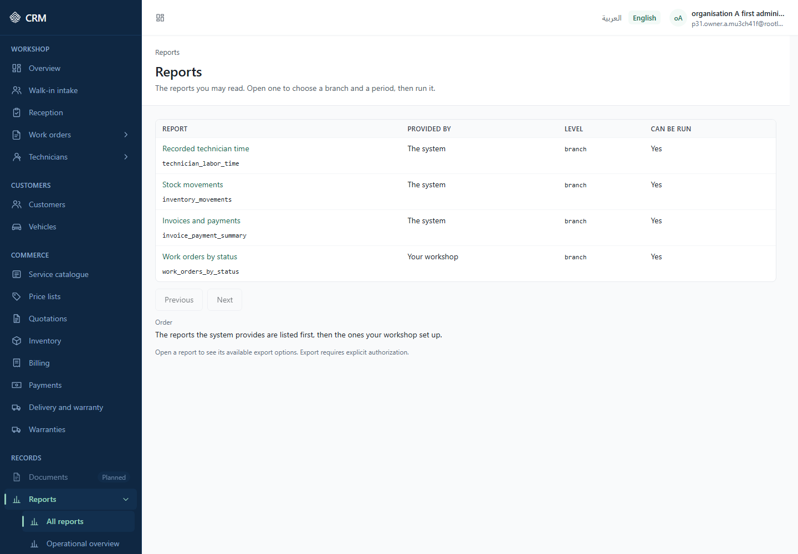

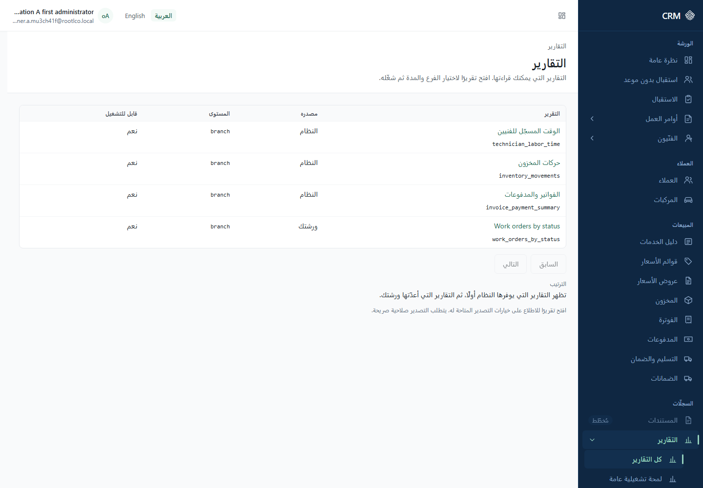

### 6.5.2 The four published reports

**IMPLEMENTED (UI)**

Four report domains are approved and delivered in this release, and no others:

| Report name                                                                                       | Code used in the address  |
| ------------------------------------------------------------------------------------------------- | ------------------------- |
| "Work orders by status" <!-- reports.work_orders_by_status.title --> ("أوامر العمل حسب الحالة")   | `work_orders_by_status`   |
| "Recorded technician time" <!-- reports.technician_labor_time.title --> ("الوقت المسجّل للفنيين") | `technician_labor_time`   |
| "Stock movements" <!-- reports.inventory_movements.title --> ("حركات المخزون")                    | `inventory_movements`     |
| "Invoices and payments" <!-- reports.invoice_payment_summary.title --> ("الفواتير والمدفوعات")    | `invoice_payment_summary` |

A report you can see in the catalogue still has to be **configured and published** for your
organisation before it can be run. A report that has not been is shown with "Can be run" = "No", and
opening it gives "This report cannot be run yet" <!-- reports.run.notRunnableTitle --> with "You can
read what it is meant to show, but the system has nothing behind it to run. Nothing is missing from
your access." <!-- reports.run.notRunnableBody -->

Publishing a report configuration has no screen — see 6.5.9.

### 6.5.3 Run a report

**IMPLEMENTED (UI)**

- **Label:** "Run the report" <!-- reports.run.show -->
- **Who:** an account holding `rpt.report.read` **and** the read permissions of the data behind the
  report, in the branch you select. Those extra codes are decided per report and are checked by the
  service, not by the screen.
- **Where:** "Records" › "Reports" › "All reports", then open a report. The address is
  `/en/reports/<report code>`. The page heading is "Report" <!-- reports.run.title --> ("تقرير").
- **Steps** — the form is labelled "Choose what to report on" <!-- reports.run.formLabel --> :
  1. **Required** — "Company" <!-- reports.run.company --> . Example: Al-Noor Auto Services
     (example).
  2. **Required** — "Branch" <!-- reports.run.branch --> . Example: Riyadh — Exit 5 (example).
  3. **Required** — "First day" <!-- reports.run.from --> . Hint: "This day is included." <!-- reports.run.fromHint -->
  4. **Required** — "Day after the last" <!-- reports.run.to --> . Hint: "This day is not included." <!-- reports.run.toHint -->
  5. Press "Run the report".
- **Result:** the context banner, then "Totals for the whole period" <!-- reports.groups.heading -->
  , then "Report rows" <!-- reports.run.rowsCaption --> . See 6.5.4.
- **Restrictions:**
  - **The period rule is stated on the form and you must follow it:** "The first day is included,
    and the second box is the day AFTER the last day you want. To report on a single day, put the
    next day in the second box." <!-- reports.run.periodRule -->
  - **There is no default period and no default branch.** Nothing is chosen for you and nothing runs
    until you press the button.
  - **A report covers one branch.** There is no all-branch and no tenant-wide report run. Reports
    for Riyadh — Exit 5 (example) and Jeddah — Corniche (example) are two separate runs.
  - The period is read in **the selected branch's own time zone**, so a row is never moved into a
    different day.
- **If it goes wrong:**
  - "Nothing has been run yet" <!-- reports.run.idleTitle --> with "Choose a company, a branch and
    the two days, then run the report." <!-- reports.run.idleBody --> — you have not pressed the
    button.
  - "Choose a company." <!-- reports.run.chooseCompany --> ; "Choose a branch in the company you
    selected." <!-- reports.run.chooseBranch --> ; "Choose a day." <!-- reports.run.needDay -->
  - "The second day must come after the first. It is the day after the last day you want." <!-- reports.run.toAfterFrom -->
  - "No branch is available to you" <!-- reports.run.noScopesTitle --> with "A report is read for
    one branch. Ask an administrator for access to a branch." <!-- reports.run.noScopesBody -->
  - "There is nothing to show for this branch and these days." <!-- reports.run.noRows --> — the run
    succeeded and found nothing. That is a measurement, not a failure.
  - "This report cannot be run yet" — the report is not configured and published for your
    organisation. Nothing is wrong with your access.
  - A refusal shows "You do not have access" with a "Reference:" value. Quote that reference to
    support.
- **Screenshot:** `images/report-work-orders-en.png` (the form before the run) and
  `images/report-work-orders-en-answered.png` (the same report answered). Arabic:
  `images/report-work-orders-ar.png` and `images/report-work-orders-ar-answered.png`.

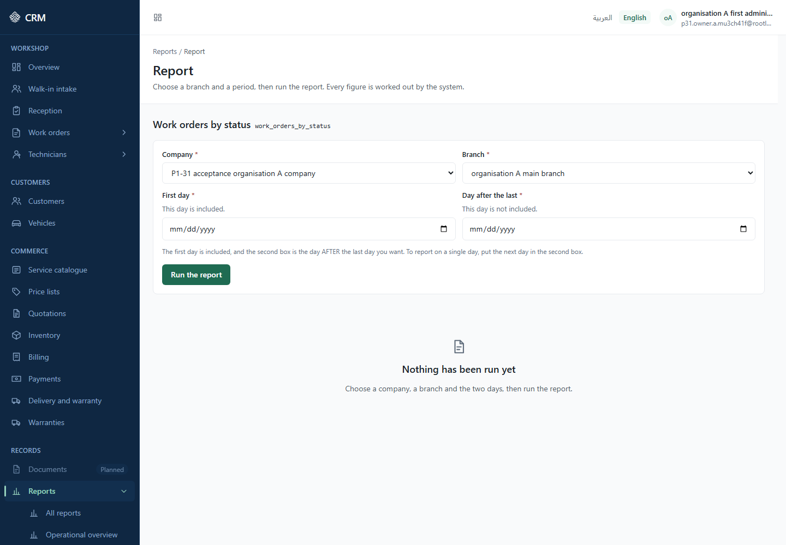

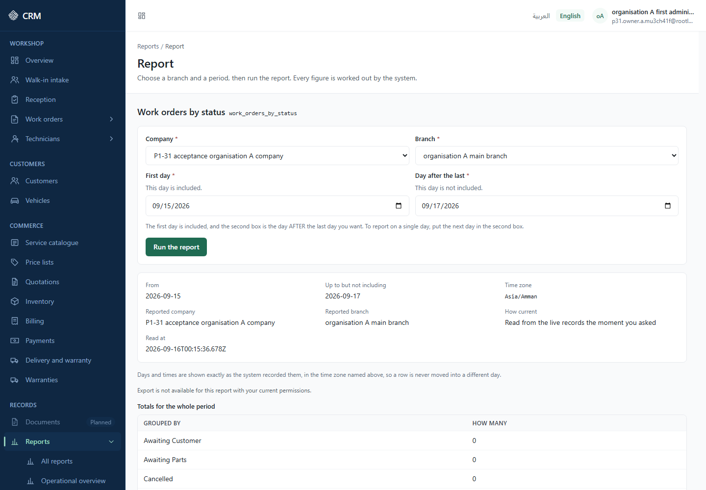

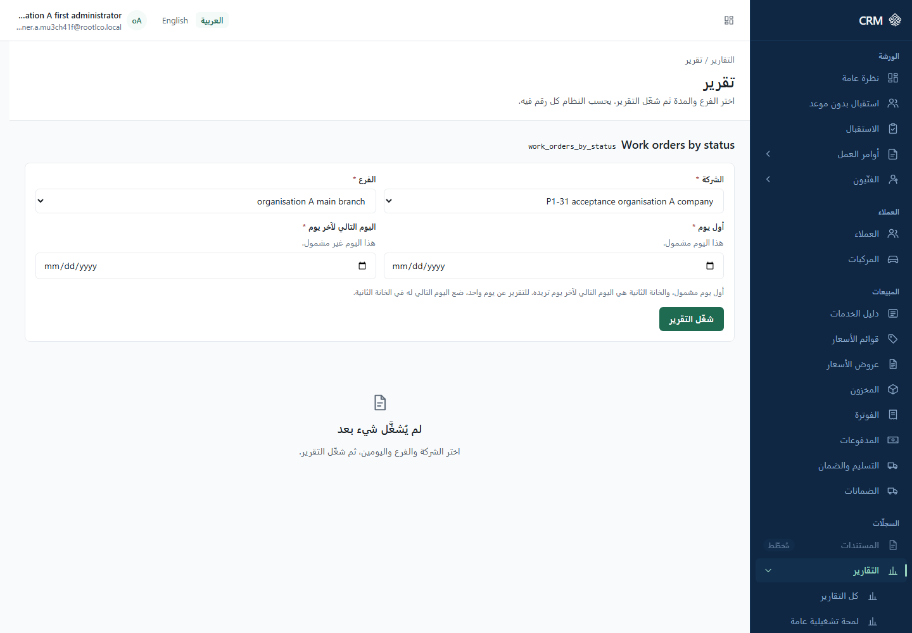

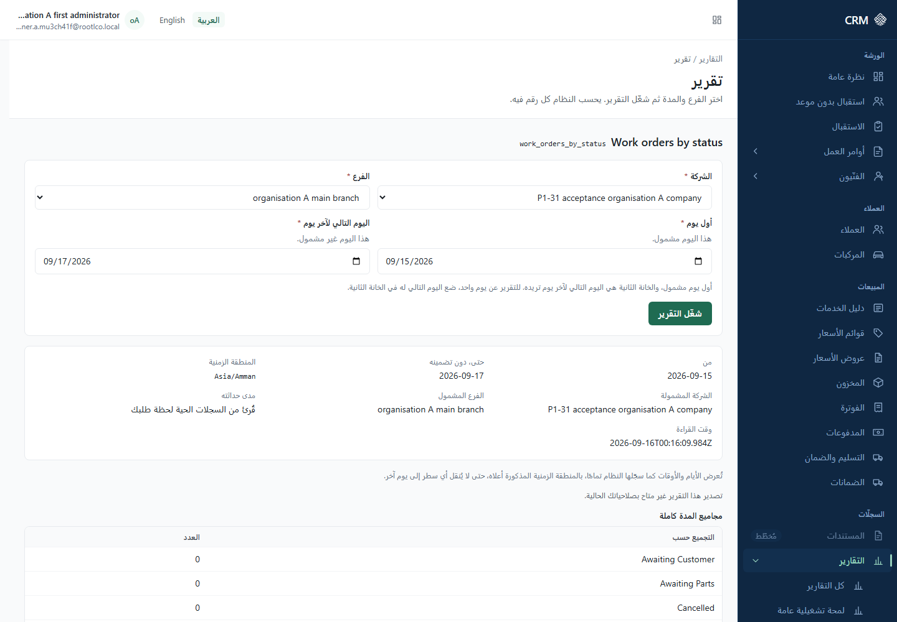

### 6.5.4 Reading the result

**IMPLEMENTED (UI)**

Three blocks appear, in this order.

**1. The context.** The period and its time zone always travel with the figures, so a number can
never be read without knowing what produced it:

- "From" <!-- reports.context.from --> and "Up to but not including" <!-- reports.context.to -->
- "Time zone" <!-- reports.context.timezone --> , named in your language with its offset — for
  example "Jordan Time (GMT+3)" ("توقيت الأردن (غرينتش+3)") — never as a system identifier
- "Reported company" <!-- reports.context.company --> and "Reported branch" <!-- reports.context.branch -->
- "How current" <!-- reports.context.freshness --> , which reads "Read from the live records the
  moment you asked" <!-- reports.context.freshness.live --> — or, for "Invoices and payments",
  "Read from the live records, with every amount as it stood at the moment stated below" <!-- reports.context.freshness.asOf -->
  (6.5.4a)
- "Read at" <!-- reports.context.generatedAt -->
- and the note "Days and times are shown exactly as the system recorded them, in the time zone named
  above, so a row is never moved into a different day." <!-- reports.context.periodNote -->

**2. "Totals for the whole period"**, captioned "Totals by group for the whole period" <!-- reports.groups.caption -->
, with the first column "Grouped by" <!-- reports.groups.column.group --> . These totals cover the
whole period you asked for — not the page of rows below them.

**3. "Report rows"**, one page at a time. "Rows are shown a page at a time. The totals above cover
the whole period, not this page." <!-- reports.run.pagingNote --> Move with "Previous" <!-- reports.page.previous -->
and "Next" <!-- reports.page.next --> . **There are no page numbers and no row count** — the service
publishes neither, and the screen does not invent them.

Column and measure names are plain words, among them "How many" <!-- reports.field.count --> ,
"Recorded time" <!-- reports.field.duration --> , "Quantity received" <!-- reports.field.quantityIn -->
, "Quantity issued" <!-- reports.field.quantityOut --> , "Invoiced" <!-- reports.field.invoiced -->
, "Credit notes", "Receipts" <!-- reports.field.receipts --> , "Applied to invoices" <!-- reports.field.allocated -->
, "Not yet applied" <!-- reports.field.unallocated --> , "Still owed" <!-- reports.field.outstanding -->
, "Kind of document" <!-- reports.field.documentType --> and "Kind of movement" <!-- reports.field.movementType -->
.

Three things to expect in the cells:

- **Every figure is worked out by the server.** Nothing on the screen is summed, divided, rounded,
  re-scaled or turned into another unit. An amount is **written in its currency's own decimals with
  the currency code** — `49.380 JOD`, as every other finance screen writes it — using the currency
  of its own row <!-- reports.field.currency --> . A digit finer than the currency's smallest coin is
  still shown (`1.9752 JOD`), never rounded away. The totals of a currency group are written the same
  way. An amount with no currency beside it is shown exactly as stored.
- **Codes are said in words.** In "Invoices and payments" the kind of document reads "Invoice",
  "Receipt" or "Credit note" <!-- reports.documentType.invoice --> , the party's role reads "Payer"
  <!-- reports.partyRole.payer --> or "The invoice's payer" <!-- reports.partyRole.invoice_payer -->
  , and the status uses the same words as the invoice, payment and credit-note screens (for example
  "Issued", "Partly applied", "Waiting for a second person"). A group of totals reads, for example,
  "JOD · Receipts" <!-- reports.groups.documentType.receipt --> . The report is headed by its name
  only; its internal code is not printed under the title.
- An absent value reads "Not reported" <!-- reports.cell.missing --> or, in a group, <!-- reports.groups.noMeasure -->
  the same words. An empty set of values reads "None" <!-- reports.cell.none --> . **An absence is
  never printed as a zero.**
- A group with no name reads "Not named" <!-- reports.groups.unnamed --> .

### 6.5.4a As-of versus snapshot — end-of-period amounts in "Invoices and payments"

**IMPLEMENTED (UI)** — Owner decision D16, part 1 (as-of amounts). The snapshot half is not built.

- **The documents are chosen by the period.** The invoices, receipts and credit notes listed are the
  ones dated inside the period, exactly as before.
- **The amounts are as of a stated moment.** What each invoice still owed, what each receipt had
  applied and had left, each invoice's credit position and each document's status are worked out as
  they stood at that moment. The screen says which moment: "Amounts as of {moment}" <!-- reports.asOf.statement -->
  , on the reported branch's clock with its time zone, and "A payment, credit or reversal recorded
  after this moment does not change these amounts. The documents listed are still the ones dated in
  the period." <!-- reports.asOf.note -->
- **The moment, by default, is the end of the period** — midnight at the start of the day you put in
  "Up to but not including", on the branch's clock — once that has passed. For a period still
  running it is the moment you asked. Under "Show the amounts as of" <!-- reports.asOf.legend --> you
  may choose "End of period" <!-- reports.asOf.endOfPeriod --> , "Now" <!-- reports.asOf.now --> or
  "A specific moment" <!-- reports.asOf.specific --> , then press "Show these amounts" <!-- reports.asOf.apply -->
  . A moment before the period starts, or later than now, is refused; so is a date and time only
  partly typed ("The date and time are not finished. Complete them, or clear them." <!-- reports.asOf.incomplete -->
  ).
- **So a later payment, credit or reversal changes only a report whose moment is after it.** Last
  month's report, read as of the end of last month, stays as it was when a payment is applied, a
  credit note approved or a receipt reversed today. The same report read as of now shows today's
  figures.
- **What this is not: a snapshot.** The report is still read from the live records each time; it is
  not a stored copy. Payments, allocations, credit notes and reversals take their moment from the
  system clock when they are recorded and cannot be backdated, which is what makes an as-of reading
  repeatable. Keeping an issued copy of a period's report and marking a later correction as a
  restatement are the second part of this decision and are not available yet. Closing a period and
  financial statements are not part of it.
- The other three reports are read as they are now and say so; they do not offer a moment.

### 6.5.5 Drill-through from a report row

**IMPLEMENTED (UI)** for work orders and credit notes · **DEFERRED** for the others

Where a row names a record this application has a screen for, the reference is a link. **Today that
is work orders and credit notes.** A credit note in the "Invoices and payments" report opens the
Credit notes screen on that note; that screen asks for its own permissions, as it always does. There
is no per-technician page, no invoice detail page and no receipt detail page in this release, so
references to those render as plain text rather than as a link that would lead nowhere.

Where a reference has no label at all, the cell reads "No reference" <!-- reports.cell.noReference -->
rather than showing an internal identifier.

### 6.5.6 Currencies, units and totals across them

**IMPLEMENTED (UI)**

Reports deliberately keep things apart rather than adding them up:

- Stock movements are grouped by item, unit **and** kind of movement. "Nothing is added across items
  or units." <!-- reports.overview.caption.inventory -->
- Invoice and payment figures are grouped by currency **and** kind of document. "Nothing is added
  across them." <!-- reports.overview.caption.invoices -->

There is no grand total across currencies anywhere, because no exchange rate is held or calculated
in this release (6.2.12).

### 6.5.7 The operational overview

**IMPLEMENTED (UI)**

- **Label:** "Show the overview" <!-- reports.overview.show -->
- **Screen:** "Operational overview" <!-- reports.overview.title --> ("لمحة تشغيلية عامة") at
  `/en/reports/overview`.
- **Purpose, in its own words:** "The four approved reports for one branch and one period,
  summarised side by side. Every figure is worked out by the system." <!-- reports.overview.description -->
- **Who:** an account holding `rpt.report.read`, plus each report's own data permissions in the
  selected branch.
- **Where:** "Records" › "Reports" › "Operational overview".
- **Steps:**
  1. **Required** — "Company", "Branch", "First day" and "Day after the last", exactly as in 6.5.3.
  2. Press "Show the overview".
- **Result:** "Summaries for the chosen branch and days" <!-- reports.overview.resultsHeading -->
  holding four panels — "Work orders by status", "Recorded technician time", "Stock movements" and
  "Invoices and payments" — each with its own caption. The labour panel's caption is worth quoting,
  because it fixes what the figure means: "Recorded labour duration for each technician, in seconds,
  exactly as the system recorded it. It says how long was logged, and nothing about how well anyone
  worked." <!-- reports.overview.caption.labour --> The work-order panel reads "How many work orders
  are in each status." <!-- reports.overview.caption.workOrders --> Each panel offers "Open the full
  report" <!-- reports.overview.openReport --> , which opens that report with the same company,
  branch and two days already filled in.
- **Restrictions:**
  - The closing note is binding on how you may use the screen: "Every figure above covers the whole
    period and is worked out by the system. Nothing on this screen is added up, divided or turned
    into another unit." <!-- reports.overview.serverNote --> There is no profit figure, no
    productivity score, no utilisation, no efficiency and no trend anywhere, in either language.
  - One branch and one period, like every report run.
  - **There is no export on this screen.** Export is offered on a single report run only (6.6).
- **If it goes wrong:**
  - "Nothing has been shown yet" <!-- reports.overview.idleTitle --> with "Choose a company, a
    branch and the two days, then show the overview." <!-- reports.overview.idleBody -->
  - "This report is not among the ones available to you, so there is nothing to summarise here." <!-- reports.overview.notPublished -->
  - "This report cannot be run yet, so there is nothing to summarise here. Nothing is missing from
    your access." <!-- reports.overview.notRunnable -->
  - "The system published no summary for this report, and nothing has been worked out here in its
    place." <!-- reports.overview.noSummary -->
  - "Nothing was recorded for this branch on these days." <!-- reports.overview.noneInPeriod --> — a
    measurement, not a refusal.
  - A panel that was refused shows the refusal and its "Reference:" beside the panels that did
    answer. **A refusal is never shown as a zero.**
- **Screenshot:** `images/report-overview-en.png` (before) and
  `images/report-overview-en-answered.png` (the four panels answered). Arabic:
  `images/report-overview-ar.png` and `images/report-overview-ar-answered.png`.

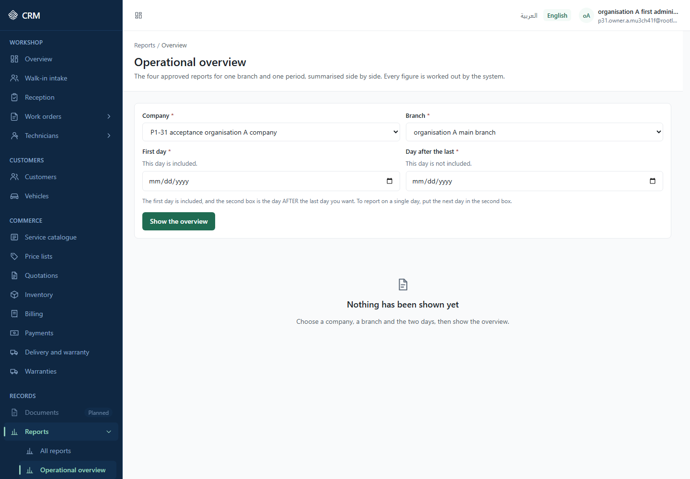

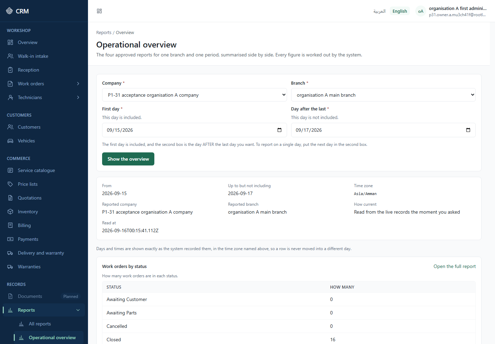

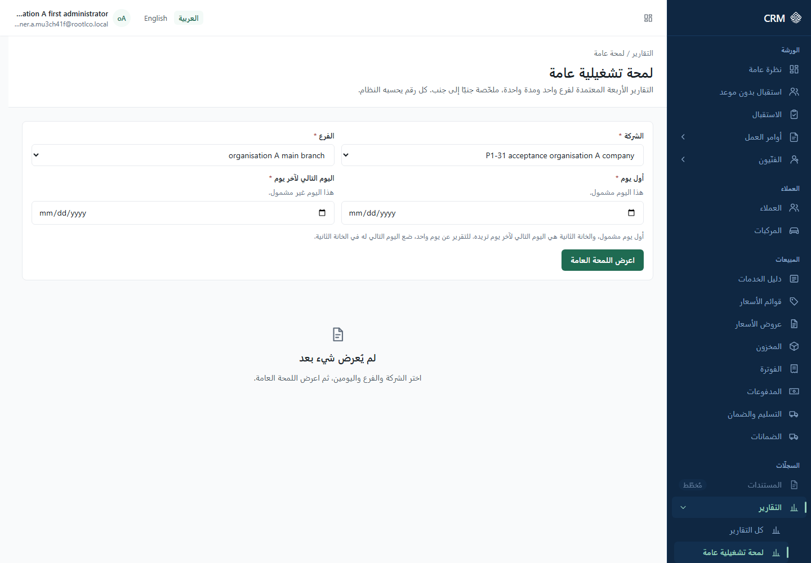

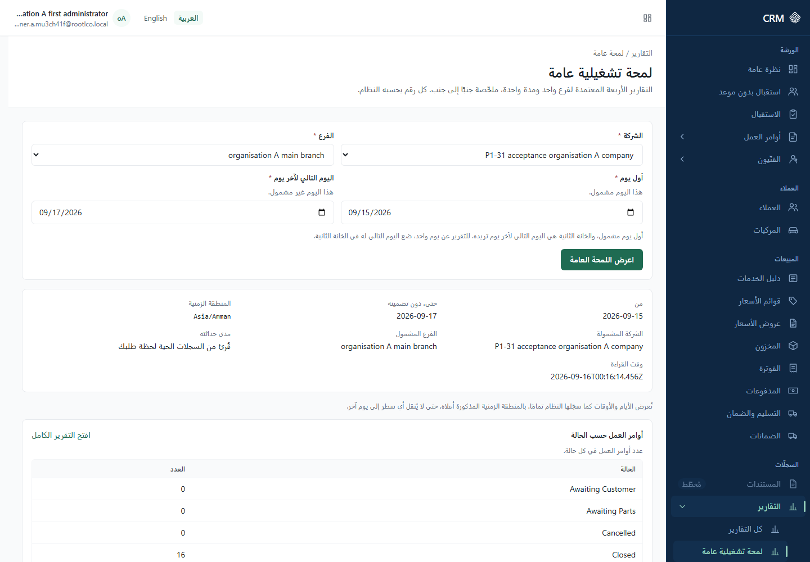

### 6.5.8 An overview fixed to one branch

**IMPLEMENTED (UI)**

The same overview can be opened with the branch fixed in the address:
`/en/reports/overview?branchId=<branch identifier>`. The branch selector is then shown, disabled, at
the branch it is fixed to — so you can always see which branch you are reading — and the screen says
"This overview is fixed to the branch named in the link. Open the overview from the menu to choose
another branch." <!-- reports.overview.branchFixed -->

**There is no menu entry for a fixed branch, deliberately.** No branch is written into the
application anywhere. If the branch in the link is not one you hold access to, the screen shows the
"No branch is available to you" body rather than substituting another branch.

### 6.5.9 Creating and publishing a report definition

**OPERATOR PROCEDURE**

There is no screen for authoring, publishing or archiving a report definition. The permission
`rpt.report.configure` gates seven operations and **no page calls any of them**; the tenant
administrator holds the code and has nowhere to use it. A report is only readable and runnable once
a **published** configuration exists for your organisation, and only your operator can create one.

Until that is done for a report code, the catalogue shows "Can be run" = "No" and the run screen
answers "This report cannot be run yet".

---

## 6.6 Export

### 6.6.1 The export permission policy — read this first

**IMPLEMENTED (UI)**, with a deliberate restriction

**The default administrator cannot export a report.** The export permission `rpt.export` is
deliberately left out of the bundle that a newly provisioned tenant administrator receives, on
least-privilege grounds. This is a decision, not an oversight.

To export a report you need **all three** of the following, in the branch you selected:

1. `rpt.report.read`,
2. `rpt.export`, and
3. the export permission code that the published report configuration itself names.

If you do not hold them, the export panel is replaced by a single line: **"Export is not available
for this report with your current permissions."** <!-- reports.export.withheld --> ("تصدير هذا
التقرير غير متاح بصلاحياتك الحالية.") Nothing is broken; nothing is hidden from you by mistake. An
administrator must grant the codes.

Nothing else in this release exports anything. There is no export on the catalogue, none on the
operational overview, none on the audit log, and none on any invoice, receipt or list.

### 6.6.2 Export a report as CSV

**IMPLEMENTED (UI)**

- **Label:** "Download CSV" <!-- reports.export.download --> under the heading "Export this report" <!-- reports.export.title -->
  ("تصدير هذا التقرير")
- **Who:** an account holding the three codes named in 6.6.1, in the selected branch.
- **Where:** "Records" › "Reports" › "All reports" › a report, **after** a successful run. The panel
  is keyed to the branch and period you submitted.
- **Steps:**
  1. Run the report (6.5.3).
  2. **Required** — "Reason for export" <!-- reports.export.reason --> : write why you are taking
     the data out. The rule is "Enter a reason for export, up to 500 characters." <!-- reports.export.reasonRequired -->
     A blank reason is refused.
  3. Press "Download CSV". The button reads "Preparing file…" <!-- reports.export.preparing -->
     while it works.
- **Result:** your browser downloads a CSV file named after the report and the two days, and a
  notification reads "Report file prepared for download." <!-- reports.export.ready -->
- **Restrictions:**
  - **The file is not the page.** The panel states this: "Export all rows for the displayed branch
    and period using current data. Values may have changed since this report was shown." <!-- reports.export.liveNote -->
    The export reads live records at the moment you press the button, so it may differ from what is
    on screen. **"Invoices and payments" is the exception:** its file holds the amounts as of the
    moment the report on screen states, and the panel says so instead — "The file will hold the
    amounts as of {moment}, the same moment as the report shown." <!-- reports.export.asOfNote -->
    Every record of that file carries the moment in an `asOf` column beside `freshness` (6.5.4a).
  - The file covers **all rows** for the displayed branch and period — not just the page you can
    see.
  - One branch and one period per file.
  - **Every successful download is a fresh disclosure and is audited again.** Pressing the button
    twice produces two audit records, not one. There is no "the same download" claim.
  - The export refuses a selection that is too large rather than returning part of a file. You will
    receive no file at all in that case; narrow the period or the branch.
  - Opening the file in spreadsheet software: cells that begin like a formula are neutralised with a
    leading apostrophe on purpose. Keep that protection; do not strip it.
- **If it goes wrong:**
  - "Export is not available for this report with your current permissions." — see 6.6.1.
  - An empty or over-long reason re-marks the field with "Enter a reason for export, up to 500
    characters."
  - A failed attempt raises a notification carrying a "Reference" <!-- action.reference --> value.
    Quote it to support.
- **Screenshot:** no screenshot available at this version. (The captured report screens in
  `images/report-work-orders-en.png` and `images/report-work-orders-en-answered.png` were taken by
  an account that does not hold the export permission.)

### 6.6.3 What the export audit records — and what it does not

**IMPLEMENTED (UI)** for the record · a stated limitation

Each successful export writes one audit record, `rpt.report.exported`, holding:

- which report configuration was exported,
- who exported it and the reference of that request,
- the company and branch,
- the period and its time zone,
- for "Invoices and payments", the moment its amounts were worked out as of,
- how many detail rows and how many summary rows were in the file, and
- the reason you typed, classified.

**The record does not hold the file, its size or any fingerprint of its contents.** The recorded
limitation is plain: the audit records the selection and the counts, **not the bytes**, so it cannot
later establish exactly which file was produced. Treat the audit as proof that a disclosure happened
and over what selection — not as proof of what the file contained.

The contents of the file are never copied into the audit record or into any log.

### 6.6.4 Granting the export permission

**IMPLEMENTED (UI)** — in Administration, covered fully in Part 3

An administrator grants `rpt.export` by creating or editing a workspace role at "Administration" ›
"Roles" <!-- nav.roles --> and granting it at "Administration" › "Users" <!-- nav.users --> .

Two rules constrain this:

- **You can only grant what you already hold.** "You are granting a permission with a high risk
  level. Only a permission you already hold can be granted." <!-- permissions.escalationWarning -->
  and, on the Users screen, "You can only grant roles you already hold the authority to grant." <!-- users.invite.rolesHint -->
  A default administrator does **not** hold `rpt.export`, so a default administrator cannot grant it
  to anyone. Obtaining it is therefore an operator act in the first instance.
- The report configuration's own export permission code must also be granted, in the same branch.

There is no seeded "reporting reader" role, or any other seeded business role. Every workshop role
is one an administrator creates.

---

## 6.7 The audit log

### 6.7.1 What it is

**IMPLEMENTED (UI)**

- **Screen:** "Audit log" <!-- audit.title --> ("سجل التدقيق") at `/en/administration/audit-log`.
- **Purpose, in its own words:** "A read-only record of what happened in this workspace." <!-- audit.description -->
- **Permission:** `iam.audit.view` gates the page. `iam.sensitive.view` additionally reveals values
  that are otherwise withheld. The tenant-administrator bundle holds both.

Three standing notices are shown on the screen and all three are binding:

- "Audit records cannot be changed or deleted from here." <!-- audit.readOnly -->
- **"Opening this screen is itself recorded."** <!-- audit.viewedNotice -->
- **"The service publishes no export operation for audit records, so none is offered here."** <!-- audit.noExport -->

### 6.7.2 Search the audit log

**IMPLEMENTED (UI)**

- **Label:** "Apply filters" <!-- audit.filter.apply --> , in the form "Audit log filters" <!-- audit.filter.formLabel -->
- **Who:** an account holding `iam.audit.view`.
- **Where:** "Administration" › "Audit log".
- **Steps:**
  1. **Required** — "From" <!-- audit.from --> and "To" <!-- audit.to --> . The screen states the
     rule: "A date range is required. This screen opens on the last seven days." <!-- audit.rangeHint -->
     You cannot search without a range; the last seven days are filled in for you and you may change
     them.
  2. Optional — "Company" <!-- audit.filter.company --> and "Branch" <!-- audit.filter.branch --> .
     Leaving the company empty means "All accessible audit records" <!-- audit.filter.allCompanies -->
     ; choosing a company then asks you to "Choose a branch for the selected company." <!-- audit.filter.chooseBranch -->
  3. Optional — "Action" <!-- audit.filter.action --> , "Record type" <!-- audit.filter.entityType -->
     and "Who" <!-- audit.filter.actor --> .
  4. Press "Apply filters". "Clear filters" <!-- audit.filter.clear --> resets them.
- **Result:** a table with the columns "When" <!-- audit.column.occurredAt --> , "Who" <!-- audit.column.actor -->
  , "Action" <!-- audit.column.action --> , "Record" <!-- audit.column.entity --> , "Reference" <!-- audit.column.correlationId -->
  and "Result" <!-- audit.column.result --> .
- **Restrictions:**
  - **Every filter value must match exactly.** The hint is explicit: "Leave a box empty to include
    everything. Each value must match exactly." <!-- audit.filter.hint --> There is no partial match
    and no search-as-you-type. For an identifier, the screen tells you where to get one: "Copy it
    from a row in the table below." <!-- audit.filter.identifierHelp --> and "Enter the identifier
    exactly as it was given." <!-- audit.filter.idFormat -->
  - **There is no export and no download.** If you need the contents elsewhere, copy them from the
    screen.
  - Your search itself is recorded.
- **If it goes wrong:** "Company and branch choices are unavailable. You can still search the audit
  log." <!-- audit.filter.scopeUnavailable --> — the directory read failed; the search still works.
- **Screenshot:** `images/audit-log-en.png` (the date range and the five filters before searching)
  and `images/audit-log-en-answered.png` (a search answered, including the "Reference" column).
  Arabic: `images/audit-log-ar.png` and `images/audit-log-ar-answered.png`.

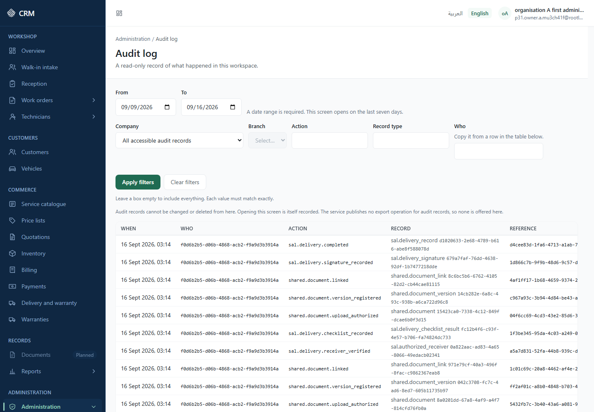

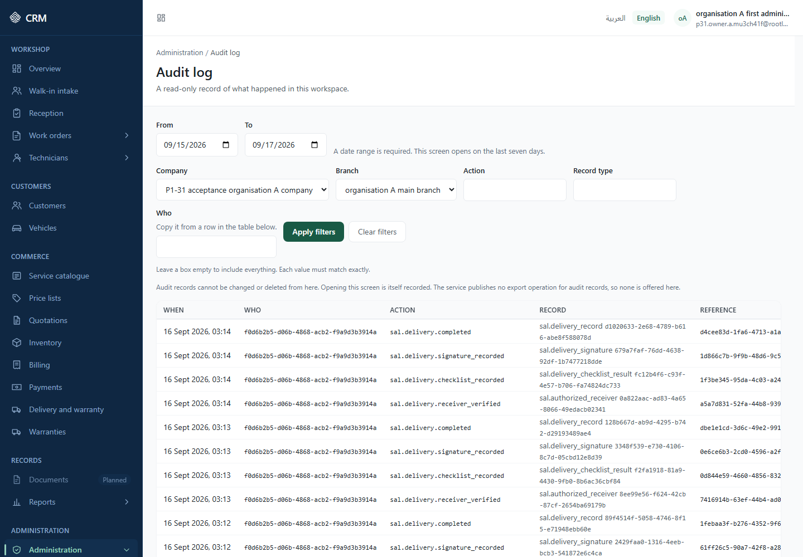

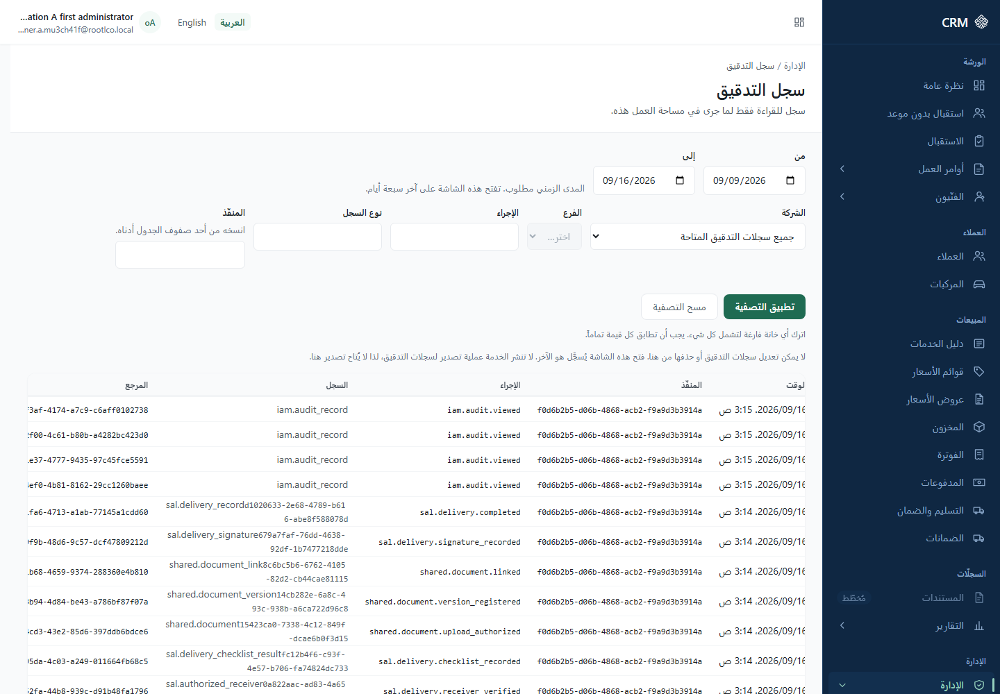

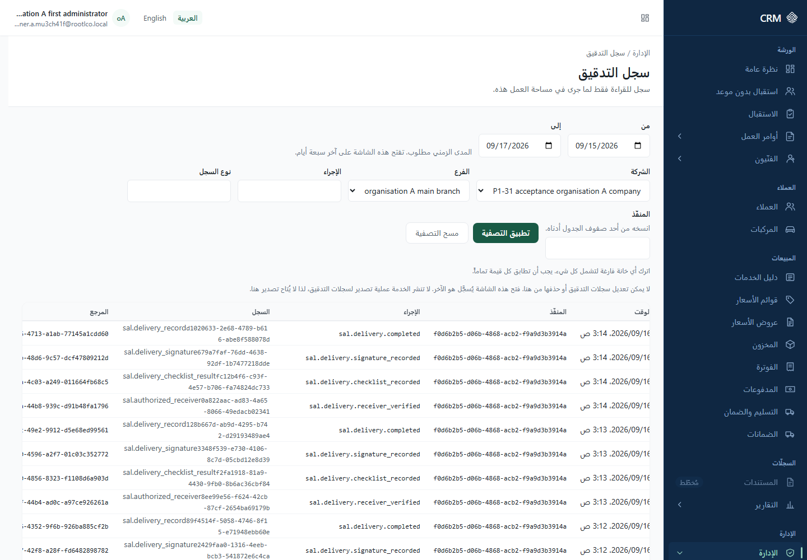

### 6.7.3 Open one audit record

**IMPLEMENTED (UI)**

Opening a row shows "Audit record" <!-- audit.detail.title --> with a "Details" <!-- audit.detail.details -->
list.

Where a value is protected it reads **"Withheld"** <!-- audit.detail.masked --> , with the
explanation "Some values are withheld unless your account may view sensitive data." <!-- audit.detail.maskedHint -->
Seeing them needs `iam.sensitive.view`.

Where the record has no detail rows: "This record carries no detail rows." <!-- audit.detail.noDetails -->

### 6.7.4 Using the "Reference" to get help

**IMPLEMENTED (UI)**

The "Reference" column holds the same value that the application shows you when something goes wrong
— it appears as "Reference:" <!-- state.correlationId --> beneath "Something went wrong" <!-- state.error.title -->
, "You do not have access", "Service unavailable" <!-- state.unavailable.title --> and on a printed
document whose section could not be read.

Quote that reference when you ask for help. It lets support find exactly one request. Part 7 covers
this in full.

---

## 6.8 Restrictions and limitations you will meet in this part

**IMPLEMENTED (UI)** unless marked otherwise. Collected here so you can find them, each one also
stated where you meet it.

1. **There is no invoice list.** The Invoice screen asks "Which work order?". An invoice is reached
   only through its work order.
2. **An invoice can be cancelled only before it is issued.** After issue there is no cancel, no
   reverse and no credit note anywhere in the interface. **NOT AVAILABLE**
3. **An invoice number comes from the branch's own sequence, allocated at issue.** Issuing is
   refused if the branch has no invoice numbering set up, or if the invoice changed since you read
   it.
4. **`sal.finance.view` is separate from `sal.invoice.manage`.** Without it the invoice exists on
   screen with its status and dates, and every amount is withheld.
5. **An allocation cannot be undone on its own.** Allocations are append-only; a wrongly recorded
   receipt is corrected by reversing the whole receipt under two people (§6.3.7).
6. **A printed receipt carries identifiers only** — no payer name, no invoice number, and no record
   of who took the payment.
7. **Payments are single-branch.** So are every report run and the operational overview. There is no
   tenant-wide view of receipts and no all-branch report.
8. **Your organisation must have its own payment method** before a payment can be recorded. Adding
   one is an **OPERATOR PROCEDURE**.
9. **Only four report domains exist** and each must additionally be configured and published for
   your organisation. Publishing is an **OPERATOR PROCEDURE**; `rpt.report.configure` has no screen.
10. **Export needs a permission the default administrator does not hold.** `rpt.export` is
    deliberately excluded from the tenant-administrator bundle, and a default administrator cannot
    grant what they do not hold. Refusal reads "Export is not available for this report with your
    current permissions."
11. **The export audit records the selection and the counts, not the file.** It cannot later
    establish which exact bytes were disclosed.
12. **Each successful export is a fresh, separately audited disclosure**, and it reads live data
    that may differ from the report on your screen.
13. **The audit log has no export**, requires a date range, and matches every filter value exactly.
    Opening it is itself recorded.
14. **Nothing is calculated in your browser.** Every figure is the server's own; amounts appear
    exactly as stored, with no grouping separators and no currency symbol beside them.
15. **No exchange rate is held or calculated**, so nothing is ever added across currencies.
16. **Drill-through reaches work orders only.** There is no invoice detail page, no receipt detail
    page and no per-technician page for a report row to link to. **DEFERRED**
17. **There is no analytics dashboard.** **NOT AVAILABLE**
18. **Four administration areas — Numbering rules, Taxes, Currencies and System settings — are
    key-and-value settings screens, not dedicated features**, and they need `org.settings.manage`,
    which the tenant-administrator bundle holds since the Owner decision of 2026-09-27.
19. **The product name, logo and colours are provisional.** The interface shows a placeholder name
    with the banner "Provisional appearance — final brand pending".
20. **Printing is always your browser's own print.** No PDF is generated and there is no server-side
    document route for the invoice copy or the receipt copy.

---

## 6.9 Not established

**REFERENCE** — this section summarises, records or points elsewhere; it makes no capability claim of its own.

The following could not be established from the records available for this part, and nothing above
should be read as asserting them:

- **The exact on-screen layout of the Invoice screen and the Payments screen.** No screenshot of
  either exists at this version, in either language. Every label quoted for those two screens is
  taken from the application's message catalogue, not from a capture.
- **The exact appearance of the export panel in use.** No screenshot shows the "Export this report"
  panel or a completed download; the captured report screens were taken by an account that does not
  hold the export permission.
- **How a report definition is authored and published in practice.** There is no screen and the
  detailed operator procedure is outside the material available for this part; ask your operator.
- **How a payment method is added for an organisation.** Same reason.
- **Whether any figure shown in a screenshot is representative.** All captured figures come from a
  disposable test organisation, not from operating data.

<!--
SOURCES
Inventory: scratchpad/handover-map-B.json — modules[8] "Invoices and payments"; modules[11] "Reports";
modules[12] "Documents, notifications and dashboards"; modules[1] screens[5] "Audit log", [7] "Numbering
rules", [9] "Currencies"; navigation[]; roles_reference[0..4]; cross_cutting.printing,
.correlation_id_for_support, .stale_version_and_conflict, .notifications_audit_documents;
known_limitations_for_operators items 1,2,3,6,7,8,9,13,14; screenshots_available; not_found items 3,6,8,9.
Environment: scratchpad/handover-map-A.json — environment.kind, .urls.
REVISION 2026-09-21 — sections 6.1, 6.2.10 and the new 6.2a were re-read and written at develop
f30ce918405164712cc9cdcadb458c4e91a2b5b9. Everything else in this part is carried unchanged from
the readings recorded below.

Read for this revision:
- apps/api/src/app/api/v1/credit-notes/route.ts (sal.credit-note-list) and
  .../credit-notes/[creditNoteId]/route.ts (the single read) — both declare sal.credit.manage AND
  sal.finance.view, and both take the branch as their target.
- apps/web/src/app/[locale]/(dashboard)/credit-notes/page.tsx and
  apps/web/src/features/billing/components/CreditNotesScreen.tsx — the branch picker, the list, the
  single note, the absence of any approval control, and the deliberate choice to show a refusal as
  a refusal rather than as an empty table.
- apps/web/src/config/navigation.ts — nav.creditNotes under the Commerce group, gated on
  sal.credit.manage; apps/web/src/i18n/messages/{en,ar}.json — creditNotes.* and nav.creditNotes.
- apps/api/src/modules/iam/domain/bootstrap-roles.ts — sal.credit.manage is not in the
  first-administrator set at this head.

What was exercised rather than read: on 2026-09-21 the returns screen's "Open the credit note" link
was followed on the local environment as a newly provisioned organisation's first administrator, and
the screen's refusal was read back from it. No screenshot was captured.

REVISION 2026-09-18 — sections 6.2.1 and 6.2.10 were re-read and rewritten at develop
5b2c7840da1821f973438d5429665ef4448132f2. Read for this revision:
  apps/web/src/features/billing/api.ts — listCounterSales (sal.counter-sale-list) and
    createCounterSale (sal.counter-sale-create); issueInvoice and cancelInvoice are the same
    functions a work-order invoice uses
  apps/web/src/lib/contracts/billing-contract.ts — SALE_KINDS = work_order | counter_sale
  apps/web/src/features/inventory/components/{CounterSalesScreen,CustomerReturnsScreen}.tsx
  apps/api/src/modules/inventory/application/inventory-sales-return-service.ts — a return against a
    counter-sale line raises a PENDING credit note through sal.request_return_credit_note;
    sal.credit-note-approve still requires a second person; a return against a part issue raises
    no credit note
  No web screen calls sal.credit-note-create against an invoice directly, and none calls
    sal.credit-note-approve.
Everything else in this part is carried unchanged from the reading below.

Message catalogue at origin/develop beebc6c28c873f498fe0503161eb53caa107a9e3,
apps/web/src/i18n/messages/en.json (and ar.json for the Arabic labels quoted):
keys invoices.* (all), payments.* (all), reports.* (all), audit.* (all), overview.*, nav.*, state.*,
money.error.*, app.provisionalBrand, permissions.visibilityNotice, permissions.escalationWarning,
users.invite.rolesHint, action.reference.
Code read at the same commit:
apps/web/src/app/[locale]/(dashboard)/invoices/page.tsx:17-26 (page gate sal.invoice.manage before any
read; no invoice list; searchParam workOrderId);
apps/web/src/app/[locale]/(dashboard)/payments/page.tsx:16-33, :64-90 (page gate sal.finance.view;
searchParams paymentId and invoiceId; the cashier reaches the open balance here);
apps/web/src/app/[locale]/(dashboard)/reports/[reportCode]/page.tsx:20-62, :80-92, :156-159
(page gate rpt.report.read before the read; canExport = holds rpt.export AND the configuration's own
exportPermissionCode is not null);
apps/web/src/features/reports/components/ReportExportPanel.tsx:13-90 (withheld line when not permitted;
reason trimmed, refused when blank or over 500; CSV composed in the browser from the response);
apps/web/src/features/reports/components/ReportCatalogueScreen.tsx:106-215 (four columns; "Level" renders
the machine name; the standing no-download notice);
apps/web/src/features/reports/reports-contract.ts:67-70 (REPORT_PERMISSIONS);
apps/web/src/features/payments/components/PaymentsScreen.tsx:316-389 (branch target form; fallback to typed
company and branch identifiers).
Phase documents at the same commit:
docs/phase-1/phase-1-31/report-screens.md §2 (four datasets; period parameters are calendar days; three
drill-through templates, one served; no export operation when written), §3.2 (nothing computed in the
browser), §3.4 (the half-open period; no default period), §3.5 (no page numbers), §3.6 (groups cover the
whole selection), §3.7 (a reference links only to a route this application serves), §5 (named prerequisites:
invoice detail, receipt detail and per-technician pages);
docs/phase-1/phase-1-31/report-export-seam.md:11-62 (rpt.export and rpt.report.read in the selected branch
plus the configuration's own export_permission_code; nonblank reason of at most 500 characters; live
freshness; refusal of oversized selections with no partial file; formula-prefix neutralisation; the
rpt.report.exported audit contents and the explicit "selection and counts, not a digest or byte length"
limitation; each successful retry a fresh audited disclosure);
docs/phase-1/phase-1-31/operational-overview.md §1 (D-19, D-5, D-17 in the Owner's words), §2 (group shapes
of the four datasets; labour published as whole seconds), §3 (nothing computed; four honesty states kept
apart; one context banner; drill-through carrying the four filters; FE-016 fixed by the address with no
branch literal anywhere);
docs/phase-1/phase-1-31/acceptance-record.md §11.5 (the export companion: four report codes exported plus an
empty selection, one rpt.report.exported row per correlation id, and the journey administrator holding the
tenant-administrator bundle refused all four exports with 403 ERR-IAM-001), §11.7 (screens captured).
Screenshots: orchestration/evidence/p1-31/acceptance-20260916-0008/screens/ — report-catalogue-en.png,
report-catalogue-ar.png, report-work-orders-en.png, report-work-orders-en-answered.png,
report-work-orders-ar.png, report-work-orders-ar-answered.png, report-overview-en.png,
report-overview-en-answered.png, report-overview-ar.png, report-overview-ar-answered.png, audit-log-en.png,
audit-log-en-answered.png, audit-log-ar.png, audit-log-ar-answered.png (all fourteen confirmed present on
disk). No screenshot exists for the invoice or payment screens.
No command, gate, build or test was run for this part.
-->

<!--
REVISION 2026-09-25 — section 6.2a was re-read and rewritten on branch
feature/owner-directive-credit-note-authority (cut from develop
57d0a95d2c52763470e1552c60c4487ee4a12904), against
apps/api/src/modules/iam/domain/bootstrap-roles.ts (sal.credit.manage now carried by the tenant
administrator bundle), apps/api/src/app/api/v1/invoices/[invoiceId]/credit-notes/route.ts and
apps/api/src/app/api/v1/credit-notes/** (every credit-note operation declares sal.credit.manage and
sal.finance.view and is branch-scoped), supabase/migrations/20260724092000_sal_payments.sql
(ck_credit_notes_approved_distinct: the approver must differ from the requester) and
scripts/platform/backfill-tenant-administrator-bundle.mjs (customised administrator roles are
skipped and reported). The approval step still has no screen at this version. Nothing here states
that a check was run in a browser.
-->
